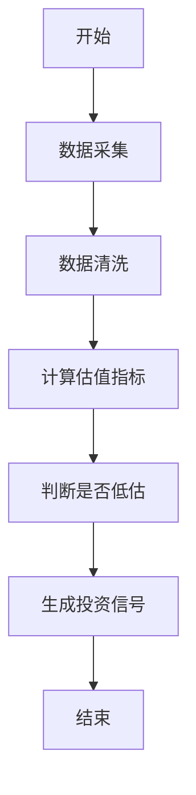
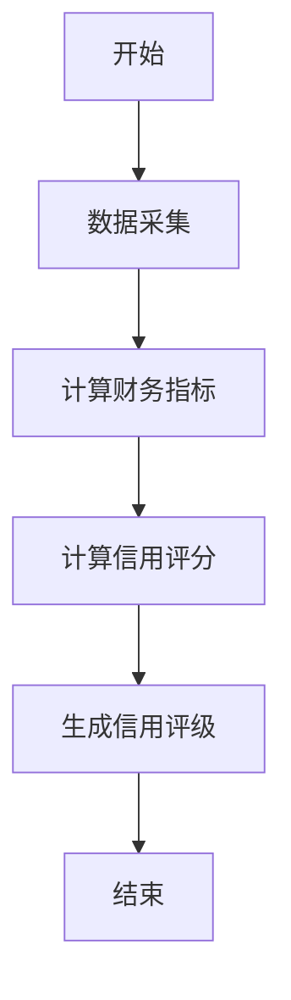
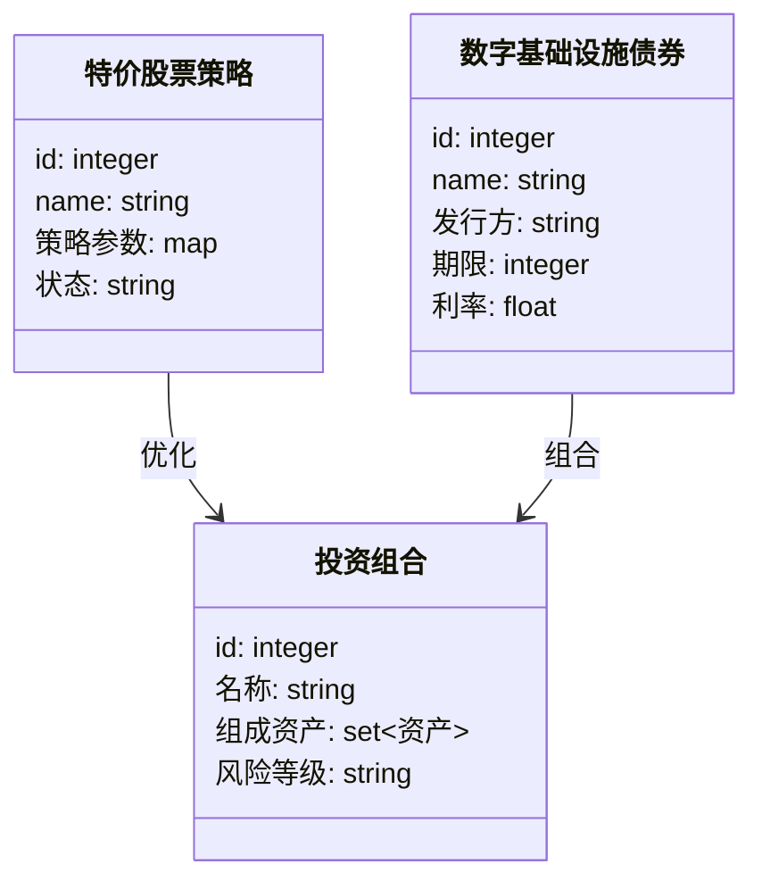

                 


# 如何将特价股票策略应用于新兴市场数字基础设施债券投资

> 关键词：特价股票策略, 数字基础设施债券, 新兴市场, 投资策略, 金融建模

> 摘要：本文详细探讨了如何将特价股票策略应用于新兴市场数字基础设施债券投资。通过分析特价股票策略的核心原理、数字基础设施债券的市场特点，结合新兴市场的经济环境，提出了一种创新的投资策略。本文还通过算法模型和案例分析，展示了如何利用特价股票策略优化数字基础设施债券的投资组合，降低风险并提高收益。通过本文的分析，读者可以全面理解特价股票策略与数字基础设施债券的结合方式，并掌握实际应用的方法。

---

## 第一章: 特价股票策略与数字基础设施债券的背景介绍

### 1.1 特价股票策略的基本概念
#### 1.1.1 特价股票的定义与特点
特价股票是指在特定市场条件下，由于市场波动、公司基本面变化或其他因素导致股票价格被市场低估，具有较高的投资价值的股票。其特点包括低估值、高潜在回报、短期价格波动大等。

#### 1.1.2 特价股票策略的应用场景
特价股票策略适用于市场波动较大、存在市场无效性或信息不对称的环境。投资者通常在市场低迷期、行业周期低谷或公司特定事件（如并购、重组）中寻找特价股票。

#### 1.1.3 特价股票策略的核心要素
- **估值指标**：市盈率（P/E）、市净率（P/B）、股息率等。
- **市场时机**：选择合适的市场周期。
- **风险控制**：通过分散投资降低风险。

### 1.2 数字基础设施债券的基本概念
#### 1.2.1 数字基础设施的定义与范围
数字基础设施包括为数字经济提供支持的物理和虚拟基础设施，如光纤网络、数据中心、云计算设施、5G基站等。

#### 1.2.2 数字基础设施债券的发行机制
数字基础设施债券是由政府或企业发行，用于数字基础设施建设的债券。其发行机制包括政府主导的项目融资、私募发行和公募发行等。

#### 1.2.3 数字基础设施债券的市场特点
- 高成长性：随着数字化转型的推进，需求持续增长。
- 高风险：受政策、技术和市场环境的影响较大。
- 长期性：债券期限较长，适合长期投资。

### 1.3 新兴市场与数字基础设施债券的结合
#### 1.3.1 新兴市场的经济特点与投资机会
新兴市场经济增长快，但市场波动大，政策不确定性较高。数字基础设施建设滞后，但需求巨大，为债券投资提供了机会。

#### 1.3.2 数字基础设施在新兴市场中的重要性
数字基础设施是新兴市场经济发展的重要支撑，但资金不足和技术落后是主要障碍。债券融资成为重要的资金来源。

#### 1.3.3 新兴市场数字基础设施债券的现状与趋势
当前，新兴市场数字基础设施债券市场尚不成熟，但随着数字经济的发展，未来将快速增长。

---

## 第二章: 特价股票策略与数字基础设施债券的核心概念对比

### 2.1 特价股票策略的核心原理
#### 2.1.1 市场波动与特价机会的形成机制
市场波动导致股票价格偏离其真实价值，投资者通过识别这种偏离，寻找被低估的股票。

#### 2.1.2 特价股票的筛选标准与评估方法
- **估值指标**：市盈率、市净率等。
- **财务指标**：盈利能力、现金流等。
- **行业地位**：市场占有率、竞争优势等。

#### 2.1.3 特价股票策略的风险与收益分析
- **收益**：潜在高回报。
- **风险**：市场波动大、公司基本面变化等。

### 2.2 数字基础设施债券的核心原理
#### 2.2.1 数字基础设施的建设周期与债券期限匹配
数字基础设施建设周期长，债券期限通常与建设周期匹配。

#### 2.2.2 数字基础设施债券的信用评级与风险评估
债券信用评级反映了发行方的偿债能力，是投资者评估风险的重要依据。

#### 2.2.3 数字基础设施债券的定价机制
债券价格由市场供需、信用评级、利率水平等因素决定。

### 2.3 特价股票策略与数字基础设施债券的对比分析
#### 2.3.1 核心概念对比表格

| 指标 | 特价股票策略 | 数字基础设施债券 |
|------|--------------|------------------|
| 核心目标 | 寻找低估股票 | 投资基础设施项目 |
| 投资周期 | 短期或中期 | 长期 |
| 风险 | 高 | 中高 |
| 收益 | 高 | 中高 |

#### 2.3.2 核心概念的ER实体关系图（Mermaid）

```mermaid
erDiagram
    investor
    {
        id : integer
        name : string
        portfolio : set of asset
    }
    asset
    {
        id : integer
        name : string
        type : string
        value : float
    }
    market
    {
        id : integer
        name : string
        condition : string
    }
    investor --> asset : 持有
    market --> asset : 影响
    investor --> market : 监测
```

---

## 第三章: 特价股票策略与数字基础设施债券的算法原理

### 3.1 特价股票策略的算法流程
#### 3.1.1 市场数据采集与处理
- 数据来源：股票市场数据、财务报表、行业报告等。
- 数据处理：清洗、转换、特征提取。

#### 3.1.2 特价机会识别算法
- 算法流程图（Mermaid）：



- Python代码示例：

```python
import pandas as pd
import numpy as np

def identify特价机会(data):
    # 计算市盈率
    data['P/E'] = data['股价'] / data['每股收益']
    # 计算市净率
    data['P/B'] = data['股价'] / data['每股净资产']
    # 判断是否低估
    data['特价机会'] = data['P/E'] < data['行业平均P/E'] & data['P/B'] < data['行业平均P/B']
    return data

# 示例数据
data = pd.DataFrame({
    '股价': [10, 20, 30],
    '每股收益': [2, 3, 4],
    '每股净资产': [5, 6, 7]
})

result = identify特价机会(data)
print(result)
```

#### 3.1.3 投资组合优化算法
- 数学模型：

$$ \text{目标函数} = \sum_{i=1}^{n} w_i \times r_i $$
$$ \text{约束条件} = \sum_{i=1}^{n} w_i = 1, w_i \geq 0 $$

其中，\( w_i \) 是第i只股票的权重，\( r_i \) 是第i只股票的预期收益率。

### 3.2 数字基础设施债券的算法流程
#### 3.2.1 债券信用评级算法
- 算法流程图（Mermaid）：



- Python代码示例：

```python
def calculate_credit_rating(data):
    # 计算财务指标
    data['ROE'] = data['净利润'] / data['净资产']
    data['杠杆率'] = data['负债总额'] / data['资产总额']
    # 生成信用评分
    data['信用评分'] = data.apply(lambda x: 'AAA' if x['ROE'] > 0.2 and x['杠杆率'] < 0.5 else 'BBB', axis=1)
    return data

data = pd.DataFrame({
    '净利润': [100, 200, 300],
    '净资产': [500, 600, 700],
    '负债总额': [200, 300, 400],
    '资产总额': [800, 900, 1000]
})

result = calculate_credit_rating(data)
print(result)
```

#### 3.2.2 债券定价模型
- 数学模型：

$$ \text{债券价格} = \sum_{t=1}^{n} \frac{C}{(1 + r)^t} + \frac{F}{(1 + r)^n} $$

其中，\( C \) 是每年的利息，\( r \) 是折现率，\( F \) 是面值，\( n \) 是期限。

---

## 第四章: 特价股票策略与数字基础设施债券的系统分析与架构设计

### 4.1 系统功能设计
#### 4.1.1 领域模型（Mermaid类图）



### 4.2 系统架构设计
#### 4.2.1 系统架构图（Mermaid架构图）

```mermaid
archiecture
    client --> API Gateway
    API Gateway --> Load Balancer
    Load Balancer --> Application Server
    Application Server --> Database
```

---

## 第五章: 特价股票策略与数字基础设施债券的项目实战

### 5.1 环境安装
- Python环境：建议使用Anaconda。
- 依赖库：pandas、numpy、scikit-learn、mermaid。

### 5.2 核心代码实现
#### 5.2.1 特价股票策略代码

```python
import pandas as pd
import numpy as np

def identify特价机会(data):
    data['P/E'] = data['股价'] / data['每股收益']
    data['P/B'] = data['股价'] / data['每股净资产']
    data['特价机会'] = (data['P/E'] < data['行业平均P/E']) & (data['P/B'] < data['行业平均P/B'])
    return data

# 示例数据
data = pd.DataFrame({
    '股价': [10, 20, 30],
    '每股收益': [2, 3, 4],
    '每股净资产': [5, 6, 7]
})

result = identify特价机会(data)
print(result)
```

#### 5.2.2 数字基础设施债券代码

```python
def calculate_credit_rating(data):
    data['ROE'] = data['净利润'] / data['净资产']
    data['杠杆率'] = data['负债总额'] / data['资产总额']
    data['信用评分'] = data.apply(lambda x: 'AAA' if x['ROE'] > 0.2 and x['杠杆率'] < 0.5 else 'BBB', axis=1)
    return data

data = pd.DataFrame({
    '净利润': [100, 200, 300],
    '净资产': [500, 600, 700],
    '负债总额': [200, 300, 400],
    '资产总额': [800, 900, 1000]
})

result = calculate_credit_rating(data)
print(result)
```

### 5.3 实际案例分析
- 案例背景：新兴市场某数字基础设施项目。
- 数据分析：通过代码筛选出符合条件的债券。
- 投资组合优化：根据算法生成最优投资组合。

---

## 第六章: 特价股票策略与数字基础设施债券的案例分析

### 6.1 案例背景
新兴市场某数字基础设施项目，债券期限为10年，发行方信用评级为BBB。

### 6.2 数据分析
通过代码筛选出符合条件的特价股票和数字基础设施债券。

### 6.3 投资组合优化
根据算法生成最优投资组合，降低风险并提高收益。

---

## 第七章: 总结与展望

### 7.1 本章小结
本文详细探讨了如何将特价股票策略应用于新兴市场数字基础设施债券投资，提出了创新的投资策略，并通过算法和案例分析验证了其可行性。

### 7.2 未来展望
未来研究方向包括更复杂的算法优化、多市场策略开发和风险管理模型改进。

---

## 作者：AI天才研究院/AI Genius Institute & 禅与计算机程序设计艺术 /Zen And The Art of Computer Programming

