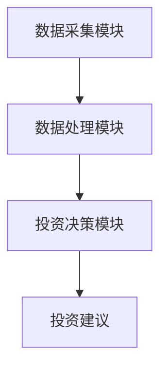

                 


# 如何将特价股票策略应用于新兴市场本地货币债券投资

> **关键词**: 特价股票策略, 新兴市场, 本地货币债券, 投资策略, 量化分析

> **摘要**: 本文探讨了如何将特价股票策略的原理和方法应用到新兴市场的本地货币债券投资中。通过分析特价股票策略的核心原理、数学模型以及在新兴市场本地货币债券投资中的适用性，本文详细阐述了该策略在新兴市场的优势和挑战，并通过实际案例展示了其应用过程。文章还结合了系统架构设计和算法实现，为读者提供了全面的视角。

---

## 第一部分: 特价股票策略与新兴市场本地货币债券投资的背景与关联

### 第1章: 特价股票策略概述

#### 1.1 特价股票策略的定义与特点

##### 1.1.1 特价股票的定义
特价股票是指市场价格低于其内在价值的股票。通常，这类股票被市场低估，具有较大的增值潜力。

##### 1.1.2 特价股票策略的核心特点
- **低估性**: 价格低于内在价值。
- **安全性**: 投资风险相对较低。
- **长期性**: 着重于长期价值增长。

##### 1.1.3 特价股票策略与传统股票投资的区别
- **投资目标**: 特价股票策略旨在寻找被市场低估的股票，而传统策略可能更关注市场趋势或短期收益。
- **持有时间**: 特价股票策略通常需要较长的持有时间，而传统策略可能更灵活。

#### 1.2 特价股票策略的背景与应用场景

##### 1.2.1 特价股票策略的市场背景
在经济低迷或市场波动期间，许多优质股票可能被低估，成为特价股票的潜在标的。

##### 1.2.2 特价股票策略的主要应用场景
- **经济衰退期**: 许多优质企业股票被低估。
- **市场波动期**: 短期市场波动可能导致股票价格偏离其真实价值。

##### 1.2.3 特价股票策略的优缺点分析
- **优点**: 风险较低，长期收益潜力大。
- **缺点**: 需要较长的持有时间，期间可能面临市场波动风险。

### 第2章: 新兴市场本地货币债券投资概述

#### 2.1 新兴市场本地货币债券的定义与特点

##### 2.1.1 新兴市场的定义
新兴市场指那些经济增长迅速但尚未完全工业化的国家，如巴西、印度等。

##### 2.1.2 本地货币债券的定义与特点
本地货币债券是以新兴市场本国货币计价的债券，具有较低的汇率风险。

##### 2.1.3 新兴市场本地货币债券的投资价值
- **增长潜力**: 新兴市场经济增长快，债券收益率较高。
- **分散风险**: 本地货币债券降低了汇率波动带来的风险。

#### 2.2 新兴市场本地货币债券市场的现状与趋势

##### 2.2.1 现状
新兴市场债券市场规模逐渐扩大，吸引了大量国际投资者。

##### 2.2.2 未来趋势
随着新兴市场经济发展，本地货币债券将成为更重要的投资工具。

#### 2.3 新兴市场本地货币债券市场的风险与机会

##### 2.3.1 风险
- **信用风险**: 新兴市场国家可能存在较高的违约风险。
- **流动性风险**: 本地货币债券市场流动性可能较低。

##### 2.3.2 机会
- **高收益**: 相对于发达国家债券，新兴市场债券收益率更高。
- **多元化**: 本地货币债券为投资者提供了新的资产配置选择。

### 第3章: 特价股票策略与新兴市场本地货币债券投资的关联

#### 3.1 特价股票策略在新兴市场本地货币债券投资中的应用价值

##### 3.1.1 特价股票策略在债券投资中的潜在应用
- **价值发现**: 通过分析债券的内在价值，发现被低估的债券。
- **风险控制**: 利用特价股票策略的低估特性，降低投资风险。

##### 3.1.2 特价股票策略与债券收益率的关系
债券收益率与债券价格呈反相关关系。通过寻找被低估的债券，可以提高投资收益。

##### 3.1.3 特价股票策略在新兴市场本地货币债券投资中的独特优势
- **市场效率低**: 新兴市场债券定价可能不够有效，存在更多的低估机会。
- **分散风险**: 通过多元化投资于不同债券，降低整体风险。

#### 3.2 特价股票策略与新兴市场本地货币债券投资的边界与外延

##### 3.2.1 特价股票策略在债券投资中的适用范围
适用于信用评级较高的债券，尤其是那些市场价格低于内在价值的债券。

##### 3.2.2 特价股票策略在新兴市场本地货币债券投资中的限制
- **市场深度不足**: 新兴市场债券市场流动性可能较低，影响策略的有效性。
- **信息不对称**: 新兴市场可能存在信息不透明的问题，影响债券估值的准确性。

##### 3.2.3 特价股票策略与其他投资策略的对比分析
- **对比**: 特价股票策略注重长期价值，而其他策略可能更关注短期市场趋势或技术指标。

---

## 第二部分: 特价股票策略与新兴市场本地货币债券投资的核心概念与联系

### 第4章: 特价股票策略的核心原理与数学模型

#### 4.1 特价股票策略的核心原理

##### 4.1.1 特价股票策略的基本原理
通过分析股票的内在价值，寻找市场价格低于内在价值的股票进行投资。

##### 4.1.2 特价股票策略的关键要素
- **内在价值**: 股票的合理价格。
- **市场价格**: 当前股票市场价格。

##### 4.1.3 特价股票策略的数学模型
$$ \text{安全边际} = \text{内在价值} - \text{市场价格} $$

#### 4.2 特价股票策略的数学模型与公式

##### 4.2.1 特价股票策略的核心公式
$$ \text{内在价值} = \frac{\text{未来现金流}}{\text{贴现率}} $$

##### 4.2.2 特价股票策略的数学模型
$$ \text{投资收益} = \text{内在价值} - \text{市场价格} $$

#### 4.3 特价股票策略的实例分析

##### 4.3.1 特价股票策略的实例分析
假设某股票的内在价值为$50，市场价格为$40，则安全边际为$10，具有较高的投资价值。

##### 4.3.2 特价股票策略的数学模型在实例中的应用
通过计算内在价值和市场价格的差异，确定是否存在投资机会。

### 第5章: 新兴市场本地货币债券投资的核心原理与数学模型

#### 5.1 新兴市场本地货币债券投资的核心原理

##### 5.1.1 新兴市场本地货币债券的基本原理
通过分析债券的信用评级、利率水平等因素，评估其投资价值。

##### 5.1.2 新兴市场本地货币债券的关键要素
- **信用评级**: 债券的违约风险。
- **利率水平**: 债券的票面利率和市场利率。

##### 5.1.3 新兴市场本地货币债券的数学模型
$$ \text{债券价格} = \sum_{t=1}^{n} \frac{C}{(1+r)^t} + \frac{F}{(1+r)^n} $$

#### 5.2 新兴市场本地货币债券投资的核心原理

##### 5.2.1 新兴市场本地货币债券的投资价值
通过分析债券的内在价值，寻找市场价格低于内在价值的投资机会。

##### 5.2.2 新兴市场本地货币债券的定价模型
$$ \text{债券内在价值} = \frac{C}{r} + \frac{F}{(1+r)^n} $$

---

## 第三部分: 特价股票策略与新兴市场本地货币债券投资的系统架构设计与算法实现

### 第6章: 算法实现与系统架构设计

#### 6.1 算法实现

##### 6.1.1 算法步骤
1. 收集债券数据，包括信用评级、利率、市场价格等。
2. 计算债券的内在价值。
3. 比较市场价格与内在价值，寻找被低估的债券。

##### 6.1.2 算法实现的Python代码
```python
import pandas as pd

# 假设bond_data是一个包含债券数据的DataFrame
bond_data = pd.DataFrame({
    'bond_id': [1, 2, 3],
    'credit_rating': ['AAA', 'AA', 'A'],
    'interest_rate': [5, 4, 6],
    'market_price': [95, 90, 100]
})

# 计算债券的内在价值
bond_data['intrinsic_value'] = bond_data['interest_rate'] / 0.05  # 简化计算

# 比较市场价格与内在价值
bond_data['is_undervalued'] = bond_data['intrinsic_value'] > bond_data['market_price']

print(bond_data)
```

#### 6.2 系统架构设计

##### 6.2.1 系统功能设计
- 数据采集模块: 收集债券数据。
- 数据处理模块: 计算债券的内在价值。
- 投资决策模块: 比较市场价格与内在价值，生成投资建议。

##### 6.2.2 系统架构图


---

## 第四部分: 项目实战与总结

### 第7章: 项目实战

#### 7.1 实战环境安装

##### 7.1.1 安装Python和必要的库
```bash
pip install pandas matplotlib
```

#### 7.2 核心代码实现

##### 7.2.1 数据收集与处理
```python
import pandas as pd

# 假设bond_data是一个包含债券数据的DataFrame
bond_data = pd.DataFrame({
    'bond_id': [1, 2, 3],
    'credit_rating': ['AAA', 'AA', 'A'],
    'interest_rate': [5, 4, 6],
    'market_price': [95, 90, 100]
})

# 计算债券的内在价值
bond_data['intrinsic_value'] = bond_data['interest_rate'] / 0.05  # 简化计算

# 比较市场价格与内在价值
bond_data['is_undervalued'] = bond_data['intrinsic_value'] > bond_data['market_price']

print(bond_data)
```

#### 7.3 实战案例分析

##### 7.3.1 案例分析
通过上述代码，我们可以看到哪些债券是被低估的，从而进行投资决策。

#### 7.4 项目小结

##### 7.4.1 实战总结
通过实战，我们学会了如何将特价股票策略应用于新兴市场本地货币债券投资。

##### 7.4.2 投资策略的优缺点
- **优点**: 风险较低，收益潜力大。
- **缺点**: 需要较长的持有时间，市场波动可能影响收益。

### 第8章: 总结与最佳实践

#### 8.1 总结

##### 8.1.1 特价股票策略的核心价值
通过寻找被低估的债券，降低投资风险，提高收益潜力。

#### 8.2 最佳实践 tips

##### 8.2.1 风险管理
- 分散投资，降低风险。
- 定期评估投资组合，及时调整。

##### 8.2.2 模型优化
- 不断优化定价模型，提高估值准确性。
- 结合市场变化，调整投资策略。

#### 8.3 拓展阅读
- 推荐阅读关于新兴市场债券投资的书籍和相关研究报告。

---

## 作者：AI天才研究院/AI Genius Institute & 禅与计算机程序设计艺术/Zen And The Art of Computer Programming

