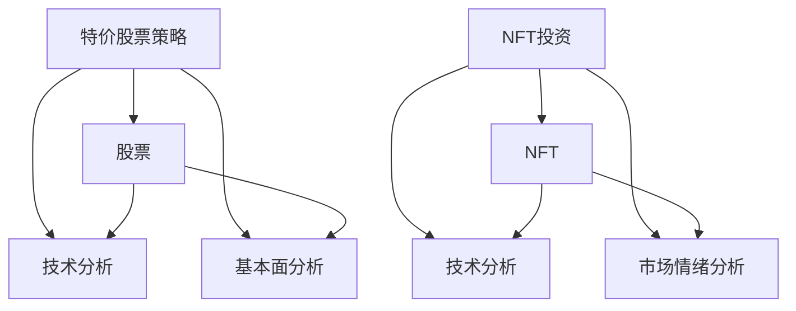
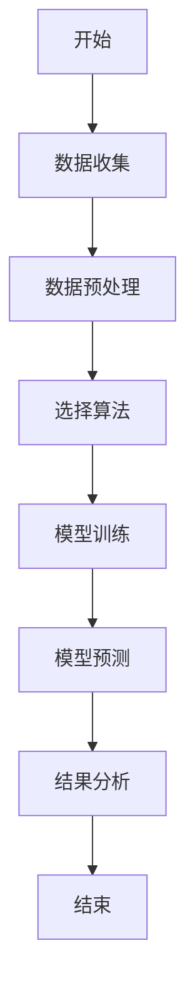

                 

# 如何将特价股票策略应用于非同质化代币(NFT)投资

> 关键词：NFT投资，特价股票策略，技术分析，套利机会，风险管理

> 摘要：本文详细探讨了如何将传统的股票投资策略应用于非同质化代币（NFT）投资中，包括市场分析、技术分析、套利机会、风险管理等方面。通过对比股票和NFT市场的特点，结合实际案例，为投资者提供一套系统化的NFT投资策略。

---

# 第一部分: 特价股票策略与NFT投资的背景介绍

## 第1章: 特价股票策略与NFT投资的背景介绍

### 1.1 特价股票策略的基本概念

#### 1.1.1 什么是特价股票策略
特价股票策略是一种通过技术分析和基本面分析相结合的投资方法，旨在在市场波动中寻找短期或中期的价格波动机会。这种方法通常包括以下步骤：
1. **技术分析**：通过分析股票的价格走势、成交量等指标，预测价格的未来变化。
2. **基本面分析**：研究公司的财务状况、行业地位、管理团队等因素，评估其股票的内在价值。
3. **套利机会**：利用不同市场或时间点的价格差异，进行无风险或低风险的投资。

#### 1.1.2 特价股票策略的核心目标
- 短期或中期的价格波动获利。
- 利用市场 inefficiencies 进行套利。
- 在市场波动中寻找超额收益。

#### 1.1.3 特价股票策略的适用场景
- 股票市场的短期价格波动。
- 市场流动性充足，交易活跃。
- 存在套利机会的市场环境。

### 1.2 NFT投资的基本概念

#### 1.2.1 什么是NFT
NFT（Non-Fungible Token，非同质化代币）是一种基于区块链技术的数字资产，具有唯一性和不可分割性。每个NFT都代表一种独特的数字资产，如数字艺术、虚拟土地、游戏道具等。

#### 1.2.2 NFT的市场现状
- NFT市场近年来迅速崛起，成为区块链领域的重要组成部分。
- 市场规模庞大，交易量增长迅速。
- 市场参与者包括收藏家、投资者和机构。

#### 1.2.3 NFT投资的特点与优势
- 高度的市场波动性。
- 独特性和稀缺性带来的投资价值。
- 市场参与者多元化，包括个人和机构。

### 1.3 特价股票策略与NFT投资的结合意义

#### 1.3.1 NFT市场的波动性与投资机会
- NFT市场价格波动较大，为投资者提供了短期获利的机会。
- 市场波动性与股票市场的波动性有相似之处，可以借鉴股票策略。

#### 1.3.2 特价股票策略在NFT投资中的潜在应用
- 利用技术分析预测NFT价格走势。
- 寻找NFT市场的套利机会。
- 基于市场情绪分析进行投资决策。

#### 1.3.3 两者的结合对投资者的价值
- 提高NFT投资的科学性和系统性。
- 降低投资风险，提高投资收益。
- 为投资者提供一种新的投资思路。

### 1.4 本章小结
本章介绍了特价股票策略和NFT投资的基本概念，并分析了两者结合的潜在价值和意义。通过对比分析，为后续章节的应用提供了理论基础。

---

# 第2章: 特价股票策略与NFT投资的核心概念

## 2.1 特价股票策略的核心原理

### 2.1.1 技术分析在股票投资中的应用
- **K线图分析**：通过分析价格走势，识别趋势和形态。
- **成交量分析**：成交量是价格变动的确认指标。
- **技术指标**：如RSI、MACD等，用于判断超买超卖状态和趋势强度。

### 2.1.2 基本面分析在股票投资中的应用
- **财务报表分析**：评估公司的盈利能力、资产负债情况等。
- **行业分析**：研究行业发展趋势和竞争格局。
- **管理团队分析**：评估公司管理团队的能力和战略。

### 2.1.3 套利策略在股票投资中的应用
- **跨市场套利**：利用不同市场之间的价格差异进行投资。
- **跨期套利**：利用同一资产在不同时间点的价格差异进行投资。
- ** arbitrage**：在价格差异中进行无风险或低风险投资。

## 2.2 NFT市场的核心特征

### 2.2.1 NFT市场的流动性分析
- NFT市场的流动性较低，交易量不如股票市场活跃。
- 某些NFT项目可能具有较高的流动性，而其他项目则流动性较低。

### 2.2.2 NFT市场的价格波动性
- NFT市场价格波动较大，受市场情绪和供需关系影响。
- 热门项目的价格可能在短时间内大幅波动。

### 2.2.3 NFT市场的供需关系
- 供给有限，需求取决于市场热度和收藏价值。
- 热门项目的需求可能远超供给，导致价格上涨。

## 2.3 特价股票策略与NFT投资的关联性分析

### 2.3.1 技术分析与NFT价格预测的结合
- 将技术分析方法应用于NFT价格走势预测。
- 通过K线图和成交量分析识别NFT市场的趋势和形态。

### 2.3.2 套利策略在NFT市场的应用
- 寻找不同平台或市场之间的价格差异，进行套利。
- 利用NFT市场的流动性不足，寻找短期价格波动机会。

### 2.3.3 市场情绪分析在NFT投资中的作用
- 市场情绪影响NFT价格，可以通过社交媒体、社区讨论等渠道进行分析。
- 市场情绪分析与技术分析结合，提高投资决策的准确性。

## 2.4 核心概念对比表格

| 比较维度 | 特价股票策略 | NFT投资 |
|----------|--------------|----------|
| 投资对象 | 股票          | NFT      |
| 市场流动性 | 高            | 低        |
| 价格波动性 | 中            | 高        |
| 投资策略 | 技术分析+基本面分析 | 技术分析+市场情绪分析 |
| 套利机会 | 跨市场套利    | 平台价格差异套利 |

## 2.5 ER实体关系图

## 2.6 本章小结
本章通过对比分析，揭示了特价股票策略和NFT投资的核心概念及其关联性，为后续策略的应用提供了理论基础。

---

# 第3章: 特价股票策略在NFT投资中的算法原理

## 3.1 特价股票策略的核心算法

### 3.1.1 技术分析算法
- **K线图分析**：通过绘制NFT的价格走势，识别趋势和形态。
- **成交量分析**：分析交易量的变化，确认价格走势的有效性。
- **技术指标**：如RSI、MACD等，用于判断超买超卖状态和趋势强度。

### 3.1.2 基本面分析算法
- **财务报表分析**：评估NFT项目背后的公司或团队的财务状况。
- **行业分析**：研究NFT市场的整体发展趋势和竞争格局。
- **管理团队分析**：评估NFT项目管理团队的能力和战略。

### 3.1.3 套利策略算法
- **跨平台套利**：寻找不同平台之间的价格差异，进行低买高卖。
- **时间套利**：利用同一NFT在不同时间点的价格差异进行投资。

## 3.2 NFT市场分析的算法

### 3.2.1 市场情绪分析算法
- **社交媒体分析**：通过分析社交媒体上的讨论，判断市场情绪。
- **关键词提取**：提取与NFT相关的关键词，分析市场热度。

### 3.2.2 价格波动预测算法
- **时间序列分析**：通过历史价格数据，预测未来的价格走势。
- **机器学习模型**：使用回归模型、神经网络等方法进行价格预测。

### 3.2.3 交易量分析算法
- **成交量确认**：通过分析交易量的变化，确认价格走势的有效性。
- **异常交易检测**：识别市场操纵或其他异常交易行为。

## 3.3 算法原理的Mermaid流程图

## 3.4 数学模型与公式

### 3.4.1 RSI指标公式
$$
RSI = \frac{\text{上涨幅度}}{\text{上涨幅度} + \text{下跌幅度}}
$$

### 3.4.2 MACD指标公式
$$
MACD = \text{短期EMA} - \text{长期EMA}
$$

### 3.4.3 时间序列预测模型
$$
\hat{y}_t = \alpha y_{t-1} + (1-\alpha)y_{t-2}
$$

## 3.5 本章小结
本章详细介绍了特价股票策略在NFT投资中的算法原理，包括技术分析、基本面分析和套利策略的应用，以及数学模型的建立和实现。

---

# 第4章: NFT投资中的风险管理与策略优化

## 4.1 风险管理的重要性

### 4.1.1 风险来源
- 市场波动风险
- 流动性风险
- 市场操纵风险

### 4.1.2 风险管理策略
- 设定止损点
- 分散投资
- 风险对冲

## 4.2 策略优化

### 4.2.1 策略参数优化
- 调整技术指标的参数，如RSI的计算周期。
- 优化套利策略的执行时机。

### 4.2.2 策略组合优化
- 结合技术分析和市场情绪分析，制定综合投资策略。
- 结合不同NFT项目的特性，制定差异化的投资策略。

## 4.3 实际案例分析

### 4.3.1 案例1：利用技术分析进行NFT投资
- 某NFT项目的价格走势符合技术指标的超卖信号，投资者在价格低点买入，随后价格上涨，获利卖出。

### 4.3.2 案例2：利用套利机会进行NFT投资
- 某NFT项目在A平台价格为0.5 ETH，在B平台价格为0.6 ETH，投资者在A平台买入，B平台卖出，获利0.1 ETH。

## 4.4 本章小结
本章通过风险管理与策略优化，提高了NFT投资的稳健性和收益性，为投资者提供了实际操作的参考。

---

# 第5章: 结论与展望

## 5.1 研究总结
- 特价股票策略在NFT投资中的应用具有一定的可行性和潜力。
- 技术分析和套利策略是NFT投资的重要工具。

## 5.2 未来展望
- NFT市场的进一步发展和成熟将为投资者提供更多机会。
- 人工智能和大数据技术的应用将进一步提升NFT投资的分析能力和决策效率。

## 5.3 最佳实践 Tips
- 投资者应根据自身风险承受能力和投资目标，选择适合的NFT投资策略。
- 在实际操作中，应密切关注市场动态，及时调整投资策略。

---

# 作者信息

作者：AI天才研究院/AI Genius Institute & 禅与计算机程序设计艺术/Zen And The Art of Computer Programming

---

# 附录

## 附录A: NFT投资工具推荐
- OpenSea
- NFTX
- Foundation

## 附录B: 相关术语解释
- NFT：Non-Fungible Token，非同质化代币。
- RSI：Relative Strength Index，相对强度指数。
- MACD：Moving Average Convergence Divergence，移动平均收敛散度。

---

通过以上章节的详细分析，我们可以看到，将特价股票策略应用于NFT投资需要结合两者的市场特点，利用技术分析和套利机会，同时注重风险管理。这不仅为投资者提供了新的思路，也为NFT市场的进一步发展提供了理论支持。

