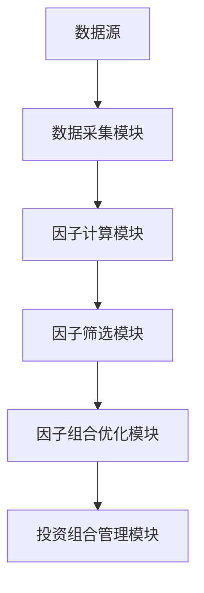
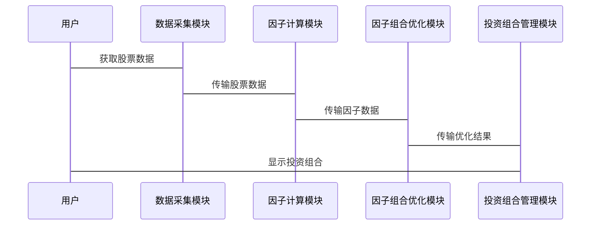

                 


# 如何将特价股票策略融入因子投资

## 关键词：
特价股票策略, 因子投资, 股票投资, 量化投资, 投资组合优化

## 摘要：
本文将详细介绍如何将特价股票策略融入因子投资。通过背景介绍、因子投资的核心概念、算法原理、系统架构设计、项目实战以及总结等部分，系统地阐述了特价股票策略在因子投资中的应用。文章结合理论与实践，通过具体案例分析和代码实现，为读者提供了一套完整的解决方案。

---

## 第1章: 特价股票策略概述

### 1.1 特价股票的定义与特点

#### 1.1.1 特价股票的定义
特价股票是指市场价格低于其内在价值的股票，通常被认为是被市场低估的投资标的。这种股票通常具有较高的安全边际，适合长期投资者。

#### 1.1.2 特价股票的核心特点
- **低估值**：市盈率、市净率等估值指标低于行业平均水平。
- **高分红**：部分特价股票公司倾向于高分红，为投资者提供稳定的现金流。
- **风险较低**：由于价格被低估，投资者的安全边际较高，风险相对较低。

#### 1.1.3 特价股票与普通股票的区别
- 普通股票的价格可能反映市场情绪，而特价股票的价格通常低于其内在价值。
- 普通股票的估值可能较高，而特价股票的估值通常较低。

### 1.2 特价股票策略的应用场景

#### 1.2.1 特价股票策略的常见应用场景
- **长期投资**：投资者寻找具有长期增长潜力的低估股票。
- **价值投资**：基于基本面分析，寻找被市场忽视的优质公司。
- **风险管理**：通过低估值股票降低投资组合的整体风险。

#### 1.2.2 特价股票策略的优势与劣势
- **优势**：风险较低，潜在回报较高。
- **劣势**：可能需要较长的时间才能实现价值回归，期间可能面临市场波动的风险。

#### 1.2.3 特价股票策略的适用人群
- 适合长期投资者、价值投资者以及风险偏好较低的投资者。

---

## 第2章: 因子投资概述

### 2.1 因子投资的定义与特点

#### 2.1.1 因子投资的定义
因子投资是一种通过筛选特定因子来构建投资组合的投资方法。因子可以是市场风险、市值、价值、动量等，每个因子代表了一种特定的市场特征。

#### 2.1.2 因子投资的核心特点
- **系统性**：基于数学模型和统计方法进行投资决策。
- **可量化**：因子的选择和组合可以通过量化方法进行优化。
- **分散化**：通过多因子组合降低投资风险。

#### 2.1.3 因子投资与传统投资的区别
- 传统投资通常基于基本面分析或技术分析，而因子投资基于统计方法和量化模型。
- 传统投资可能较为主观，而因子投资更加客观和系统。

### 2.2 因子投资的主要类型

#### 2.2.1 常见因子类型
- **市值因子（Size）**：小盘股相对于大盘股的表现。
- **价值因子（Value）**：低市盈率、低市净率等指标。
- **动量因子（Momentum）**：近期表现强劲的股票。
- **红利因子（Dividend Yield）**：高股息率的股票。
- **质量因子（Quality）**：高盈利能力、低杠杆等指标。

#### 2.2.2 因子类型的选择标准
- **可测性**：因子必须能够通过数据量化。
- **可解释性**：因子必须具有一定的理论基础。
- **可操作性**：因子必须能够在实际投资中应用。

#### 2.2.3 因子类型之间的关系
- **独立性**：不同因子之间应尽量独立，以避免多重共线性问题。
- **互补性**：不同因子可以互补，以提高投资组合的分散化程度。

---

## 第3章: 特价股票策略与因子投资的结合

### 3.1 特价股票策略融入因子投资的背景

#### 3.1.1 特价股票策略与因子投资的契合点
- 特价股票策略注重低估值，而价值因子也是因子投资中的重要组成部分。
- 特价股票策略通常关注长期回报，而因子投资可以通过多因子模型捕捉长期收益。

#### 3.1.2 特价股票策略在因子投资中的优势
- 通过因子筛选可以进一步优化特价股票的选择。
- 可以利用因子模型对投资组合进行风险管理和收益优化。

#### 3.1.3 特价股票策略与因子投资结合的必要性
- 单纯的特价股票策略可能过于集中在某些行业或公司，风险较高。
- 因子投资可以提供一种更加分散化和系统化的方式，降低投资风险。

### 3.2 特价股票策略与因子投资的融合方式

#### 3.2.1 基于因子筛选的特价股票选择
- 使用价值因子（如低市盈率、低市净率）筛选特价股票。
- 结合其他因子（如质量因子、动量因子）进一步优化股票选择。

#### 3.2.2 基于因子权重的特价股票配置
- 根据因子的重要性赋予不同的权重。
- 通过因子权重动态调整投资组合中特价股票的比例。

#### 3.2.3 特价股票策略与因子投资的动态调整
- 定期重新评估和调整因子权重。
- 根据市场变化动态调整特价股票的筛选条件。

---

## 第4章: 因子投资的核心概念与数学模型

### 4.1 因子的定义与分类

#### 4.1.1 常见因子的定义与特点
- **市值因子（Size）**：衡量公司市值大小的指标。
- **价值因子（Value）**：衡量股票是否低估的指标。
- **动量因子（Momentum）**：衡量股票近期表现的指标。
- **红利因子（Dividend Yield）**：衡量股票股息率的指标。
- **质量因子（Quality）**：衡量公司财务健康状况的指标。

#### 4.1.2 因子分类与应用场景
- **市场因子（Market）**：衡量市场整体风险的因子。
- **行业因子（Industry）**：衡量行业风险的因子。
- **风格因子（Style）**：衡量投资风格（如成长、价值）的因子。

#### 4.1.3 因子之间的相互影响
- **独立性**：不同因子之间应尽量独立，以避免多重共线性问题。
- **互补性**：不同因子可以互补，以提高投资组合的分散化程度。

### 4.2 因子权重的计算方法

#### 4.2.1 常见因子权重计算方法
- **等权法**：所有因子权重相等。
- **风险中性化法**：根据因子的风险贡献调整权重。
- **最大化收益法**：根据因子的收益潜力调整权重。

#### 4.2.2 因子权重计算的数学公式
- 等权法：$$w_i = \frac{1}{n}$$，其中$$w_i$$是第$$i$$个因子的权重，$$n$$是因子的总数。
- 风险中性化法：$$w_i = \frac{\sigma_i}{\sum_{j=1}^{n} \sigma_j}$$，其中$$\sigma_i$$是第$$i$$个因子的风险标准差。
- 最大化收益法：$$w_i = \frac{r_i}{\sum_{j=1}^{n} r_j}$$，其中$$r_i$$是第$$i$$个因子的预期收益。

#### 4.2.3 因子权重计算的注意事项
- 权重分配应根据市场环境和投资目标进行调整。
- 需要定期重新评估和调整因子权重。

---

## 第5章: 因子投资的数学模型

### 5.1 因子模型的构建

#### 5.1.1 因子模型的构建步骤
1. **数据收集**：收集相关股票的历史数据。
2. **因子计算**：根据因子定义计算因子值。
3. **因子筛选**：根据因子表现筛选出表现优异的因子。
4. **因子组合**：将筛选出的因子进行组合，构建投资组合。
5. **模型验证**：对模型进行回测和风险评估。

#### 5.1.2 因子模型的数学表达式
- 单因子模型：$$R_i = \alpha + \beta F_j + \epsilon$$，其中$$R_i$$是股票$$i$$的收益，$$F_j$$是因子$$j$$的值，$$\alpha$$是截距，$$\beta$$是因子的回归系数，$$\epsilon$$是误差项。
- 多因子模型：$$R_i = \alpha + \beta_1 F_1 + \beta_2 F_2 + \dots + \beta_n F_n + \epsilon$$，其中$$F_1, F_2, \dots, F_n$$是不同的因子。

#### 5.1.3 因子模型的验证与优化
- 回测分析：通过历史数据验证模型的收益和风险表现。
- 稳健性检验：通过不同的数据集和时间窗口检验模型的稳健性。

### 5.2 因子组合优化的数学方法

#### 5.2.1 常见因子组合优化方法
- **均值-方差优化**：最小化投资组合的方差，同时最大化预期收益。
- **风险中性优化**：在风险中性条件下优化投资组合。
- **最大化夏普比率优化**：通过优化投资组合的夏普比率来提高风险调整后收益。

#### 5.2.2 因子组合优化的数学公式
- 均值-方差优化：$$\min_w \frac{1}{2} w^T \Sigma w$$，在约束条件$$w^T \mu = R$$下，其中$$w$$是权重向量，$$\Sigma$$是协方差矩阵，$$\mu$$是预期收益向量，$$R$$是目标收益。
- 风险中性优化：$$\min_w w^T \Sigma w$$，在约束条件$$w^T \mu = R$$且$$w^T \Sigma \mathbf{1} = 0$$下，其中$$\mathbf{1}$$是全为1的向量。
- 最大化夏普比率优化：$$\max_w \frac{\mu^T w}{\sqrt{w^T \Sigma w}}$$，在约束条件$$w^T \mathbf{1} = 1$$下。

#### 5.2.3 因子组合优化的实现步骤
1. **计算因子收益和风险**：计算每个因子的历史收益和风险。
2. **构建优化模型**：根据优化目标构建数学模型。
3. **求解优化问题**：使用优化算法求解模型。
4. **验证优化结果**：对优化结果进行回测和风险评估。

---

## 第6章: 特价股票策略融入因子投资的算法原理

### 6.1 特价股票策略的算法实现

#### 6.1.1 特价股票筛选算法
1. **数据收集**：收集相关股票的历史数据。
2. **计算估值指标**：计算市盈率、市净率等估值指标。
3. **筛选低估值股票**：根据设定的筛选条件选择低估值股票。
4. **组合优化**：根据因子权重进行组合优化。

#### 6.1.2 特价股票策略优化算法
- **因子筛选**：根据因子表现筛选出表现优异的因子。
- **组合优化**：通过因子权重动态调整投资组合中特价股票的比例。

### 6.2 因子投资中的算法实现

#### 6.2.1 因子筛选算法
1. **计算因子值**：根据因子定义计算因子值。
2. **因子筛选**：根据因子表现筛选出表现优异的因子。
3. **因子组合**：将筛选出的因子进行组合，构建投资组合。

#### 6.2.2 因子组合优化算法
- **均值-方差优化**：最小化投资组合的方差，同时最大化预期收益。
- **风险中性优化**：在风险中性条件下优化投资组合。
- **最大化夏普比率优化**：通过优化投资组合的夏普比率来提高风险调整后收益。

---

## 第7章: 系统架构设计与项目实战

### 7.1 系统架构设计

#### 7.1.1 系统功能设计
- **数据采集**：从数据源获取股票数据。
- **因子计算**：根据因子定义计算因子值。
- **模型构建**：构建因子模型并进行优化。
- **投资组合管理**：根据优化结果进行投资组合管理。

#### 7.1.2 系统架构图


#### 7.1.3 系统接口设计
- 数据采集模块接口：从数据源获取股票数据。
- 因子计算模块接口：根据因子定义计算因子值。
- 因子组合优化模块接口：根据因子表现进行优化。

#### 7.1.4 系统交互流程图


### 7.2 项目实战

#### 7.2.1 环境安装
```bash
pip install pandas numpy matplotlib
```

#### 7.2.2 核心实现代码
```python
import pandas as pd
import numpy as np

# 数据采集模块
def get_stock_data(tickers):
    # 从数据源获取股票数据
    pass

# 因子计算模块
def compute_factors(stock_data):
    # 计算因子值
    pass

# 因子组合优化模块
def optimize_portfolio(factors):
    # 进行因子组合优化
    pass

# 投资组合管理模块
def manage_portfolio(optimized_factors):
    # 管理投资组合
    pass
```

#### 7.2.3 代码应用解读与分析
- 数据采集模块：从数据源获取股票数据。
- 因子计算模块：根据因子定义计算因子值。
- 因子组合优化模块：根据因子表现进行优化。
- 投资组合管理模块：根据优化结果进行投资组合管理。

#### 7.2.4 实际案例分析
- 数据来源：假设使用某金融数据平台的数据。
- 数据处理：清洗和整理数据。
- 因子计算：计算市盈率、市净率等因子。
- 因子组合优化：使用均值-方差优化方法进行优化。
- 投资组合管理：根据优化结果构建投资组合。

---

## 第8章: 总结与展望

### 8.1 总结
本文详细介绍了如何将特价股票策略融入因子投资。通过背景介绍、核心概念、算法原理、系统架构设计和项目实战等部分，系统地阐述了特价股票策略在因子投资中的应用。文章结合理论与实践，通过具体案例分析和代码实现，为读者提供了一套完整的解决方案。

### 8.2 最佳实践 tips
- 在实际应用中，建议根据市场环境和投资目标动态调整因子权重。
- 定期重新评估和优化投资组合，以应对市场变化。

### 8.3 注意事项
- 特价股票策略和因子投资都具有一定的风险，投资者需要具备一定的市场知识和经验。
- 在实际操作中，建议结合多种因子进行优化，以提高投资组合的分散化程度。

### 8.4 拓展阅读
- 阅读相关学术论文，了解最新的研究成果。
- 学习更多的因子筛选和组合优化方法。
- 关注市场动态，了解最新的投资策略和工具。

---

## 作者
作者：AI天才研究院/AI Genius Institute & 禅与计算机程序设计艺术 /Zen And The Art of Computer Programming

