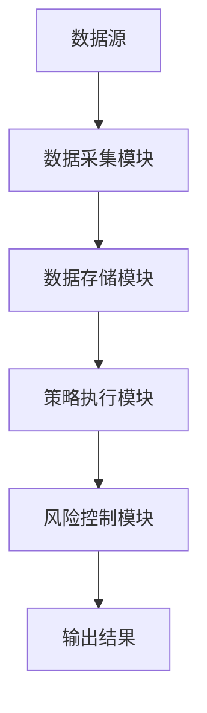
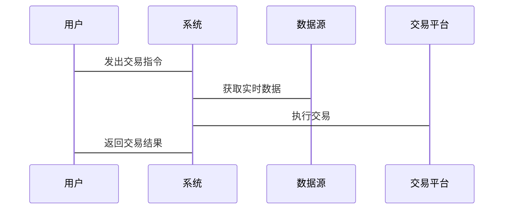

                 


# 如何将特价股票策略融入多元化数字资产对冲组合

## 关键词：特价股票策略，数字资产对冲，多元化投资，风险控制，算法优化

## 摘要：本文详细探讨了如何将特价股票策略与多元化数字资产对冲策略相结合，构建一个高效的风险控制体系。文章从背景介绍、核心概念、算法实现、系统架构到项目实战，逐步分析了如何利用数字资产的高波动性和对冲机制优化投资组合。通过数学模型、Python代码和系统设计，本文为投资者提供了理论支持和实践指导。

---

# 第一部分: 特价股票策略与数字资产对冲的背景与概念

## 第1章: 特价股票策略与数字资产对冲概述

### 1.1 特价股票策略的背景与定义
- **什么是特价股票策略**：特价股票策略是指在特定时间窗口内，以低于市场价买入股票，待价格上涨后卖出获利的策略。这种策略依赖于市场的短期波动，通常适用于市场流动性较好、波动性较高的环境。
- **特价股票策略的核心原理**：通过分析市场数据，识别短期价格波动机会，利用低买高卖的策略获利。其关键在于精准捕捉价格波动的时机。
- **特价股票策略的优缺点**：
  - 优点：高收益潜力，操作灵活。
  - 缺点：高风险，需频繁交易，对市场敏感度要求高。

### 1.2 数字资产对冲组合的定义与特点
- **数字资产的基本概念**：数字资产包括比特币、以太坊等加密货币，具有去中心化、匿名性和高波动性的特点。
- **对冲组合的定义与原理**：对冲组合是一种通过同时投资于多种资产或使用衍生品，以降低整体投资组合风险的投资策略。在数字资产领域，对冲组合通常结合不同类型的数字资产或传统资产，以分散风险。
- **数字资产对冲组合的优势**：
  - 风险分散：通过投资不同资产，降低单一资产的波动风险。
  - 利用市场相关性：通过分析不同资产之间的相关性，优化组合收益。

### 1.3 特价股票策略与数字资产对冲的结合
- **结合的必要性与可行性**：数字资产的高波动性和对冲机制为特价股票策略提供了新的机会。通过结合数字资产，可以利用其高波动性增强策略收益，同时利用对冲机制降低风险。
- **结合后的优势与潜在风险**：
  - 优势：高收益潜力，风险分散。
  - 风险：市场波动剧烈，操作复杂性增加。

---

# 第二部分: 特价股票策略与数字资产对冲的核心概念与联系

## 第2章: 特价股票策略的核心原理

### 2.1 特价股票策略的数学模型
- **价格波动的数学模型**：利用时间序列分析模型（如ARIMA）预测价格波动。
- **市场情绪对价格的影响**：通过自然语言处理（NLP）分析社交媒体和新闻，量化市场情绪对价格的影响。
- **策略收益的计算公式**：
  \[
  \text{收益} = \sum_{i=1}^{n} (P_{\text{卖出}} - P_{\text{买入}})
  \]

### 2.2 特价股票策略的关键因素
- **时间窗口的选择**：选择合适的时间窗口（如1小时、1天）进行买卖操作。
- **市场数据的获取与处理**：实时获取市场数据，进行清洗和特征提取。
- **策略参数的优化**：通过回测和参数优化，找到最优策略参数。

### 2.3 特价股票策略的实现流程
1. 数据采集与预处理。
2. 策略回测与优化。
3. 策略执行与监控。

## 第3章: 数字资产对冲组合的核心原理

### 3.1 数字资产对冲组合的构建方法
- **资产配置的基本原理**：根据风险承受能力和收益目标，分配投资比例。
- **风险分散的实现方式**：通过投资不同类型的资产，降低组合的波动性。
- **对冲机制的具体应用**：利用期货、期权等衍生品对冲市场风险。

### 3.2 数字资产对冲组合的数学模型
- **组合收益的计算公式**：
  \[
  \text{组合收益} = \sum_{i=1}^{m} w_i \times r_i
  \]
  其中，\(w_i\) 是第i种资产的投资权重，\(r_i\) 是第i种资产的收益。
- **风险度量的数学模型**：使用夏普比率、波动率等指标衡量组合风险。
- **组合优化的数学方法**：使用均值-方差优化模型，找到最优投资组合。

### 3.3 数字资产对冲组合的关键因素
- **资产选择的标准**：根据相关性和波动性选择资产。
- **杠杆与对冲的比例**：合理使用杠杆，控制对冲比例。
- **组合调整的频率**：定期评估和调整组合，适应市场变化。

## 第4章: 特价股票策略与数字资产对冲的结合原理

### 4.1 结合的理论基础
- **股票与数字资产市场的相关性分析**：通过相关性分析，确定两种市场的互动关系。
- **对冲策略在股票投资中的应用**：利用对冲机制，降低股票投资的市场风险。
- **数字资产对冲对股票投资的优化作用**：通过数字资产的高波动性，增强股票投资的收益。

---

# 第三部分: 特价股票策略与数字资产对冲的算法实现

## 第5章: 优化算法的设计与实现

### 5.1 算法优化的目标
- 提升策略收益。
- 控制交易风险。
- 降低交易成本。

### 5.2 算法优化的步骤
1. 数据预处理：清洗和特征提取。
2. 策略回测：计算策略收益和风险指标。
3. 参数优化：使用遗传算法或网格搜索优化策略参数。
4. 策略执行：根据优化后的参数执行交易。

### 5.3 算法优化的数学模型
- **动态规划模型**：用于寻找最优交易路径。
- **均值-方差优化模型**：用于优化投资组合。

### 5.4 算法优化的Python代码实现
```python
import numpy as np
import pandas as pd

# 数据预处理
data = pd.read_csv('stock_data.csv')
features = data[['open', 'close', 'high', 'low']]
labels = data['target']

# 参数优化
from sklearn.model_selection import GridSearchCV
from sklearn.linear_model import LinearRegression

param_grid = {'alpha': [0.1, 0.2, 0.3]}
grid_search = GridSearchCV(LinearRegression(), param_grid, cv=5)
grid_search.fit(features, labels)
best_params = grid_search.best_params_
```

### 5.5 算法优化的效果分析
- 通过回测结果分析策略的收益和风险。
- 比较不同优化方法的效果，选择最优策略。

---

# 第四部分: 特价股票策略与数字资产对冲的系统架构与设计

## 第6章: 系统架构设计

### 6.1 系统功能模块
- 数据采集模块：实时采集股票和数字资产数据。
- 策略执行模块：根据优化算法执行交易。
- 风险控制模块：监控和管理投资风险。
- 数据存储模块：存储交易数据和日志。

### 6.2 系统架构图


### 6.3 系统接口设计
- 数据接口：与数据源对接，获取实时数据。
- 交易接口：与交易平台对接，执行交易指令。
- 风险控制接口：与监控系统对接，实时监控风险指标。

### 6.4 系统交互流程


---

# 第五部分: 特价股票策略与数字资产对冲的项目实战

## 第7章: 项目实战

### 7.1 环境安装与配置
- 安装Python和相关库（如Pandas、NumPy、Scikit-learn）。
- 配置数据源和交易接口。

### 7.2 核心代码实现
```python
# 策略回测代码
def backtest策略(数据, 参数):
    收益 = 0
    for i in range(len(数据)-1):
        当前价格 = 数据[i]
        下一价格 = 数据[i+1]
        如果(执行策略的条件满足):
            收益 += (下一价格 - 当前价格)
    return 收益

# 参数优化代码
from sklearn.model_selection import GridSearchCV
from sklearn.linear_model import LinearRegression

param_grid = {'alpha': [0.1, 0.2, 0.3]}
grid_search = GridSearchCV(LinearRegression(), param_grid, cv=5)
grid_search.fit(X, y)
best_params = grid_search.best_params_
```

### 7.3 实际案例分析
- 选择一个具体的股票和数字资产组合，进行回测和分析。
- 计算策略的收益和风险指标，进行比较和优化。

---

# 第六部分: 特价股票策略与数字资产对冲的最佳实践

## 第8章: 最佳实践

### 8.1 系统优化与维护
- 定期更新数据源和交易接口。
- 根据市场变化调整策略参数。
- 监控系统性能，优化运行效率。

### 8.2 小结
- 特价股票策略与数字资产对冲的结合可以有效提升投资收益，降低风险。
- 系统设计和算法优化是实现这一目标的关键。

### 8.3 注意事项
- 风险控制是第一位的，需严格监控市场波动和交易风险。
- 确保数据源的可靠性和交易接口的稳定性。
- 定期回顾和优化策略，适应市场变化。

### 8.4 拓展阅读
- 推荐阅读《算法交易：量化投资策略与系统》和《数字资产投资的策略与风险》。

---

# 作者：AI天才研究院/AI Genius Institute & 禅与计算机程序设计艺术 /Zen And The Art of Computer Programming

