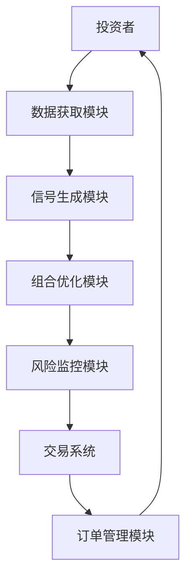

                 


# 如何将特价股票策略融入多资产类别投资组合

> 关键词：特价股票策略，多资产类别投资，量化分析，组合优化，风险管理

> 摘要：本文详细探讨了如何将特价股票策略融入多资产类别投资组合的策略、方法和实际应用。通过分析特价股票的定义、量化分析方法、多资产类别投资的系统架构设计、实际案例分析和最佳实践，本文为投资者提供了一个系统化的解决方案，帮助他们在复杂的金融市场中优化投资组合，降低风险，实现长期收益目标。

---

## 第一部分：背景介绍与核心概念

### 第1章：特价股票策略的基本概念

#### 1.1 什么是特价股票策略
- **定义**：特价股票策略是指通过寻找市场中被低估的股票，以低于其内在价值的价格买入，长期持有的投资策略。
- **分类**：根据低估的指标不同，特价股票可以分为价值型股票、红利型股票等。
- **特点**：低估值、高分红、高安全边际。

#### 1.2 多资产类别投资的基本原理
- **定义**：多资产类别投资是指将资金分配到股票、债券、房地产等多种资产类别中，以分散风险、提高收益的投资策略。
- **优势**：通过资产类别间的低相关性，实现风险分散和收益增强。
- **组合管理**：通过优化资产配置比例，平衡风险和收益。

### 第2章：特价股票策略在投资组合中的应用背景

#### 2.1 当前金融市场环境分析
- **全球化与金融市场的变化**：全球经济一体化使得投资者可以接触到更多的资产类别和市场。
- **特价股票策略的兴起**：市场波动性和低利率环境促使投资者寻找高收益低风险的投资机会。
- **多资产投资的市场需求**：投资者对风险控制和收益稳定性的需求增加。

#### 2.2 投资者行为与策略选择
- **风险偏好**：不同投资者对风险的承受能力不同，影响其对特价股票策略的选择。
- **收益目标**：投资者的长期收益目标决定了其对高收益资产的配置比例。
- **策略适用场景**：特价股票策略适合长期投资，但在市场波动较大时需要灵活调整。

### 第3章：特价股票策略的核心概念与联系

#### 3.1 特价股票策略的核心原理
- **市场有效性的分析**：市场价格与内在价值的偏离反映了市场非有效性的机会。
- **定价机制**：通过基本面分析，寻找市场价格低于内在价值的股票。
- **投资者行为**：投资者的理性与非理性行为可能导致股票价格的低估或高估。

#### 3.2 特价股票策略与多资产投资的联系
- **角色定位**：特价股票在多资产组合中起到提供超额收益的作用。
- **互动关系**：通过与其他资产类别的组合，降低整体投资组合的波动性。
- **风险分散**：多资产配置可以有效分散单一资产的风险，提高整体投资组合的稳定性。

---

## 第二部分：算法原理与量化分析

### 第4章：特价股票策略的量化分析

#### 4.1 数据收集与处理
- **数据来源**：包括历史价格、财务报表、市场指标等。
- **数据清洗**：去除缺失值、异常值，确保数据质量。
- **数据标准化**：对不同资产类别的数据进行标准化处理，便于比较。

#### 4.2 特价股票筛选模型
- **价值比率计算**：通过市盈率（P/E）、市净率（P/B）、股息率等指标筛选低估股票。
$$ Value\ Ratio = \frac{Price}{Earnings} $$
- **多因子模型**：结合多个因子（如价值、动量、质量等）进行综合评估。
$$ Score = \alpha \times Value + \beta \times Momentum + \gamma \times Quality $$

#### 4.3 组合优化算法
- **均值-方差优化**：通过最小化组合风险，最大化预期收益。
$$ Minimize\ Var(r) $$
$$ Subject\ to\ E[r] \geq Target\ Return $$
- **风险平价优化**：将风险在不同资产类别间平均分配，降低组合的尾部风险。
$$ Risk\ Parity = \frac{Weight_i \times Volatility_i^2}{\sum_{j} Weight_j \times Volatility_j^2} $$

### 第4.3 实际案例分析
- **策略回测**：通过历史数据回测特价股票策略的表现。
- **结果分析**：比较不同策略在不同市场环境下的表现，分析其稳定性和收益能力。
- **风险与收益权衡**：通过夏普比率、最大回撤等指标评估策略的风险收益比。

---

## 第三部分：系统分析与架构设计

### 第5章：投资组合管理系统架构

#### 5.1 系统功能模块划分
- **数据获取模块**：实时获取市场数据，包括股票价格、债券收益率等。
- **信号生成模块**：根据量化模型生成投资信号，如买入、卖出信号。
- **组合优化模块**：根据当前市场环境和投资者目标，优化投资组合配置。
- **风险监控模块**：实时监控投资组合的风险指标，如VaR、回撤等。

#### 5.2 数据流与信息交互
- **数据输入**：市场数据、投资者目标、风险偏好。
- **数据处理**：清洗、转换、分析。
- **数据输出**：投资信号、组合优化结果、风险报告。

#### 5.3 系统架构的可扩展性
- **模块化设计**：各功能模块相对独立，便于扩展和维护。
- **接口标准化**：统一接口规范，便于与其他系统集成。
- **可扩展性设计**：预留接口，方便未来新增功能模块。

### 第5.2 系统接口设计

#### 5.2.1 数据接口规范
- **数据格式**：使用JSON或CSV格式进行数据传输。
- **接口协议**：使用RESTful API进行数据交互。
- **数据频率**：支持实时数据和历史数据的获取。

#### 5.2.2 策略执行接口
- **订单生成**：根据策略信号生成买入或卖出订单。
- **订单执行**：通过交易系统执行订单，记录交易流水。
- **订单撤销**：在特定条件下撤销未执行的订单。

#### 5.2.3 风险监控接口
- **风险指标计算**：实时计算投资组合的风险指标，如VaR、波动率。
- **风险预警**：当风险指标超过设定阈值时，触发预警机制。
- **风险报告**：生成风险报告，供投资者参考。

### 第5.3 系统交互流程图



---

## 第四部分：项目实战与代码实现

### 第6章：项目实战与代码实现

#### 6.1 环境安装
- **Python环境**：安装Anaconda或Miniconda，包括Python 3.8+版本。
- **依赖库安装**：使用pip安装以下库：
  - pandas
  - numpy
  - matplotlib
  - pyfolio
  - yfinance

#### 6.2 核心实现代码

```python
import pandas as pd
import numpy as np
import yfinance as yf
from pyfolio import timeseries

# 下载数据
def get_data(tickers, start_date, end_date):
    data = yf.download(tickers, start=start_date, end=end_date)
    return data['Adj Close']

# 计算价值比率
def calculate_value_ratios(df, window=12):
    df['PE'] = df['Adj Close'] / df['Earnings'].shift(window)
    df['PB'] = df['Adj Close'] / df['Book Value'].shift(window)
    df['Div Yield'] = df['Dividends'] / df['Adj Close']
    return df[['PE', 'PB', 'Div Yield']].mean()

# 策略回测
def backtest_strategy(data, universe, window=12):
    universe = list(universe)
    portfolio = []
    for i in range(window, len(data)):
        current_data = data.iloc[i]
        value = calculate_value_ratios(current_data, window)
        if value < data['PE'].quantile(0.25):
            portfolio.append(universe[i % len(universe)])
    return portfolio

# 组合优化
def optimize_portfolio(returns, constraints):
    return timeseries.portfolio_weights(returns, constraints)
```

#### 6.3 代码应用解读与分析
- **数据获取**：使用yfinance获取股票数据，计算调整后的收盘价。
- **价值比率计算**：通过移动窗口计算市盈率、市净率和股息率，筛选低估股票。
- **策略回测**：基于价值比率的筛选结果生成投资组合，并进行回测分析。
- **组合优化**：利用pyfolio进行组合优化，确保风险可控，收益最大化。

#### 6.4 实际案例分析
- **案例背景**：假设市场中有10只股票，目标是构建一个包含这些股票的投资组合。
- **数据处理**：下载历史数据，计算价值比率。
- **策略执行**：根据价值比率筛选低估股票，生成投资组合。
- **风险评估**：计算投资组合的风险指标，如夏普比率和最大回撤。

#### 6.5 项目小结
- **策略优点**：通过多资产类别配置，降低整体风险。
- **策略缺点**：需要频繁监控市场环境，及时调整投资组合。
- **注意事项**：市场环境变化会影响策略的有效性，需要持续监控和优化。

---

## 第五部分：最佳实践与总结

### 第7章：最佳实践与总结

#### 7.1 最佳实践 tips
- **风险管理**：定期评估投资组合的风险，及时调整配置比例。
- **模型调优**：根据市场环境的变化，优化量化模型的参数。
- **持续学习**：关注市场动态，学习新的投资策略和工具。

#### 7.2 小结
- **策略优势**：通过将特价股票策略融入多资产类别投资组合，投资者可以在控制风险的同时，实现超额收益。
- **潜在挑战**：市场波动性和模型的有效性是需要重点关注的问题。
- **未来展望**：随着人工智能和大数据技术的发展，量化分析和组合优化将更加精准和高效。

---

## 作者：AI天才研究院 & 禅与计算机程序设计艺术

---

通过以上结构，我们系统地分析了如何将特价股票策略融入多资产类别投资组合的各个方面，从理论到实践，从算法到系统设计，为投资者提供了一个全面的解决方案。希望本文能够帮助读者更好地理解这一策略，并在实际投资中取得优异的成果。

