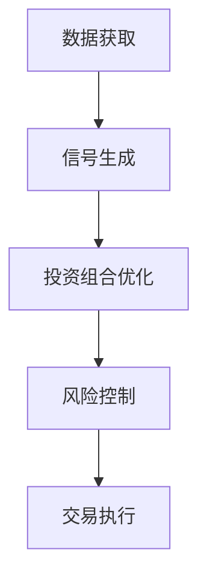

                 


# 如何将特价股票策略融入指数增强型投资

## 关键词：特价股票策略、指数增强型投资、统计套利、量化交易、风险控制

## 摘要：本文探讨了如何将特价股票策略融入指数增强型投资，通过分析特价股票策略的核心原理、指数增强型投资的策略优化，以及两者结合的方法，提出了一种结合市场中性策略和统计套利模型的创新投资方法。文章详细讲解了套利机会的识别、投资组合优化、风险控制等关键环节，并通过实际案例分析验证了策略的有效性。

---

# 第一部分: 特价股票策略与指数增强型投资的背景介绍

## 第1章: 特价股票策略与指数增强型投资概述

### 1.1 特价股票策略的定义与特点

#### 1.1.1 特价股票策略的定义
特价股票策略是一种利用市场中短期价格波动进行投资的策略，主要通过捕捉套利机会、技术分析或统计套利模型来实现超额收益。

#### 1.1.2 特价股票策略的核心特点
- **短期性**：主要关注短期价格波动，投资周期较短。
- **套利导向**：利用市场价差或不合理的定价获取无风险或低风险收益。
- **量化驱动**：依赖数学模型和算法进行交易决策。

#### 1.1.3 特价股票策略的适用场景
- **市场波动较大**：适合在市场波动较大的情况下捕捉短期价差。
- **套利机会存在**：当市场中存在套利机会时，特价股票策略能够快速响应。

### 1.2 指数增强型投资的定义与特点

#### 1.2.1 指数增强型投资的定义
指数增强型投资是一种通过跟踪特定指数（如沪深300、标普500等），同时加入主动管理策略，以期获得超越指数收益率的投资方式。

#### 1.2.2 指数增强型投资的核心特点
- **被动投资为主**：以跟踪指数为核心，同时辅以主动管理。
- **风险可控**：通过分散投资降低个股风险，收益接近指数。
- **超额收益目标**：通过主动管理策略实现超越指数的收益。

#### 1.2.3 指数增强型投资的优势与局限性
- **优势**：
  - 风险分散，稳定性高。
  - 管理费用较低。
- **局限性**：
  - 主动管理部分的收益不稳定。
  - 需要较高的投研能力。

### 1.3 特价股票策略与指数增强型投资的结合意义

#### 1.3.1 结合的背景与动机
- 利用特价股票策略捕捉短期收益，增强指数增强型投资的收益。
- 通过指数增强型投资的稳定性，降低特价股票策略的风险。

#### 1.3.2 结合的潜在优势
- 提升整体收益：通过结合两种策略，实现收益互补。
- 降低风险：利用指数增强型投资的分散性，降低特价股票策略的风险。

#### 1.3.3 结合的可能风险与挑战
- 风险叠加：如果两种策略同时出现亏损，风险可能放大。
- 操作复杂性：需要同时管理短期交易和长期投资策略。

---

# 第二部分: 特价股票策略的原理与应用

## 第2章: 特价股票策略的核心原理

### 2.1 套利机会的识别与捕捉

#### 2.1.1 套利的基本原理
套利是指利用不同市场或不同资产之间的价格差异，以无风险或低风险的方式赚取利润。

#### 2.1.2 市场中性策略的应用
市场中性策略通过同时做多和做空，抵消市场波动影响，专注于捕捉个股或行业的超额收益。

#### 2.1.3 套利机会的数学模型
套利机会可以通过统计套利模型进行识别，例如：
$$ \text{价差} = \text{价格}_A - \text{价格}_B $$
当价差偏离均值时，套利机会出现。

### 2.2 技术分析与量化交易

#### 2.2.1 技术分析的基本原理
技术分析通过分析历史价格和成交量数据，预测未来价格走势。

#### 2.2.2 量化交易的核心方法
量化交易依赖于算法和模型，通过高频交易和大数据分析捕捉市场机会。

#### 2.2.3 技术指标与交易信号的生成
常用技术指标包括：
- **移动平均线（MA）**：$$ MA_n = \frac{1}{n} \sum_{i=1}^{n} p_i $$
- **相对强弱指数（RSI）**：衡量价格超买或超卖状态。

### 2.3 统计套利模型的构建与应用

#### 2.3.1 统计套利模型的定义
统计套利模型基于资产价格的均值回归特性，寻找价格偏离均值的套利机会。

#### 2.3.2 统计套利模型的构建步骤
1. 数据收集与清洗。
2. 计算相关资产的价格关系。
3. 确定套利机会的触发条件。
4. 设定交易策略和风险管理规则。

#### 2.3.3 统计套利模型的实证分析
通过历史数据验证统计套利模型的有效性，例如：
$$ \text{收益} = \text{价差变化} \times \text{交易量} $$

---

## 第3章: 指数增强型投资的核心策略

### 3.1 指数跟踪与偏离控制

#### 3.1.1 指数跟踪的基本原理
通过购买指数成分股，按照权重配置资金，实现对指数的跟踪。

#### 3.1.2 偏离控制的方法与技巧
- **权重调整**：根据市场变化动态调整成分股权重。
- **替代投资**：用相似的股票替代成分股，降低交易成本。

#### 3.1.3 偏离控制的数学模型
$$ \text{偏离} = \sum_{i=1}^{n} (w_i - \text{index}_i) $$
通过优化模型最小化偏离。

---

## 第4章: 将特价股票策略融入指数增强型投资的方法

### 4.1 系统架构设计

#### 4.1.1 问题场景介绍
- 数据来源：市场数据、历史数据。
- 系统功能：数据获取、信号生成、投资组合优化、风险控制。

#### 4.1.2 系统架构设计
使用Mermaid绘制系统架构图：



#### 4.1.3 系统功能模块
- 数据获取模块：实时获取市场数据。
- 信号生成模块：基于模型生成交易信号。
- 投资组合优化模块：优化投资组合。
- 风险控制模块：控制整体风险。

### 4.2 投资组合优化

#### 4.2.1 多因子模型的应用
$$ \text{收益} = \beta_1 \times \text{因子}_1 + \beta_2 \times \text{因子}_2 + \dots + \beta_n \times \text{因子}_n $$

#### 4.2.2 风险对冲策略
通过做空股指期货对冲市场风险。

#### 4.2.3 数学优化模型
$$ \text{收益最大化} = \sum_{i=1}^{n} w_i \times r_i $$
$$ \text{风险最小化} = \sum_{i=1}^{n} w_i^2 \times \sigma_i^2 $$

### 4.3 风险控制

#### 4.3.1 风险控制策略
- **止损策略**：设定最大亏损比例。
- **仓位控制**：根据市场情况动态调整仓位。

#### 4.3.2 风险调整后的收益优化
$$ \text{夏普比率} = \frac{\text{超额收益}}{\text{收益标准差}} $$

---

## 第5章: 项目实战

### 5.1 环境配置

#### 5.1.1 系统环境
- 操作系统：Linux/Windows/Mac。
- 开发工具：Python、Jupyter Notebook。
- 数据源：Yahoo Finance/Quandl。

### 5.2 核心实现

#### 5.2.1 数据获取
```python
import pandas as pd
import yfinance as yf

data = yf.download(tickers='AAPL', start='2020-01-01', end='2023-12-31')
```

#### 5.2.2 信号生成
```python
def generate_signal(data):
    # 计算RSI指标
    rsi = data['Close'].rolling(14).apply(lambda x: (x[-1] - x.mean())/x.std())
    return rsi.apply(lambda x: 1 if x > 70 else (-1 if x < 30 else 0))
```

#### 5.2.3 组合优化
```python
import numpy as np

def optimize_portfolio(returns, weights):
    # 计算收益和风险
    portfolio_return = np.dot(returns, weights)
    portfolio_risk = np.sqrt(np.dot(weights.T, np.dot(returns.cov(), weights)))
    return portfolio_return, portfolio_risk
```

#### 5.2.4 回测分析
```python
def backtest策略(data, signal):
    positions = signal.shift(1)
    returns = data['Close'].pct_change() * positions
    return returns.cumprod()
```

### 5.3 案例分析

#### 5.3.1 案例背景
假设使用沪深300指数作为基准，结合特价股票策略进行增强。

#### 5.3.2 实证分析
通过回测验证策略的有效性，计算夏普比率、最大回撤等指标。

### 5.4 小结

---

## 第6章: 最佳实践与总结

### 6.1 最佳实践 tips
- 定期调整投资组合，应对市场变化。
- 严格控制风险，避免过度杠杆。

### 6.2 小结
通过将特价股票策略融入指数增强型投资，可以在保持稳定性的基础上提升收益。

### 6.3 注意事项
- 风险控制是关键。
- 确保数据质量和模型的有效性。

### 6.4 拓展阅读
- 《投资学》
- 《量化交易入门》

---

作者：AI天才研究院/AI Genius Institute & 禅与计算机程序设计艺术 /Zen And The Art of Computer Programming

