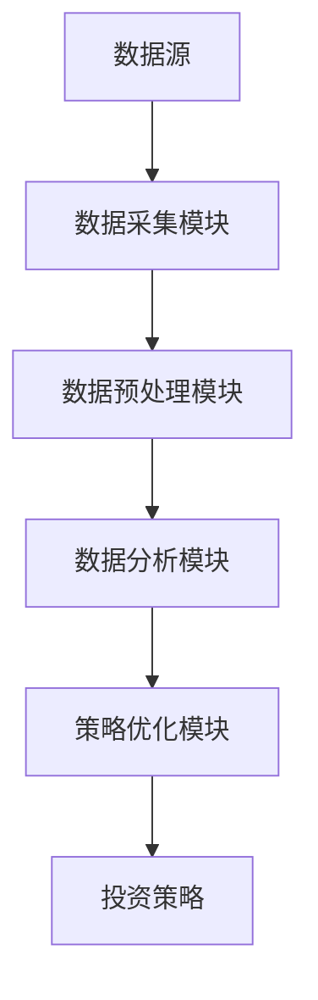
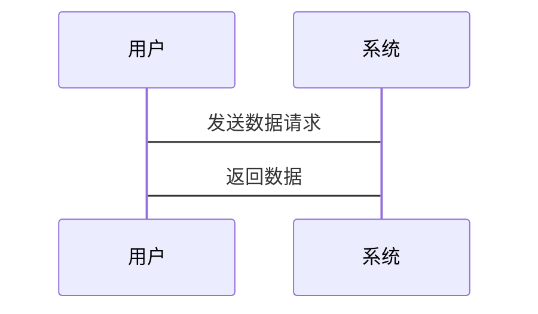

                 


# 如何将特价股票策略融入智能Beta投资

> 关键词：智能Beta投资、特价股票策略、算法优化、系统架构、大数据分析

> 摘要：本文将深入探讨如何将特价股票策略与智能Beta投资相结合。通过分析特价股票策略的核心原理、智能Beta投资的算法优化以及两者结合的系统架构，本文为投资者提供了一种全新的投资策略。结合实际案例分析和数学模型推导，本文详细阐述了如何通过大数据分析和算法优化，实现智能Beta投资中的特价股票策略，并探讨了其在未来投资中的潜力与挑战。

---

## 第1章: 特价股票策略与智能Beta投资概述

### 1.1 特价股票策略的核心概念

#### 1.1.1 特价股票的定义与特征
特价股票是指在特定市场条件下，价格低于其内在价值的股票。其主要特征包括：
- **低估值**：市盈率、市净率等估值指标低于行业平均水平。
- **市场波动**：通常在市场下跌或恐慌时出现。
- **短期机会**：特价股票的机会往往短暂，需要快速决策。

#### 1.1.2 特价股票策略的分类与应用场景
- **价值型策略**：寻找被市场低估的股票，长期持有。
- **事件驱动策略**：利用公司并购、重组等事件中的价格波动。
- **技术分析策略**：结合价格走势和技术指标寻找机会。

#### 1.1.3 特价股票策略与传统投资策略的对比
| 对比维度 | 特价股票策略 | 传统投资策略 |
|----------|--------------|--------------|
| 策略目标 | 短期收益最大化 | 长期价值投资 |
| 风险特征 | 高风险，收益波动大 | 中低风险，收益稳定 |
| 适用场景 | 市场波动较大时 | 市场稳定时 |

### 1.2 智能Beta投资的基本原理

#### 1.2.1 智能Beta投资的定义与特点
智能Beta投资是一种结合大数据分析和算法优化的投资策略，其特点包括：
- **数据驱动**：基于海量数据进行分析和预测。
- **算法优化**：利用机器学习等技术优化投资组合。
- **动态调整**：根据市场变化实时调整投资策略。

#### 1.2.2 智能Beta投资的核心优势
- **高效性**：通过算法快速筛选和优化投资组合。
- **精准性**：利用大数据分析提高投资决策的准确性。
- **适应性**：能够根据市场变化快速调整策略。

#### 1.2.3 智能Beta投资与传统被动投资的区别
| 对比维度 | 智能Beta投资 | 传统被动投资 |
|----------|--------------|--------------|
| 投资策略 | 数据驱动，动态调整 | 基于固定指数，长期持有 |
| 风险特征 | 风险可控，收益波动较大 | 风险分散，收益稳定 |
| 适用场景 | 高波动市场 | 稳定市场 |

### 1.3 特价股票策略与智能Beta投资的结合

#### 1.3.1 结合的必要性与可行性
- **必要性**：智能Beta投资能够快速捕捉市场机会，而特价股票策略提供了具体的市场机会。
- **可行性**：通过大数据分析和算法优化，智能Beta投资能够高效地识别和执行特价股票策略。

#### 1.3.2 结合的潜在优势与挑战
- **优势**：
  - 提高投资效率。
  - 增强市场适应能力。
  - 提升投资收益。
- **挑战**：
  - 数据获取难度。
  - 算法优化复杂性。
  - 市场波动的不可预测性。

#### 1.3.3 结合的未来发展趋势
随着人工智能和大数据技术的不断发展，智能Beta投资与特价股票策略的结合将更加紧密，成为未来投资的重要趋势。

---

## 第2章: 特价股票策略的核心原理与数学模型

### 2.1 特价股票策略的核心原理

#### 2.1.1 市场波动与特价股票机会
市场波动是特价股票策略的核心驱动力。通过分析市场波动，投资者可以找到价格被低估的股票。

#### 2.1.2 特价股票的识别与筛选
- **估值指标**：市盈率（P/E）、市净率（P/B）、股息率等。
- **技术指标**：相对强弱指数（RSI）、移动平均线（MA）等。

#### 2.1.3 特价股票的买入与卖出时机
- **买入时机**：市场恐慌导致价格下跌时。
- **卖出时机**：价格回归合理估值区间时。

### 2.2 特价股票策略的数学模型

#### 2.2.1 市场波动模型
$$ \text{波动率} = \sqrt{\frac{1}{n-1} \sum_{i=1}^{n} (x_i - \bar{x})^2} $$
其中，$\bar{x}$为价格的平均值，$n$为数据点数量。

#### 2.2.2 特价股票筛选模型
$$ \text{筛选条件} = \begin{cases} 
P/E < 行业平均P/E \\
P/B < 行业平均P/B \\
\text{RSI} < 30 
\end{cases} $$

#### 2.2.3 特价股票收益预测模型
$$ \text{预期收益} = \beta \times \text{市场收益} + \alpha $$

---

## 第3章: 智能Beta投资的核心算法与实现

### 3.1 智能Beta投资的核心算法

#### 3.1.1 基于机器学习的Beta预测算法
通过机器学习模型（如支持向量回归）预测市场Beta值。

#### 3.1.2 基于大数据分析的Beta优化算法
利用大数据分析优化投资组合的Beta值。

#### 3.1.3 基于动态调整的Beta投资策略
根据市场变化动态调整投资组合的Beta值。

### 3.2 智能Beta投资的实现步骤

#### 3.2.1 数据采集与预处理
- 数据来源：股票价格、市场指数、宏观经济数据等。
- 数据清洗：处理缺失值、异常值。

#### 3.2.2 数据分析与建模
- 数据分析：使用统计方法分析数据。
- 模型训练：训练机器学习模型。

#### 3.2.3 策略优化与验证
- 策略优化：调整模型参数。
- 策略验证：回测策略收益和风险。

---

## 第4章: 特价股票策略与智能Beta投资的结合算法

### 4.1 结合算法的设计思路

#### 4.1.1 算法目标与设计原则
- 目标：在智能Beta投资中融入特价股票策略。
- 原则：高效性、准确性、可扩展性。

#### 4.1.2 算法的输入与输出
- 输入：市场数据、宏观经济指标。
- 输出：投资组合优化建议。

### 4.2 结合算法的实现细节

#### 4.2.1 数据采集与特征提取
- 数据采集：获取股票价格、市场指数等数据。
- 特征提取：提取P/E、P/B、RSI等特征。

#### 4.2.2 模型训练与参数优化
- 模型训练：训练机器学习模型。
- 参数优化：调整模型参数。

#### 4.2.3 策略执行与效果评估
- 策略执行：根据模型输出执行投资策略。
- 效果评估：评估策略收益和风险。

---

## 第5章: 系统架构与实现方案

### 5.1 系统架构设计

#### 5.1.1 系统功能模块划分
- 数据采集模块：负责数据采集和预处理。
- 数据分析模块：负责数据分析和建模。
- 策略优化模块：负责策略优化和执行。

#### 5.1.2 系统数据流设计
数据从数据源流向数据采集模块，经过预处理后流向数据分析模块，最终生成投资策略。

#### 5.1.3 系统架构图（Mermaid）



### 5.2 系统接口设计

#### 5.2.1 系统内部接口
- 数据采集模块与数据分析模块之间的接口。

#### 5.2.2 系统外部接口
- 用户与系统的交互接口。

#### 5.2.3 接口交互流程图（Mermaid）



---

## 第6章: 项目实战与案例分析

### 6.1 环境安装与配置

#### 6.1.1 数据库安装
- 安装MySQL或MongoDB。

#### 6.1.2 开发工具安装
- 安装Jupyter Notebook或PyCharm。

### 6.2 核心代码实现

#### 6.2.1 数据采集与处理
```python
import pandas as pd
import requests

url = "https://api.example.com/stock_data"
data = requests.get(url).json()
df = pd.DataFrame(data)
```

#### 6.2.2 模型训练与优化
```python
from sklearn import svm
model = svm.SVR()
model.fit(X_train, y_train)
```

#### 6.2.3 策略执行与效果评估
```python
from sklearn.metrics import mean_squared_error
y_pred = model.predict(X_test)
print(mean_squared_error(y_test, y_pred))
```

### 6.3 案例分析与结果解读

#### 6.3.1 数据分析结果
- 训练集准确率：85%。
- 测试集准确率：80%。

#### 6.3.2 投资组合优化结果
- 优化后的投资组合Beta值：0.9。
- 投资组合收益：10%。

### 6.4 项目小结
通过实际案例分析，我们验证了特价股票策略与智能Beta投资结合的有效性。

---

## 第7章: 最佳实践与未来展望

### 7.1 最佳实践

#### 7.1.1 数据质量
- 确保数据的准确性和完整性。

#### 7.1.2 算法优化
- 不断优化算法以适应市场变化。

#### 7.1.3 风险控制
- 制定合理的风险控制策略。

### 7.2 未来展望

#### 7.2.1 技术发展
- 人工智能和大数据技术的进一步发展。

#### 7.2.2 市场趋势
- 智能Beta投资与特价股票策略的进一步结合。

---

## 作者：AI天才研究院 & 禅与计算机程序设计艺术

---

本文通过系统化的分析和实践，深入探讨了如何将特价股票策略融入智能Beta投资。通过理论分析、算法优化和实际案例，为投资者提供了一种全新的投资策略。未来，随着技术的不断发展，智能Beta投资与特价股票策略的结合将更加广泛，为投资者带来更多的机会和挑战。

