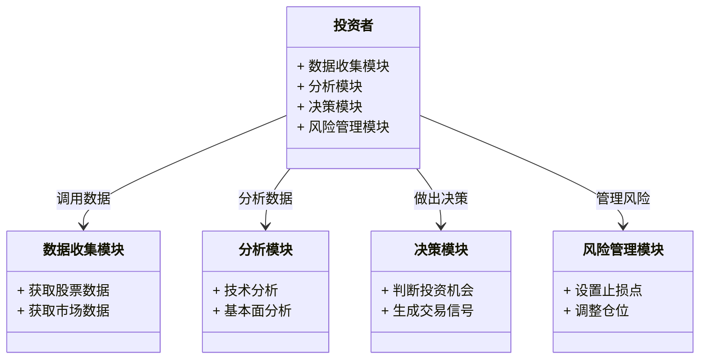

                 


# 如何提高特价股票投资的成功率

> 关键词：特价股票，投资策略，风险管理，技术分析，基本面分析，心理因素

> 摘要：本文将从背景介绍、核心概念、算法原理、数学模型、系统分析与架构设计、项目实战、最佳实践等多个维度，深入分析如何提高特价股票投资的成功率。通过详细讲解技术分析、基本面分析、风险管理等核心策略，并结合心理因素和系统架构设计，为读者提供一套全面的投资方法论。

---

## 第一部分：背景介绍

### 第1章：特价股票投资的背景与概念

#### 1.1 特价股票的基本概念

- **1.1.1 什么是特价股票**
  特价股票是指在特定市场环境下，价格低于其内在价值或行业平均水平的股票。这些股票通常被视为被市场低估，具有较高的投资潜力。

- **1.1.2 特价股票的市场环境**
  特价股票的出现往往与市场周期性波动、经济下行或行业调整密切相关。投资者需要识别这些市场环境中的特殊机会。

- **1.1.3 特价股票与普通股票的对比**
  | 特性 | 特价股票 | 普通股票 |
  |------|----------|----------|
  | 价格 | 通常被低估 | 价格反映市场预期 |
  | 风险 | 较高 | 较低或适中 |
  | 投资回报 | 可能较高 | 稳定但不一定高 |

#### 1.2 投资者心理与行为

- **1.2.1 投资者的贪婪与恐惧**
  投资者在面对特价股票时，常常会因为贪婪而过度买入，或者因为恐惧而错失良机。这种情绪化决策是投资失败的主要原因之一。

- **1.2.2 行为偏差对投资决策的影响**
  行为偏差，如确认偏差、损失厌恶等，会影响投资者的判断。例如，投资者可能会过度关注正面信息，而忽视负面信号。

- **1.2.3 如何克服心理障碍**
  通过制定严格的交易计划、记录投资日志以及定期复盘，投资者可以逐步克服心理障碍，做出更理性的决策。

#### 1.3 特价股票市场的特点

- **1.3.1 特价股票的波动性分析**
  特价股票的价格波动通常较大，短期内可能暴涨或暴跌。这种波动性既是机会，也是风险。

- **1.3.2 市场参与者的多样性**
  特价股票市场参与者包括机构投资者、散户和个人投资者。不同参与者的行为会影响市场走势。

- **1.3.3 特价股票的周期性特征**
  特价股票的投资机会通常具有周期性。例如，经济复苏期可能有更多的特价股票出现，而经济过热时则较少。

#### 1.4 特价股票投资的边界与外延

- **1.4.1 特价股票投资的适用场景**
  特价股票适合长期投资者或具有较高风险承受能力的投资者。例如，在经济低迷时期，寻找被低估的股票是不错的选择。

- **1.4.2 与其他投资方式的对比**
  与其他投资方式（如债券、基金等）相比，特价股票的风险和回报都较高。投资者需要根据自身风险偏好选择合适的投资方式。

- **1.4.3 特价股票投资的潜在风险**
  特价股票的高波动性可能导致重大损失。此外，市场操纵、公司基本面恶化等因素也可能增加投资风险。

---

## 第二部分：核心概念与联系

### 第2章：特价股票的核心概念与联系

#### 2.1 特价股票的核心原理

- **2.1.1 特价股票的定价机制**
  特价股票的价格受市场供需、公司基本面和投资者情绪的共同影响。通常，当市场低估某公司的真实价值时，其股票价格可能低于其内在价值。

- **2.1.2 市场供需对价格的影响**
  供需关系是影响股票价格的核心因素之一。当需求超过供给时，价格可能上涨；反之则可能下跌。

- **2.1.3 投资者情绪对价格波动的推动作用**
  投资者情绪通常呈现周期性波动。例如，市场上涨时投资者乐观，可能导致股价被高估；市场下跌时投资者恐慌，可能导致股价被低估。

#### 2.2 特价股票与其他股票的对比

- **2.2.1 价格波动幅度对比**
  特价股票的价格波动通常比普通股票更大。例如，某特价股票可能在短时间内上涨或下跌超过20%。

- **2.2.2 市场流动性对比**
  特价股票的流动性通常较低，尤其是在市场低迷时期。这可能导致买卖价差较大，交易成本较高。

- **2.2.3 投资风险对比**
  特价股票的风险较高，尤其是在市场环境不佳时。普通股票的风险相对较低，但回报也较为有限。

#### 2.3 特价股票的实体关系图

```mermaid
erDiagram
    actor 投资者
    actor 市场
    actor 公司
    entity 特价股票
    entity 价格
    entity 市场情绪
    entity 风险
    entity 投资回报
    投资者 --> 特价股票: 购买
    市场 --> 特价股票: 影响价格
    公司 --> 特价股票: 提供信息
    特价股票 --> 价格: 反映价值
    特价股票 --> 市场情绪: 受情绪影响
    特价股票 --> 风险: 承担风险
    特价股票 --> 投资回报: 产生回报
```

---

## 第三部分：算法原理讲解

### 第3章：特价股票投资的算法原理

#### 3.1 技术分析算法

- **3.1.1 K线图分析**
  K线图是技术分析的重要工具，通过分析价格走势来预测未来趋势。例如，当股价形成“底部”形态时，可能预示着股价即将上涨。

- **3.1.2 均线系统**
  均线系统通过计算股票价格的平均值来判断价格走势。例如，5日均线和10日均线可以帮助投资者判断短期趋势。

- **3.1.3 MACD指标**
  MACD指标通过计算短期和长期移动平均线的差值，帮助投资者判断市场趋势和力量变化。

#### 3.2 基本面分析算法

- **3.2.1 财务指标分析**
  通过分析公司的财务报表，如市盈率、市净率、ROE等指标，判断公司的真实价值。

- **3.2.2 行业分析**
  行业分析帮助投资者了解公司所处的行业环境，例如行业增长潜力、竞争格局等。

- **3.2.3 公司估值模型**
  使用DCF模型等方法，计算公司的真实价值，判断其股票是否被低估。

#### 3.3 风险管理算法

- **3.3.1 止损策略**
  设置止损点，当股价触及止损价时立即卖出，以减少潜在损失。

- **3.3.2 风险分散**
  通过投资不同行业的股票，分散投资风险。

- **3.3.3 情绪指标**
  使用市场情绪指标（如VIX指数）来判断市场风险，调整投资策略。

---

## 第四部分：数学模型与公式

### 第4章：数学模型与公式

#### 4.1 技术分析模型

- **4.1.1 均线模型**
  $$ y = \frac{1}{n} \sum_{i=1}^{n} p_i $$

  其中，\( y \) 为平均价格，\( p_i \) 为第 \( i \) 天的价格，\( n \) 为天数。

- **4.1.2 MACD指标**
  $$ MACD = \text{短期均线} - \text{长期均线} $$

---

## 第五部分：系统分析与架构设计

### 第5章：系统分析与架构设计

#### 5.1 问题场景介绍

- 投资者需要一个系统化的工具来分析特价股票，包括数据收集、分析和决策支持。

#### 5.2 项目介绍

- 开发一个基于技术分析和基本面分析的股票投资系统，帮助投资者提高特价股票投资的成功率。

#### 5.3 系统功能设计



#### 5.4 系统架构设计


---

## 第六部分：项目实战

### 第6章：项目实战

#### 6.1 环境安装

- 安装Python、Pandas、Matplotlib、Ta-lib等工具。

#### 6.2 核心实现源代码

```python
import pandas as pd
import matplotlib.pyplot as plt
import talib as ta

# 示例数据：假设我们有一个包含股票价格的DataFrame df
# 计算均线
df['MA5'] = ta.SMA(df['close'], timeperiod=5)
df['MA10'] = ta.SMA(df['close'], timeperiod=10)

# 绘制K线图和均线
plt.figure(figsize=(10, 6))
plt.plot(df['close'], label='Close Price')
plt.plot(df['MA5'], label='5-Day MA')
plt.plot(df['MA10'], label='10-Day MA')
plt.legend()
plt.show()
```

#### 6.3 代码应用解读与分析

- 以上代码展示了如何使用技术分析工具（如均线）来分析股票价格。投资者可以根据均线的交叉情况判断买入或卖出信号。

#### 6.4 实际案例分析

- 以某只特价股票为例，分析其技术图表和基本面数据，判断其是否值得投资。

#### 6.5 项目小结

- 通过系统化的分析和实践，投资者可以更好地识别特价股票的投资机会，并制定有效的投资策略。

---

## 第七部分：最佳实践

### 第7章：最佳实践

#### 7.1 投资策略

- **分散投资**：不要将所有资金投入一只股票，分散投资可以降低风险。
- **长期持有**：避免频繁交易，长期持有优质股票可以获得更高的回报。
- **定期复盘**：定期检查投资组合，及时调整策略。

#### 7.2 心理因素

- **保持冷静**：在市场波动中保持冷静，避免情绪化决策。
- **持续学习**：不断学习新的知识和技能，提高自己的投资能力。

#### 7.3 风险管理

- **设定止损**：在投资前设定止损点，避免重大损失。
- **控制仓位**：根据自身资金情况，合理分配仓位，避免过度杠杆。

---

## 第八部分：小结

### 第8章：小结

通过本文的分析，我们从背景介绍、核心概念、算法原理、数学模型、系统架构设计、项目实战等多个维度，深入探讨了如何提高特价股票投资的成功率。投资者需要结合技术分析、基本面分析和风险管理等多种方法，制定科学的投资策略，并在实践中不断总结经验，提升自己的投资能力。

---

## 第九部分：注意事项

### 第9章：注意事项

- **市场风险**：特价股票的价格波动较大，投资者需要充分认识到市场的不确定性。
- **信息不对称**：市场信息可能不对称，投资者需要通过多种渠道获取信息，提高自己的信息处理能力。
- **合规性**：投资者需要遵守相关法律法规，避免参与非法交易。

---

## 第十部分：拓展阅读

### 第10章：拓展阅读

- **《股票作手回忆录》**：一本经典的股票投资书籍，讲述了作者如何通过技术分析和市场直觉赚取财富。
- **《投资学基础》**：一本介绍投资学基础理论的书籍，适合初学者阅读。
- **《风险管理与投资组合》**：一本详细介绍风险管理方法的书籍，帮助投资者制定科学的投资策略。

---

## 作者信息

作者：AI天才研究院/AI Genius Institute & 禅与计算机程序设计艺术 /Zen And The Art of Computer Programming

