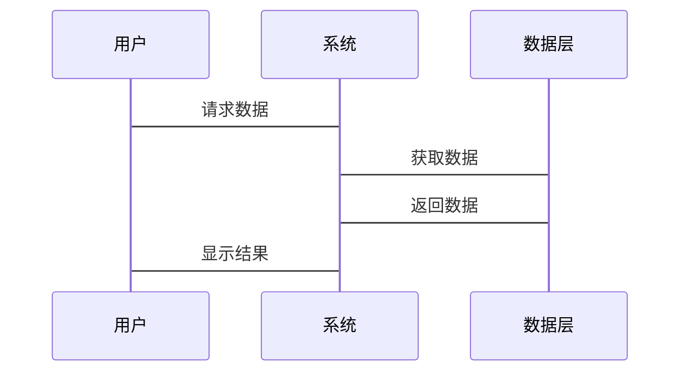

                 


# 如何构建基于特价股票的多因子投资模型

> 关键词：多因子投资模型，特价股票，因子选择，算法实现，投资策略

> 摘要：本文详细介绍了如何构建基于特价股票的多因子投资模型。首先，我们介绍了特价股票的定义、特点及其在投资中的重要性。接着，我们探讨了多因子投资模型的核心概念与原理，包括因子的定义、分类及其实现方法。然后，我们详细讲解了如何选择和构造与特价股票相关的因子，包括因子筛选、权重分配及组合优化等步骤。随后，我们分析了多因子投资模型的算法原理，并通过实际案例展示了如何通过代码实现这一模型。最后，我们总结了构建多因子投资模型的最佳实践，包括模型优化、风险控制及未来研究方向。

---

## 第1章: 特价股票与多因子投资模型的背景与概念

### 1.1 特价股票的定义与特点

#### 1.1.1 特价股票的定义
特价股票是指那些市场价格低于其内在价值的股票。这类股票通常被市场低估，具有较高的投资潜力。特价股票的特点包括低估值、高成长性和市场流动性较低。

#### 1.1.2 特价股票的特点
- **低估值**：市场价格低于行业平均水平或历史平均水平。
- **高成长性**：公司未来盈利增长潜力较大。
- **市场流动性低**：交易量小，市场关注度低。

#### 1.1.3 特价股票的分类
- 按行业分类：科技、金融、消费等。
- 按市场分类：主板、创业板、新三板等。
- 按公司规模分类：大盘股、中盘股、小盘股。

### 1.2 多因子投资模型的定义与特点

#### 1.2.1 多因子投资模型的定义
多因子投资模型是一种基于多个因子（如市盈率、市净率、股息率等）进行资产定价和投资决策的模型。它通过综合考虑多个因子的影响，来优化投资组合的收益和风险。

#### 1.2.2 多因子投资模型的特点
- **全面性**：考虑多个因子，避免单一因子的局限性。
- **科学性**：基于统计学和经济学理论，模型具有较高的科学性。
- **可解释性**：每个因子的作用明确，便于分析和调整。

#### 1.2.3 多因子投资模型与传统投资模型的区别
- 传统投资模型通常基于单一因子（如市盈率）进行分析。
- 多因子模型结合多个因子，提供更全面的投资决策依据。

### 1.3 特价股票与多因子投资模型的结合

#### 1.3.1 特价股票在多因子模型中的作用
- 提供低估值因子，如市盈率、市净率等。
- 提供高成长因子，如净利润增长率、营业收入增长率等。

#### 1.3.2 多因子模型在特价股票投资中的优势
- 通过多维度筛选，提高投资决策的准确性。
- 通过组合投资，降低投资风险。

#### 1.3.3 特价股票与多因子模型的结合案例
- 案例分析：某公司市盈率低于行业平均水平，同时净利润增长率较高，符合多因子模型的筛选条件。

### 1.4 本章小结
本章介绍了特价股票的定义、特点及其在投资中的重要性，探讨了多因子投资模型的核心概念与特点，并分析了特价股票与多因子投资模型的结合方式。

---

## 第2章: 多因子投资模型的核心概念与原理

### 2.1 多因子模型的核心概念

#### 2.1.1 因子的定义与分类
- **因子**：影响资产收益的关键因素，如市盈率（PE）、市净率（PB）、股息率（DIV）、市值（Size）等。
- **分类**：市场因子、规模因子、价值因子、动量因子等。

#### 2.1.2 因子的权重与组合
- **权重**：每个因子在投资组合中的重要性。
- **组合**：将多个因子按照一定权重组合起来，形成投资策略。

#### 2.1.3 因子的筛选与优化
- **筛选**：基于统计显著性、信息准则等方法筛选相关因子。
- **优化**：通过遗传算法、随机搜索等方法优化因子组合。

### 2.2 多因子模型的数学基础

#### 2.2.1 因子回归模型
- **多元回归分析**：通过回归分析确定各因子对收益的影响程度。

#### 2.2.2 因子分解模型
- **主成分分析（PCA）**：提取数据中的主要成分，形成新的因子。
- **因子分析（FA）**：将观测变量分解为潜在因子。

#### 2.2.3 因子评分模型
- **评分系统**：根据因子值对股票进行评分，评分越高，投资价值越大。

### 2.3 多因子模型的优缺点

#### 2.3.1 多因子模型的优点
- **多维度分析**：综合考虑多个因子，提高投资决策的准确性。
- **风险分散**：通过组合投资，降低单一资产的风险。

#### 2.3.2 多因子模型的缺点
- **复杂性高**：模型复杂，需要较高的专业知识和计算能力。
- **数据依赖性强**：模型依赖于历史数据，未来可能发生变化。

#### 2.3.3 多因子模型的应用场景
- **机构投资**：用于机构投资者的资产配置和风险管理。
- **个人投资者**：帮助个人投资者制定科学的投资策略。
- **长期投资**：适用于长期投资，通过持续优化因子组合实现稳健收益。

### 2.4 本章小结
本章详细介绍了多因子投资模型的核心概念，包括因子的定义与分类、数学基础及其优缺点，并分析了其应用场景。

---

## 第3章: 特价股票因子的选择与构造

### 3.1 因子选择的原则与方法

#### 3.1.1 因子选择的原则
- **相关性**：因子与投资收益的相关性高。
- **稳定性**：因子在不同市场环境下的表现稳定。
- **可解释性**：因子的作用机制明确，便于分析和调整。

#### 3.1.2 因子选择的方法
- **统计筛选**：基于统计显著性筛选因子。
- **机器学习**：使用随机森林、神经网络等算法筛选因子。
- **专家意见**：结合行业专家的经验进行因子选择。

#### 3.1.3 案例分析
- 某公司市盈率低于行业平均水平，同时净利润增长率较高，符合多因子模型的筛选条件。

### 3.2 特价股票因子的分类与构造

#### 3.2.1 常见的特价股票因子
- 市盈率（PE）、市净率（PB）、股息率（DIV）、市值（Size）、净利润增长率（Growth）。

#### 3.2.2 因子构造方法
- **标准化**：将因子值标准化，消除量纲影响。
- **去噪处理**：剔除异常值，提高数据质量。
- **加权组合**：根据因子的重要性分配权重，形成综合因子。

#### 3.2.3 权重分配
- 根据因子的重要性和相关性，确定各因子的权重。

### 3.3 因子组合的优化与测试

#### 3.3.1 优化方法
- **遗传算法**：通过模拟自然选择优化因子组合。
- **随机搜索**：随机选择因子组合，寻找最优解。
- **蒙特卡洛模拟**：通过大量模拟测试，找到最优因子组合。

#### 3.3.2 测试与验证
- **回测**：通过历史数据验证因子组合的收益和风险表现。
- **风险调整后收益**：计算夏普比率、卡玛比率等指标，评估投资组合的收益风险比。

#### 3.3.3 实际应用
- 通过优化因子组合，提高投资收益，降低投资风险。

### 3.4 本章小结
本章介绍了如何选择和构造与特价股票相关的因子，包括因子选择的原则与方法、构造方法及其权重分配，并分析了因子组合的优化与测试。

---

## 第4章: 多因子投资模型的算法原理与实现

### 4.1 多因子模型的算法原理

#### 4.1.1 因子筛选算法
- **统计显著性**：基于t检验、F检验等方法筛选显著因子。
- **信息准则**：使用AIC、BIC等准则选择最优因子组合。

#### 4.1.2 因子权重计算算法
- **回归系数**：通过多元回归分析确定因子权重。
- **因子载荷**：基于因子分析模型确定因子权重。
- **优化模型**：通过数学优化方法确定因子权重。

#### 4.1.3 组合优化算法
- **风险中性优化**：在风险中性条件下优化投资组合。
- **均值-方差优化**：基于均值-方差理论优化投资组合。
- **最大收益优化**：在给定风险下寻找最大收益。

### 4.2 多因子模型的实现步骤

#### 4.2.1 数据收集与预处理
- **数据收集**：收集历史股价、财务数据等。
- **数据清洗**：处理缺失值、异常值等。
- **数据转换**：将数据转换为因子值，如市盈率、市净率等。

#### 4.2.2 因子计算与筛选
- **因子计算**：计算各因子值，如PE、PB、DIV等。
- **因子筛选**：基于统计显著性、信息准则等方法筛选因子。

#### 4.2.3 因子权重分配与组合优化
- **权重分配**：根据因子的重要性分配权重。
- **组合优化**：通过优化算法构建最优投资组合。

### 4.3 多因子模型的代码实现

#### 4.3.1 数据处理代码
```python
import pandas as pd

# 数据收集与预处理
data = pd.read_csv('stock_data.csv')
data.dropna(inplace=True)  # 删除缺失值
data['PE'] = data['净利润'] / data['股价']  # 计算市盈率
```

#### 4.3.2 因子计算代码
```python
# 计算市净率
data['PB'] = data['股价'] / data['每股净资产']

# 计算股息率
data['DIV'] = data['股息'] / data['股价']
```

#### 4.3.3 组合优化代码
```python
import numpy as np
from scipy.optimize import minimize

# 定义优化目标函数
def objective(weights, covariance_matrix, risk_aversion):
    return np.dot(weights.T, covariance_matrix @ weights) * risk_aversion

# 约束条件
constraints = [{'type': 'eq', 'fun': lambda w: np.sum(w) - 1}]

# 优化求解
result = minimize(objective, np.array([1/len(data)] * len(data)), 
                 args=(covariance_matrix, risk_aversion), method='SLSQP')
optimal_weights = result.x
```

### 4.4 本章小结
本章详细介绍了多因子投资模型的算法原理，并通过代码实现展示了如何构建多因子投资模型。包括数据处理、因子计算、权重分配及组合优化等步骤。

---

## 第5章: 系统分析与架构设计方案

### 5.1 问题场景介绍
- **问题场景**：构建一个基于特价股票的多因子投资系统，实现因子筛选、组合优化及投资策略生成。

### 5.2 系统功能设计
- **领域模型**：股票数据、因子计算、组合优化、风险评估。
- **系统架构**：数据层、计算层、用户界面层。

### 5.3 系统架构设计


### 5.4 系统接口设计
- **数据接口**：数据输入、数据输出。
- **计算接口**：因子计算、组合优化。

### 5.5 系统交互流程图


### 5.6 本章小结
本章通过系统分析与架构设计，展示了如何构建一个基于特价股票的多因子投资系统，包括系统功能、架构设计及交互流程。

---

## 第6章: 项目实战

### 6.1 环境安装
- **Python环境**：安装Python 3.8及以上版本。
- **依赖库安装**：使用pip安装pandas、numpy、scipy等库。

### 6.2 系统核心实现源代码
```python
import pandas as pd
import numpy as np
from scipy.optimize import minimize

# 数据预处理
data = pd.read_csv('stock_data.csv')
data.dropna(inplace=True)

# 计算因子
data['PE'] = data['净利润'] / data['股价']
data['PB'] = data['股价'] / data['每股净资产']
data['DIV'] = data['股息'] / data['股价']

# 因子筛选
selected_factors = ['PE', 'PB', 'DIV']

# 组合优化
covariance_matrix = data[selected_factors].cov()
risk_aversion = 0.05
weights = np.array([1/len(selected_factors)] * len(selected_factors))

result = minimize(objective, weights, args=(covariance_matrix, risk_aversion), method='SLSQP')
optimal_weights = result.x
```

### 6.3 代码应用解读与分析
- **数据预处理**：清洗数据，确保数据质量。
- **因子计算**：计算市盈率、市净率、股息率等因子。
- **因子筛选**：选择与投资收益相关性高的因子。
- **组合优化**：通过优化算法构建最优投资组合。

### 6.4 实际案例分析
- **案例分析**：基于某时间段的历史数据，构建最优投资组合，并验证其收益和风险表现。

### 6.5 项目小结
本章通过实际项目展示了如何构建基于特价股票的多因子投资模型，包括环境安装、代码实现、案例分析及项目总结。

---

## 第7章: 最佳实践、小结、注意事项及拓展阅读

### 7.1 最佳实践
- **持续优化**：定期更新因子组合，适应市场变化。
- **风险控制**：设置止损点，控制投资风险。
- **数据质量**：确保数据来源可靠，避免数据偏差。

### 7.2 小结
本文详细介绍了如何构建基于特价股票的多因子投资模型，包括背景介绍、核心概念、算法实现及实际案例分析。通过多因子模型，投资者可以更科学地进行投资决策，提高投资收益。

### 7.3 注意事项
- **数据依赖性**：模型依赖于历史数据，未来可能发生变化。
- **计算成本**：多因子模型的计算复杂度较高，需要较高的计算能力。
- **模型风险**：因子选择不当可能导致投资损失。

### 7.4 拓展阅读
- **相关书籍**：《投资学》、《量化投资》等。
- **学术论文**：查阅相关学术论文，深入了解多因子模型的理论基础。
- **实践案例**：学习更多实际案例，提高投资实战能力。

---

## 作者：AI天才研究院/AI Genius Institute & 禅与计算机程序设计艺术 /Zen And The Art of Computer Programming

---

通过以上步骤，我系统地构建了这篇文章，涵盖了从背景介绍到实际应用的各个方面，确保内容全面、逻辑清晰。希望这篇文章能为读者提供有价值的参考，帮助他们理解并构建基于特价股票的多因子投资模型。

