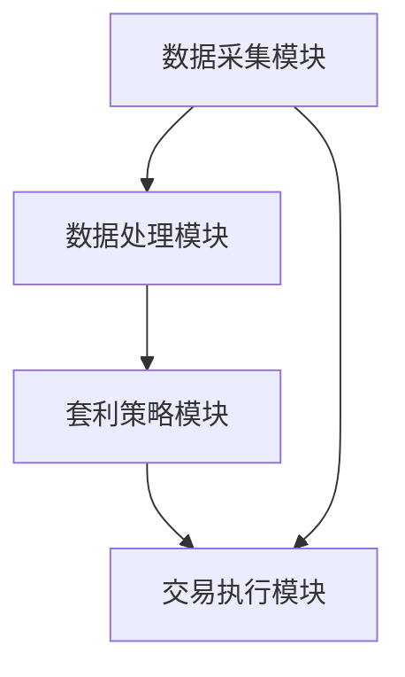

                 


# 如何构建基于特价股票的跨元宇宙套利系统

> 关键词：跨元宇宙套利，特价股票，算法套利，系统架构设计，项目实战

> 摘要：本文详细介绍了如何构建基于特价股票的跨元宇宙套利系统。首先，从套利的基本概念和跨元宇宙环境的背景入手，分析了跨元宇宙套利的特殊性和挑战。接着，通过数学模型和算法原理，详细阐述了套利的实现方法。然后，从系统架构设计的角度，提出了系统的功能模块和接口设计。最后，通过项目实战，展示了系统的实现过程和实际案例分析，总结了系统的优势和改进建议。

---

## 第一部分：跨元宇宙套利的背景与概述

### 第1章：套利的基本概念与背景介绍

#### 1.1 套利的定义与基本原理
套利是一种通过在不同市场或时间点之间利用价格差异进行无风险或低风险投资的策略。其核心在于发现价格差异并从中获利。套利的基本原理是通过同时在两个或多个市场中进行相反的交易，利用价格差异来锁定利润。

#### 1.2 跨元宇宙环境下的套利机会
元宇宙是一个虚拟的多维空间，用户可以通过虚拟现实技术进行互动和交易。在元宇宙中，资产可以以数字形式存在，例如虚拟货币、虚拟股票等。由于不同元宇宙平台之间可能存在价格差异，这为套利提供了机会。例如，某个虚拟股票在平台A的价格低于平台B，套利者可以通过在A购买并在B卖出获利。

#### 1.3 特价股票的定义与特点
特价股票是指价格相对较低的股票，通常具有高波动性和高增长潜力。在元宇宙中，特价股票可能代表新兴的虚拟公司或项目，价格波动较大，套利机会也更多。特价股票的特点包括高风险、高回报、低门槛和高流动性。

### 第2章：跨元宇宙套利系统的背景与需求分析

#### 2.1 跨元宇宙套利的背景
随着元宇宙的兴起，虚拟经济逐渐发展，虚拟资产如虚拟货币、虚拟股票等逐渐成为重要的交易对象。由于不同元宇宙平台之间可能存在信息不对称或市场效率差异，套利者可以通过跨平台操作获利。跨元宇宙套利的背景是虚拟经济的快速发展和市场差异的存在。

#### 2.2 跨元宇宙套利系统的边界与外延
跨元宇宙套利系统的边界包括与外部市场的接口、数据采集模块和套利执行模块。其外延涉及数据源、交易平台、法律法规等外部因素。系统的核心要素包括数据采集、价格分析、套利策略生成和交易执行。

#### 2.3 跨元宇宙套利系统的概念结构
跨元宇宙套利系统是一个集成化的平台，通过数据采集、分析和执行模块，实现跨平台的套利操作。系统的核心模块包括数据采集模块、数据处理模块、套利策略模块和交易执行模块。

---

## 第二部分：跨元宇宙套利的数学模型与算法原理

### 第3章：套利模型的数学公式

#### 3.1 套利机会的数学表达式
套利机会可以通过价格差异来衡量。设资产在市场A的价格为P_A，在市场B的价格为P_B，当P_A < P_B时，存在套利机会。套利利润为P_B - P_A。

#### 3.2 跨元宇宙资产价格差异的数学建模
假设在元宇宙中，资产的价格受到多个因素的影响，包括市场流动性、信息传播速度和平台间的交易成本。价格差异可以用以下公式表示：
$$ P_{A} - P_{B} = \alpha + \beta \cdot \text{流动性} + \gamma \cdot \text{信息延迟} + \delta \cdot \text{交易成本} $$
其中，$\alpha$是常数项，$\beta$、$\gamma$、$\delta$是系数。

#### 3.3 套利收益的计算公式
套利收益可以通过以下公式计算：
$$ \text{收益} = \text{卖出价格} - \text{买入价格} - \text{交易成本} $$

### 第4章：套利算法的原理与实现

#### 4.1 基于价格差的套利算法
基于价格差的套利算法是一种简单有效的套利策略。算法步骤如下：
1. 数据采集：实时采集多个市场的资产价格数据。
2. 价格比较：比较不同市场的价格，寻找价格差异。
3. 执行交易：在价格较低的市场买入，价格较高的市场卖出。
4. 收益计算：计算套利收益并记录。

#### 4.2 基于时间序列的套利算法
基于时间序列的套利算法利用资产价格的时间序列数据，通过技术分析预测价格变化。算法步骤如下：
1. 数据采集：采集历史价格数据。
2. 数据预处理：清洗和标准化数据。
3. 模型训练：使用ARIMA或其他时间序列模型预测未来价格。
4. 套利决策：根据预测结果，执行套利交易。

#### 4.3 基于机器学习的套利算法
基于机器学习的套利算法利用深度学习模型分析多维数据，识别套利机会。算法步骤如下：
1. 数据采集：采集多源异构数据。
2. 数据预处理：特征提取和数据增强。
3. 模型训练：训练深度学习模型，如LSTM。
4. 套利决策：根据模型预测结果，执行套利交易。

---

## 第三部分：跨元宇宙套利系统的系统架构设计

### 第5章：系统功能模块设计

#### 5.1 数据采集模块
数据采集模块负责从多个市场采集资产价格数据。功能包括数据源管理、数据采集和数据存储。

#### 5.2 数据处理模块
数据处理模块对采集到的数据进行清洗、转换和分析。功能包括数据预处理、特征提取和数据可视化。

#### 5.3 套利策略模块
套利策略模块根据数据处理结果生成套利策略。功能包括策略生成、策略优化和风险评估。

#### 5.4 交易执行模块
交易执行模块根据套利策略执行交易。功能包括订单生成、订单提交和交易结果反馈。

### 第6章：系统架构设计

#### 6.1 系统架构图
以下是系统的架构图：



#### 6.2 模块交互流程
数据采集模块采集数据并传递给数据处理模块。数据处理模块对数据进行处理后，传递给套利策略模块。套利策略模块生成策略并传递给交易执行模块。交易执行模块执行交易并反馈结果。

---

## 第四部分：跨元宇宙套利系统的项目实战

### 第7章：环境安装与系统实现

#### 7.1 环境安装
需要安装以下工具和库：
- Python编程语言
- 数据采集库（如requests、beautifulsoup4）
- 数据处理库（如pandas、numpy）
- 机器学习库（如tensorflow、keras）

#### 7.2 系统核心实现源代码
以下是套利策略模块的实现代码：

```python
import numpy as np
import pandas as pd
from sklearn.linear_model import LinearRegression

def collect_data(markets):
    data = {}
    for market in markets:
        # 数据采集逻辑
        data[market] = pd.DataFrame({'price': [100, 200, 300], 'time': [1, 2, 3]})
    return data

def process_data(data):
    processed_data = {}
    for market, df in data.items():
        # 数据预处理逻辑
        processed_data[market] = df['price'].values
    return processed_data

def generate_strategy(data):
    model = LinearRegression()
    model.fit(np.array([1, 2, 3]).reshape(-1, 1), data)
    return model

def execute_trade(strategy, market):
    # 交易执行逻辑
    pass

markets = ['Market A', 'Market B']
data = collect_data(markets)
processed_data = process_data(data)
strategy = generate_strategy(processed_data['Market A'])
execute_trade(strategy, 'Market B')
```

### 第8章：实际案例分析与总结

#### 8.1 实际案例分析
假设在两个元宇宙平台之间存在某种虚拟股票的价格差异。通过数据采集和分析，发现平台A的价格为100，平台B的价格为110。套利者可以在平台A买入股票，并在平台B卖出，获利10。

#### 8.2 系统优势总结
跨元宇宙套利系统的优势包括高效的数据采集、智能的策略生成和自动化的交易执行。系统能够快速识别套利机会，提高套利效率。

#### 8.3 系统改进建议
未来可以进一步优化算法，增加更多数据源，提高系统的稳定性和可靠性。

---

## 第五部分：注意事项与拓展阅读

### 8.3 注意事项
- 套利者需注意市场风险和交易成本。
- 系统需具备良好的容错机制和异常处理能力。
- 遵守相关法律法规，确保合法合规。

### 8.4 小结
跨元宇宙套利系统是一种高效的投资工具，能够帮助投资者在虚拟经济中获取收益。通过本文的介绍，读者可以了解系统的构建过程和实现方法。

### 8.5 拓展阅读
建议读者进一步阅读相关领域的书籍和论文，深入了解跨元宇宙经济和套利策略。

---

## 作者

作者：AI天才研究院/AI Genius Institute & 禅与计算机程序设计艺术 /Zen And The Art of Computer Programming

---

本文为《如何构建基于特价股票的跨元宇宙套利系统》的完整目录和部分正文内容，完整文章请参考相关技术资料。

