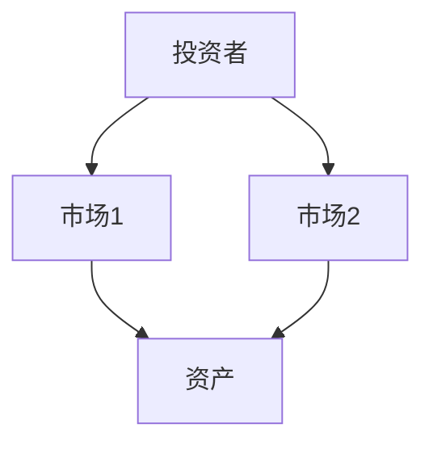
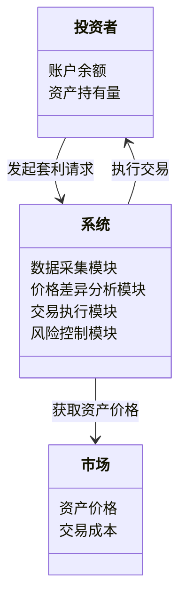
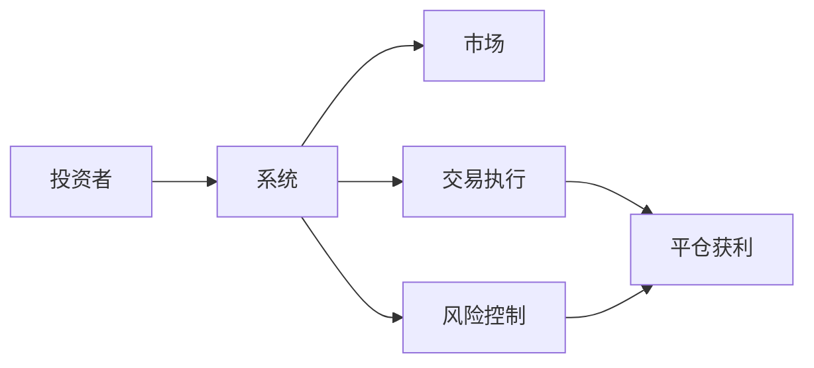
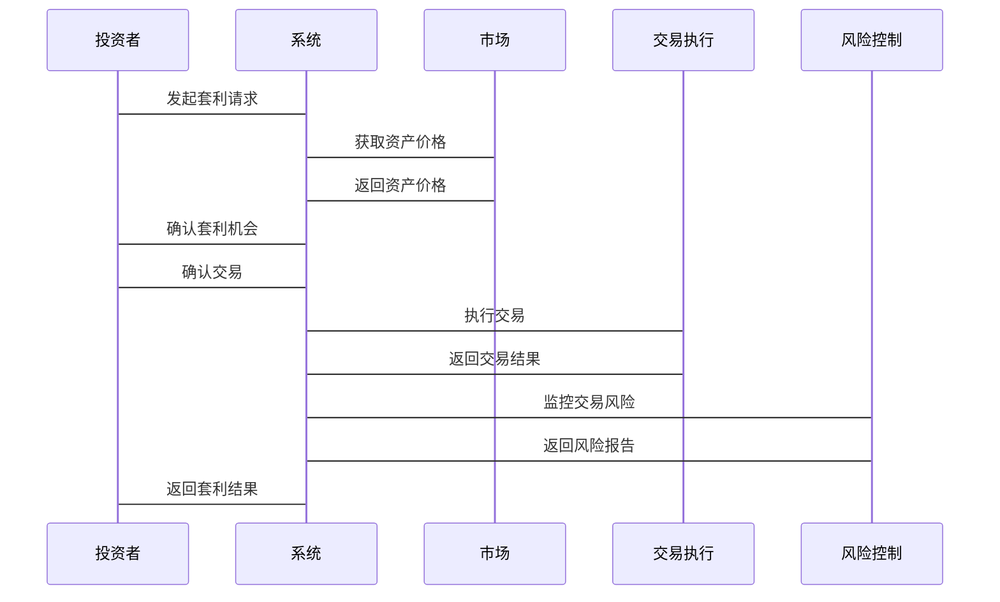

                 


# 如何构建基于特价股票的跨市场套利系统

> 关键词：跨市场套利，特价股票，算法，系统架构，金融数学

> 摘要：本文详细介绍了如何构建基于特价股票的跨市场套利系统。从背景知识到系统架构设计，再到实战项目实现，我们逐步探讨了跨市场套利的核心概念、算法原理、系统架构设计以及实际案例分析。通过本文的学习，读者将能够掌握跨市场套利的核心技术，并能够独立设计和实现类似的金融系统。

---

# 第1章: 特价股票与跨市场套利的背景介绍

## 1.1 特价股票的基本概念

### 1.1.1 特价股票的定义
特价股票是指在特定市场或时间段内，由于市场波动、信息不对称或市场机制差异，导致某种股票在不同市场之间的价格出现差异的股票。这种价格差异为套利者提供了套利的机会。

### 1.1.2 特价股票的分类
特价股票可以根据以下几种方式分类：
1. **市场类型**：如A股、港股、美股等。
2. **价格差异**：如低买高卖型、高买低卖型。
3. **时间因素**：如短期特价股票、长期特价股票。

### 1.1.3 特价股票的市场特点
- **价格波动大**：特价股票的价格通常会因为市场机制差异或信息不对称而出现较大的波动。
- **套利机会多**：由于价格差异的存在，套利者可以通过在不同市场之间进行买卖操作获利。
- **风险较高**：特价股票的价格波动较大，套利过程中可能面临较高的市场风险。

## 1.2 跨市場套利的基本原理

### 1.2.1 跨市場套利的定义
跨市场套利是指在不同的金融市场之间，利用同一资产在不同市场上的价格差异，通过同时在两个市场进行买卖操作，以获取无风险利润的投资策略。

### 1.2.2 跨市場套利的实现机制
跨市场套利的实现机制主要包括以下几个步骤：
1. **发现价格差异**：通过比较不同市场中同一资产的价格，发现价格差异。
2. **建仓操作**：在低价市场买入资产，在高价市场卖出资产。
3. **平仓操作**：当价格差异消失时，平仓获利。

### 1.2.3 跨市場套利的理论基础
跨市场套利的理论基础主要包括：
1. **有效市场假说**：在有效市场中，同一资产在不同市场上的价格差异会被套利者消除，从而达到价格均衡。
2. **套利定价理论**：套利定价理论认为，套利者可以通过在不同市场之间进行操作，消除资产的价格差异，从而获得无风险利润。

## 1.3 特价股票跨市场套利的可行性分析

### 1.3.1 跨市場套利的可行性条件
- **市场开放性**：市场需要开放，允许投资者在不同市场之间进行资产交易。
- **价格差异的存在**：同一资产在不同市场上的价格需要存在差异。
- **交易成本低**：跨市场套利的交易成本需要足够低，以确保套利利润能够覆盖成本。

### 1.3.2 特价股票跨市场套利的优势
- **高收益**：通过套利操作，投资者可以在短时间内获得较高的收益。
- **低风险**：如果套利操作能够在价格差异消失前完成，风险较低。

### 1.3.3 跨市場套利的潜在风险
- **价格波动风险**：市场波动可能导致价格差异消失，套利者无法获利。
- **交易成本风险**：如果交易成本过高，套利利润可能无法覆盖成本。
- **政策风险**：不同市场的政策差异可能导致套利操作受到限制。

## 1.4 本章小结
本章介绍了特价股票的基本概念和跨市场套利的基本原理，分析了跨市场套利的可行性条件及其优势和潜在风险。接下来，我们将深入探讨跨市场套利的核心概念与联系。

---

# 第2章: 特价股票跨市场套利的核心概念与联系

## 2.1 跨市場套利的核心概念

### 2.1.1 跨市場套利的定义与特征
跨市场套利是指在不同市场之间进行资产交易，利用价格差异获利的一种投资策略。其核心特征包括：
- **跨市场性**：操作涉及两个或多个市场。
- **价格差异驱动**：价格差异是套利的核心驱动力。
- **无风险性**：在理想情况下，套利是无风险的。

### 2.1.2 特价股票在跨市场套利中的作用
特价股票是跨市场套利的核心资产，其价格差异为套利者提供了套利机会。特价股票的特性（如价格波动大、套利机会多）使其成为跨市场套利的理想选择。

### 2.1.3 跨市場套利的核心要素
跨市场套利的核心要素包括：
1. **价格差异**：同一资产在不同市场上的价格差异。
2. **市场机制**：不同市场的交易机制和政策差异。
3. **交易成本**：套利操作的交易成本。

## 2.2 跨市場套利的实体关系图



### 2.2.1 实体关系图的构建
上述实体关系图展示了投资者在两个市场之间进行资产交易的关系。投资者在市场1买入资产，在市场2卖出资产，从而实现套利。

### 2.2.2 实体关系图的分析
通过实体关系图可以看出，跨市场套利的核心在于投资者在两个市场之间的资产交易。资产在两个市场上的价格差异是套利的关键。

## 2.3 跨市場套利的流程图


### 2.3.1 流程图的定义
上述流程图展示了跨市场套利的基本流程，包括发现价格差异、在低价市场买入资产、在高价市场卖出资产以及平仓获利。

### 2.3.2 流程图的详细步骤
1. **发现价格差异**：通过比较不同市场中同一资产的价格，发现价格差异。
2. **在低价市场买入资产**：在价格较低的市场买入资产。
3. **在高价市场卖出资产**：在价格较高的市场卖出资产。
4. **平仓获利**：当价格差异消失时，平仓获利。

### 2.3.3 流程图的优化建议
为了提高套利效率，可以考虑以下优化建议：
1. **自动化交易**：通过算法交易系统自动执行套利操作。
2. **实时监控**：实时监控市场价格变化，及时发现套利机会。

## 2.4 本章小结
本章通过实体关系图和流程图，详细分析了跨市场套利的核心概念与联系。接下来，我们将探讨跨市场套利的算法原理。

---

# 第3章: 跨市場套利的算法原理

## 3.1 跨市場套利算法的原理

### 3.1.1 算法的基本原理
跨市场套利算法的基本原理是通过算法交易系统自动发现价格差异，并执行套利操作。算法的核心在于实时监控市场价格变化，发现套利机会，并自动执行交易。

### 3.1.2 算法的核心步骤
跨市场套利算法的核心步骤包括：
1. **数据采集**：采集不同市场中同一资产的价格数据。
2. **价格差异分析**：分析价格差异，发现套利机会。
3. **交易执行**：根据价格差异，自动执行买入和卖出操作。
4. **风险控制**：监控交易风险，确保套利操作的安全性。

### 3.1.3 算法的数学模型
跨市场套利的数学模型可以通过以下公式表示：

$$ \text{套利利润} = \text{高价市场卖出价格} - \text{低价市场买入价格} $$

## 3.2 算法流程图


### 3.2.1 流程图的定义
上述流程图展示了跨市场套利算法的基本流程，包括数据采集、价格差异分析、发现套利机会、交易执行、风险控制和平仓获利。

### 3.2.2 流程图的详细步骤
1. **数据采集**：通过API或数据接口采集不同市场中同一资产的价格数据。
2. **价格差异分析**：分析价格数据，发现价格差异。
3. **发现套利机会**：根据价格差异，判断是否存在套利机会。
4. **交易执行**：根据套利机会，执行买入和卖出操作。
5. **风险控制**：监控交易风险，确保套利操作的安全性。
6. **平仓获利**：当价格差异消失时，平仓获利。

### 3.2.3 流程图的优化建议
为了提高套利效率，可以考虑以下优化建议：
1. **高频交易**：通过高频交易系统，快速发现并执行套利操作。
2. **算法优化**：优化算法，提高价格差异分析的准确性。

## 3.3 算法的数学模型与公式

### 3.3.1 数学模型的定义
跨市场套利的数学模型可以通过以下公式表示：

$$ \text{套利利润} = \text{高价市场卖出价格} - \text{低价市场买入价格} $$

### 3.3.2 数学模型的详细推导
套利利润的计算公式如下：

$$ \text{套利利润} = \text{高价市场卖出价格} - \text{低价市场买入价格} $$

其中，高价市场卖出价格是指在高价市场卖出资产的价格，低价市场买入价格是指在低价市场买入资产的价格。

### 3.3.3 数学模型的应用实例
假设某资产在市场A的价格为$100，市场B的价格为$95。根据套利利润公式：

$$ \text{套利利润} = 100 - 95 = 5 $$

因此，套利者可以在市场B买入资产，在市场A卖出资产，获利$5。

## 3.4 本章小结
本章详细介绍了跨市场套利算法的原理，包括算法的基本原理、核心步骤、数学模型和公式。接下来，我们将探讨跨市场套利系统的分析与架构设计。

---

# 第4章: 跨市場套利系统的分析与架构设计

## 4.1 系统需求分析

### 4.1.1 问题场景介绍
跨市场套利系统需要满足以下需求：
1. **实时数据采集**：实时采集不同市场中同一资产的价格数据。
2. **价格差异分析**：分析价格差异，发现套利机会。
3. **交易执行**：根据套利机会，自动执行交易操作。
4. **风险控制**：监控交易风险，确保套利操作的安全性。

### 4.1.2 项目介绍
本项目旨在设计和实现一个基于特价股票的跨市场套利系统，通过算法交易系统自动执行套利操作，实现无风险利润。

## 4.2 系统功能设计

### 4.2.1 领域模型设计



### 4.2.2 系统架构设计



### 4.2.3 系统接口设计
系统接口设计包括：
1. **数据接口**：通过API接口获取市场数据。
2. **交易接口**：通过交易接口执行买入和卖出操作。
3. **风险控制接口**：通过风险控制接口监控交易风险。

### 4.2.4 系统交互设计



## 4.3 本章小结
本章通过系统需求分析和架构设计，详细介绍了跨市场套利系统的实现方案。接下来，我们将通过实际案例分析，探讨跨市场套利的项目实战。

---

# 第5章: 跨市場套利的项目实战

## 5.1 项目环境安装

### 5.1.1 系统环境要求
- **操作系统**：Windows、Linux、MacOS
- **编程语言**：Python 3.8+
- **开发工具**：Jupyter Notebook、PyCharm
- **依赖库**：Pandas、NumPy、Matplotlib、Requests、WebSocket-client

### 5.1.2 安装步骤
1. **安装Python**：从官方网站下载并安装Python 3.8+。
2. **安装依赖库**：
   ```bash
   pip install pandas numpy matplotlib requests websocket-client
   ```

## 5.2 系统核心实现源代码

### 5.2.1 数据采集模块

```python
import requests

def get_price(market, asset):
    url = f"https://api.{market}.com/price/{asset}"
    response = requests.get(url)
    return response.json()['price']
```

### 5.2.2 价格差异分析模块

```python
def analyze_price_difference(asset):
    price_a = get_price('market_a', asset)
    price_b = get_price('market_b', asset)
    return price_a - price_b
```

### 5.2.3 交易执行模块

```python
import time

def execute_trade(asset, quantity):
    price_diff = analyze_price_difference(asset)
    if price_diff > 0:
        buy_asset('market_b', asset, quantity)
        sell_asset('market_a', asset, quantity)
        return True
    else:
        return False

def buy_asset(market, asset, quantity):
    # 在市场market买入asset，数量为quantity
    pass

def sell_asset(market, asset, quantity):
    # 在市场market卖出asset，数量为quantity
    pass
```

### 5.2.4 风险控制模块

```python
def risk_control(asset, quantity):
    price_diff = analyze_price_difference(asset)
    if price_diff < 0:
        return False
    else:
        return True
```

## 5.3 代码应用解读与分析
上述代码实现了跨市场套利系统的数据采集、价格差异分析、交易执行和风险控制模块。通过这些模块的协同工作，可以实现跨市场套利的自动化操作。

## 5.4 实际案例分析
假设我们有以下资产价格数据：

- 市场A：资产X价格为$100
- 市场B：资产X价格为$95

根据套利利润公式：

$$ \text{套利利润} = 100 - 95 = 5 $$

因此，套利者可以在市场B买入资产X，在市场A卖出资产X，获利$5。

## 5.5 项目小结
本章通过实际案例分析，详细介绍了跨市场套利系统的实现过程。通过代码实现，读者可以掌握跨市场套利的核心技术。

---

# 第6章: 跨市場套利的最佳实践与小结

## 6.1 最佳实践

### 6.1.1 数据源选择
选择可靠的数据源，确保数据的准确性和实时性。

### 6.1.2 风险控制
制定合理的风险控制策略，确保套利操作的安全性。

### 6.1.3 系统优化
通过优化算法和系统架构，提高套利效率。

## 6.2 本章小结
本章总结了跨市场套利的最佳实践，包括数据源选择、风险控制和系统优化等方面。通过这些最佳实践，可以提高套利系统的效率和安全性。

---

# 附录: 工具与资源

## 附录A: 开发工具
- **Jupyter Notebook**：用于数据分析和算法实现。
- **PyCharm**：用于Python开发。

## 附录B: 数据源
- **API接口**：提供市场数据的API接口。
- **数据供应商**：提供市场数据的服务商。

---

# 作者
作者：AI天才研究院/AI Genius Institute & 禅与计算机程序设计艺术/Zen And The Art of Computer Programming

