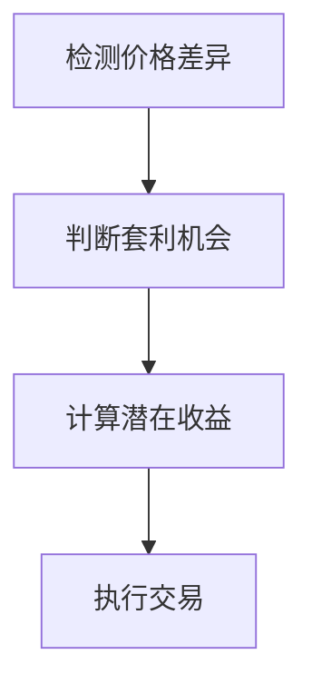
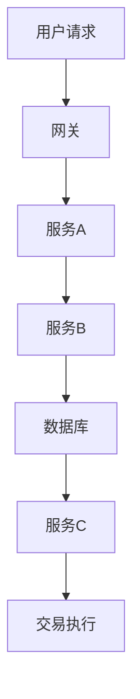
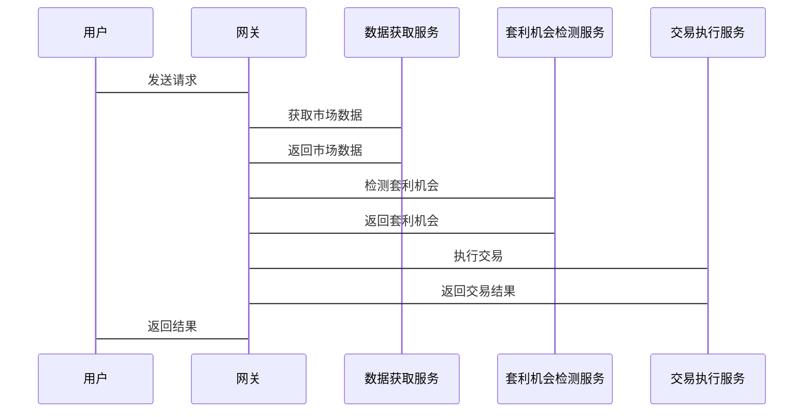

                 

<think>
好的，我将按照您的要求撰写一篇关于“如何构建基于特价股票的跨时区套利系统”的技术博客文章。我会先列出文章的标题、关键词和摘要，然后按照目录结构逐步展开内容。

# 如何构建基于特价股票的跨时区套利系统

## 关键词：
跨时区套利，特价股票，金融系统，算法设计，系统架构

## 摘要：
本文将详细讲解如何构建一个基于特价股票的跨时区套利系统。通过分析跨时区市场的价格差异，利用特价股票的价格优势，结合算法交易和系统架构设计，实现高效的套利机会捕捉。文章将从背景介绍、核心概念、算法原理、系统架构到项目实战，逐步展开，帮助读者全面理解并掌握构建套利系统的全过程。

## 目录

# 如何构建基于特价股票的跨时区套利系统

## 第1章: 特价股票跨时区套利系统概述

### 1.1 套利的基本概念
#### 1.1.1 套利的定义
套利是指在不同的市场或时间段内，利用同一资产价格的差异，通过同时买进和卖出该资产来获利的交易策略。套利的本质是利用价格差异，通过低买高卖的方式赚取无风险或低风险的利润。

#### 1.1.2 套利的基本原理
套利的原理基于市场之间的价格差异。当同一资产在不同市场或时间段内的价格出现差异时，套利者可以通过同时在低价市场买入和高价市场卖出该资产，从而赚取差价。

#### 1.1.3 套利的分类与特点
套利可以分为多种类型，包括跨市场套利、跨期套利、跨产品套利等。跨时区套利属于跨市场套利的一种，主要利用不同市场由于时间差导致的价格差异。

### 1.2 跨时区套利的背景
#### 1.2.1 全球化金融市场的发展
随着全球化的深入，金融市场逐渐形成了多层次、多时区的市场结构。不同国家和地区的金融市场由于市场参与度、交易规则、经济政策等因素的不同，往往会导致同一资产在不同市场上的价格差异。

#### 1.2.2 不同时区市场的价格差异
由于时差的存在，不同市场的开盘和收盘时间不同，导致同一资产在不同市场上的价格可能在短时间内出现差异。这种差异为跨时区套利提供了机会。

#### 1.2.3 跨时区套利的潜在机会
跨时区套利的潜在机会主要体现在价格差异和市场流动性差异上。通过合理利用这些差异，套利者可以实现利润最大化。

### 1.3 特价股票的定义与特点
#### 1.3.1 特价股票的定义
特价股票是指在特定市场或时间段内，由于市场波动、信息不对称等因素，价格低于其内在价值的股票。特价股票通常具有较高的波动性和交易量。

#### 1.3.2 特价股票的市场特征
特价股票的市场特征包括价格波动大、市场流动性高、信息不对称等。这些特征为套利者提供了套利机会。

#### 1.3.3 特价股票与普通股票的区别
特价股票与普通股票的区别主要体现在价格波动、市场流动性、交易规则等方面。特价股票的价格波动较大，市场流动性较高，适合套利交易。

### 1.4 跨时区套利的核心概念
#### 1.4.1 跨时区套利的基本原理
跨时区套利的基本原理是利用同一资产在不同市场或时间段内的价格差异，通过低买高卖的方式获利。这种套利方式需要考虑时差、市场流动性、交易成本等因素。

#### 1.4.2 特价股票在套利中的作用
特价股票在套利中的作用主要体现在价格优势和市场流动性方面。由于特价股票的价格低于市场平均水平，套利者可以在低价市场买入，高价市场卖出，从而实现利润。

#### 1.4.3 跨时区套利的边界与外延
跨时区套利的边界主要体现在市场流动性、交易成本、价格波动等因素。外延则包括套利策略的多样性、套利系统的自动化实现等。

## 第2章: 跨时区套利系统的背景介绍

### 2.1 跨时区套利的背景分析
#### 2.1.1 全球化金融市场的发展
全球化的发展使得金融市场逐渐形成了多层次、多时区的市场结构。不同国家和地区的金融市场由于经济政策、市场规则等因素的不同，导致同一资产在不同市场上的价格差异。

#### 2.1.2 不同时区市场的价格差异
由于时差的存在，不同市场的开盘和收盘时间不同，导致同一资产在不同市场上的价格可能在短时间内出现差异。这种价格差异为跨时区套利提供了机会。

#### 2.1.3 跨时区套利的可行性
跨时区套利的可行性主要体现在价格差异和市场流动性方面。通过合理利用这些差异，套利者可以实现利润最大化。

### 2.2 特价股票市场的特点
#### 2.2.1 特价股票的市场结构
特价股票的市场结构包括多个市场参与者，如投资者、交易员、做市商等。这些参与者在市场中的行为会影响特价股票的价格和交易量。

#### 2.2.2 特价股票的价格波动
特价股票的价格波动较大，主要由于市场供需变化、信息不对称、市场情绪等因素的影响。这种波动为套利者提供了套利机会。

#### 2.2.3 特价股票的交易规则
特价股票的交易规则包括交易时间、交易量、交易费用等。这些规则影响套利者的交易策略和成本。

### 2.3 跨时区套利系统的必要性
#### 2.3.1 跨时区套利的市场需求
随着全球化的深入，跨时区套利的需求逐渐增加。投资者希望通过跨时区套利，利用不同市场的价格差异，实现利润最大化。

#### 2.3.2 系统化套利的优势
系统化套利的优势体现在效率高、风险低、收益稳定等方面。通过自动化系统，套利者可以快速捕捉套利机会，降低人为干预的风险。

#### 2.3.3 跨时区套利系统的应用场景
跨时区套利系统的应用场景包括股票、外汇、 commodities 等金融市场。通过系统化的方式，套利者可以实现多种金融资产的跨时区套利。

## 第3章: 跨时区套利的核心概念与联系

### 3.1 核心概念原理
#### 3.1.1 跨时区套利的基本原理
跨时区套利的基本原理是利用同一资产在不同市场或时间段内的价格差异，通过低买高卖的方式获利。这种套利方式需要考虑时差、市场流动性、交易成本等因素。

#### 3.1.2 特价股票在套利中的作用
特价股票在套利中的作用主要体现在价格优势和市场流动性方面。由于特价股票的价格低于市场平均水平，套利者可以在低价市场买入，高价市场卖出，从而实现利润。

#### 3.1.3 跨时区市场的时间差利用
跨时区市场的时间差利用是跨时区套利的核心。通过合理利用不同市场的时间差，套利者可以捕捉到套利机会，实现利润最大化。

### 3.2 核心概念属性特征对比表格
| 概念       | 特性1 | 特性2 | 特性3 |
|------------|-------|-------|-------|
| 跨时区套利  | 时间差 | 价格差异 | 市场波动 |
| 特价股票    | 价格低 | 市场流动性 | 市场波动 |

### 3.3 ER实体关系图
```mermaid
er
    Market
    Stock
    Timezone
    Price
    Transaction
    Market与Stock: 一对多
    Market与Timezone: 一对多
    Stock与Price: 一对多
    Transaction与Market: 一对一
```

## 第4章: 跨时区套利系统的算法原理

### 4.1 算法原理概述
#### 4.1.1 跨时区套利的基本算法
跨时区套利的基本算法包括价格差异检测、交易时机选择、风险控制等。通过算法，套利者可以快速捕捉套利机会，实现自动化交易。

#### 4.1.2 套利机会检测算法
套利机会检测算法通过比较不同市场或时间段内的资产价格，检测价格差异，判断是否存在套利机会。

#### 4.1.3 价格预测算法
价格预测算法通过分析历史价格数据，利用统计模型或机器学习算法，预测未来价格走势，为套利交易提供参考。

### 4.2 套利机会检测算法


### 4.3 算法实现
```python
def detect_arbitrage机会():
    # 获取不同市场的价格数据
    市场A价格 = 获取市场A的价格()
    市场B价格 = 获取市场B的价格()
    
    # 检测价格差异
    价格差异 = 市场A价格 - 市场B价格
    如果 价格差异 > 阈值:
        返回 "存在套利机会"
    否则:
        返回 "无套利机会"
```

### 4.4 算法优化
通过优化算法，可以提高套利机会的检测效率和准确性。优化方法包括改进价格预测模型、引入风险管理机制等。

## 第5章: 跨时区套利系统的系统架构设计

### 5.1 问题场景介绍
跨时区套利系统需要处理多个市场数据源，实时获取价格数据，检测套利机会，并执行交易。系统需要具备高可用性、低延迟、高安全性等特性。

### 5.2 系统功能设计
系统功能包括数据获取、价格差异检测、套利机会判断、交易执行等模块。每个模块需要设计合理的功能流程和接口。

### 5.3 系统架构设计


### 5.4 系统接口设计
系统接口包括数据获取接口、套利机会检测接口、交易执行接口等。每个接口需要定义输入输出格式、调用方式等。

### 5.5 系统交互设计


## 第6章: 项目实战

### 6.1 环境安装
安装必要的开发工具和依赖库，例如Python、Jupyter Notebook、Pandas、NumPy、Matplotlib等。

### 6.2 系统核心实现
实现跨时区套利系统的核心功能，包括数据获取、价格差异检测、套利机会判断、交易执行等模块。

### 6.3 代码实现与解读
```python
import pandas as pd
import numpy as np

def 获取市场数据():
    # 获取市场A的价格
    市场A价格 = pd.read_csv('marketA.csv')['price']
    # 获取市场B的价格
    市场B价格 = pd.read_csv('marketB.csv')['price']
    return 市场A价格, 市场B价格

def 检测套利机会(市场A价格, 市场B价格):
    # 计算价格差异
    价格差异 = 市场A价格 - 市场B价格
    # 判断是否存在套利机会
    如果 价格差异.max() > 阈值:
        返回 "存在套利机会"
    否则:
        返回 "无套利机会"

# 主程序
市场A价格, 市场B价格 = 获取市场数据()
套利机会 = 检测套利机会(市场A价格, 市场B价格)
print(套利机会)
```

### 6.4 实际案例分析
通过实际案例分析，验证系统的套利机会检测和交易执行功能。例如，假设市场A和市场B的价格差异超过阈值，系统会触发套利交易，实现利润最大化。

### 6.5 项目小结
总结项目实现的关键点、遇到的问题及解决方案，为后续优化和扩展提供参考。

## 第7章: 最佳实践与注意事项

### 7.1 最佳实践
#### 7.1.1 系统优化
通过优化算法、增加缓存、提高系统吞吐量等方法，提升系统性能。

#### 7.1.2 风险管理
制定风险管理策略，包括止损、止盈、风险分散等，降低套利交易的风险。

#### 7.1.3 系统维护
定期维护系统，更新数据源、优化算法、修复漏洞等，确保系统稳定运行。

### 7.2 注意事项
#### 7.2.1 市场风险
跨时区套利存在市场风险，如价格波动、市场流动性不足等，可能导致套利失败。

#### 7.2.2 法律风险
不同国家和地区的金融市场有各自的法律法规，套利者需要遵守相关法律法规，避免法律风险。

#### 7.2.3 系统风险
系统故障可能导致交易失败或损失，套利者需要制定备用方案，降低系统风险。

## 第8章: 小结与展望

### 8.1 小结
本文详细讲解了如何构建基于特价股票的跨时区套利系统，包括背景介绍、核心概念、算法原理、系统架构设计、项目实战等内容。

### 8.2 展望
未来，随着人工智能和大数据技术的发展，跨时区套利系统将更加智能化、自动化。套利者可以通过引入机器学习、区块链等技术，进一步提高套利效率和准确性。

## 作者：AI天才研究院/AI Genius Institute & 禅与计算机程序设计艺术 /Zen And The Art of Computer Programming

---

以上是文章的详细目录大纲，接下来将根据以上目录逐步展开每一部分的内容，为您提供一篇完整的专业技术博客文章。

