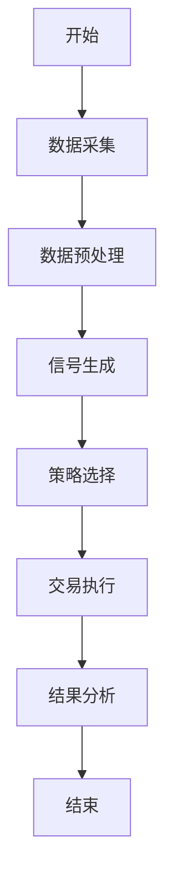

                 


# 如何构建基于特价股票的跨维度套利系统

> 关键词：跨维度套利，特价股票，算法交易，系统架构，数学模型

> 摘要：本文详细讲解了如何构建基于特价股票的跨维度套利系统，涵盖从理论分析到算法实现再到系统架构设计的完整流程。通过数学模型、算法流程图和系统架构图的详细展示，帮助读者理解并掌握跨维度套利的核心原理和实现方法。

---

## 第一部分：背景介绍

### 第1章：跨维度套利系统概述

#### 1.1 问题背景与定义
- **1.1.1 套利的定义与基本原理**
  套利是指利用资产在不同市场或时间点上的价格差异，以无风险或低风险的方式获取利润的交易策略。套利的本质在于发现市场中的价格不一致，并通过交易来获利。

- **1.1.2 特价股票的定义与特点**
  特价股票指的是在特定时间内价格出现异常波动的股票，通常由于市场信息不对称、短期资金流动或其他市场因素导致的价格偏离。

- **1.1.3 跨维度套利的背景与意义**
  跨维度套利是指在同一资产在不同维度（如不同市场、不同时间、不同货币）上进行价格比较，利用价格差异进行套利。这种策略在现代金融市场中具有重要意义，尤其是在高频交易和算法交易日益普及的情况下。

#### 1.2 股票市场的基本分析
- **1.2.1 股票市场的基本结构**
  股票市场由买方、卖方、交易中介（如交易所）和价格机制组成。市场的价格由供需关系决定，受多种因素影响，包括经济指标、公司基本面、市场情绪等。

- **1.2.2 影响股票价格的主要因素**
  - 公司基本面：收入、利润、资产负债情况等。
  - 市场情绪：投资者情绪、市场波动性等。
  - 宏观经济因素：GDP增长率、利率、通货膨胀等。
  - 事件驱动：公司公告、政策变化等。

- **1.2.3 套利机会的来源**
  套利机会通常来源于市场中的价格差异，例如同一股票在不同交易所的价格差异，或者同一资产在不同市场中的价格差异。

#### 1.3 跨维度套利的策略与边界
- **1.3.1 跨维度套利的核心概念**
  跨维度套利通过分析同一资产在不同维度上的价格差异，利用这些差异进行套利。例如，同一股票在A股和港股中的价格差异。

- **1.3.2 套利策略的分类与对比**
  - 市场套利：利用不同市场间的价差。
  - 时间套利：利用同一资产在不同时间点的价格差异。
  - 资产套利：利用相关资产之间的价格差异。

- **1.3.3 套利的边界与风险**
  套利并非无风险，存在市场风险、流动性风险和模型风险。此外，套利机会可能受到市场机制的限制，例如涨跌停板制度。

---

## 第二部分：核心概念与联系

### 第2章：套利的数学模型与核心要素

#### 2.1 核心概念原理
- **2.1.1 套利的数学模型**
  套利的数学模型通常基于资产定价理论，例如CAPM模型和APT模型。通过比较资产在不同维度上的定价，发现套利机会。

- **2.1.2 股票价格的波动性分析**
  股票价格的波动性可以通过统计学方法进行分析，例如计算标准差、波动率等。波动性高的股票通常套利机会较多，但也伴随更高的风险。

- **2.1.3 套利机会的量化指标**
  套利机会的量化指标包括价差、波动率、相关性等。这些指标帮助投资者判断套利机会的可行性和收益潜力。

#### 2.2 核心要素对比表格
- **2.2.1 不同套利策略的核心要素对比**

| 套利策略 | 市场套利 | 时间套利 | 资产套利 |
|----------|----------|----------|----------|
| 核心要素 | 不同市场的价格差异 | 同一资产在不同时间点的价格差异 | 相关资产之间的价格差异 |
| 风险     | 市场风险较高 | 时间风险较低 | 资产相关性风险较高 |

- **2.2.2 不同市场环境下的套利机会对比**

| 市场环境 | 低波动 | 高波动 | 牛市 | 熊市 |
|----------|--------|--------|------|------|
| 套利机会 | 较少   | 较多   | 较多 | 较少 |

#### 2.3 实体关系图（ER图）
- **2.3.1 套利系统中的实体关系**
  - 套利系统涉及的主要实体包括：投资者、市场、资产、交易、价格等。
  - 实体关系图展示套利系统中各实体之间的关系，例如投资者通过交易影响资产价格，市场提供交易环境等。

---

## 第三部分：算法原理讲解

### 第3章：套利算法的实现与优化

#### 3.1 算法原理
- **3.1.1 套利算法的基本原理**
  套利算法通常基于统计套利和算法交易，通过分析资产价格差异，自动识别套利机会并执行交易。算法的关键在于发现价格差异、计算交易量和控制风险。

- **3.1.2 算法的核心步骤与流程**
  - 数据采集：获取相关资产的价格数据。
  - 数据预处理：清洗和标准化数据。
  - 信号生成：计算价格差异，识别套利机会。
  - 策略选择：根据信号选择交易策略。
  - 交易执行：根据策略执行交易。
  - 结果分析：评估交易结果，优化算法。

#### 3.2 算法流程图（Mermaid）


#### 3.3 算法代码实现
```python
import pandas as pd
import numpy as np

def calculate_price_diff(data):
    return data['price1'] - data['price2']

def generate_signal(data, threshold=0.01):
    diff = calculate_price_diff(data)
    return diff > threshold

def execute_trading(signal, positions, capital):
    return positions + capital * signal

# 示例数据
data = pd.DataFrame({
    'price1': [100, 101, 99],
    'price2': [102, 100, 98]
})

signal = generate_signal(data)
positions = execute_trading(signal, 0, 1000)
print(positions)
```

#### 3.4 数学模型与公式
- **CAPM模型**：$$E(R_i) = R_f + \beta_i (R_m - R_f)$$
  其中，\( R_f \) 是无风险利率，\( R_m \) 是市场预期收益，\( \beta_i \) 是资产的贝塔系数。

- **均值-方差模型**：$$\text{Minimize } \sigma^2 \text{ subject to } E(R) = \text{target return}$$

---

## 第四部分：系统分析与架构设计方案

### 第4章：系统架构设计

#### 4.1 系统功能设计
- **4.1.1 功能模块划分**
  - 数据采集模块：负责采集相关资产的价格数据。
  - 数据处理模块：清洗和标准化数据。
  - 信号生成模块：计算价格差异，识别套利机会。
  - 策略执行模块：根据信号执行交易。
  - 结果分析模块：评估交易结果，优化算法。

- **4.1.2 系统功能流程**
  使用Mermaid流程图展示系统功能流程。

#### 4.2 系统架构设计
- **4.2.1 系统架构图**
  使用Mermaid架构图展示系统的整体架构，包括前端、后端、数据库和交易接口。

#### 4.3 系统接口设计
- **接口描述**
  - 数据接口：与数据源对接，获取价格数据。
  - 交易接口：与交易所或经纪商对接，执行交易。

#### 4.4 系统交互设计
- **交互流程**
  使用Mermaid序列图展示系统各模块之间的交互流程。

---

## 第五部分：项目实战

### 第5章：项目实战

#### 5.1 环境安装
- **安装Python环境**
  使用Anaconda或Miniconda安装Python环境，版本建议为3.8或以上。

- **安装依赖库**
  使用pip安装必要的库，例如pandas、numpy、scikit-learn等。

#### 5.2 核心代码实现
- **数据采集模块**
  ```python
  import requests

  def fetch_data(api_key):
      response = requests.get(f'https://api.example.com/stock_prices?api_key={api_key}')
      return response.json()
  ```

- **信号生成模块**
  ```python
  def generate_signal(data, threshold=0.01):
      diff = data['price1'] - data['price2']
      return diff > threshold
  ```

#### 5.3 案例分析与解读
- **案例分析**
  以某段时间内的数据为例，展示如何识别套利机会并执行交易。

#### 5.4 项目小结
- **项目总结**
  总结项目实施过程中的关键点和经验教训，提出改进建议。

---

## 第六部分：最佳实践与总结

### 第6章：最佳实践与总结

#### 6.1 最佳实践
- **风险管理**
  建立完善的风险控制机制，包括止损、止盈和头寸管理。

- **系统优化**
  定期优化算法模型，适应市场变化。

#### 6.2 小结
- **总结**
  本文详细讲解了如何构建基于特价股票的跨维度套利系统，从理论分析到算法实现再到系统架构设计，帮助读者掌握套利的核心原理和实现方法。

#### 6.3 注意事项
- **注意事项**
  在实际操作中，需注意市场风险、流动性风险和模型风险，确保交易系统稳定运行。

#### 6.4 拓展阅读
- **推荐书籍**
  - 《算法交易： hype、 hype、 hype》
  - 《金融市场的统计套利》

---

## 作者信息

作者：AI天才研究院/AI Genius Institute & 禅与计算机程序设计艺术 /Zen And The Art of Computer Programming

---

以上是《如何构建基于特价股票的跨维度套利系统》的技术博客文章目录大纲，详细涵盖了从背景介绍到项目实战的各个方面，旨在为读者提供一个系统化的套利系统构建指南。

