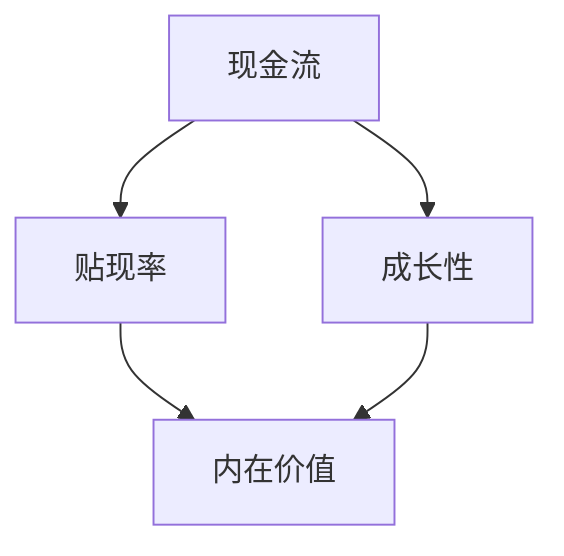
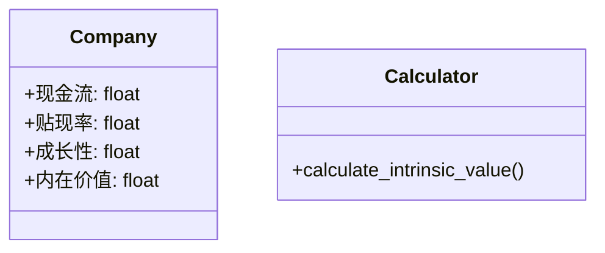
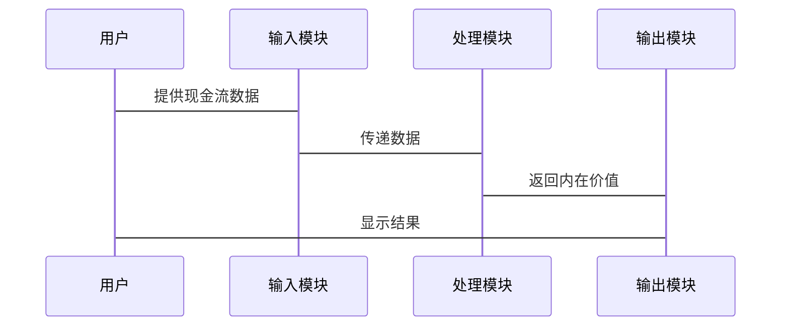

                 


# 如何计算一家公司的内在价值

> 关键词：内在价值，现金流贴现模型，自由现金流，贴现率，投资估值，企业价值

> 摘要：本文将详细介绍如何计算一家公司的内在价值，从背景介绍、核心概念到算法原理、系统架构，再到项目实战和最佳实践，层层深入，帮助读者掌握这一关键的财务分析方法。

---

## 第一部分：背景介绍

### 第1章：内在价值的核心概念与背景

#### 1.1 内在价值的定义与重要性

##### 1.1.1 什么是内在价值

内在价值是指一家公司在未来能创造的自由现金流的现值，反映了公司的真实价值。它是基于公司未来现金流的贴现值，不依赖于市场的短期波动。

##### 1.1.2 内在价值在投资中的重要性

- **投资决策的基础**：内在价值帮助投资者判断股票是否被高估或低估。
- **长期视角**：关注公司未来的现金流，而非短期市场波动。
- **风险管理**：通过计算内在价值，投资者可以更好地评估风险和回报。

##### 1.1.3 内在价值与市场价值的区别

- **内在价值**：公司的真实价值，基于未来现金流的现值。
- **市场价值**：市场交易价格，受情绪和短期因素影响。

#### 1.2 内在价值的计算背景

##### 1.2.1 投资者与市场的基本矛盾

- 投资者追求长期收益，市场短期波动频繁。
- 市场价格可能偏离内在价值，为投资者提供买入或卖出的机会。

##### 1.2.2 内在价值计算的必要性

- 帮助投资者识别价值低估或高估的公司。
- 为长期投资策略提供依据。

##### 1.2.3 内在价值与企业长期发展的关系

- 内在价值反映企业未来的盈利能力。
- 长期发展的稳定性和成长性影响内在价值。

### 第2章：内在价值的核心概念与联系

#### 2.1 内在价值的构成要素

##### 2.1.1 自由现金流

- **定义**：公司在偿债和支付股息后的剩余现金流。
- **公式**：$FCF = EBIT(1 - 税率) + 折旧 - 资本支出$

##### 2.1.2 贴现率

- **定义**：将未来现金流折算成现值的利率。
- **计算**：通常使用加权平均资本成本（WACC）。

##### 2.1.3 成长性与永续增长率

- **成长性**：公司未来现金流的增长速度。
- **永续增长率**：长期稳定增长的假设，通常在DCF模型中使用。

#### 2.2 核心概念之间的关系

##### 2.2.1 内在价值与自由现金流的公式推导

$$ V = \sum_{t=1}^{n} \frac{CF_t}{(1 + r)^t} + \frac{TV}{(1 + r)^n} $$

其中，$CF_t$为第t年的自由现金流，$r$为贴现率，$TV$为终值。

##### 2.2.2 贴现率与风险的关系

- 风险越高，贴现率越高，内在价值越低。

##### 2.2.3 成长性对内在价值的影响

- 高成长性公司可能有更高的内在价值，但需考虑贴现率的影响。

#### 2.3 内在价值计算的ER实体关系图



### 第3章：内在价值计算的算法原理

#### 3.1 现金流贴现模型（DCF模型）

##### 3.1.1 DCF模型的基本原理

- 将未来现金流折现，计算其现值。

##### 3.1.2 现金流贴现的数学公式

$$ V = \sum_{t=1}^{n} \frac{CF_t}{(1 + r)^t} + \frac{TV}{(1 + r)^n} $$

##### 3.1.3 算法实现的Python代码

```python
def calculate_intrinsic_value(free_cash_flows, discount_rate, terminal_value, horizon):
    present_value = 0
    for t in range(1, horizon + 1):
        present_value += free_cash_flows[t-1] / (1 + discount_rate)**t
    present_value += terminal_value / (1 + discount_rate)**horizon
    return present_value

# 示例数据
free_cash_flows = [100, 120, 150]
discount_rate = 0.1
terminal_value = 2000
horizon = 3

iv = calculate_intrinsic_value(free_cash_flows, discount_rate, terminal_value, horizon)
print(f"内在价值：{iv:.2f}")
```

---

## 第二部分：系统分析与架构设计方案

### 第4章：系统分析与架构设计方案

#### 4.1 问题场景介绍

- 为一家公司设计内在价值计算系统，帮助投资者快速评估公司价值。

#### 4.2 系统功能设计

##### 4.2.1 领域模型



##### 4.2.2 系统架构设计


##### 4.2.3 接口设计

- 输入接口：接收现金流、贴现率、成长性等参数。
- 输出接口：返回计算出的内在价值。

##### 4.2.4 交互流程图



---

## 第三部分：项目实战

### 第5章：项目实战与分析

#### 5.1 环境安装与配置

- 安装Python和相关库（如numpy、pandas）。

#### 5.2 核心代码实现

```python
import numpy as np

def calculate_intrinsic_value(fcf, wacc, tv, years):
    pv = 0
    for year in range(1, years + 1):
        pv += fcf[year-1] / (1 + wacc)**year
    pv += tv / (1 + wacc)**years
    return pv

# 示例数据
fcf = [150, 180, 220]
wacc = 0.12
tv = 3000
years = 3

iv = calculate_intrinsic_value(fcf, wacc, tv, years)
print(f"计算的内在价值为：{iv:.2f}")
```

#### 5.3 案例分析与解读

- 以某公司为例，计算其内在价值，并与市场价比较。

---

## 第四部分：高级技巧与最佳实践

### 第6章：高级技巧与注意事项

#### 6.1 非财务因素的考量

- 竞争优势、管理层质量等对内在价值的影响。

#### 6.2 感知贴现率的调整

- 根据公司风险调整贴现率。

#### 6.3 敏感性分析

- 分析关键变量变化对内在价值的影响。

---

## 第五部分：总结与展望

### 第7章：总结与未来展望

#### 7.1 内在价值计算的总结

- 内在价值是投资决策的关键指标。
- DCF模型是核心工具，但需谨慎处理假设。

#### 7.2 未来展望

- 人工智能在内在价值计算中的应用。
- 更精确的模型和工具的开发。

---

## 作者：AI天才研究院/AI Genius Institute & 禅与计算机程序设计艺术 /Zen And The Art of Computer Programming

---

通过以上结构，您可以逐步撰写完整的文章，确保每一部分都详细具体，满足专业性和可读性。

