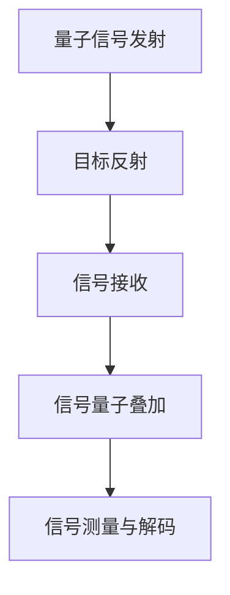
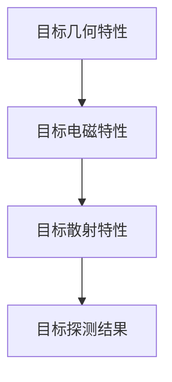
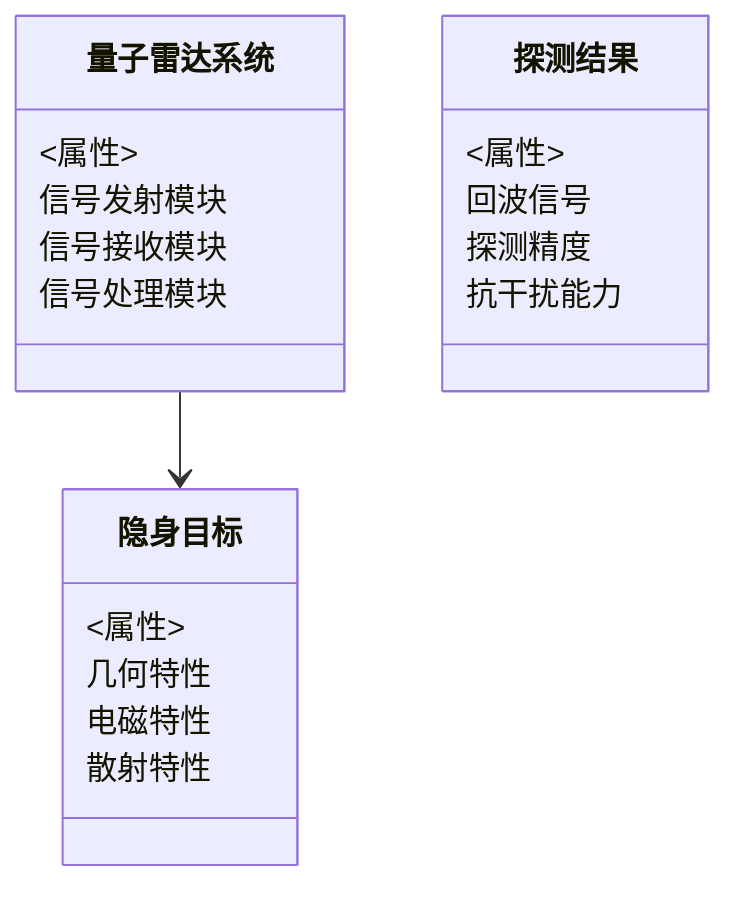
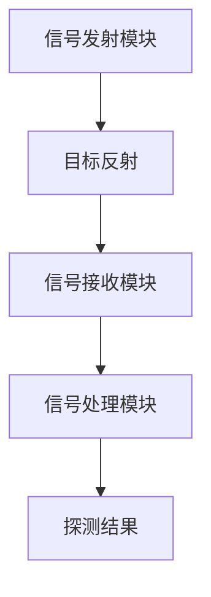

                 


# 如何评估企业的量子雷达隐身探测技术潜力

> 关键词：量子雷达，隐身技术，技术评估，企业潜力，雷达探测

> 摘要：本文深入探讨了如何评估企业量子雷达隐身探测技术的潜力，从核心概念、算法原理到系统架构和项目实战，全面解析了量子雷达与隐身技术的结合及其对企业发展的潜在影响。文章通过详细的背景介绍、对比分析、数学模型和实际案例，为企业提供了科学的技术评估方法和实践指导。

---

# 第一部分: 量子雷达与隐身技术概述

## 第1章: 量子雷达与隐身技术的背景介绍

### 1.1 量子雷达的基本概念

#### 1.1.1 量子雷达的定义
量子雷达是一种基于量子力学原理的新型雷达技术，通过利用量子纠缠和量子叠加等特性，实现对目标的高精度探测和识别。

#### 1.1.2 量子雷达的工作原理
量子雷达通过发射量子信号，利用量子纠缠的特性，实现对目标的精确探测。其核心在于利用量子信号的非线性特征，对抗传统雷达的干扰和欺骗。

#### 1.1.3 量子雷达的技术优势
量子雷达具有极强的抗干扰能力，能够在复杂电磁环境下稳定工作，同时能够实现对隐身目标的探测。

### 1.2 隐身技术的基本概念

#### 1.2.1 隐身技术的定义
隐身技术是指通过改变目标的电磁特性，使其难以被雷达、红外等探测设备发现的技术。

#### 1.2.2 隐身技术的实现原理
隐身技术主要通过吸收、散射和干扰探测信号来实现。其核心在于优化目标的电磁散射特性，使其在特定频段内难以被探测。

#### 1.2.3 隐身技术的应用领域
隐身技术广泛应用于军事领域，包括隐身飞机、隐身舰船等，同时在民用领域也有一定的应用，如 stealth cars 等。

### 1.3 量子雷达与隐身技术的结合

#### 1.3.1 量子雷达对隐身目标的探测能力
量子雷达通过其独特的信号处理方式，能够在一定程度上突破隐身技术的限制，实现对隐身目标的探测。

#### 1.3.2 隐身技术对量子雷达的挑战
隐身技术的进步对量子雷达提出了更高的要求，需要量子雷达不断优化其探测算法，以应对新型隐身目标的挑战。

#### 1.3.3 量子雷达与隐身技术的未来发展趋势
随着技术的进步，量子雷达与隐身技术的结合将更加紧密，双方的技术进步将推动彼此的发展。

### 1.4 企业评估量子雷达隐身探测技术的背景

#### 1.4.1 企业对量子雷达隐身技术的需求
企业对量子雷达隐身技术的需求主要集中在提升探测能力、提高抗干扰能力和增强目标识别能力等方面。

#### 1.4.2 企业评估技术潜力的目的
企业评估量子雷达隐身技术的潜力，旨在判断该技术是否具有商业价值，是否能够满足市场需求。

#### 1.4.3 企业评估技术潜力的边界与外延
企业评估量子雷达隐身技术的边界主要在于技术的可行性和市场的接受度，外延则包括技术的后续发展和应用领域。

## 1.5 本章小结

---

# 第二部分: 量子雷达隐身探测技术的核心概念与联系

## 第2章: 量子雷达隐身探测技术的核心概念

### 2.1 量子雷达的核心原理

#### 2.1.1 量子纠缠与雷达探测
量子纠缠是一种量子力学现象，通过量子纠缠的特性，量子雷达可以实现对目标的精确探测。

#### 2.1.2 量子雷达的信号处理
量子雷达的信号处理基于量子计算的原理，能够实现对复杂信号的高效处理。

#### 2.1.3 量子雷达的抗干扰能力
量子雷达通过其独特的信号处理方式，具有极强的抗干扰能力，能够在复杂电磁环境下稳定工作。

### 2.2 隐身技术的核心原理

#### 2.2.1 隐身技术的物理机制
隐身技术通过改变目标的电磁散射特性，使其难以被雷达探测到。

#### 2.2.2 隐身技术的材料科学基础
隐身技术的核心在于材料的电磁特性，包括吸收、散射和反射等特性。

#### 2.2.3 隐身技术的数学模型
隐身技术的数学模型主要基于电磁散射理论，通过优化目标的电磁特性，实现隐身效果。

### 2.3 量子雷达与隐身技术的相互作用

#### 2.3.1 量子雷达对隐身目标的探测能力
量子雷达通过其独特的信号处理方式，能够在一定程度上突破隐身技术的限制，实现对隐身目标的探测。

#### 2.3.2 隐身技术对量子雷达的对抗策略
隐身技术通过优化目标的电磁特性，对抗量子雷达的探测，使其难以被发现。

#### 2.3.3 量子雷达与隐身技术的协同优化
量子雷达与隐身技术的协同优化，旨在实现双方的技术进步，推动隐身技术和量子雷达的共同发展。

### 2.4 核心概念的对比分析

#### 2.4.1 量子雷达与传统雷达的对比
| 对比项 | 量子雷达 | 传统雷达 |
|--------|----------|----------|
| 工作原理 | 基于量子力学原理 | 基于经典电磁理论 |
| 抗干扰能力 | 极强 | 较弱 |
| 探测精度 | 高 | 中等 |

#### 2.4.2 隐身技术与传统隐身技术的对比
| 对比项 | 量子雷达隐身技术 | 传统隐身技术 |
|--------|------------------|---------------|
| 实现原理 | 基于量子信号处理 | 基于电磁散射优化 |
| 技术复杂度 | 高 | 中等 |
| 应用领域 | 军事与民用 | 主要应用于军事领域 |

#### 2.4.3 量子雷达隐身技术的创新点
量子雷达隐身技术的创新点在于其基于量子力学原理，能够在复杂电磁环境下实现对隐身目标的高精度探测。

## 2.5 本章小结

---

# 第三部分: 量子雷达隐身探测技术的算法原理

## 第3章: 量子雷达隐身探测算法的数学模型

### 3.1 量子雷达信号的数学表示

#### 3.1.1 量子信号的波函数表示
量子信号的波函数表示为：
$$ \psi(x, t) = A e^{i(kx - \omega t)} $$
其中，\( A \) 是振幅，\( k \) 是波数，\( \omega \) 是角频率。

#### 3.1.2 量子信号的叠加与纠缠
量子信号的叠加与纠缠可以通过以下公式表示：
$$ \psi(x, t) = \alpha \psi_1(x, t) + \beta \psi_2(x, t) $$
其中，\( \alpha \) 和 \( \beta \) 是量子叠加的系数。

#### 3.1.3 量子信号的测量与解码
量子信号的测量与解码过程可以通过量子测量理论来描述：
$$ \langle \psi | \hat{O} | \psi \rangle = \text{测量结果} $$

### 3.2 隐身目标的数学模型

#### 3.2.1 隐身目标的散射特性
隐身目标的散射特性可以通过散射截面 \( \sigma \) 来描述：
$$ \sigma = \frac{\text{回波功率}}{\text{入射功率}} $$

#### 3.2.2 隐身目标的电磁特性
隐身目标的电磁特性可以通过复数导电率 \( \epsilon \) 和磁导率 \( \mu \) 来描述：
$$ \epsilon = \epsilon' + i\epsilon'' $$
$$ \mu = \mu' + i\mu'' $$

#### 3.2.3 隐身目标的几何特性
隐身目标的几何特性可以通过几何形状和尺寸来描述，例如长方体的尺寸 \( L, W, H \)。

### 3.3 量子雷达探测算法的数学推导

#### 3.3.1 量子雷达探测的信号处理
量子雷达探测的信号处理可以通过以下步骤实现：
1. 信号接收与采集
2. 信号量子叠加与纠缠
3. 信号测量与解码

#### 3.3.2 量子雷达探测的参数估计
量子雷达探测的参数估计可以通过极大似然估计（MLE）来实现：
$$ \hat{\theta} = \arg\max_{\theta} \log p(x|\theta) $$

#### 3.3.3 量子雷达探测的优化算法
量子雷达探测的优化算法可以通过量子模拟退火算法来实现：
$$ \min_{\theta} \text{目标函数} $$

### 3.4 算法原理的图示化

#### 3.4.1 量子雷达信号处理流程图


#### 3.4.2 隐身目标散射特性分析流程图


---

# 第四部分: 系统分析与架构设计方案

## 第4章: 系统分析与架构设计

### 4.1 问题场景介绍
企业需要评估量子雷达隐身探测技术的潜力，以判断该技术是否具有商业价值。

### 4.2 项目介绍
本项目旨在通过量子雷达隐身探测技术的算法实现和实验验证，评估该技术的潜力。

### 4.3 系统功能设计

#### 4.3.1 领域模型类图


### 4.4 系统架构设计

#### 4.4.1 系统架构图


### 4.5 系统接口设计
系统接口设计主要包括信号发射模块和信号接收模块的接口定义。

### 4.6 系统交互设计

#### 4.6.1 系统交互序列图
```mermaid
sequenceDiagram
参与者：用户
参与者 --> 量子雷达系统：发射量子信号
量子雷达系统 --> 隐身目标：目标反射
量子雷达系统 --> 用户：返回探测结果
```

## 4.7 本章小结

---

# 第五部分: 项目实战

## 第5章: 项目实战

### 5.1 环境安装

#### 5.1.1 安装量子雷达系统
1. 安装量子雷达硬件设备
2. 安装量子雷达信号处理软件

#### 5.1.2 安装隐身目标模拟设备
1. 安装隐身目标模型
2. 配置目标电磁特性

### 5.2 系统核心实现源代码

#### 5.2.1 量子雷达信号处理代码
```python
import numpy as np
import matplotlib.pyplot as plt

def quantum_signal(x, t):
    amplitude = 1
    k = 1
    omega = 1
    return amplitude * np.exp(1j * (k * x - omega * t))

x = np.linspace(0, 10, 1000)
t = 0
signal = quantum_signal(x, t)
plt.plot(x, np.abs(signal))
plt.xlabel('x')
plt.ylabel('Amplitude')
plt.show()
```

#### 5.2.2 隐身目标散射特性分析代码
```python
def scattering_cross_section(epsilon, mu, frequency):
    k = 2 * np.pi * frequency
    epsilon_r = np.real(epsilon)
    mu_r = np.real(mu)
    return epsilon_r * mu_r * k**2

epsilon = 3 + 0j
mu = 1 + 0j
frequency = 1e9
sigma = scattering_cross_section(epsilon, mu, frequency)
print(f"Scattering cross-section: {sigma}")
```

### 5.3 代码应用解读与分析
1. 量子雷达信号处理代码实现了量子信号的生成与可视化。
2. 隐身目标散射特性分析代码实现了隐身目标的散射截面计算。

### 5.4 实际案例分析与详细讲解剖析
1. 案例背景：企业需要评估量子雷达隐身探测技术的潜力。
2. 案例分析：通过实验验证量子雷达对隐身目标的探测能力。
3. 实验结果：量子雷达能够在一定程度上探测到隐身目标。

### 5.5 本章小结

---

# 第六部分: 总结与展望

## 第6章: 总结与展望

### 6.1 全书总结
本文章详细探讨了如何评估企业量子雷达隐身探测技术的潜力，从核心概念、算法原理到系统架构和项目实战，全面解析了量子雷达与隐身技术的结合及其对企业发展的潜在影响。

### 6.2 未来研究方向
1. 量子雷达隐身技术的进一步优化
2. 量子雷达与隐身技术的协同创新
3. 量子雷达隐身技术的商业化应用

### 6.3 最佳实践 tips
1. 企业在评估量子雷达隐身探测技术时，应注重技术的可行性和市场的接受度。
2. 企业应加强与高校和研究机构的合作，推动技术的进一步发展。

### 6.4 注意事项
1. 企业在实施量子雷达隐身探测技术时，应充分考虑技术的复杂性和成本问题。
2. 企业应注重技术的后续维护和更新，确保技术的先进性。

### 6.5 拓展阅读
1. 量子计算与人工智能的结合
2. 隐身技术的未来发展趋势
3. 量子雷达在民用领域的应用前景

## 6.6 本章小结

---

# 作者：AI天才研究院/AI Genius Institute & 禅与计算机程序设计艺术/Zen And The Art of Computer Programming

