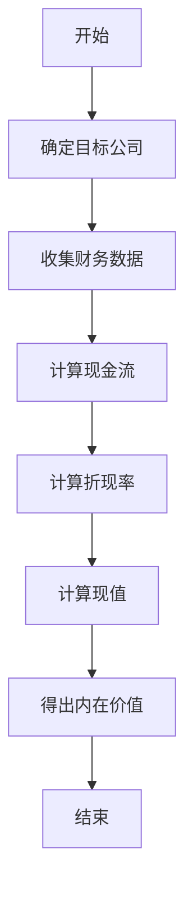

                 

# 如何评估特价股票的内在价值

> 关键词：股票投资，内在价值，财务分析，DCF模型，价值投资，风险管理

> 摘要：本文将详细探讨如何评估特价股票的内在价值。通过分析财务指标、数学模型和实际案例，帮助读者掌握股票内在价值的评估方法，从而做出更明智的投资决策。

---

# 第1章: 股票投资与内在价值基础

## 1.1 股票投资的基本概念

### 1.1.1 股票的定义与分类
股票是公司的一部分所有权，代表持有者对公司资产和收益的权利。股票可以分为以下几类：
- 普通股：享有投票权和分红权。
- 优先股：优先获得股息，但在公司决策中通常没有投票权。

### 1.1.2 特价股票的特点与优势
特价股票通常指价格较低的股票，具有以下特点：
- 价格低廉，适合小额投资。
- 市场波动较大，存在套利机会。
- 可能隐藏着被低估的优质公司。

### 1.1.3 内在价值评估的重要性
内在价值是指股票本身的价值，与市场波动无关。准确评估内在价值可以帮助投资者识别被低估的股票，避免盲目跟风。

---

## 1.2 内在价值评估的核心概念

### 1.2.1 内在价值的定义
内在价值是基于公司基本面（如盈利能力、成长性、财务状况）计算的股票真实价值。

### 1.2.2 内在价值与市场价值的区别
市场价值是股票在市场上的价格，可能高于或低于内在价值。

### 1.2.3 内在价值评估的必要性
通过评估内在价值，投资者可以判断股票是否被高估或低估，从而做出更合理的投资决策。

---

# 第2章: 内在价值评估的关键指标

## 2.1 盈利能力分析

### 2.1.1 净利润与ROE
净利润是公司税后利润，ROE（净资产收益率）衡量公司使用股东资金的效率。
$$ \text{ROE} = \frac{\text{净利润}}{\text{净资产}} $$

### 2.1.2 毛利率与营业利润率
毛利率 = (营业收入 - 营业成本) / 营业收入
$$ \text{毛利率} = \frac{\text{营业收入} - \text{营业成本}}{\text{营业收入}} $$

营业利润率 = 净利润 / 营业收入
$$ \text{营业利润率} = \frac{\text{净利润}}{\text{营业收入}} $$

## 2.2 成长能力分析

### 2.2.1 收入增长率
收入增长率 = (本年收入 - 去年收入) / 去年收入
$$ \text{收入增长率} = \frac{\text{本年收入} - \text{去年收入}}{\text{去年收入}} $$

### 2.2.2 净利润增长率
净利润增长率 = (本年净利润 - 去年净利润) / 去年净利润
$$ \text{净利润增长率} = \frac{\text{本年净利润} - \text{去年净利润}}{\text{去年净利润}} $$

## 2.3 财务健康状况分析

### 2.3.1 负债率与资产负债表分析
负债率 = 负债总额 / 资产总额
$$ \text{负债率} = \frac{\text{负债总额}}{\text{资产总额}} $$

### 2.3.2 现金流状况
经营活动现金流净额反映公司盈利质量。

### 2.3.3 资产负债结构
健康的资产负债结构应保持合理的流动资产与非流动资产比例。

---

# 第3章: 内在价值评估的数学模型与公式

## 3.1 现金流折现模型（DCF）

### 3.1.1 DCF模型的定义
DCF模型通过将未来现金流折现，计算公司当前的合理价值。

### 3.1.2 现金流的计算公式
$$ \text{现金流} = \text{营业收入} - \text{成本} - \text{税费} $$

### 3.1.3 折现率的计算与选择
折现率通常基于无风险利率和市场风险溢价。
$$ \text{折现率} = \text{无风险利率} + \text{市场风险溢价} $$

### 3.1.4 DCF模型的步骤与流程图

## 3.2 市盈率与PEG模型

### 3.2.1 市盈率公式
$$ \text{市盈率} = \frac{\text{股价}}{\text{每股收益}} $$

### 3.2.2 PEG公式
PEG = 市盈率 / 净利润增长率
$$ \text{PEG} = \frac{\text{市盈率}}{\text{净利润增长率}} $$

---

# 第4章: 投资策略与风险管理

## 4.1 价值投资策略

### 4.1.1 价值投资的核心思想
购买价格低于内在价值的股票，长期持有。

### 4.1.2 价值投资的注意事项
- 避免追涨杀跌。
- 关注公司基本面。

## 4.2 成长投资策略

### 4.2.1 成长投资的核心思想
投资于成长速度快的公司。

### 4.2.2 成长投资的注意事项
- 风险较高，需谨慎选择。

## 4.3 风险管理

### 4.3.1 风险控制
- 设置止损点。
- 分散投资。

### 4.3.2 心理因素
避免贪婪与恐惧影响决策。

---

# 第5章: 案例分析与实战

## 5.1 案例分析

### 5.1.1 公司背景介绍
以某科技公司为例，分析其财务数据。

### 5.1.2 财务指标计算
计算ROE、毛利率等指标。

### 5.1.3 内在价值评估
使用DCF模型计算公司价值。

## 5.2 实战指南

### 5.2.1 工具推荐
- Excel：用于财务分析。
- 股票分析软件：如Morningstar。

### 5.2.2 持续学习
阅读投资经典书籍，参加投资课程。

---

# 第6章: 总结与展望

## 6.1 本章总结
本文详细介绍了如何评估特价股票的内在价值，包括财务分析、数学模型和投资策略。

## 6.2 未来展望
随着技术进步，股票分析将更加智能化和数据化。

---

# 作者：AI天才研究院/AI Genius Institute & 禅与计算机程序设计艺术 /Zen And The Art of Computer Programming

