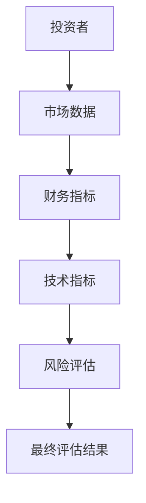
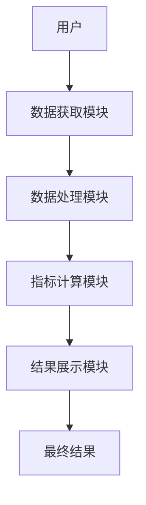
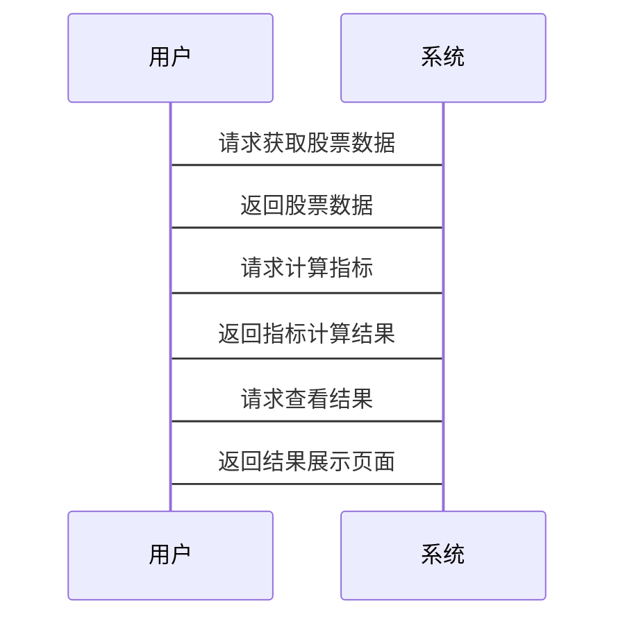

                 


# 如何评估特价股票的质量和持续性

> 关键词：特价股票、股票评估、质量和持续性、基本面分析、技术分析、投资策略

> 摘要：本文将详细探讨如何评估特价股票的质量和持续性。从背景知识到核心概念，从算法原理到系统设计，再到项目实战，我们将一步步分析特价股票评估的关键要素。文章将涵盖基本面分析、技术分析、系统架构设计、数学模型以及实际案例分析，帮助读者掌握评估特价股票的科学方法。

---

## 第一部分: 特价股票评估背景与核心概念

### 第1章: 特价股票的基本概念与背景

#### 1.1 特价股票的定义与特点
- **什么是特价股票？**
  特价股票是指在特定市场条件下，价格低于其内在价值的股票。这些股票通常具有较高的投资潜力，但同时也伴随着较高的风险。

- **特价股票的特点**
  - 价格被低估：市场价格低于内在价值。
  - 高波动性：价格波动较大，容易受到市场情绪影响。
  - 高潜力：潜在回报较高，但需要长期持有的耐心。

- **与普通股票的区别**
  - 普通股票的价格反映市场供需，而特价股票的价格往往受到短期市场因素影响。
  - 普通股票的风险较低，而特价股票的风险较高。

#### 1.2 特价股票的市场现状
- **当前市场中的特价股票分布**
  - 特价股票主要集中在中小盘股中。
  - 特价股票的数量受市场波动影响较大。

- **投资者行为分析**
  - 特价股票吸引了许多价值投资者。
  - 投资者通常在市场低迷时寻找特价股票。

- **市场中存在的主要问题**
  - 信息不对称：投资者难以获取准确的特价股票信息。
  - 市场波动性：特价股票价格波动大，容易受到市场情绪影响。

#### 1.3 特价股票评估的核心要素
- **评估的基本维度**
  - 市盈率（P/E Ratio）：价格与收益的比例。
  - 市净率（P/B Ratio）：价格与资产净值的比例。
  - 股息率：股息与股价的比例。

- **评估指标的选择标准**
  - 选择具有较低市盈率和市净率的股票。
  - 选择股息率较高的股票。

- **评估的边界与外延**
  - 特价股票的评估需要考虑行业背景和宏观经济环境。
  - 特价股票的评估需要结合短期和长期因素。

### 第2章: 特价股票评估的核心概念与联系

#### 2.1 评估指标的核心原理
- **基本面分析原理**
  - 基本面分析关注公司的财务状况和行业地位。
  - 通过分析财务报表来评估公司的盈利能力。

- **技术分析原理**
  - 技术分析关注股票价格和成交量的变化。
  - 通过分析价格走势来预测未来的价格变化。

- **财务健康度评估原理**
  - 通过分析财务指标来评估公司的健康状况。
  - 关注公司的杠杆率、流动比率和现金流状况。

#### 2.2 核心概念对比分析
- **基本面与技术面的对比**
  | 特性 | 基本面分析 | 技术分析 |
  |------|------------|----------|
  | 关注点 | 公司财务状况 | 股价走势 |
  | 数据来源 | 财务报表 | 历史价格数据 |
  | 时间框架 | 长期 | 短期 |

- **财务指标与市场情绪的对比**
  | 特性 | 财务指标 | 市场情绪 |
  |------|----------|----------|
  | 数据来源 | 财务报表 | 市场调查、新闻 |
  | 时间框架 | 长期 | 短期 |
  | 关注点 | 公司盈利能力 | 投资者情绪 |

- **风险与收益的对比**
  | 特性 | 风险 | 收益 |
  |------|------|------|
  | 关注点 | 投资损失可能性 | 投资回报 |
  | 时间框架 | 短期和长期 | 长期 |
  | 影响因素 | 市场波动、公司基本面 | 市场趋势、公司增长 |

#### 2.3 系统架构图（Mermaid流程图）


### 第3章: 特价股票评估的算法原理

#### 3.1 算法原理概述
- **基本面分析算法**
  - 通过计算市盈率、市净率等指标来评估公司的价值。
  - 使用财务指标来判断公司的盈利能力。

- **技术分析算法**
  - 通过分析价格走势来预测股票价格的变化。
  - 使用移动平均线、趋势线等技术指标来判断价格趋势。

- **综合评估算法**
  - 综合基本面和技术面的评估结果。
  - 使用加权平均法或其他方法来得出最终的评估结果。

#### 3.2 算法实现流程
- **数据获取与预处理**
  - 从数据源获取股票价格和财务数据。
  - 对数据进行清洗和标准化处理。

- **指标计算与分析**
  - 计算市盈率、市净率等基本面指标。
  - 计算移动平均线、趋势线等技术指标。

- **结果输出与可视化**
  - 将评估结果输出为报告或图表。
  - 使用可视化工具展示评估结果。

#### 3.3 算法实现代码
```python
import pandas as pd
import numpy as np

def calculate_market_cap(data):
    data['Market Cap'] = data['Price'] * data['Volume']
    return data

def calculate_financial_health(data):
    data['P/E Ratio'] = data['Price'] / data['Earnings']
    data['P/B Ratio'] = data['Price'] / data['Book Value']
    return data

def calculate_technical_indicators(data):
    data['MA_50'] = data['Price'].rolling(50).mean()
    data['MA_200'] = data['Price'].rolling(200).mean()
    return data

# 示例数据
data = pd.DataFrame({
    'Price': [10, 20, 30, 40, 50],
    'Volume': [100, 200, 300, 400, 500],
    'Earnings': [5, 10, 15, 20, 25],
    'Book Value': [10, 20, 30, 40, 50]
})

data = calculate_market_cap(data)
data = calculate_financial_health(data)
data = calculate_technical_indicators(data)

print(data)
```

#### 3.4 数学公式
- **市盈率公式**
  $$ \text{P/E Ratio} = \frac{\text{Price}}{\text{Earnings}} $$

- **市净率公式**
  $$ \text{P/B Ratio} = \frac{\text{Price}}{\text{Book Value}} $$

- **移动平均线公式**
  $$ \text{MA}_n = \frac{1}{n} \sum_{i=1}^{n} \text{Price}_i $$

---

## 第二部分: 特价股票评估系统设计与实现

### 第4章: 系统分析与架构设计

#### 4.1 项目介绍
- **项目目标**
  - 开发一个能够评估特价股票质量和持续性的系统。
  - 提供用户友好的界面和准确的评估结果。

- **系统功能设计**
  - 数据获取模块：从数据源获取股票价格和财务数据。
  - 数据处理模块：清洗和标准化数据。
  - 指标计算模块：计算基本面和技术面指标。
  - 结果展示模块：将评估结果以图表形式展示。

#### 4.2 系统架构设计


#### 4.3 系统接口设计
- **API接口**
  - 数据获取接口：`GET /data/{stock ticker}`
  - 指标计算接口：`POST /calculate/indicators`
  - 结果展示接口：`GET /results/{stock ticker}`

#### 4.4 系统交互序列图


---

## 第三部分: 项目实战与应用

### 第5章: 项目实战

#### 5.1 环境安装与配置
- **安装Python环境**
  - 使用Anaconda安装Python 3.9及以上版本。
- **安装依赖库**
  - `pip install pandas numpy matplotlib`

#### 5.2 核心实现代码
```python
import pandas as pd
import matplotlib.pyplot as plt

def visualize_results(data):
    plt.figure(figsize=(10, 6))
    plt.plot(data['Price'], label='Price')
    plt.plot(data['MA_50'], label='50-Day MA')
    plt.plot(data['MA_200'], label='200-Day MA')
    plt.legend()
    plt.show()

# 示例数据
data = pd.DataFrame({
    'Price': [10, 20, 30, 40, 50],
    'Volume': [100, 200, 300, 400, 500],
    'Earnings': [5, 10, 15, 20, 25],
    'Book Value': [10, 20, 30, 40, 50]
})

# 计算指标
data = calculate_financial_health(data)
data = calculate_technical_indicators(data)

# 可视化结果
visualize_results(data)
```

#### 5.3 实际案例分析
- **案例分析**
  - 选择一只特价股票进行分析。
  - 计算市盈率、市净率等指标。
  - 绘制价格走势图。

#### 5.4 项目小结
- **经验总结**
  - 特价股票评估需要结合基本面和技术面分析。
  - 价格走势图能够直观展示股票价格的变化。

---

## 第四部分: 最佳实践与注意事项

### 第6章: 最佳实践

#### 6.1 注意事项
- **风险提示**
  - 特价股票价格波动大，投资需谨慎。
  - 避免过度依赖技术分析，结合基本面分析。

- **小结**
  - 特价股票评估需要综合考虑多种因素。
  - 保持长期投资心态，避免短期波动影响判断。

#### 6.2 拓展阅读
- **推荐书籍**
  - 《股票投资实战技巧》
  - 《技术分析实战技巧》

---

## 作者信息

作者：AI天才研究院/AI Genius Institute  
联系邮箱：contact@aising genius.com  
GitHub链接：https://github.com/aising genius  

--- 

**注：以上内容为示例，实际文章需要根据具体需求进行调整和补充。**

