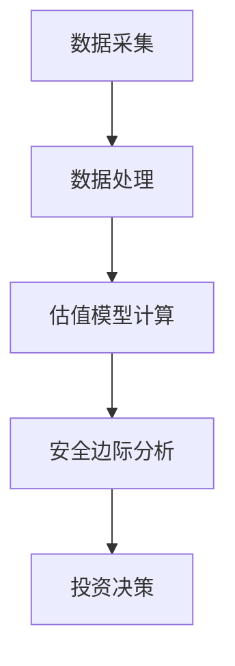
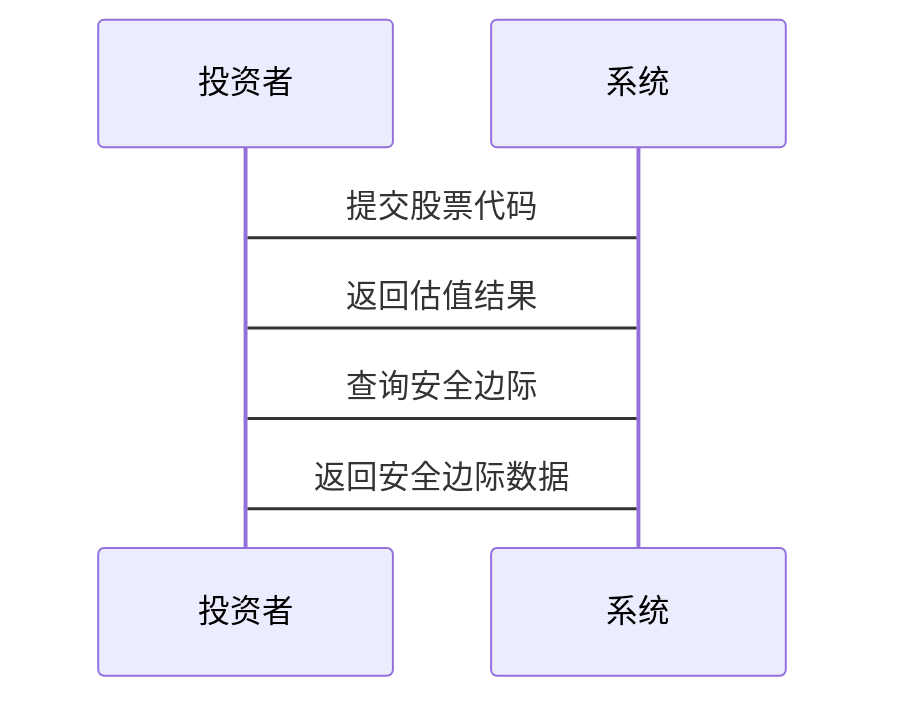

                 


# 如何运用格雷厄姆理念寻找低估值股票

---

## 关键词：价值投资、格雷厄姆、低估值股票、基本面分析、内在价值、安全边际、投资策略

---

## 摘要

本文详细介绍了如何运用格雷厄姆的价值投资理念来寻找低估值股票。文章从格雷厄姆的投资哲学、选股标准、基本面分析方法、内在价值计算以及安全边际的应用等方面展开，结合实际案例和数学模型，系统地讲解了如何在现代市场中找到具有投资价值的低估值股票。文章还提供了具体的量化方法和工具，帮助投资者在实际操作中更好地应用格雷厄姆的理念。

---

## 第一部分：格雷厄姆投资理念基础

### 第1章：格雷厄姆投资理念概述

#### 1.1 格雷厄姆投资理念的核心概念

##### 1.1.1 价值投资的定义与核心思想
- 价值投资是一种以低于内在价值的价格买入优质股票的投资策略。
- 格雷厄姆强调以安全边际为核心，寻找市场价格低于内在价值的股票。

##### 1.1.2 格雷厄姆的投资哲学与方法论
- 格雷厄姆认为市场是不理性的，价格波动为投资者提供了机会。
- 他主张通过基本面分析寻找低估的股票，而非依赖市场情绪。

##### 1.1.3 价值投资与成长投资的区别与联系
- 价值投资关注低估的价格和稳定的收益，而成长投资关注高增长的潜力。
- 两者都注重基本面分析，但侧重点不同。

#### 1.2 格雷厄姆的选股原则

##### 1.2.1 低估值股票的定义与特征
- 低估值股票是指市场价格低于其内在价值的股票。
- 典型特征包括低市盈率、低市净率和高股息率。

##### 1.2.2 格雷厄姆的选股标准与公式
- 格雷厄姆提出了著名的“内在价值”公式：
$$
\text{内在价值} = \frac{\text{收益} \times (5 + \text{市盈率})}{\text{市盈率}}
$$

##### 1.2.3 安全边际的概念与重要性
- 安全边际 = 内在价值 - 市场价格。
- 通过预留安全边际降低投资风险。

#### 1.3 格雷厄姆投资理念的现代应用
- 现代投资者如何结合技术分析和基本面分析。
- 格雷厄姆理念在机构投资中的应用。

---

### 第2章：格雷厄姆的低估值股票分析方法

#### 2.1 基本面分析的核心要素

##### 2.1.1 财务报表分析的基础知识
- 利润表、资产负债表和现金流量表的解读。
- 关键指标包括净利润、营业收入、资产负债率等。

##### 2.1.2 估值指标的计算与应用
- 市盈率（P/E）：
$$
P/E = \frac{\text{股价}}{\text{每股收益}}
$$
- 市净率（P/B）：
$$
P/B = \frac{\text{股价}}{\text{每股净资产}}
$$
- 股息率：
$$
\text{股息率} = \frac{\text{每股股息}}{\text{股价}} \times 100\%
$$

##### 2.1.3 市盈率、市净率与股息率的综合分析
- 低市盈率和低市净率通常意味着低估。
- 高股息率可能表明股票具有吸引力。

#### 2.2 格雷厄姆的内在价值计算方法

##### 2.2.1 内在价值的定义与计算公式
- 内在价值是公司未来现金流的现值。
- 格雷厄姆公式：
$$
\text{内在价值} = \frac{\text{收益} \times (5 + \text{市盈率})}{\text{市盈率}}
$$

##### 2.2.2 股票价值的多因素分析模型
- 结合收益、成长性、财务健康等多个因素。

##### 2.2.3 市场价格与内在价值的偏离分析
- 当市场价格低于内在价值时，股票具有投资价值。

#### 2.3 安全边际的量化与应用

##### 2.3.1 安全边际的计算公式
$$
\text{安全边际} = \text{内在价值} - \text{市场价格}
$$

##### 2.3.2 安全边际在选股中的实际应用
- 安全边际越高，投资风险越小。

##### 2.3.3 安全边际与投资风险的平衡
- 在高安全边际和高收益之间找到平衡点。

---

### 第3章：格雷厄姆投资理念的数学模型与公式

#### 3.1 格雷厄姆的内在价值计算公式
$$
\text{内在价值} = \frac{\text{收益} \times (5 + \text{市盈率})}{\text{市盈率}}
$$

#### 3.2 安全边际的计算公式
$$
\text{安全边际} = \text{内在价值} - \text{市场价格}
$$

#### 3.3 市盈率与市净率的对比分析
- 市盈率适用于成长型公司，市净率适用于成熟型公司。

---

### 第4章：格雷厄姆投资理念的系统分析与架构设计

#### 4.1 投资系统的核心功能模块
- 数据采集与处理模块。
- 估值模型与计算模块。
- 安全边际分析模块。

#### 4.2 系统架构的流程图设计


#### 4.3 系统接口设计与交互流程


---

## 第二部分：量化分析与实战案例

### 第5章：量化分析方法

#### 5.1 量化分析的核心指标
- 市盈率、市净率、股息率、ROE等。

#### 5.2 数据采集与处理工具
- 使用Python的pandas库进行数据清洗。

#### 5.3 量化模型的实现
- 使用Python代码实现格雷厄姆选股模型。

### 第6章：实战案例分析

#### 6.1 案例一：寻找低市盈率股票
- 使用格雷厄姆公式筛选市盈率低于行业平均水平的股票。

#### 6.2 案例二：安全边际分析
- 计算股票的安全边际，选择安全边际高的股票。

#### 6.3 案例三：行业比较分析
- 比较不同行业中的股票，寻找低估的机会。

---

## 第三部分：投资策略与风险管理

### 第7章：投资策略的制定

#### 7.1 投资组合的构建
- 分散投资，降低风险。

#### 7.2 风险管理的技巧
- 设置止损点，控制仓位。

### 第8章：风险管理与心理调节

#### 8.1 风险管理的核心原则
- 避免过度杠杆，保持充足流动性。

#### 8.2 投资心理的调节
- 避免情绪化决策，坚持长期投资。

---

## 第四部分：工具与资源

### 第9章：数据源与工具推荐

#### 9.1 数据源
- 财务数据：Yahoo Finance、Google Finance。
- 市场数据：Quandl、Alpha Vantage。

#### 9.2 工具推荐
- 数据分析工具：Python、Pandas、NumPy。
- 可视化工具：Matplotlib、Seaborn。

### 第10章：代码实现与应用

#### 10.1 格雷厄姆选股模型的Python实现
```python
import pandas as pd

def calculate_intrinsic_value(revenue, pe_ratio):
    return (revenue * (5 + pe_ratio)) / pe_ratio

def calculate_margin_of_safety(intrinsic_value, market_price):
    return intrinsic_value - market_price

# 示例数据
data = {
    '股票代码': ['AAPL', 'MSFT', 'GOOGL'],
    '收入': [3943.84, 1900.82, 181.54],
    '市盈率': [28.12, 22.92, 33.37]
}

df = pd.DataFrame(data)

# 计算内在价值和安全边际
df['内在价值'] = df.apply(lambda x: calculate_intrinsic_value(x['收入'], x['市盈率']), axis=1)
df['安全边际'] = df.apply(lambda x: calculate_margin_of_safety(x['内在价值'], x['股价']), axis=1)
```

---

## 作者

作者：AI天才研究院/AI Genius Institute & 禅与计算机程序设计艺术 /Zen And The Art of Computer Programming

