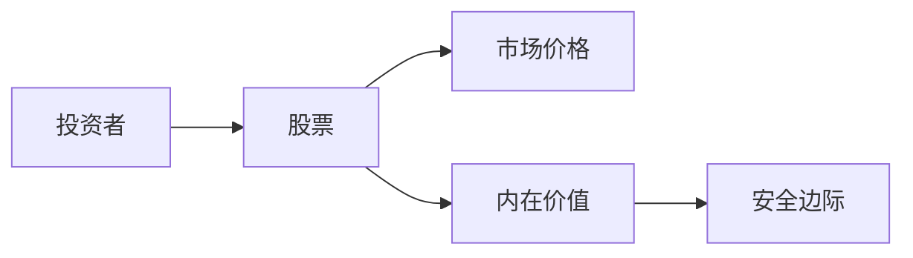
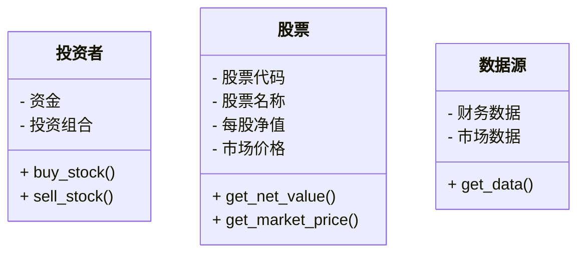

                 


# 如何运用格雷厄姆的净净股策略进行投资

> 关键词：净净股策略、格雷厄姆、价值投资、安全边际、投资策略、投资分析

> 摘要：本文深入探讨了格雷厄姆的净净股策略，通过系统化的方法分析其核心原理、算法设计、系统架构以及实际应用。文章从基础概念出发，逐步解析了净净股策略的数学模型、计算方法和实现步骤，并结合实际案例进行了详细分析。通过本文，读者将能够掌握如何运用净净股策略进行投资，并在实际操作中实现稳健的投资收益。

---

## 第1章 净净股策略的背景与概念

### 1.1 投资的基本概念
投资是通过将资金投入特定资产以期获得收益的行为。根据资产类型，投资可以分为股票、债券、房地产等多种形式。在股票投资领域，格雷厄姆提出了价值投资的理念，强调以低于内在价值的价格购买股票。

### 1.2 净净股策略的核心概念
净净股策略是格雷厄姆提出的一种价值投资方法，其核心在于寻找市场价格低于每股净资产（即净净股）的股票。这种策略基于以下假设：
- 股票的内在价值可以通过公司净资产除以发行股份计算得出。
- 市场价格受短期波动影响，但长期会回归其内在价值。

### 1.3 净净股策略的适用场景
- **低估市场**：当市场整体被低估时，净净股策略表现尤为突出。
- **防御性投资**：在市场波动较大时，净净股策略可以提供较高的安全边际。
- **稳健投资者**：适合风险承受能力较低的投资者。

---

## 第2章 净净股策略的核心原理

### 2.1 净值与市场价格的关系
- **内在价值公式**：$$ V = \frac{E}{P} $$
  其中，\( E \) 为公司净资产，\( P \) 为公司发行股份。
- **安全边际计算公式**：$$ S = P - V $$
  当市场价格低于内在价值时，\( S \) 为正，表示存在安全边际。

### 2.2 净净股策略的数学模型
- **内在价值计算**：通过分析公司财务报表，计算每股净资产。
- **市场价格波动**：通过历史数据和市场趋势，判断市场价格是否偏离内在价值。

### 2.3 核心概念与联系
- **表格对比**：
| 属性 | 净净股策略 | 其他投资策略 |
|------|------------|--------------|
| 核心 | 净值与价格差 | 收益最大化 | 
| 风险 | 中低风险 | 高风险 |

- **ER实体关系图**：


---

## 第3章 净净股策略的算法原理

### 3.1 净值计算算法
- **计算步骤**：
  1. 收集公司财务数据。
  2. 计算每股净资产。
  3. 分析市场价格与净值的差异。

### 3.2 安全边际计算算法
- **计算步骤**：
  1. 计算内在价值。
  2. 确定市场价格。
  3. 计算安全边际。

### 3.3 净净股策略的流程图


### 3.4 Python实现
```python
def calculate_net_value(company_data):
    # 计算每股净值
    return company_data['equity'] / company_data['shares']
```

---

## 第4章 净净股策略的系统分析与架构设计

### 4.1 问题场景介绍
- **投资者需求**：寻找低估股票，实现稳健收益。
- **市场环境分析**：市场波动较大，需要通过算法筛选出具备安全边际的股票。

### 4.2 系统功能设计
- **数据采集模块**：收集公司财务数据和市场数据。
- **净值计算模块**：计算每股净资产。
- **安全边际分析模块**：判断市场价格与内在价值的差异。

### 4.3 系统架构设计
- **领域模型类图**：


- **系统架构图**：


---

## 第5章 净净股策略的实际应用与案例分析

### 5.1 实际案例分析
- **案例背景**：假设某公司每股净资产为10元，当前股价为8元。
- **计算过程**：
  1. 内在价值 \( V = 10 \) 元。
  2. 市场价格 \( P = 8 \) 元。
  3. 安全边际 \( S = 10 - 8 = 2 \) 元。
- **结论**：该股票具有2元的安全边际，适合买入。

### 5.2 项目实战
- **环境安装**：安装Python和相关数据分析库（如Pandas、NumPy）。
- **核心实现**：
  ```python
  def calculate_margin(company_data):
      net_value = calculate_net_value(company_data)
      market_price = company_data['market_price']
      return net_value - market_price
  ```

---

## 第6章 净净股策略的优化与扩展

### 6.1 优化策略
- **动态调整**：根据市场变化，动态调整安全边际。
- **多因子分析**：结合其他财务指标，进一步优化选股策略。

### 6.2 拓展阅读
- **相关书籍**：《聪明的投资者》。
- **学术论文**：研究安全边际在不同市场环境下的表现。

---

## 第7章 总结与展望

### 7.1 总结
净净股策略是一种有效的价值投资方法，通过计算内在价值和市场价格的差异，帮助投资者找到低估股票。其核心在于安全边际的计算，确保投资的稳健性。

### 7.2 注意事项
- 投资者需结合市场环境，灵活调整策略。
- 需定期更新财务数据，确保计算的准确性。

### 7.3 未来展望
- 结合人工智能技术，进一步优化选股模型。
- 研究安全边际在不同资产类别中的应用。

---

## 作者

作者：AI天才研究院/AI Genius Institute & 禅与计算机程序设计艺术 /Zen And The Art of Computer Programming

