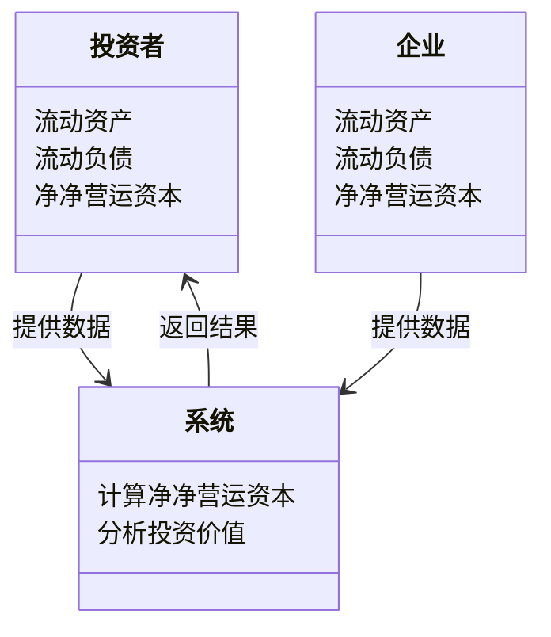
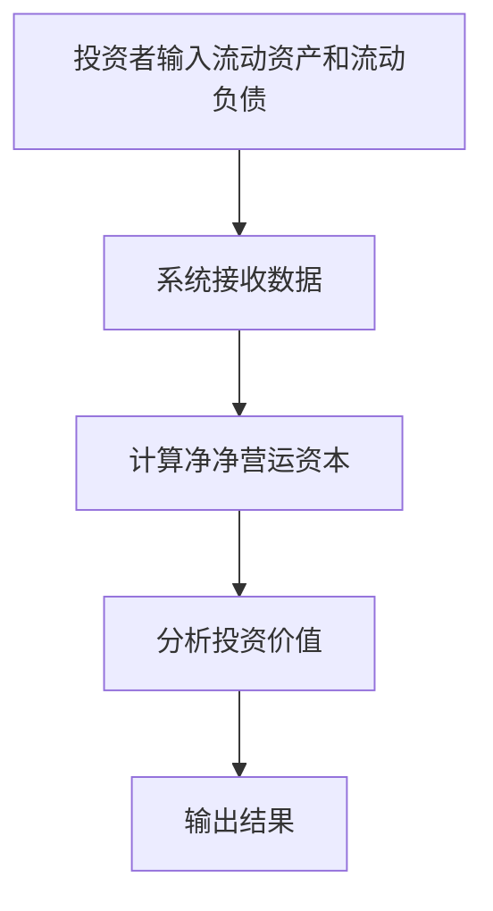
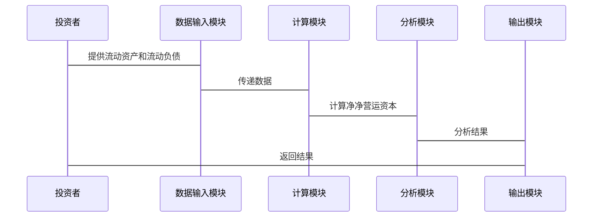

                 


# 如何运用格雷厄姆的净净营运资本策略

> 关键词：格雷厄姆，净净营运资本，投资策略，价值投资，财务分析，投资决策，企业估值

> 摘要：本文将详细介绍格雷厄姆的净净营运资本策略，从基本概念到数学模型，再到系统架构设计和项目实战，全面解析这一投资策略的应用方法。通过实际案例分析，帮助读者掌握如何利用净净营运资本进行投资决策和企业估值。

---

## 第1章 净净营运资本的基本概念

### 1.1 净净营运资本的定义与背景

#### 1.1.1 核心概念：问题背景与问题描述
净净营运资本（Net Net Working Capital, NWC）是企业营运资本的一种形式，用于衡量企业短期资产与短期负债之间的差额。它是企业短期流动性的重要指标，也是评估企业财务健康状况的关键因素之一。

#### 1.1.2 净净营运资本的定义与属性
净净营运资本（NWC）的定义为：
$$NWC = Current\ Assets - Current\ Liabilities$$
其中，流动资产包括现金、应收账款、存货等，流动负债包括应付账款、短期借款等。NWC反映了企业在短期内的偿债能力和运营效率。

#### 1.1.3 净净营运资本的边界与外延
净净营运资本主要关注企业的短期财务状况，不包括长期资产和长期负债。它的外延涉及企业的日常运营、流动资金管理以及短期财务风险评估。

### 1.2 净净营运资本与传统营运资本的区别

#### 1.2.1 核心要素对比
| 比较维度 | 净净营运资本（NWC） | 传统营运资本（WC） |
|----------|-----------------------|---------------------|
| 定义     | 流动资产 - 流动负债   | 流动资产 + 流动负债 |
| 用途     | 评估短期偿债能力     | 评估整体营运能力   |
| 突出特征 | 短期偿债能力         | 综合营运能力       |

#### 1.2.2 ER实体关系图架构
```mermaid
er
  actor 投资者 {
    <的关联关系>
  }
  actor 企业 {
    <的关联关系>
  }
  entity 流动资产 {
    <的关联关系>
  }
  entity 流动负债 {
    <的关联关系>
  }
  entity 净净营运资本 {
    <的关联关系>
  }
  relation "拥有" --> 投资者
  relation "包括" --> 流动资产
  relation "包括" --> 流动负债
  relation "计算" --> 净净营运资本
```

---

## 第2章 格雷厄姆的投资策略概述

### 2.1 格雷厄姆的投资理念

#### 2.1.1 价值投资的核心思想
格雷厄姆是价值投资的鼻祖，他主张以低于内在价值的价格购买优质股票。他认为市场先生是不理性的，投资者应利用市场的非理性来获取超额收益。

#### 2.1.2 净净营运资本在投资中的作用
净净营运资本是格雷厄姆分析企业内在价值的重要工具之一。他通过分析企业的流动资产和流动负债，评估企业的短期偿债能力和运营效率。

#### 2.1.3 格雷厄姆的投资策略与现代投资理论的联系
格雷厄姆的投资策略为现代价值投资奠定了基础，其核心思想与基本面分析密切相关。现代投资理论中的资产定价模型（如CAPM）也受到其影响。

### 2.2 净净营运资本在投资决策中的应用

#### 2.2.1 净净营运资本的计算公式
$$NWC = Current\ Assets - Current\ Liabilities$$

#### 2.2.2 投资决策中的关键指标
- 流动比率：$$流动比率 = \frac{流动资产}{流动负债}$$
- 速动比率：$$速动比率 = \frac{流动资产 - 存货}{流动负债}$$

#### 2.2.3 净净营运资本与企业价值的关系
企业价值不仅取决于净净营运资本，还与企业的盈利能力、成长潜力等因素密切相关。格雷厄姆强调，投资者应综合分析这些因素，才能做出合理的投资决策。

---

## 第3章 净净营运资本的数学模型与算法原理

### 3.1 净净营运资本的数学公式

#### 3.1.1 基本公式
$$NWC = Current\ Assets - Current\ Liabilities$$

#### 3.1.2 扩展公式
$$NWC = (流动资产 - 短期负债)$$

#### 3.1.3 应用场景与限制条件
- 适用场景：评估企业短期偿债能力。
- 限制条件：仅适用于流动资产和流动负债的分析，无法反映长期资产和负债的情况。

### 3.2 净净营运资本的算法流程

#### 3.2.1 数据输入与处理
1. 获取企业的流动资产和流动负债数据。
2. 确保数据的准确性和完整性。

#### 3.2.2 计算过程
1. 计算流动资产减去流动负债，得到净净营运资本。

#### 3.2.3 结果输出与分析
1. 输出净净营运资本的数值。
2. 分析其对投资决策的影响。

### 3.3 净净营运资本的算法实现

#### 3.3.1 Python源代码实现
```python
def calculate_nwc(current_assets, current_liabilities):
    return current_assets - current_liabilities

# 示例数据
current_assets = 500000
current_liabilities = 300000

nwc = calculate_nwc(current_assets, current_liabilities)
print(f"净净营运资本: {nwc}")
```

#### 3.3.2 代码应用解读
- 输入：企业的流动资产和流动负债。
- 输出：净净营运资本的数值。
- 应用：用于评估企业的短期偿债能力，辅助投资决策。

#### 3.3.3 实际案例分析
假设某企业流动资产为50万元，流动负债为30万元，则：
$$NWC = 500,000 - 300,000 = 200,000$$
净净营运资本为20万元，表明企业在短期内有足够的流动资金偿还债务。

---

## 第4章 净净营运资本的系统架构设计

### 4.1 系统功能设计

#### 4.1.1 领域模型设计（Mermaid类图）


#### 4.1.2 系统功能模块划分
- 数据输入模块：接收流动资产和流动负债数据。
- 计算模块：计算净净营运资本。
- 分析模块：评估企业投资价值。

#### 4.1.3 功能流程图（Mermaid流程图）


### 4.2 系统架构设计

#### 4.2.1 系统架构图（Mermaid架构图）
```mermaid
container 投资者系统 {
    class 投资者
    class 数据输入模块
    class 计算模块
    class 分析模块
    class 输出模块
}
```

#### 4.2.2 系统接口设计
- 输入接口：接收流动资产和流动负债。
- 输出接口：返回净净营运资本和投资分析结果。

#### 4.2.3 系统交互图（Mermaid序列图）


---

## 第5章 项目实战

### 5.1 项目介绍

#### 5.1.1 项目目标
通过分析某企业的流动资产和流动负债，计算其净净营运资本，并评估其投资价值。

### 5.2 系统核心实现

#### 5.2.1 环境安装
需要安装Python和相关开发工具。

#### 5.2.2 核心代码实现
```python
def calculate_nwc(current_assets, current_liabilities):
    return current_assets - current_liabilities

def analyze_investment(nwc, current_assets, current_liabilities):
    if nwc < 0:
        return "投资风险较高，建议谨慎"
    elif nwc > (current_assets * 0.3):
        return "投资价值较高，建议关注"
    else:
        return "投资价值一般，建议进一步分析"

# 示例数据
current_assets = 500000
current_liabilities = 300000
nwc = calculate_nwc(current_assets, current_liabilities)
investment_analysis = analyze_investment(nwc, current_assets, current_liabilities)
print(f"净净营运资本: {nwc}")
print(f"投资分析结果: {investment_analysis}")
```

#### 5.2.3 代码解读与分析
- `calculate_nwc`函数：计算净净营运资本。
- `analyze_investment`函数：根据NWC值分析投资价值。
- 示例数据：流动资产为50万元，流动负债为30万元，NWC为20万元，投资分析结果为“投资价值较高，建议关注”。

### 5.3 实际案例分析

#### 5.3.1 案例背景
某制造企业流动资产为800万元，流动负债为500万元。

#### 5.3.2 计算过程
$$NWC = 8000000 - 5000000 = 3000000$$

#### 5.3.3 投资分析
NWC为300万元，占流动资产的37.5%，投资价值较高，建议关注。

### 5.4 项目小结
通过实际案例分析，验证了净净营运资本在投资决策中的应用价值。投资者可以根据NWC值评估企业的短期偿债能力和投资价值，做出合理的投资决策。

---

## 第6章 总结与扩展

### 6.1 总结
本文详细介绍了格雷厄姆的净净营运资本策略，从基本概念到数学模型，再到系统架构设计和项目实战，全面解析了这一策略的应用方法。通过实际案例分析，帮助读者掌握了如何利用净净营运资本进行投资决策和企业估值。

### 6.2 最佳实践 tips
- 投资者应结合其他财务指标（如盈利能力、成长潜力）进行综合分析。
- 定期更新财务数据，及时调整投资策略。

### 6.3 小结
净净营运资本是评估企业短期偿债能力和投资价值的重要指标。投资者应合理运用这一策略，结合市场环境和企业实际情况，做出明智的投资决策。

### 6.4 注意事项
- 数据准确性是关键，需确保流动资产和流动负债的准确记录。
- 单一指标分析存在局限性，需结合其他指标进行综合评估。

### 6.5 拓展阅读
- 格雷厄姆的《 Intelligent Investor》
- 价值投资相关书籍和文献

---

## 附录：完整代码和参考资料

### 附录A：完整代码
```python
def calculate_nwc(current_assets, current_liabilities):
    return current_assets - current_liabilities

def analyze_investment(nwc, current_assets, current_liabilities):
    if nwc < 0:
        return "投资风险较高，建议谨慎"
    elif nwc > (current_assets * 0.3):
        return "投资价值较高，建议关注"
    else:
        return "投资价值一般，建议进一步分析"

# 示例数据
current_assets = 500000
current_liabilities = 300000
nwc = calculate_nwc(current_assets, current_liabilities)
investment_analysis = analyze_investment(nwc, current_assets, current_liabilities)
print(f"净净营运资本: {nwc}")
print(f"投资分析结果: {investment_analysis}")
```

### 附录B：参考资料
1. 格雷厄姆的《 Intelligent Investor》
2. 财务管理相关文献
3. 网络资源和投资分析工具

---

作者：AI天才研究院/AI Genius Institute & 禅与计算机程序设计艺术 /Zen And The Art of Computer Programming

---

以上就是完整的文章大纲和正文内容。

