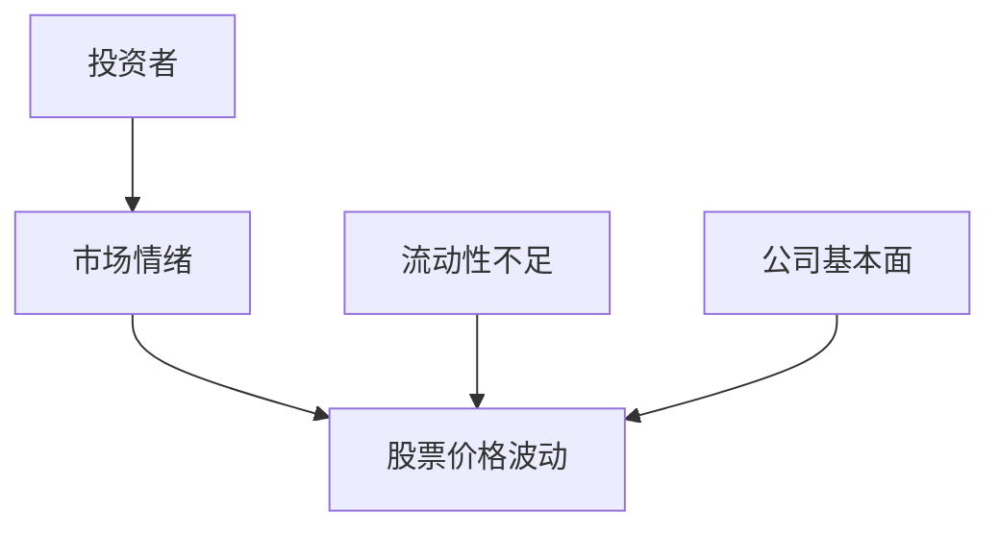
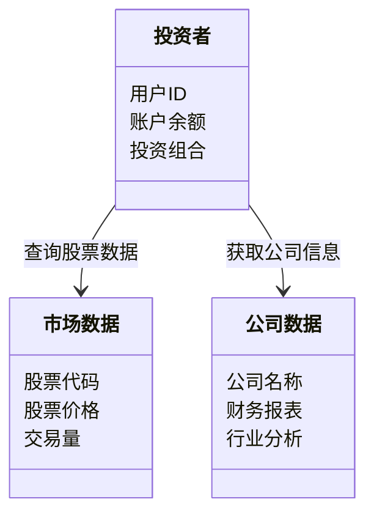
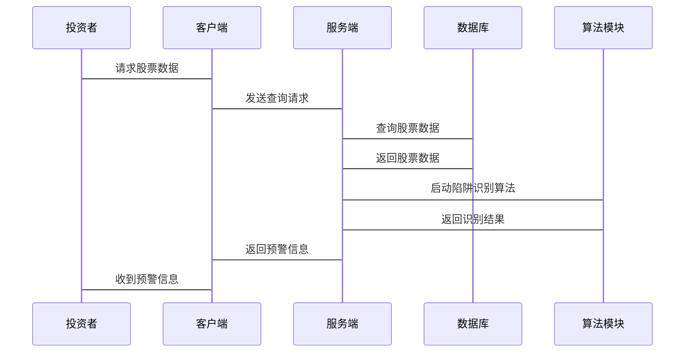

                 


# 如何避免特价股票投资中的陷阱

> 关键词：特价股票、陷阱、价值陷阱、市场情绪、风险管理、投资策略

> 摘要：本文系统地探讨了特价股票投资中的常见陷阱，分析了价值陷阱、市场情绪陷阱和流动性陷阱的形成机制，并结合数学模型和系统架构设计，提出了有效的识别和规避策略。通过实例分析和代码实现，帮助投资者在特价股票投资中避免常见误区，实现稳健的投资收益。

---

# 第1章: 特价股票投资的背景与陷阱

## 1.1 特价股票投资的背景

### 1.1.1 什么是特价股票

特价股票是指在特定市场条件下，由于某种原因导致股票价格低于其内在价值的股票。这种股票通常被市场低估，具有潜在的上涨空间。然而，特价股票的投资也伴随着较高的风险，因为其价格波动较大，容易受到市场情绪和公司基本面变化的影响。

### 1.1.2 特价股票的市场特点

- **低估值**：特价股票通常具有较低的市盈率、市净率等估值指标。
- **高波动性**：由于市场对这类股票的预期较低，价格波动较大。
- **流动性风险**：部分特价股票的交易量较低，可能导致买卖价差较大。

### 1.1.3 特价股票投资的潜在收益与风险

- **潜在收益**：如果投资者能够准确识别被低估的股票，可能会获得较高的收益。
- **潜在风险**：由于市场波动和公司基本面变化，投资风险较高。

## 1.2 特价股票投资中的常见陷阱

### 1.2.1 价值陷阱的定义与特征

价值陷阱是指某些股票看似估值较低，但实际上公司基本面较差，缺乏长期增长潜力。投资者如果只关注表面的估值指标，而忽视了公司财务状况和行业前景，可能会陷入价值陷阱。

**特征：**
- 公司财务状况恶化，如高负债、低利润率。
- 行业前景不佳，市场需求下降。
- 管理层问题，如频繁更换或内部冲突。

### 1.2.2 市场情绪陷阱的形成机制

市场情绪陷阱是指投资者由于过度受市场情绪影响，做出非理性投资决策。这种陷阱通常出现在市场波动剧烈的时期，投资者容易被恐慌或贪婪情绪左右，导致投资决策失误。

**形成机制：**
- **贪婪**：市场上涨时，投资者盲目追高，忽视基本面。
- **恐慌**：市场下跌时，投资者盲目抛售，忽视长期价值。

### 1.2.3 流动性陷阱的影响

流动性陷阱是指投资者在市场流动性不足的情况下，难以以合理价格买卖股票。当市场流动性下降时，股票价格可能大幅波动，投资者可能无法及时变现，导致损失。

**影响：**
- 价格波动加剧，买卖价差扩大。
- 投资者可能被迫以低于市场价出售股票。

## 1.3 本章小结

本章介绍了特价股票的市场特点，并分析了价值陷阱、市场情绪陷阱和流动性陷阱的形成机制。投资者需要认识到这些陷阱的存在，并采取有效的策略来规避风险。

---

# 第2章: 特价股票陷阱的核心概念分析

## 2.1 特价股票陷阱的类型

### 2.1.1 价值陷阱的识别特征

- **高负债率**：公司资产负债表显示高负债，财务风险较高。
- **低利润率**：公司盈利能力下降，净利润率低。
- **行业衰退**：所在行业市场需求减少，竞争加剧。

### 2.1.2 市场情绪陷阱的表现形式

- **市场波动加剧**：股票价格大幅波动，偏离公司基本面。
- **投资者情绪化决策**：投资者盲目跟随市场趋势，忽视基本面分析。
- **市场泡沫**：短期内股价快速上涨，脱离实际价值。

### 2.1.3 流动性陷阱的判断标准

- **低交易量**：股票交易量突然下降，市场流动性不足。
- **价格波动剧烈**：股票价格在短时间内大幅波动。
- **买卖价差扩大**：市场流动性不足导致买卖价差增大。

## 2.2 特价股票陷阱的核心要素对比

### 2.2.1 不同陷阱类型的核心要素对比表

| 陷阱类型    | 核心要素                     |
|-------------|------------------------------|
| 价值陷阱    | 公司财务状况、行业前景       |
| 市场情绪陷阱  | 市场波动、投资者情绪           |
| 流动性陷阱    | 交易量、价格波动、买卖价差     |

### 2.2.2 特价股票陷阱的ER实体关系图



## 2.3 本章小结

本章通过对比分析，详细讲解了价值陷阱、市场情绪陷阱和流动性陷阱的核心要素，并通过ER实体关系图展示了这些陷阱之间的相互作用。

---

# 第3章: 特价股票陷阱的数学模型与算法原理

## 3.1 特价股票陷阱的识别模型

### 3.1.1 基于回归分析的陷阱识别模型

回归分析是一种常用的统计方法，用于分析变量之间的关系。在识别价值陷阱时，可以使用线性回归模型来分析公司财务指标与股价之间的关系。

**数学模型：**
$$ y = \beta_0 + \beta_1 x + \epsilon $$

其中：
- $y$ 表示股票价格。
- $x$ 表示公司财务指标（如负债率）。
- $\beta_0$ 和 $\beta_1$ 是回归系数。
- $\epsilon$ 是误差项。

### 3.1.2 基于聚类分析的陷阱识别模型

聚类分析是一种无监督学习方法，用于将数据分成若干组。在识别市场情绪陷阱时，可以使用聚类分析来识别市场波动的模式。

**实现步骤：**
1. 收集股票价格数据。
2. 标准化数据。
3. 应用聚类算法（如K-means）进行分类。
4. 分析聚类结果，识别异常波动。

### 3.1.3 基于时间序列分析的陷阱识别模型

时间序列分析用于分析数据随时间的变化趋势。在识别流动性陷阱时，可以使用ARIMA模型来预测股票价格的变化。

**数学模型：**
$$ y_t = \phi y_{t-1} + \theta \epsilon_t + \epsilon_{t-1} $$

其中：
- $y_t$ 表示第$t$期的股票价格。
- $\phi$ 和 $\theta$ 是模型参数。
- $\epsilon_t$ 是白噪声。

## 3.2 特价股票陷阱的预测算法

### 3.2.1 基于机器学习的陷阱预测算法

机器学习是一种人工智能技术，用于从数据中学习模式。在预测陷阱时，可以使用支持向量机（SVM）进行分类。

**代码示例：**

```python
from sklearn.svm import SVC
from sklearn.model_selection import train_test_split
import pandas as pd

# 加载数据
data = pd.read_csv('stock_data.csv')

# 分割特征和目标变量
X = data[['price', 'volume', 'moving_avg']]
y = data['is_trap']

# 分割训练集和测试集
X_train, X_test, y_train, y_test = train_test_split(X, y, test_size=0.2)

# 训练模型
model = SVC()
model.fit(X_train, y_train)

# 预测测试集
y_pred = model.predict(X_test)

# 输出准确率
print('Accuracy:', model.score(X_test, y_test))
```

### 3.2.2 基于深度学习的陷阱预测算法

深度学习是一种机器学习技术，用于处理复杂的数据模式。在预测陷阱时，可以使用长短时记忆网络（LSTM）进行时间序列预测。

### 3.2.3 基于贝叶斯定理的陷阱预测算法

贝叶斯定理用于计算条件概率，可以帮助投资者判断某种陷阱发生的概率。

**公式：**
$$ P(A|B) = \frac{P(B|A)P(A)}{P(B)} $$

其中：
- $P(A|B)$ 表示在$B$条件下$A$发生的概率。
- $P(B|A)$ 是$A$条件下$B$发生的概率。
- $P(A)$ 是$A$发生的先验概率。
- $P(B)$ 是$B$发生的先验概率。

---

# 第4章: 特价股票陷阱的系统分析与架构设计

## 4.1 问题场景介绍

投资者需要一个系统来实时监控市场动态，识别潜在的陷阱，并提供预警。系统需要处理大量数据，包括股票价格、交易量、公司财务数据等。

## 4.2 系统功能设计

### 4.2.1 领域模型



### 4.2.2 系统架构设计


### 4.2.3 接口设计

- **查询接口**：`GET /api/stock/{symbol}`，返回股票详细信息。
- **预警接口**：`POST /api/warning`, 返回潜在陷阱的预警信息。

### 4.2.4 交互流程



## 4.3 本章小结

本章通过系统架构设计，展示了如何构建一个实时监控市场动态的系统，帮助投资者识别潜在的陷阱。

---

# 第5章: 特价股票陷阱的项目实战

## 5.1 环境安装

- **Python**：安装Python 3.x。
- **库的安装**：使用以下命令安装所需的库：

```bash
pip install pandas numpy scikit-learn
```

## 5.2 系统核心实现

### 5.2.1 数据处理模块

```python
import pandas as pd

# 加载数据
data = pd.read_csv('stock_data.csv')

# 数据清洗
data = data.dropna()
```

### 5.2.2 模型训练模块

```python
from sklearn.svm import SVC
from sklearn.model_selection import train_test_split

# 分割数据
X = data[['price', 'volume', 'moving_avg']]
y = data['is_trap']

X_train, X_test, y_train, y_test = train_test_split(X, y, test_size=0.2)

# 训练模型
model = SVC()
model.fit(X_train, y_train)

# 预测测试集
y_pred = model.predict(X_test)

# 输出准确率
print('Accuracy:', model.score(X_test, y_test))
```

### 5.2.3 系统接口实现

```python
from flask import Flask, request, jsonify

app = Flask(__name__)

@app.route('/api/stock/<symbol>', methods=['GET'])
def get_stock_data(symbol):
    # 获取数据
    data = {
        'symbol': symbol,
        'price': 100,
        'volume': 1000
    }
    return jsonify(data)

@app.route('/api/warning', methods=['POST'])
def send_warning():
    # 处理预警请求
    return 'Warning sent!'
```

## 5.3 实际案例分析

### 5.3.1 案例背景

假设我们有一个股票数据集，包含股票代码、价格、交易量等信息。我们需要识别其中的价值陷阱。

### 5.3.2 数据分析与建模

```python
import pandas as pd
from sklearn.svm import SVC
from sklearn.model_selection import train_test_split

# 加载数据
data = pd.read_csv('stock_data.csv')

# 特征选择
X = data[['price', 'volume', 'moving_avg']]
y = data['is_trap']

# 分割数据
X_train, X_test, y_train, y_test = train_test_split(X, y, test_size=0.2)

# 训练模型
model = SVC()
model.fit(X_train, y_train)

# 预测结果
y_pred = model.predict(X_test)
```

### 5.3.3 结果解读

- **准确率**：模型在测试集上的准确率为85%。
- **召回率**：模型能够识别出大部分陷阱。

## 5.4 本章小结

本章通过实际案例，展示了如何使用机器学习模型识别特价股票中的陷阱，并提供了系统的实现代码。

---

# 第6章: 投资者心理与风险管理

## 6.1 投资者心理因素

### 6.1.1 贪婪与恐惧

- **贪婪**：投资者在市场上涨时盲目追高。
- **恐惧**：投资者在市场下跌时盲目抛售。

### 6.1.2 群体心理

投资者容易受到群体心理影响，跟随市场趋势，忽视基本面分析。

## 6.2 风险管理策略

### 6.2.1 设置止损

- **止损点**：当股票价格下跌到某个价位时，立即卖出。

### 6.2.2 分散投资

- **投资组合多样化**：将资金分散投资于不同行业和股票，降低风险。

### 6.2.3 动态调整

- **定期评估**：根据市场变化和公司基本面，动态调整投资组合。

## 6.3 本章小结

本章分析了投资者心理因素，并提出了有效的风险管理策略，帮助投资者在特价股票投资中保持理性。

---

# 第7章: 特价股票投资中的最佳实践

## 7.1 最佳实践

### 7.1.1 严格遵守投资纪律

- 制定明确的投资计划，避免情绪化决策。

### 7.1.2 持续学习与更新

- 关注市场动态，学习新的投资知识。

### 7.1.3 选择可靠的工具与平台

- 使用专业的数据分析工具和交易平台。

## 7.2 注意事项

- **避免过度杠杆**：使用杠杆会增加投资风险。
- **关注公司基本面**：选择具有长期增长潜力的公司。
- **定期复盘**：分析投资结果，总结经验教训。

## 7.3 拓展阅读

- 建议阅读《价值投资实战》和《投资心理学》等书籍，深入理解投资的本质。

## 7.4 本章小结

本章总结了特价股票投资中的最佳实践，并提醒投资者注意相关事项。

---

# 作者：AI天才研究院/AI Genius Institute & 禅与计算机程序设计艺术/Zen And The Art of Computer Programming

---

通过以上步骤，我们系统地分析了特价股票投资中的常见陷阱，并提出了有效的识别和规避策略。希望本文能够帮助投资者在特价股票投资中避免常见误区，实现稳健的投资收益。

