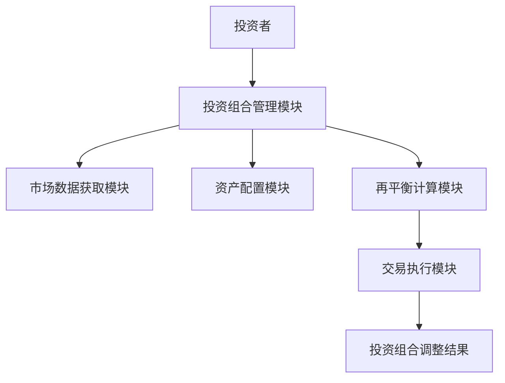
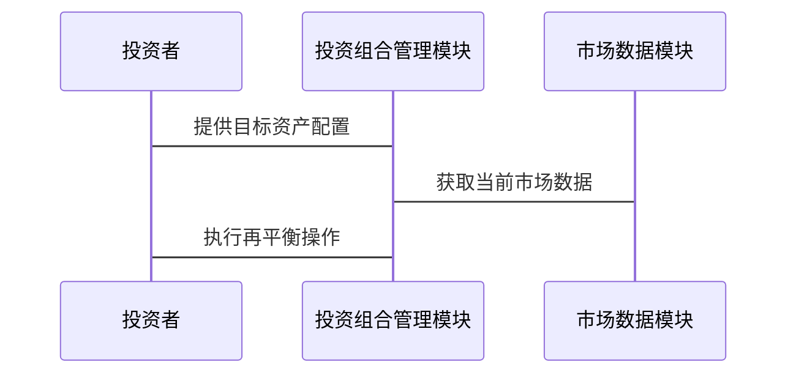

                 


# 《威廉·伯恩斯坦的投资组合再平衡技巧》

## 关键词：
- 投资组合再平衡
- 资产配置
- 现代投资组合理论（MPT）
- 风险管理
- 投资策略

## 摘要：
本文详细探讨了威廉·伯恩斯坦的投资组合再平衡技巧，从理论基础到实际应用，全面分析了再平衡在投资组合管理中的重要性。通过数学模型和算法原理的深入讲解，结合实际案例，帮助读者理解如何通过定期调整资产配置来优化投资组合，降低风险，实现长期收益目标。

---

## 第一部分: 投资组合再平衡的背景与基础

### 第1章: 投资组合再平衡的定义与重要性

#### 1.1 投资组合再平衡的定义
##### 1.1.1 投资组合再平衡的定义
投资组合再平衡是指定期调整投资组合中各资产的权重，使其符合预定的投资策略或风险目标。通过再平衡，投资者可以维持资产配置的纪律性，避免因市场波动或资产表现差异导致的投资偏离。

##### 1.1.2 再平衡的目的与意义
再平衡的主要目的是优化投资组合的风险收益比，确保资产配置符合投资者的长期目标。它还能帮助投资者避免过度集中在某一种资产或行业，从而分散风险。

##### 1.1.3 再平衡与投资组合管理的关系
再平衡是投资组合管理的核心环节之一，它是动态调整资产配置的过程，确保投资组合在不同市场环境下保持最优状态。

#### 1.2 投资组合再平衡的重要性
##### 1.2.1 风险管理的核心作用
再平衡通过调整资产权重，降低了单一资产波动对整体投资组合的影响，从而有效管理投资风险。

##### 1.2.2 再平衡在长期投资中的价值
长期投资中，市场波动和资产表现的差异会导致初始资产配置偏离预定目标，再平衡帮助投资者保持目标配置，实现长期收益。

##### 1.2.3 再平衡与市场波动的关系
市场波动越大，再平衡的必要性越高。通过定期再平衡，投资者可以避免因市场短期波动导致的过度风险暴露。

---

## 第2章: 投资组合再平衡的理论基础

### 2.1 现代投资组合理论（MPT）概述
##### 2.1.1 MPT的核心思想
MPT认为，通过合理配置不同资产，可以在相同风险水平下获得最大收益，或在相同收益水平下最小化风险。

##### 2.1.2 MPT与投资组合再平衡的关系
MPT提供了资产配置的理论基础，而再平衡则是实现这一理论的实际操作方法。

##### 2.1.3 MPT的局限性与改进方向
MPT假设市场是有效的，且资产回报服从正态分布，但在实际中可能不完全成立，因此需要结合实际情况进行调整。

### 2.2 投资组合再平衡的数学模型
##### 2.2.1 投资组合优化的数学表达
$$ \text{目标函数：} \quad \min \sigma^2 \quad \text{或} \quad \max \mu $$

##### 2.2.2 风险与收益的数学关系
$$ \sigma^2 = \sum_{i=1}^{n} \sum_{j=1}^{n} w_i w_j \sigma_{ij} $$

##### 2.2.3 再平衡策略的优化算法
通过动态规划或最优化算法，确定最优的再平衡频率和调整幅度。

---

## 第3章: 投资组合再平衡的核心概念与联系

### 3.1 投资组合再平衡的核心概念
##### 3.1.1 资产配置与再平衡的关系
资产配置是再平衡的基础，再平衡则是资产配置的动态调整过程。

##### 3.1.2 风险承受能力与再平衡策略
根据投资者的风险承受能力，制定不同的再平衡策略，如保守型、平衡型或进取型策略。

##### 3.1.3 时间因素在再平衡中的作用
再平衡的频率和时机直接影响投资组合的表现，需根据市场环境和投资目标进行调整。

### 3.2 投资组合再平衡的类型与特点
##### 3.2.1 定期再平衡与不定期再平衡
定期再平衡按固定时间间隔进行，如每季度一次；不定期再平衡则根据市场变化或资产表现进行调整。

##### 3.2.2 全部再平衡与部分再平衡
全部再平衡是指将整个投资组合重新配置到目标权重；部分再平衡仅调整偏离较大的资产。

##### 3.2.3 灵活再平衡与固定再平衡
灵活再平衡允许根据市场情况灵活调整，而固定再平衡则严格遵循预定计划。

### 3.3 投资组合再平衡的优缺点对比
##### 3.3.1 再平衡的优点
- 降低投资组合的波动风险
- 提高长期收益的稳定性
- 优化资产配置效率

##### 3.3.2 再平衡的缺点
- 再平衡可能产生交易成本和税务负担
- 频繁调整可能导致短期损失
- 需要定期监控和调整，增加了管理成本

##### 3.3.3 如何权衡再平衡的利弊
根据自身的投资目标、风险承受能力和市场环境，选择适合的再平衡策略。

---

## 第4章: 投资组合再平衡的算法原理

### 4.1 投资组合再平衡的算法步骤
##### 4.1.1 确定目标资产配置
根据投资者的风险偏好和收益目标，确定各资产的目标权重。

##### 4.1.2 计算当前资产权重
根据当前市场价值，计算各资产的实际权重。

##### 4.1.3 识别资产偏离
比较实际权重与目标权重，找出偏离较大的资产。

##### 4.1.4 执行再平衡操作
通过买卖资产，调整偏离部分，使实际权重回归目标权重。

### 4.2 投资组合再平衡的数学模型
##### 4.2.1 资产权重的计算公式
$$ w_i = \frac{v_i}{\sum_{j=1}^{n} v_j} $$

##### 4.2.2 资产偏离的计算公式
$$ d_i = w_i - t_i $$

##### 4.2.3 再平衡调整的数学表达
$$ \Delta w_i = t_i - w_i $$

### 4.3 投资组合再平衡的算法实现
##### 4.3.1 基于Python的再平衡算法实现
```python
def rebalance_portfolio(current_weights, target_weights):
    # 计算偏离
    deviations = {i: current_weights[i] - target_weights[i] for i in current_weights}
    # 执行再平衡
    for asset in deviations:
        if deviations[asset] > 0:
            # 卖出资产
            sell(asset, deviations[asset])
        else:
            # 买入资产
            buy(asset, -deviations[asset])
    return new_weights
```

##### 4.3.2 算法的优化与改进
结合市场流动性、交易成本和税务影响，优化再平衡算法。

---

## 第5章: 投资组合再平衡的系统架构与实现

### 5.1 投资组合再平衡的系统功能设计
##### 5.1.1 系统功能模块
- 数据获取与处理模块
- 资产配置模块
- 再平衡计算模块
- 交易执行模块

##### 5.1.2 系统功能流程
1. 获取市场数据和当前投资组合
2. 计算当前资产权重
3. 确定目标资产配置
4. 识别资产偏离
5. 执行再平衡操作

### 5.2 投资组合再平衡的系统架构设计
##### 5.2.1 系统架构图


##### 5.2.2 系统接口设计
- 输入接口：市场数据、当前权重、目标权重
- 输出接口：再平衡操作指令

### 5.3 投资组合再平衡的交互流程
##### 5.3.1 交互流程图


---

## 第6章: 投资组合再平衡的项目实战

### 6.1 项目环境安装与配置
##### 6.1.1 安装Python和相关库
```bash
pip install numpy pandas matplotlib
```

##### 6.1.2 数据获取与处理
使用Yahoo Finance API获取历史数据。

### 6.2 项目核心实现
##### 6.2.1 再平衡算法实现
```python
import pandas as pd
import numpy as np

def calculate_weights(portfolio_value, asset_prices):
    weights = asset_prices / asset_prices.sum()
    return weights

def execute_rebalance(current_weights, target_weights, portfolio_value):
    # 计算偏离
    deviations = current_weights - target_weights
    # 计算需要调整的金额
    adjust_amounts = deviations * (portfolio_value / 2)
    # 执行交易
    return new_weights
```

##### 6.2.2 实际案例分析
假设目标权重为60%股票、30%债券、10%现金，当前权重偏离较大时，通过再平衡调整到目标权重。

### 6.3 实际案例分析
##### 6.3.1 市场环境描述
2023年，股票市场表现不佳，债券价格上涨，导致投资组合偏离目标权重。

##### 6.3.2 再平衡策略实施
根据偏离情况，卖出债券，买入股票，调整投资组合。

##### 6.3.3 结果分析
再平衡后，投资组合的风险收益比得到优化，长期收益预期提高。

---

## 第7章: 投资组合再平衡的最佳实践

### 7.1 再平衡的关键点
##### 7.1.1 定期检查投资组合
建议每季度或半年进行一次再平衡。

##### 7.1.2 控制交易成本
尽量减少频繁交易，降低佣金和税务成本。

##### 7.1.3 考虑税务影响
在税务优惠的环境下进行再平衡，降低税务负担。

### 7.2 再平衡的注意事项
##### 7.2.1 市场波动的影响
在市场剧烈波动时，再平衡可能导致短期损失，需谨慎操作。

##### 7.2.2 交易执行的风险
确保交易执行及时准确，避免因市场变化导致的损失。

##### 7.2.3 税务影响的评估
评估再平衡对税务的影响，合理安排交易时间。

### 7.3 再平衡的拓展阅读
##### 7.3.1 推荐书籍
- 《投资学》——威廉·伯恩斯坦
- 《投资组合优化》——约翰·缪勒

##### 7.3.2 相关学术论文
- 现代投资组合理论的应用与改进

---

## 第8章: 小结与展望

### 8.1 本文总结
本文详细探讨了威廉·伯恩斯坦的投资组合再平衡技巧，从理论到实践，全面分析了再平衡的重要性和实现方法。

### 8.2 未来展望
随着市场环境的变化和科技的发展，再平衡策略将更加智能化和个性化，投资者需要不断学习和调整，以应对复杂的市场挑战。

---

## 作者信息
作者：AI天才研究院/AI Genius Institute  
联系邮箱：contact@ai-genius.com  
GitHub：https://github.com/AI-Genius-Institute  

---

感谢您的阅读！如需进一步探讨，请随时联系。

