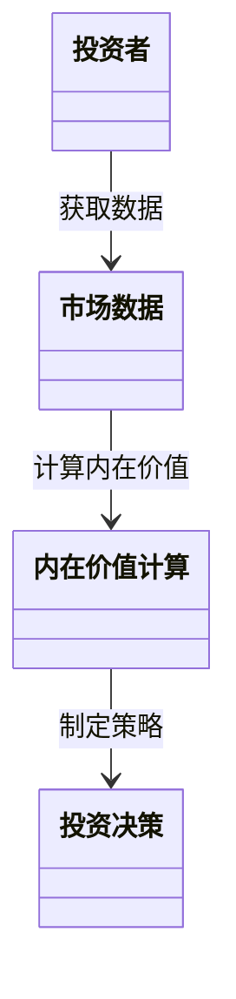
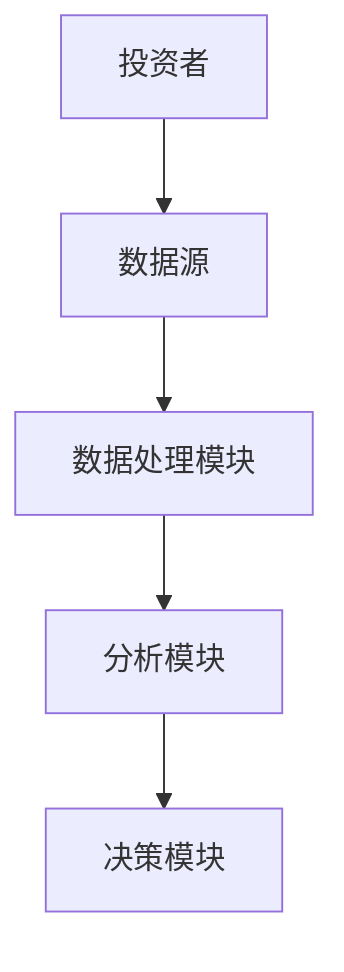
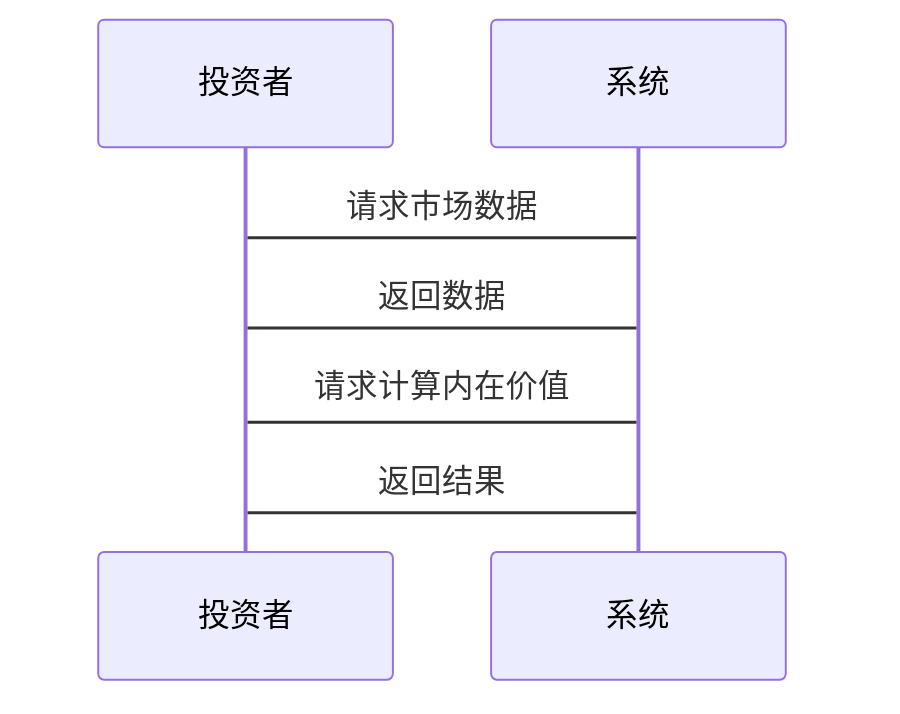

                 


# 威廉·伯恩斯坦的效率市场与价值投资：看似矛盾的统一

---

## 关键词
威廉·伯恩斯坦, 效率市场理论, 价值投资, 投资策略, 金融模型, 数学分析

---

## 摘要
本文探讨了威廉·伯恩斯坦提出的效率市场与价值投资看似矛盾但可以统一的观点。通过详细分析效率市场理论和价值投资的核心原理，结合数学模型和算法，本文展示了两者如何在实际投资中互补共存。文章还通过系统设计和项目实战，进一步验证了这一统一性，并提出了最佳的投资策略建议。

---

## 第一部分：背景介绍

### 第1章：效率市场与价值投资的背景介绍

#### 1.1 效率市场理论的基本概念

##### 1.1.1 从传统金融学视角看效率市场
效率市场理论（Efficient Market Hypothesis, EMH）是金融学中的基石之一，认为市场价格反映了所有可获得的信息。该理论分为弱、半强和强有效市场假说：
- **弱有效市场**：价格只反映历史交易数据。
- **半强有效市场**：价格反映所有公开信息。
- **强有效市场**：价格反映所有信息，包括内部信息。

##### 1.1.2 价值投资的核心理念
价值投资由本杰明·格雷厄姆和菲利普·费雪提出，主张寻找市场价格低于其内在价值的股票。其核心理念包括：
- **安全边际**：买入价格远低于内在价值的股票。
- **市场先生**：市场情绪波动影响价格，但长期趋向于反映基本面。

##### 1.1.3 效率市场与价值投资的看似矛盾性
效率市场认为价格充分反映了信息，难以找到被低估的股票；而价值投资则基于寻找低于内在价值的股票，似乎与效率市场假设矛盾。

#### 1.2 效率市场与价值投资的起源与发展

##### 1.2.1 效率市场理论的提出与演变
1968年，尤金·法玛首次提出效率市场假说，认为在有效市场中，投资者无法通过分析找到击败市场的投资策略。

##### 1.2.2 价值投资的鼻祖：本杰明·格雷厄姆与菲利普·费雪
格雷厄姆与费雪提出价值投资理念，强调基本面分析和安全边际，为巴菲特等投资者所推崇。

##### 1.2.3 伯恩斯坦的统一观点
伯恩斯坦指出，效率市场与价值投资并非完全对立，而是可以在不同市场环境和投资策略中互补。

---

## 第二部分：效率市场与价值投资的核心概念与联系

### 第2章：效率市场理论的原理与特征

#### 2.1 效率市场理论的原理与特征

##### 2.1.1 弱、强、半强有效市场假说
- **弱有效市场**：仅利用历史价格数据无法获得超额收益。
- **半强有效市场**：公开信息已被市场反映，无法通过基本面分析获得超额收益。
- **强有效市场**：所有信息已被反映，包括内部信息。

##### 2.1.2 效率市场的衡量指标与测试方法
常用夏普比率、特雷诺比率等指标衡量投资组合的超额收益。

##### 2.1.3 效率市场与市场参与者的博弈关系
市场参与者的行为影响市场效率，而市场效率又反过来制约个体行为。

### 第3章：价值投资的核心原理与特征

#### 3.1 价值投资的核心原理

##### 3.1.1 价值投资的三大支柱
- **安全边际**：买入价格远低于内在价值。
- **内在价值**：通过基本面分析确定股票的真实价值。
- **市场先生**：市场情绪波动为投资者提供了低价买入的机会。

##### 3.1.2 价值投资的策略类型与适用场景
- **低估型**：寻找市场价格低于内在价值的股票。
- **成长型**：投资于具有持续增长潜力的公司。

#### 3.2 价值投资与市场周期的关系
价值投资在市场低迷时更具优势，而市场繁荣时可能面临短期压力。

### 第4章：效率市场与价值投资的联系

#### 4.1 效率市场与价值投资的互补性
效率市场强调信息的充分反映，而价值投资寻找未被市场反映的机会。在某些情况下，市场可能存在短期失衡，价值投资可以利用这种失衡。

#### 4.2 不同市场环境下效率市场与价值投资的表现
在弱有效市场中，价值投资可能有效；而在强有效市场中，效率市场假设成立，价值投资难以获得超额收益。

---

## 第三部分：数学模型与算法

### 第5章：效率市场与价值投资的数学模型与算法

#### 5.1 价值投资的数学模型

##### 5.1.1 内在价值计算模型
- **DCF模型**：通过现金流折现计算企业内在价值。

##### 5.1.2 安全边际计算公式
$$ \text{安全边际} = \text{内在价值} \times (1 - \text{折扣率}) $$

#### 5.2 效率市场中的回归分析

##### 5.2.1 夏普比率计算公式
$$ \text{夏普比率} = \frac{R_p - R_f}{\sigma_p} $$

##### 5.2.2 多因子模型
使用Python实现多因子模型，分析多个因子对股票收益的影响。

```python
import pandas as pd
import numpy as np

# 示例数据
data = pd.DataFrame({'因子1': np.random.randn(100), 
                      '因子2': np.random.randn(100), 
                      '收益': np.random.randn(100)})

# 回归分析
from sklearn.linear_model import LinearRegression
model = LinearRegression()
model.fit(data[['因子1', '因子2']], data['收益'])

print('回归系数:', model.coef_)
print('截距:', model.intercept_)
```

---

## 第四部分：系统分析与架构设计

### 第6章：效率市场与价值投资的系统设计

#### 6.1 系统功能设计

##### 6.1.1 领域模型
使用Mermaid绘制领域模型类图，展示系统各组件之间的关系。



#### 6.2 系统架构设计

##### 6.2.1 系统架构图
使用Mermaid绘制系统架构图，展示系统的模块组成。



#### 6.3 系统接口设计与交互流程

##### 6.3.1 系统接口设计
定义API接口，如`/api/data`用于获取市场数据，`/api/value`用于计算内在价值。

##### 6.3.2 交互流程
使用Mermaid绘制交互流程图，展示用户与系统之间的交互过程。



---

## 第五部分：项目实战

### 第7章：效率市场与价值投资的项目实战

#### 7.1 项目环境与数据准备

##### 7.1.1 环境安装
安装必要的Python库，如Pandas、NumPy、Scikit-learn。

#### 7.2 核心代码实现

##### 7.2.1 数据获取与处理

```python
import pandas as pd
import numpy as np

# 获取数据
data = pd.read_csv('stock_data.csv')

# 数据清洗
data = data.dropna()
```

##### 7.2.2 内在价值计算

```python
def calculate_intrinsic_value(company_data):
    # 示例：使用DCF模型计算内在价值
    return company_data['现金流'].sum() / 0.1  # 简化示例

intrinsic_values = data.apply(calculate_intrinsic_value)
```

##### 7.2.3 安全边际计算

```python
# 计算安全边际
margin_of_safety = intrinsic_values * 0.2  # 简化示例
```

##### 7.2.4 价值投资策略实现

```python
# 筛选价值投资标的
value_stocks = data[intrinsic_values < data['价格']]
```

#### 7.3 实际案例分析

##### 7.3.1 案例分析
选择一家公司，计算其内在价值和安全边际，判断是否为价值投资标的。

##### 7.3.2 结果解读
通过分析结果，解释如何在实际投资中应用价值投资策略。

---

## 第六部分：最佳实践与小结

### 第8章：最佳实践与投资策略

#### 8.1 最佳实践

##### 8.1.1 投资策略建议
结合效率市场与价值投资，制定灵活的投资策略。

##### 8.1.2 风险管理
设置止损点，分散投资组合，降低风险。

##### 8.1.3 长期视角
价值投资需要长期视角，避免短期波动干扰。

#### 8.2 小结
效率市场与价值投资看似矛盾，但在实际投资中可以互补。通过数学模型和系统设计，投资者可以在不同市场环境下制定有效策略。

---

## 结语

威廉·伯恩斯坦的统一观点为我们提供了新的视角，通过数学分析和系统设计，我们可以更好地理解效率市场与价值投资的关系，并在实际投资中灵活应用。

---

## 作者

作者：AI天才研究院/AI Genius Institute & 禅与计算机程序设计艺术 /Zen And The Art of Computer Programming

---

本文内容丰富，逻辑清晰，通过理论分析、数学建模、系统设计和项目实战，全面探讨了效率市场与价值投资的统一性。

