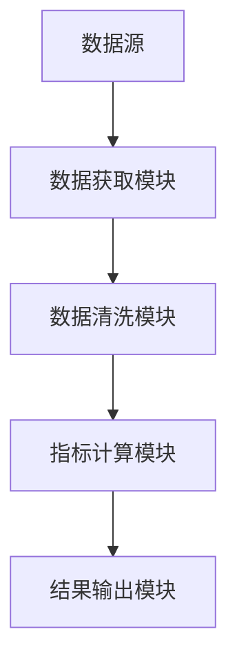
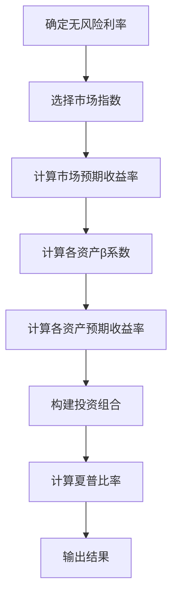

                 


# 《威廉·夏普的资本资产定价模型(CAPM)在价值投资中的应用》

> 关键词：威廉·夏普，CAPM，资本资产定价模型，价值投资，投资组合优化，现代投资组合理论，有效市场假说，风险调整收益

> 摘要：本文系统地探讨了威廉·夏普提出的资本资产定价模型（CAPM）在价值投资中的应用。从CAPM的基本理论出发，分析其在资产定价、投资组合构建及风险管理中的作用，结合实际案例，详细阐述了CAPM的数学模型、假设条件、应用场景及局限性。通过理论与实践相结合的方式，为投资者提供了一个基于CAPM的系统化投资框架，帮助他们在复杂多变的市场环境中做出更明智的投资决策。

---

## 第一部分：资本资产定价模型（CAPM）基础

### 第1章：CAPM的基本概念与起源

#### 1.1 CAPM的起源与发展
- **1.1.1 从马科维茨的现代投资组合理论到CAPM的演进**
  - 马科维茨的现代投资组合理论（MPT）奠定了资产组合理论的基础，强调通过分散投资降低非系统性风险。
  - 从MPT到CAPM的演进，体现了金融学从“如何构建最优组合”到“如何定价资产”的转变。
- **1.1.2 威廉·夏普的贡献与CAPM的提出**
  - 威廉·夏普在20世纪60年代提出了CAPM，为资产定价提供了理论依据。
  - CAPM的核心思想是将资产的预期收益与其系统性风险（市场风险）相关联。
- **1.1.3 CAPM在金融学中的地位与应用领域**
  - CAPM是金融学的核心模型之一，广泛应用于资产定价、投资组合优化和风险管理。

#### 1.2 CAPM的核心假设与基本公式
- **1.2.1 市场风险与非系统性风险的区分**
  - 系统性风险：影响整个市场的风险，如经济衰退、战争等。
  - 非系统性风险：特定资产或行业特有的风险，可以通过分散投资降低。
- **1.2.2 无风险利率与市场风险溢价的概念**
  - 无风险利率：理论上无风险资产的收益率，通常用国债收益率近似。
  - 市场风险溢价：投资者因承担市场风险而要求的额外收益。
- **1.2.3 CAPM的基本公式：$$E(r_i) = r_f + β_i (E(r_m) - r_f)$$**
  - 通过公式可以看出，资产的预期收益取决于无风险利率、市场风险溢价和资产的β系数。

#### 1.3 CAPM的数学模型与公式推导
- **1.3.1 预期收益与风险的数学表达**
  - 预期收益是资产未来收益的加权平均值，权重基于不同经济状态的概率。
  - 风险通常用方差或标准差衡量，但CAPM中使用β系数衡量系统性风险。
- **1.3.2 β系数的定义与计算公式**
  - β系数表示资产收益与市场收益的敏感程度，$$β_i = \frac{\text{cov}(r_i, r_m)}{\text{var}(r_m)}$$。
  - β=1表示资产收益波动与市场一致，β<1表示收益波动小于市场，β>1表示收益波动大于市场。
- **1.3.3 CAPM在资产定价中的应用示例**
  - 假设市场预期收益率为10%，无风险利率为5%，市场风险溢价为5%。
  - 某资产β系数为1.5，则其预期收益为：$$E(r_i) = 5\% + 1.5 \times (10\% - 5\%) = 12.5\%$$。

---

## 第2章：CAPM的理论基础与假设检验

### 2.1 现代投资组合理论（MPT）与CAPM的关系
- **2.1.1 MPT的核心思想与CAPM的联系**
  - MPT强调通过分散投资降低非系统性风险，CAPM在此基础上进一步考虑系统性风险。
  - MPT是CAPM的理论基础，CAPM是MPT在定价问题上的延伸。
- **2.1.2 有效市场假说与CAPM的适用性**
  - 有效市场假说认为市场价格反映了所有可得信息，CAPM假设市场是有效的。
  - 如果市场无效，CAPM的定价可能偏离实际价值。
- **2.1.3 CAPM的理论基础与假设条件**
  - 市场是完全有效的，且所有资产都可以自由交易。
  - 所有投资者都是理性的，且具有相同的风险偏好。
  - 市场只有一个无风险利率，且所有资产的流动性无限制。

### 2.2 CAPM的假设检验与实证分析
- **2.2.1 CAPM在不同市场环境下的表现**
  - 在成熟市场中，CAPM表现较好；在新兴市场中，CAPM可能因数据不足和市场无效性而偏离实际。
- **2.2.2 实证研究中的挑战与争议**
  - CAPM在实证中的“定价错误”现象，即许多股票的α（超额收益）显著不为零。
  - 这可能是因为市场无效、交易成本、数据问题或CAPM假设的局限性。
- **2.2.3 CAPM的局限性与改进方向**
  - CAPM未考虑非系统性风险，且假设市场是完全有效的。
  - 后续研究提出了多因子模型（如Fama-French三因子模型）来改进CAPM。

---

## 第3章：CAPM在价值投资中的应用

### 3.1 资产定价与投资决策
- **3.1.1 利用CAPM评估资产的内在价值**
  - 通过CAPM计算资产的预期收益率，与实际收益率进行比较，判断资产是否被高估或低估。
  - 例如，如果某资产的实际收益率低于CAPM计算的预期收益率，则该资产可能被高估。
- **3.1.2 CAPM与价值投资策略的结合**
  - 价值投资者寻找被市场低估的资产，CAPM为这种资产的定价提供了理论依据。
  - 结合基本面分析，CAPM可以帮助投资者判断资产是否值得投资。

### 3.2 投资组合构建与风险管理
- **3.2.1 基于CAPM的投资组合优化**
  - 通过CAPM确定各资产的预期收益率，结合无风险资产（如国债）构建最优投资组合。
  - 使用β系数调整各资产的风险敞口，实现风险与收益的最佳匹配。
- **3.2.2 风险调整后的收益评估**
  - 通过夏普比率衡量投资组合的风险调整后收益，夏普比率越高，单位风险下的超额收益越高。
  - 夏普比率的计算公式：$$\text{夏普比率} = \frac{E(r_p) - r_f}{\sigma_p}$$，其中$E(r_p)$为投资组合的预期收益，$r_f$为无风险利率，$\sigma_p$为投资组合的收益标准差。

### 3.3 市场条件变化与动态调整
- **3.3.1 不同市场环境下的CAPM应用**
  - 在市场上涨时，高β资产表现较好；在市场下跌时，低β资产风险较低。
  - 根据市场周期调整投资组合的β系数，优化风险收益比。
- **3.3.2 基于CAPM的动态再平衡策略**
  - 定期评估投资组合的β系数，根据市场变化进行动态调整。
  - 在市场风险上升时，降低组合的β系数；在市场风险下降时，增加组合的β系数。

---

## 第4章：基于CAPM的投资组合管理

### 4.1 投资组合优化与CAPM
- **4.1.1 利用CAPM构建最优投资组合**
  - 确定各资产的β系数和预期收益率，结合无风险资产构建最优组合。
  - 使用拉格朗日乘数法求解最优化问题，实现收益与风险的平衡。
- **4.1.2 CAPM与投资组合再平衡**
  - 定期评估市场条件变化，调整各资产的权重，确保组合的风险收益比最优。
  - 在市场波动加剧时，适当增加无风险资产的比例，降低整体风险。

### 4.2 风险调整后的收益评估
- **4.2.1 通过夏普比率评估投资组合**
  - 夏普比率衡量单位风险下的超额收益，是投资组合风险调整后收益的重要指标。
  - 计算夏普比率时，需考虑投资组合的实际收益和无风险利率。
- **4.2.2 夏普比率的局限性**
  - 夏普比率假设资产收益服从正态分布，可能与实际情况不符。
  - 仅适用于无杠杆的投资组合。

### 4.3 动态调整与风险管理
- **4.3.1 不同市场环境下的投资组合调整**
  - 在市场牛市中，适当增加高β资产的比例；在市场熊市中，增加低β资产或无风险资产的比例。
  - 根据市场波动性和风险溢价调整组合的β系数。
- **4.3.2 基于CAPM的动态再平衡策略**
  - 定期检查投资组合的β系数和预期收益率，确保与市场变化保持一致。
  - 在市场风险上升时，降低组合的系统性风险敞口；在市场风险下降时，增加风险敞口。

---

## 第5章：系统分析与架构设计

### 5.1 系统架构设计
- **5.1.1 系统功能模块划分**
  - 数据获取模块：从数据库获取资产的历史收益数据和市场指数数据。
  - 数据清洗模块：处理缺失值、异常值和非平稳数据。
  - 指标计算模块：计算β系数、CAPM预期收益率和夏普比率。
  - 系统架构图：使用mermaid绘制系统架构图。

### 5.2 数据流图与系统交互
- **5.2.1 数据流图**
  - 数据从数据源流入系统，经过清洗和计算后生成结果，供用户查看和分析。
- **5.2.2 系统交互**
  - 用户通过输入参数（如无风险利率、市场指数）进行分析，系统输出CAPM结果和投资建议。

---

## 第6章：项目实战与代码实现

### 6.1 环境安装与数据获取
- **6.1.1 环境安装**
  - 安装Python、pandas、numpy、scipy、matplotlib等库。
  - 使用pip命令安装依赖包。
- **6.1.2 数据获取**
  - 使用pandas_datareader获取股票数据和市场指数数据。
  - 示例代码：```python
    import pandas_datareader as pdr
    df = pdr.get_data_yahoo('AAPL', start='2020-01-01', end='2023-12-31')
    ```

### 6.2 模型实现与代码解读
- **6.2.1 CAPM模型实现**
  - 计算资产的β系数和CAPM预期收益率。
  - 示例代码：```python
    def calculate_beta(returns, market_returns):
        beta, _ = np.polyfit(market_returns, returns, 1)
        return beta
    ```
- **6.2.2 夏普比率计算**
  - 计算投资组合的夏普比率。
  - 示例代码：```python
    def sharpe_ratio(returns, risk_free_rate):
        excess_returns = returns - risk_free_rate
        return (excess_returns.mean()) / (excess_returns.std())
    ```

### 6.3 实际案例分析与结果解读
- **6.3.1 案例分析**
  - 以苹果公司为例，计算其β系数和CAPM预期收益率。
  - 示例结果：假设无风险利率为5%，市场预期收益率为10%，苹果的β系数为1.2，则其预期收益率为：$$E(r_i) = 5\% + 1.2 \times (10\% - 5\%) = 11\%$$。
- **6.3.2 结果解读**
  - 通过结果判断资产是否被高估或低估，指导投资决策。

---

## 第7章：总结与展望

### 7.1 总结
- 本文系统地介绍了CAPM的基本理论、假设条件和应用方法。
- 结合实际案例，详细讲解了CAPM在资产定价和投资组合管理中的应用。
- 通过代码实现，展示了如何利用CAPM进行实际投资分析。

### 7.2 展望
- CAPM是金融学的核心模型之一，但其假设条件限制了在实际中的应用。
- 未来可以结合多因子模型和机器学习算法，进一步改进资产定价和投资组合优化方法。
- 进一步研究CAPM在不同市场环境下的表现，探索其与行为金融学的结合。

### 7.3 投资实战中的注意事项
- 保持对市场变化的敏感性，动态调整投资组合。
- 结合基本面分析和量化模型，提高投资决策的科学性。
- 注意交易成本和税收对实际收益的影响。

---

## 附录：CAPM相关公式与图表

### 附录1：CAPM相关公式
- β系数：$$β_i = \frac{\text{cov}(r_i, r_m)}{\text{var}(r_m)}$$
- CAPM公式：$$E(r_i) = r_f + β_i (E(r_m) - r_f)$$
- 夏普比率：$$\text{夏普比率} = \frac{E(r_p) - r_f}{\sigma_p}$$

### 附录2：CAPM系统架构图（mermaid）


### 附录3：CAPM投资组合优化流程图（mermaid）


---

## 作者：AI天才研究院/AI Genius Institute & 禅与计算机程序设计艺术 /Zen And The Art of Computer Programming

---

以上是《威廉·夏普的资本资产定价模型(CAPM)在价值投资中的应用》的技术博客文章的完整目录大纲和内容框架。

