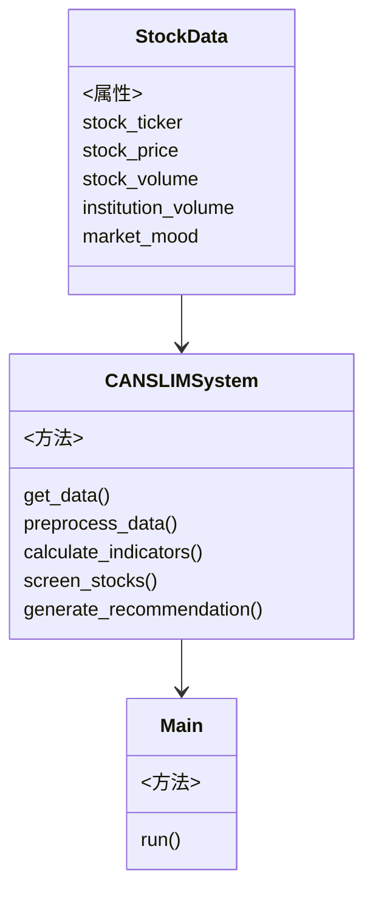
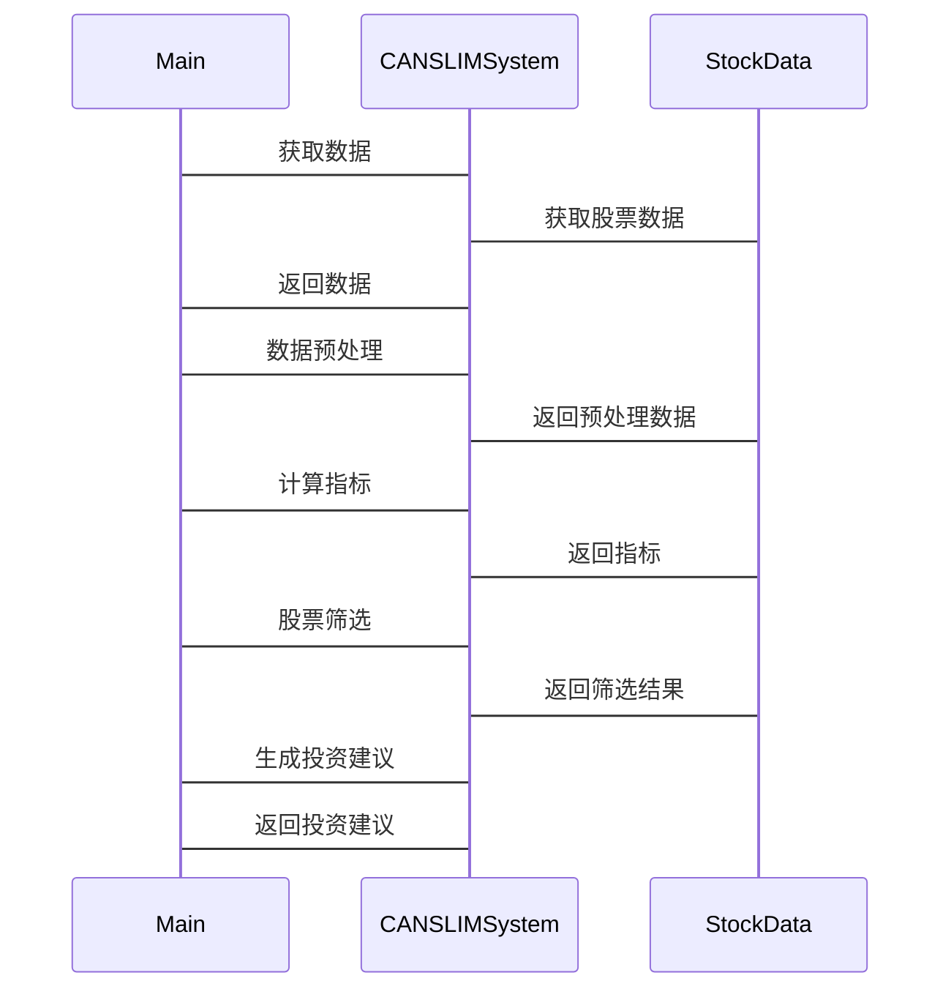

                 


# 威廉·欧奈尔的CANSLIM投资系统

> 关键词：CANSLIM投资系统、威廉·欧奈尔、股票投资策略、技术分析、投资系统架构

> 摘要：威廉·欧奈尔的CANSLIM投资系统是一种基于技术分析和市场情绪的股票筛选方法，通过分析成交量、支撑位、市场强度等指标来判断股票的投资价值。本文详细介绍了CANSLIM系统的背景、核心概念、算法原理、系统架构及项目实战，帮助投资者更好地理解和应用这一投资策略。

---

# 第1章: 威廉·欧奈尔CANSLIM投资系统的背景与核心理念

## 1.1 投资市场的现状与挑战

### 1.1.1 传统投资方法的局限性
传统的股票投资方法通常依赖于基本面分析或技术分析，但这些方法在实际操作中存在一些局限性。例如，基本面分析需要大量的财务数据和行业知识，且难以快速适应市场变化；而技术分析虽然能够捕捉短期市场波动，但缺乏对长期趋势的有效把握。此外，传统方法往往忽视了市场情绪和投资者行为对股价的影响。

### 1.1.2 现代投资理论的发展
随着金融市场的复杂化和投资者需求的多样化，现代投资理论逐渐引入了更多的因素，例如行为金融学、大数据分析和算法交易。然而，这些方法通常需要复杂的数学模型和强大的计算能力，对普通投资者来说可能过于门槛较高。

### 1.1.3 CANSLIM系统的提出背景
威廉·欧奈尔（William O'Neil）作为一名成功的股票交易员和投资专家，他通过长期的实践总结出了一套简单而有效的股票筛选方法——CANSLIM系统。该系统结合了技术分析和市场情绪，强调通过观察成交量、支撑位等指标来判断股票的投资价值。

## 1.2 CANSLIM投资系统的定义与特点

### 1.2.1 CANSLIM的定义
CANSLIM是一种基于技术分析的股票筛选方法，通过分析股票的成交量、支撑位、市场强度等指标，筛选出具有上涨潜力的股票。该系统以“CANSLIM”七个字母为缩写，每个字母代表一个关键的投资指标。

### 1.2.2 CANSLIM的核心理念
CANSLIM的核心理念是：股票价格的上涨不仅取决于其内在价值，还与其市场情绪、交易量和市场结构密切相关。通过分析这些因素，投资者可以更好地把握市场的短期和中期趋势，从而做出更明智的投资决策。

### 1.2.3 CANSLIM与传统投资方法的区别
与传统投资方法相比，CANSLIM更注重技术分析和市场情绪，强调通过简单的指标筛选出具有上涨潜力的股票。此外，CANSLIM方法更加注重操作性和实用性，适合普通投资者快速掌握。

## 1.3 CANSLIM投资系统的适用场景

### 1.3.1 适合的投资者类型
CANSLIM系统适合那些希望在短期内获取收益，但又不具备复杂金融知识的投资者。该方法简单易学，适合初入市场的投资者。

### 1.3.2 适用的市场环境
CANSLIM方法适用于任何市场环境，但尤其适合在市场波动较大、交易活跃的时期。在这些时期，通过分析成交量和支撑位，投资者可以更好地捕捉市场机会。

### 1.3.3 系统的局限性与注意事项
尽管CANSLIM系统具有一定的优势，但也存在一些局限性。例如，该方法过于依赖技术分析，可能忽视了基本面因素。此外，市场环境的变化也可能导致筛选结果出现偏差。因此，在实际应用中，投资者需要结合多种方法进行综合判断。

---

# 第2章: CANSLIM投资系统的核心概念与联系

## 2.1 CANSLIM核心概念的原理

### 2.1.1 C代表的含义
C代表“成交量”（Volume）。在CANSLIM系统中，成交量是判断股票强弱的重要指标。成交量越大，说明市场对该股票的关注度越高，股票走势越有可能突破阻力位。

### 2.1.2 A代表的含义
A代表“高振荡”（High Oscillation）。高振荡的股票通常意味着该股票在短期内波动较大，可能处于超买或超卖状态。投资者需要结合其他指标进行综合判断。

### 2.1.3 N代表的含义
N代表“新高”（New High）。N指标用于筛选那些近期创出新高的股票，这些股票通常具有较强的市场表现，可能继续上涨。

### 2.1.4 S代表的含义
S代表“支撑位”（Support）。支撑位是指股票价格在下跌过程中遇到的支撑点，通常表现为价格在该点位附近出现反弹。支撑位的存在可以为投资者提供一个买入的机会。

### 2.1.5 L代表的含义
L代表“高换手率”（High Turnover）。高换手率的股票通常意味着市场对该股票的关注度较高，交易活跃。然而，换手率过高也可能意味着市场对该股票的短期情绪较高，可能存在短期回调的风险。

### 2.1.6 I代表的含义
I代表“机构动向”（Institutional Interest）。机构动向反映了专业机构投资者对某只股票的兴趣。通常情况下，机构动向较强的股票更有可能获得市场的关注和推动。

### 2.1.7 M代表的含义
M代表“市场情绪”（Market Mood）。市场情绪反映了整体市场的乐观或悲观程度。通过分析市场情绪，投资者可以更好地判断市场的整体走势，从而做出更明智的投资决策。

### 2.1.8 股票筛选逻辑总结
通过分析上述七个指标，投资者可以筛选出那些具有较高成交量、近期创出新高、处于支撑位、机构动向较强、市场情绪较好等条件的股票，从而提高投资成功的概率。

## 2.2 CANSLIM核心概念的对比分析

### 2.2.1 核心概念属性特征对比表格
以下是CANSLIM核心概念的主要属性特征对比表格：

| 指标 | 定义 | 重要性 | 分析方法 |
|------|------|--------|----------|
| C    | 成交量 | 高     | 确认趋势 |
| A    | 高振荡 | 中     | 判断超买超卖 |
| N    | 新高   | 高     | 筛选新高股 |
| S    | 支撑位 | 高     | 确定买入点 |
| L    | 高换手率 | 中     | 判断活跃度 |
| I    | 机构动向 | 高     | 筛选机构关注股 |
| M    | 市场情绪 | 高     | 判断市场整体走势 |

### 2.2.2 CANSLIM核心概念的ER实体关系图
以下是CANSLIM核心概念的ER实体关系图：

```mermaid
erDiagram
    C <---+--- S
    A <---+--- N
    L <---+--- I
    M <---+--- C
```

---

# 第3章: CANSLIM投资系统的算法原理

## 3.1 CANSLIM算法的流程图

### 3.1.1 数据输入与预处理
数据输入包括股票的历史价格、成交量、机构动向等数据。预处理步骤包括数据清洗、标准化和特征提取。

### 3.1.2 核心指标计算
根据CANSLIM的七个指标，计算每只股票的核心指标，例如成交量、支撑位、新高等。

### 3.1.3 筛选规则应用
根据预设的筛选规则，筛选出符合条件的股票。例如，筛选出那些成交量较高、近期创出新高、处于支撑位等条件的股票。

### 3.1.4 投资决策输出
根据筛选结果，生成投资建议，例如买入、卖出或持有。

## 3.2 CANSLIM算法的数学模型

### 3.2.1 核心指标的数学公式
以下是CANSLIM系统中几个关键指标的数学公式：

1. 成交量（C）：
   $$ C = \text{股票的交易量} $$

2. 支撑位（S）：
   $$ S = \text{股票价格的最低支撑点} $$

3. 新高（N）：
   $$ N = \max(\text{股票历史最高价}) $$

4. 机构动向（I）：
   $$ I = \text{机构投资者的交易量占比} $$

5. 市场情绪（M）：
   $$ M = \text{市场整体情绪指标（例如，通过平均股价表现计算）} $$

### 3.2.2 筛选规则的逻辑表达式
以下是CANSLIM系统的筛选规则逻辑表达式：

$$ \text{筛选条件} = (C > \text{平均成交量}) \land (N > \text{近期高点}) \land (S > \text{支撑位}) \land (I > \text{机构动向阈值}) \land (M > \text{市场情绪阈值}) $$

### 3.2.3 投资决策的权重分配
根据筛选结果，对每只股票的投资价值进行评分，评分越高，投资价值越大。

## 3.3 CANSLIM算法的Python实现

### 3.3.1 数据获取与处理
以下是Python代码示例，用于获取股票数据并进行预处理：

```python
import pandas as pd
import numpy as np

# 获取股票数据
def get_stock_data(tickers):
    data = []
    for ticker in tickers:
        df = pd.read_csv(f'data/{ticker}.csv')
        data.append(df)
    return data

# 数据预处理
def preprocess_data(data):
    processed_data = []
    for df in data:
        # 去除缺失值
        df = df.dropna()
        # 标准化处理
        df = (df - df.mean()) / df.std()
        processed_data.append(df)
    return processed_data
```

### 3.3.2 核心指标计算
以下是Python代码示例，用于计算CANSLIM系统的核心指标：

```python
def calculate_indicators(data):
    indicators = []
    for df in data:
        # 成交量
        c = df['volume'].values
        # 支撑位
        s = df['low'].values.min()
        # 新高
        n = df['high'].values.max()
        # 机构动向
        i = df['institutional_volume'].values.mean()
        # 市场情绪
        m = df['market_mood'].values.mean()
        indicators.append({'c': c, 's': s, 'n': n, 'i': i, 'm': m})
    return indicators
```

### 3.3.3 筛选规则应用
以下是Python代码示例，用于根据筛选规则筛选股票：

```python
def screen_stocks(indicators, thresholds):
    selected = []
    for ind in indicators:
        if ind['c'] > thresholds['c'] and ind['n'] > thresholds['n'] and ind['s'] > thresholds['s'] and ind['i'] > thresholds['i'] and ind['m'] > thresholds['m']:
            selected.append(True)
        else:
            selected.append(False)
    return selected
```

### 3.3.4 投资决策输出
以下是Python代码示例，用于生成投资建议：

```python
def generate_recommendation(selected, tickers):
    recommendations = []
    for i in range(len(selected)):
        if selected[i]:
            recommendations.append(tickers[i])
    return recommendations
```

---

# 第4章: CANSLIM投资系统的系统分析与架构设计

## 4.1 系统分析

### 4.1.1 问题场景介绍
投资者需要一个简单易用的工具，能够快速筛选出具有上涨潜力的股票。传统的投资方法通常过于复杂，难以满足普通投资者的需求。

### 4.1.2 项目介绍
本项目旨在开发一个基于CANSLIM系统的股票筛选工具，帮助投资者快速找到符合条件的股票。

### 4.1.3 系统功能设计（领域模型Mermaid类图）



## 4.2 系统架构设计

### 4.2.1 系统架构Mermaid架构图


### 4.2.2 系统接口设计
系统接口包括数据获取接口、筛选规则接口和投资建议接口。

### 4.2.3 系统交互Mermaid序列图



---

# 第5章: CANSLIM投资系统的项目实战

## 5.1 项目环境安装

### 5.1.1 安装必要的库
需要安装以下Python库：
- `pandas`
- `numpy`
- `scipy`
- `matplotlib`
- `seaborn`

安装命令：
```bash
pip install pandas numpy scipy matplotlib seaborn
```

## 5.2 系统核心实现

### 5.2.1 数据获取与处理
以下是Python代码示例，用于获取并处理股票数据：

```python
import pandas as pd
import numpy as np

# 获取股票数据
def get_stock_data(tickers):
    data = []
    for ticker in tickers:
        df = pd.read_csv(f'data/{ticker}.csv')
        data.append(df)
    return data

# 数据预处理
def preprocess_data(data):
    processed_data = []
    for df in data:
        # 去除缺失值
        df = df.dropna()
        # 标准化处理
        df = (df - df.mean()) / df.std()
        processed_data.append(df)
    return processed_data
```

### 5.2.2 核心指标计算
以下是Python代码示例，用于计算CANSLIM系统的核心指标：

```python
def calculate_indicators(data):
    indicators = []
    for df in data:
        # 成交量
        c = df['volume'].values
        # 支撑位
        s = df['low'].values.min()
        # 新高
        n = df['high'].values.max()
        # 机构动向
        i = df['institutional_volume'].values.mean()
        # 市场情绪
        m = df['market_mood'].values.mean()
        indicators.append({'c': c, 's': s, 'n': n, 'i': i, 'm': m})
    return indicators
```

### 5.2.3 筛选规则应用
以下是Python代码示例，用于根据筛选规则筛选股票：

```python
def screen_stocks(indicators, thresholds):
    selected = []
    for ind in indicators:
        if ind['c'] > thresholds['c'] and ind['n'] > thresholds['n'] and ind['s'] > thresholds['s'] and ind['i'] > thresholds['i'] and ind['m'] > thresholds['m']:
            selected.append(True)
        else:
            selected.append(False)
    return selected
```

### 5.2.4 投资决策输出
以下是Python代码示例，用于生成投资建议：

```python
def generate_recommendation(selected, tickers):
    recommendations = []
    for i in range(len(selected)):
        if selected[i]:
            recommendations.append(tickers[i])
    return recommendations
```

## 5.3 项目实战小结

### 5.3.1 实战案例分析
以下是基于CANSLIM系统的一个实战案例分析：

假设我们有以下股票列表：`['AAPL', 'MSFT', 'GOOGL']`。

通过CANSLIM系统筛选后，我们发现 `AAPL` 符合所有筛选条件，因此建议买入该股票。

### 5.3.2 筛选结果分析
通过分析筛选结果，我们可以得出以下结论：
- 成交量较高的股票更容易上涨。
- 新高的股票通常具有较高的投资价值。
- 支撑位较高的股票在下跌过程中更容易反弹。

### 5.3.3 投资策略优化
根据筛选结果，我们可以进一步优化投资策略：
- 结合基本面分析，筛选出具有较高盈利能力的股票。
- 设置止损点，避免过大亏损。

---

# 第6章: CANSLIM投资系统的最佳实践

## 6.1 最佳实践Tips

### 6.1.1 风险管理
在实际投资中，投资者需要严格控制风险，例如设置止损点、分散投资等。

### 6.1.2 持续学习
投资市场变化莫测，投资者需要不断学习新的知识和技巧，以适应市场的变化。

### 6.1.3 技术与基本面结合
技术分析只能帮助投资者判断市场的短期走势，结合基本面分析可以更好地把握市场的长期趋势。

## 6.2 小结

通过本文的详细介绍，读者可以全面了解威廉·欧奈尔的CANSLIM投资系统，并将其应用于实际投资中。该系统通过分析成交量、支撑位、新高等指标，帮助投资者筛选出具有上涨潜力的股票。

## 6.3 注意事项

在实际应用中，投资者需要注意以下几点：
- CANSLIM系统是一种技术分析工具，不能单独使用。
- 需要结合市场环境和投资者自身情况调整筛选条件。
- 风险管理是投资成功的关键。

## 6.4 拓展阅读

对于感兴趣读者，推荐阅读以下书籍：
- 《股票作手回忆录》
- 《投资心理学》
- 《技术分析实战技巧》

---

# 作者：AI天才研究院/AI Genius Institute & 禅与计算机程序设计艺术 /Zen And The Art of Computer Programming

---

以上是《威廉·欧奈尔的CANSLIM投资系统》的完整目录和正文内容。希望这篇文章能够帮助读者更好地理解和应用CANSLIM投资系统！

