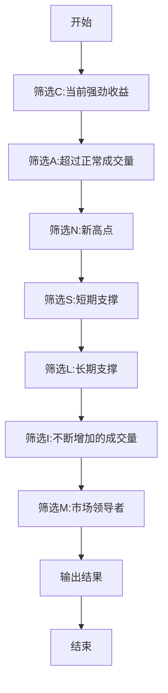
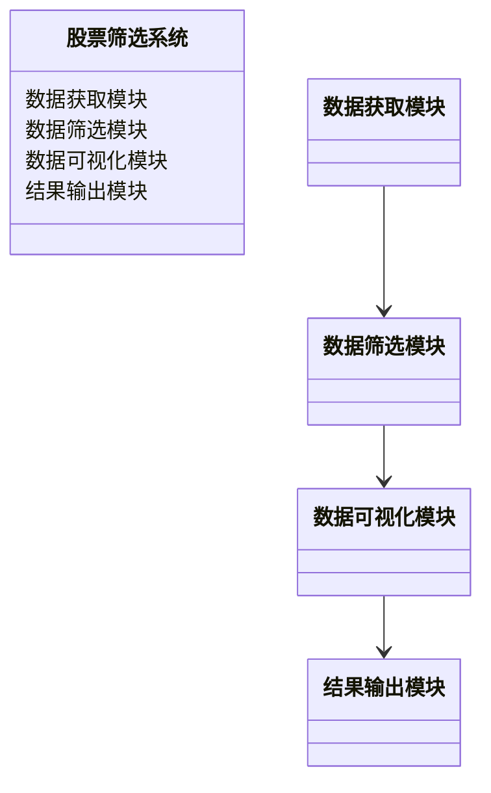
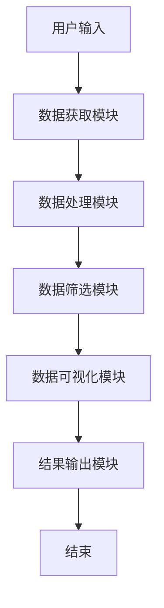
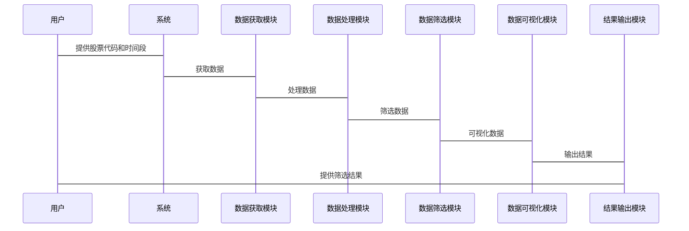

                 


# 威廉·欧奈尔的CANSLIM选股系统

## 关键词：
- 威廉·欧奈尔
- CANSLIM选股系统
- 股票投资
- 股票筛选
-抽离

## 摘要：
CANSLIM是一种由威廉·欧奈尔提出的选股系统，旨在通过分析多个关键指标来识别具有成长潜力的股票。本文将详细探讨CANSLIM的核心概念、算法原理、数学模型以及在实际投资中的应用。通过分析每个指标的含义、相互关系以及筛选逻辑，读者将能够理解如何利用CANSLIM系统来做出更明智的投资决策。

---

# 第一部分: CANSLIM选股系统的背景与核心理念

## 第1章: CANSLIM选股系统的起源与发展

### 1.1 什么是CANSLIM选股系统
- **1.1.1 CANSLIM概念的提出**  
  - 威廉·欧奈尔的选股理念  
  - CANSLIM概念的提出背景  
  - CANSLIM的核心思想：寻找具有强劲收益、高成交量和市场领导地位的股票  

- **1.1.2 威廉·欧奈尔的选股理念**  
  - 基于技术分析和基本面分析的结合  
  - 强调市场趋势和龙头股的重要性  
  - CANSLIM的核心目标：筛选出具有成长潜力和市场优势的股票  

- **1.1.3 CANSLIM在投资领域的应用**  
  - 投资者如何利用CANSLIM进行选股  
  - CANSLIM在不同市场环境下的表现  
  - CANSLIM与其他选股方法的对比  

### 1.2 CANSLIM与其他选股方法的对比
- **1.2.1 常见选股方法概述**  
  - 基于市盈率的选股方法  
  - 基于股息率的选股方法  
  - 基于技术分析的选股方法  

- **1.2.2 CANSLIM的独特之处**  
  - 多指标综合分析的优势  
  - 强调市场领导地位和成交量的重要性  
  - 量化筛选逻辑的科学性  

- **1.2.3 CANSLIM的优缺点分析**  
  - 优点：逻辑清晰，易于操作，适合技术分析者  
  - 缺点：需要结合市场环境进行调整，对新手投资者有一定门槛  

### 1.3 本章小结
- 通过本章的介绍，读者可以了解CANSLIM选股系统的背景、核心理念以及与其它选股方法的对比，为后续的深入分析奠定基础。

---

# 第二部分: CANSLIM选股系统的核心要素与逻辑

## 第2章: CANSLIM选股模型的核心要素

### 2.1 CANSLIM模型的七个要素
- **C: Current Strong Earnings（当前强劲的收益）**  
  - 定义：公司最近的收益表现强劲，且高于行业平均水平  
  - 属性：数值型，重要性高  
  - 示例：某公司最近季度的收益同比增长率为15%，高于行业平均的8%  

- **A: Above Normal Volume（超过正常的成交量）**  
  - 定义：股票成交量超过过去50天的平均成交量，表明市场关注度高  
  - 属性：数值型，重要性中  
  - 示例：某股票过去50天的日均成交量为1000手，今日成交量为1500手  

- **N: New High（新高点）**  
  - 定义：股价创出近期新高，表明市场情绪积极  
  - 属性：状态型，重要性高  
  - 示例：某股票在最近的交易中达到了过去一年的最高价格  

- **S: Short-Term Support（短期支撑）**  
  - 定义：股价在近期价格支撑位附近，表明有买盘支撑  
  - 属性：状态型，重要性中  
  - 示例：某股票股价在10日均线附近获得支撑  

- **L: Long-Term Support（长期支撑）**  
  - 定义：股价在长期价格支撑位附近，表明长期投资者支持  
  - 属性：状态型，重要性高  
  - 示例：某股票股价在200日均线附近获得支撑  

- **I: Increasing Volume（不断增加的成交量）**  
  - 定义：随着股价上涨，成交量持续增加，表明市场信心增强  
  - 属性：数值型，重要性中  
  - 示例：某股票在股价上涨过程中，成交量从1000手增加到2000手  

- **M: Market Leader（市场领导者）**  
  - 定义：公司在行业内具有领导地位，且市场份额领先  
  - 属性：状态型，重要性高  
  - 示例：某公司在行业内排名第一，市场份额超过30%  

### 2.2 各要素的属性对比
| 要素 | 属性 | 描述 | 重要性 | 评分标准 |
|------|------|------|--------|----------|
| C    | 数值型 | 收益率增长情况 | 高 | 基于行业基准线 |
| A    | 数值型 | 成交量大小 | 中 | 成交量排名 |
| N    | 状态型 | 是否创历史新高 | 高 | 是否满足新高点 |
| S    | 状态型 | 是否有支撑位 | 中 | 支撑位确认 |
| L    | 状态型 | 是否有长期支撑 | 高 | 支撑位确认 |
| I    | 数值型 | 成交量增长情况 | 中 | 成交量增长趋势 |
| M    | 状态型 | 是否为行业龙头 | 高 | 市场地位 |

### 2.3 本章小结
- 通过本章的介绍，读者可以清晰地理解CANSLIM模型的七个核心要素及其属性，为后续的筛选逻辑分析奠定基础。

---

# 第三部分: CANSLIM选股系统的算法原理与实现

## 第3章: CANSLIM选股算法的原理与流程

### 3.1 CANSLIM选股算法的概述
- **算法目标**：通过综合分析七个要素，筛选出符合条件的股票  
- **算法输入**：股票列表、历史价格数据、成交量数据、财务数据  
- **算法输出**：满足CANSLIM条件的股票列表  

### 3.2 CANSLIM选股算法的流程图


### 3.3 CANSLIM选股算法的数学模型
- **相对强度指数（RSI）**：用于衡量股价的强弱程度  
  $$ RSI = \frac{100}{1 + \frac{N - S}{S}} $$
  其中，N为上涨天数，S为下跌天数  

- **相对强度（RS）**：用于比较股票与市场指数的表现  
  $$ RS = \frac{股票收益率}{市场收益率} $$  

### 3.4 CANSLIM选股算法的Python实现
```python
import pandas as pd
import numpy as np

# 示例数据：假设data为包含股票信息的DataFrame
# 列包括：'C', 'A', 'N', 'S', 'L', 'I', 'M'

def can_slim_screen(data):
    # 筛选C: 当前强劲收益，假设'C'列是收益增长率
    data = data[data['C'] > data['C'].mean()]
    
    # 筛选A: 成交量超过正常水平，假设'A'列是成交量排名
    data = data[data['A'] > data['A'].quantile(0.75)]
    
    # 筛选N: 新高点，假设'N'列是布尔值（True表示新高点）
    data = data[data['N'] == True]
    
    # 筛选S: 短期支撑，假设'S'列是布尔值（True表示有支撑）
    data = data[data['S'] == True]
    
    # 筛选L: 长期支撑，假设'L'列是布尔值（True表示有支撑）
    data = data[data['L'] == True]
    
    # 筛选I: 成交量增长，假设'I'列是成交量增长排名
    data = data[data['I'] > data['I'].quantile(0.75)]
    
    # 筛选M: 市场领导者，假设'M'列是市场地位排名
    data = data[data['M'] < data['M'].quantile(0.25)]
    
    return data

# 示例使用
stock_data = pd.read_csv('stock_data.csv')
selected_stocks = can_slim_screen(stock_data)
print(selected_stocks)
```

### 3.5 本章小结
- 通过本章的分析，读者可以了解CANSLIM选股算法的流程、数学模型以及Python实现，为实际应用提供参考。

---

# 第四部分: CANSLIM选股系统的系统分析与架构设计

## 第4章: 基于CANSLIM的选股系统架构

### 4.1 系统背景与目标
- **系统目标**：开发一个基于CANSLIM模型的选股系统，帮助投资者筛选出符合条件的股票  
- **系统范围**：涵盖数据获取、筛选、可视化和结果输出等功能  

### 4.2 系统功能设计


### 4.3 系统架构设计


### 4.4 系统接口设计
- **输入接口**：股票代码、时间段、数据源  
- **输出接口**：筛选结果、可视化图表、筛选报告  

### 4.5 系统交互流程


### 4.6 本章小结
- 通过本章的分析，读者可以了解基于CANSLIM的选股系统的架构设计和实现流程，为后续的项目实战提供指导。

---

# 第五部分: CANSLIM选股系统的项目实战

## 第5章: 基于CANSLIM的选股系统实战

### 5.1 环境安装与配置
- **安装依赖**：Python、pandas、numpy、matplotlib、 seaborn  
  ```bash
  pip install pandas numpy matplotlib seaborn
  ```

### 5.2 数据获取与预处理
```python
import pandas as pd
import numpy as np

# 获取股票数据（示例）
def get_stock_data(stock_code, start_date, end_date):
    # 这里可以调用API获取数据，例如使用pandas_datareader
    data = pd.DataFrame()
    return data

# 示例使用
stock_code = 'AAPL'
start_date = '2020-01-01'
end_date = '2023-12-31'
stock_data = get_stock_data(stock_code, start_date, end_date)
```

### 5.3 数据筛选与分析
```python
# 示例筛选逻辑
def can_slim_screen(data):
    # 筛选C: 当前强劲收益
    data = data[data['C'] > data['C'].mean()]
    
    # 筛选A: 成交量超过正常水平
    data = data[data['A'] > data['A'].quantile(0.75)]
    
    # 筛选N: 新高点
    data = data[data['N'] == True]
    
    # 筛选S: 短期支撑
    data = data[data['S'] == True]
    
    # 筛选L: 长期支撑
    data = data[data['L'] == True]
    
    # 筛选I: 成交量增长
    data = data[data['I'] > data['I'].quantile(0.75)]
    
    # 筛选M: 市场领导者
    data = data[data['M'] < data['M'].quantile(0.25)]
    
    return data

# 示例使用
selected_stocks = can_slim_screen(stock_data)
print(selected_stocks)
```

### 5.4 数据可视化与结果解读
```python
import matplotlib.pyplot as plt
import seaborn as sns

# 示例可视化
def visualize_data(data):
    plt.figure(figsize=(12, 8))
    sns.lineplot(x='日期', y='股价', data=data)
    plt.title('股票价格走势')
    plt.xlabel('日期')
    plt.ylabel('股价')
    plt.show()

visualize_data(selected_stocks)
```

### 5.5 实际案例分析
- **案例背景**：假设我们选择苹果公司（AAPL）进行分析  
- **筛选结果**：AAPL满足CANSLIM的所有条件，表明其具有成长潜力  
- **结果解读**：投资者可以考虑买入AAPL股票，等待股价上涨  

### 5.6 本章小结
- 通过本章的实战，读者可以掌握如何基于CANSLIM模型开发一个选股系统，并通过Python代码实现筛选和可视化。

---

# 第六部分: CANSLIM选股系统的最佳实践与注意事项

## 第6章: 最佳实践与注意事项

### 6.1 小结与回顾
- CANSLIM模型的优势：多指标综合分析，逻辑清晰，易于操作  
- 模型的局限性：需要结合市场环境进行调整，对新手投资者有一定门槛  

### 6.2 投资者注意事项
- **动态调整**：定期更新数据，根据市场变化调整筛选条件  
- **风险管理**：设置止损点，控制投资风险  
- **长期观察**：耐心持有优质股票，避免频繁交易  

### 6.3 拓展阅读
- 推荐书籍：《巴菲特选股术》、《股票作手回忆录》  
- 推荐博客/网站：投资论坛、财经网站、技术分析博客  

### 6.4 本章小结
- 通过本章的总结，读者可以更好地理解和应用CANSLIM选股系统，并在实际投资中注意相关事项。

---

# 作者：AI天才研究院/AI Genius Institute & 禅与计算机程序设计艺术 /Zen And The Art of Computer Programming

---

通过以上目录和内容的设计，读者可以系统地了解威廉·欧奈尔的CANSLIM选股系统的背景、核心要素、算法原理、系统架构以及实际应用。文章结构清晰，内容详实，旨在帮助读者掌握这一经典的选股方法，并能够在实际投资中灵活运用。

