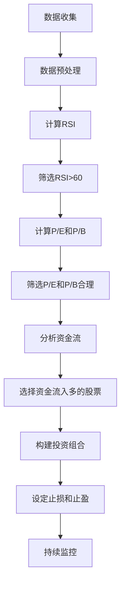
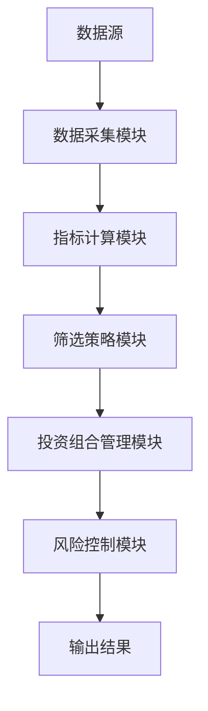
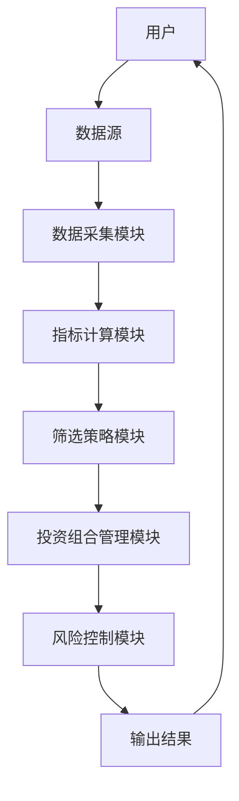

                 


# 《威廉·欧奈尔的成长股识别方法》

## 关键词：成长股、威廉·欧奈尔、相对强度、资金管理、投资策略、股票筛选

## 摘要：威廉·欧奈尔的成长股识别方法是一种基于技术分析和资金管理的投资策略，通过相对强度等指标筛选出具有成长潜力的股票。本文将详细解读该方法的核心概念、算法原理、系统架构及实战案例，帮助投资者掌握这一高效的投资策略。

---

# 第一部分: 威廉·欧奈尔的成长股识别方法基础

## 第1章: 成长股识别方法概述

### 1.1 成长股的基本概念

#### 1.1.1 成长股的定义与特点

成长股是指那些具有持续盈利能力和较高增长潜力的公司股票。这类股票通常来自处于成长期的行业，公司收入和利润预期能够以较高的速度增长。

**特点：**

- **高增长性**：公司收入和利润增长率较高。
- **估值合理**：市盈率（P/E）和市净率（P/B）等指标相对合理，具有成长空间。
- **流动性好**：成交活跃，市场关注度高。
- **风险较高**：成长股的价格波动较大，风险相对较高。

#### 1.1.2 威廉·欧奈尔的贡献与方法

威廉·欧奈尔是美国著名投资专家，其成长股识别方法基于技术分析和市场情绪研究，强调通过相对强度（RSI）等指标筛选出具有上涨潜力的股票。其方法的核心在于：

- 通过分析股票的历史价格走势，判断其是否处于上升趋势。
- 结合市场资金流向，选择资金关注度高的行业和公司。
- 通过筛选出符合特定技术指标的股票，构建投资组合。

#### 1.1.3 成长股识别方法的核心思想

- **趋势为王**：优先选择处于上升趋势的股票。
- **资金驱动**：关注资金流入较多的行业和公司。
- **相对强度**：通过相对强度指标筛选出表现优于市场平均水平的股票。

---

## 第2章: 成长股的核心指标分析

### 2.1 相对强度（RSI）指标

#### 2.1.1 相对强度的定义与计算公式

相对强度（RSI）是衡量股票相对于市场表现强弱的重要指标，公式如下：

$$
RSI = \frac{\text{平均上涨幅度}}{\text{平均下跌幅度}}
$$

其中，平均上涨幅度是指一定时期内股票上涨的平均值，平均下跌幅度是指股票下跌的平均值。

#### 2.1.2 相对强度在成长股识别中的应用

- **超买超卖判断**：当RSI超过70时，股票可能处于超买状态，存在回调风险；当RSI低于30时，股票可能处于超卖状态，存在反弹机会。
- **趋势判断**：RSI持续高于50表明股票处于上升趋势，低于50则表明处于下降趋势。
- **形态分析**：RSI的形态（如底背离、顶背离）可以帮助判断股票的买卖信号。

### 2.2 成长股的资金管理指标

#### 2.2.1 资金管理的基本概念

资金管理是投资过程中至关重要的一环，它涉及到如何合理分配资金，控制风险，以及最大化收益。

#### 2.2.2 资金管理在成长股识别中的作用

- **分散投资**：通过投资多个成长股，降低单一股票风险。
- **仓位控制**：根据市场情况调整持仓比例，避免过度集中。
- **止损与止盈**：设定止损点和止盈点，控制投资风险。

### 2.3 其他辅助指标

#### 2.3.1 成长股的市盈率（P/E）分析

市盈率（P/E）是股票价格与每股收益（EPS）的比率，用于衡量股票的估值水平。

$$
P/E = \frac{\text{股价}}{\text{每股收益}}
$$

- **合理区间**：成长股的P/E通常较高，但需结合行业和公司实际情况判断。
- **预警信号**：P/E过高可能表明股票被高估，存在回调风险。

#### 2.3.2 成长股的市净率（P/B）分析

市净率（P/B）是股票价格与每股净资产的比率，用于衡量股票的资产价值。

$$
P/B = \frac{\text{股价}}{\text{每股净资产}}
$$

- **合理区间**：成长股的P/B通常较高，但需结合行业和公司实际情况判断。
- **预警信号**：P/B过高可能表明股票被高估，存在回调风险。

### 2.4 核心指标对比表

| 指标名称 | 定义 | 作用 |
|----------|------|------|
| RSI      | 相对强度 | 评估股票的超买超卖状态 |
| P/E      | 市盈率 | 评估股票的估值水平 |
| P/B      | 市净率 | 评估股票的资产价值 |

### 2.5 本章小结

---

# 第三部分: 威廉·欧奈尔成长股识别的算法原理

## 第3章: 成长股识别的算法流程

### 3.1 成长股识别的步骤分解

#### 3.1.1 数据收集与预处理

- **数据收集**：收集目标股票的历史价格数据、财务数据等。
- **数据清洗**：处理缺失值、异常值等，确保数据质量。

#### 3.1.2 指标计算与筛选

- **计算相对强度（RSI）**：根据公式计算RSI，筛选出RSI高于60的股票。
- **计算市盈率（P/E）和市净率（P/B）**：筛选出P/E和P/B处于合理区间的股票。
- **资金流分析**：分析资金流向，选择资金流入较多的行业和公司。

#### 3.1.3 投资决策与优化

- **构建投资组合**：根据筛选结果，选择一定数量的股票构建投资组合。
- **风险控制**：设定止损点和止盈点，控制投资风险。
- **持续监控**：定期监控投资组合的表现，及时调整持仓。

### 3.2 成长股识别的算法流程图



### 3.3 算法实现的Python代码

```python
import pandas as pd
import numpy as np

def calculate_rsi(data, period=14):
    # 计算相对强度指数（RSI）
    diff = data['收盘价'].diff(period).fillna(0)
    up = diff[diff > 0]
    down = -diff[diff <= 0]
    rs = up.rolling(period).mean() / down.rolling(period).mean()
    rsi = 100 - 100 * (1 - rs.rolling(period).mean())
    return rsi

def growth_stock_screening(data):
    # 筛选成长股
    data['RSI'] = calculate_rsi(data)
    data['P/E'] = data['收盘价'] / data['EPS']
    data['P/B'] = data['收盘价'] / data['BPS']
    
    # 筛选条件：RSI > 60，P/E <行业平均，P/B <行业平均
    filtered = data[
        (data['RSI'] > 60) &
        (data['P/E'] < data['行业平均P/E']) &
        (data['P/B'] < data['行业平均P/B'])
    ]
    return filtered

# 示例数据
data = pd.DataFrame({
    '收盘价': [100, 105, 110, 115, 120],
    'EPS': [10, 11, 12, 13, 14],
    'BPS': [5, 6, 7, 8, 9],
    '行业平均P/E': [15, 15, 15, 15, 15],
    '行业平均P/B': [3, 3, 3, 3, 3]
})

result = growth_stock_screening(data)
print(result)
```

### 3.4 数学模型与公式解析

- **相对强度指数（RSI）**：
  $$
  RSI = 100 - 100 \times \left(1 - \frac{\text{平均上涨幅度}}{\text{平均下跌幅度}}\right)
  $$

- **市盈率（P/E）**：
  $$
  P/E = \frac{\text{股价}}{\text{每股收益}}
  $$

- **市净率（P/B）**：
  $$
  P/B = \frac{\text{股价}}{\text{每股净资产}}
  $$

---

## 第4章: 成长股识别系统的系统分析与架构设计

### 4.1 项目背景与目标

- **目标**：开发一个基于威廉·欧奈尔方法的自动成长股识别系统。
- **背景**：随着市场数据的日益丰富，投资者需要更高效的工具来筛选股票。

### 4.2 系统功能设计

#### 4.2.1 系统功能模块

- **数据采集模块**：从数据源获取股票数据。
- **指标计算模块**：计算相对强度、市盈率、市净率等指标。
- **筛选策略模块**：根据筛选条件筛选出符合条件的股票。
- **投资组合管理模块**：构建和管理投资组合。
- **风险控制模块**：设定止损和止盈，控制投资风险。

#### 4.2.2 系统功能流程

1. 数据采集模块获取股票数据。
2. 指标计算模块计算相关指标。
3. 筛选策略模块根据条件筛选出符合条件的股票。
4. 投资组合管理模块构建投资组合。
5. 风险控制模块设定止损和止盈，控制投资风险。

### 4.3 系统架构设计



### 4.4 系统接口设计

- **输入接口**：接收股票数据、筛选条件等。
- **输出接口**：输出筛选结果、投资组合等。

### 4.5 系统交互流程图



---

## 第5章: 成长股识别的项目实战

### 5.1 环境安装与配置

- **安装Python环境**：安装Anaconda或Python 3.8以上版本。
- **安装所需库**：安装pandas、numpy、matplotlib等库。

### 5.2 核心代码实现

#### 5.2.1 数据预处理

```python
import pandas as pd
import numpy as np

# 示例数据
data = pd.DataFrame({
    '日期': ['2023-01-01', '2023-01-02', '2023-01-03', '2023-01-04', '2023-01-05'],
    '收盘价': [100, 105, 110, 115, 120],
    '成交量': [1000, 1200, 1100, 1300, 1400],
    'EPS': [10, 11, 12, 13, 14],
    'BPS': [5, 6, 7, 8, 9]
})

# 数据预处理
data.set_index('日期', inplace=True)
```

#### 5.2.2 指标计算

```python
def calculate_rsi(data, period=14):
    diff = data['收盘价'].diff(period).fillna(0)
    up = diff[diff > 0]
    down = -diff[diff <= 0]
    rs = up.rolling(period).mean() / down.rolling(period).mean()
    rsi = 100 - 100 * (1 - rs.rolling(period).mean())
    return rsi

data['RSI'] = calculate_rsi(data)
```

#### 5.2.3 筛选策略

```python
data['P/E'] = data['收盘价'] / data['EPS']
data['P/B'] = data['收盘价'] / data['BPS']

# 筛选条件：RSI > 60，P/E < 行业平均，P/B < 行业平均
filtered = data[(data['RSI'] > 60) & (data['P/E'] < 15) & (data['P/B'] < 3)]
print(filtered)
```

### 5.3 实际案例分析

#### 5.3.1 案例背景

假设我们有一个包含多只股票的数据集，目标是筛选出符合威廉·欧奈尔成长股识别方法的股票。

#### 5.3.2 数据分析与结果解读

```python
import matplotlib.pyplot as plt

filtered['收盘价'].plot(label='筛选后股票价格')
data['收盘价'].plot(label='原数据')
plt.title('成长股识别结果')
plt.xlabel('时间')
plt.ylabel('股价')
plt.legend()
plt.show()
```

#### 5.3.3 投资组合管理

- 根据筛选结果，选择一定数量的股票构建投资组合。
- 定期监控投资组合的表现，及时调整持仓。

### 5.4 项目总结

- **项目成果**：成功开发了一个基于威廉·欧奈尔方法的自动成长股识别系统。
- **经验总结**：数据预处理和指标计算是关键步骤，算法的选择和优化也非常重要。
- **改进方向**：可以考虑引入更多指标，如市销率（P/S）等，进一步优化筛选策略。

---

## 第六部分: 优化与总结

## 第6章: 成长股识别的最佳实践

### 6.1 本章小结

- 本文详细介绍了威廉·欧奈尔的成长股识别方法，包括核心概念、算法原理、系统设计和实战案例。

### 6.2 投资注意事项

- **风险控制**：设定止损点，避免重大损失。
- **持续学习**：关注市场动态，及时调整策略。
- **分散投资**：避免过度集中，降低风险。

### 6.3 拓展阅读

- **相关书籍**：威廉·欧奈尔的《选股者手册》。
- **相关课程**：投资学、技术分析等课程。
- **相关工具**：学习使用金融数据分析工具，如Python、Excel等。

## 作者：AI天才研究院/AI Genius Institute & 禅与计算机程序设计艺术 /Zen And The Art of Computer Programming

---

通过本文的详细解读和实战案例分析，读者可以深入了解威廉·欧奈尔的成长股识别方法，并能够在实际投资中灵活运用这些方法，提高投资收益。

