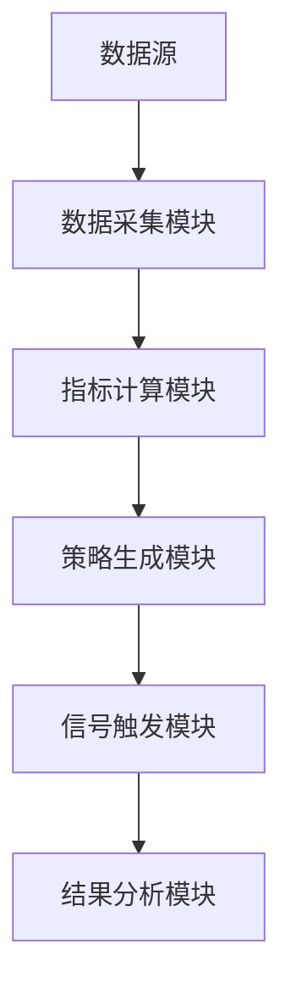
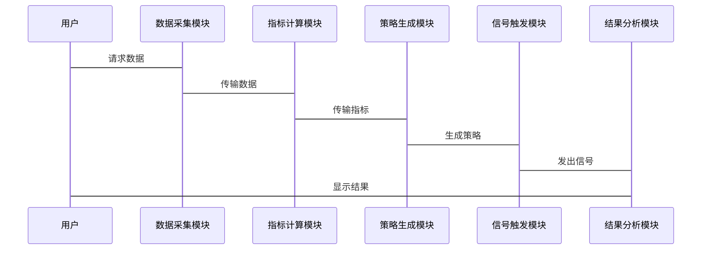

                 


# 威廉·欧奈尔的技术面与基本面结合策略

> 关键词：技术分析，基本面分析，投资策略，威廉·欧奈尔，股票投资

> 摘要：本文深入探讨了威廉·欧奈尔的技术面与基本面结合的投资策略，通过详细分析技术分析和基本面分析的核心概念、工具、数学模型和系统设计，结合实际案例，展示了如何将两者有效结合以优化投资决策。

---

## 第1章: 技术面与基本面分析概述

### 1.1 技术分析的核心概念

#### 1.1.1 技术分析的定义与背景
技术分析是一种通过研究历史价格数据来预测未来市场走势的方法。它基于假设：市场价格反映所有相关信息，并且价格走势具有一定的规律性。技术分析的核心在于识别价格趋势和形态，从而为投资者提供买卖信号。

#### 1.1.2 技术分析的主要工具与方法
技术分析依赖于多种工具和方法，包括K线图、移动平均线（MA）、相对强弱指数（RSI）、布林带（Bollinger Bands）和MACD等指标。这些工具帮助投资者识别趋势、支撑位、阻力位和超买超卖条件。

#### 1.1.3 技术分析在投资决策中的作用
技术分析帮助投资者捕捉市场趋势和短期波动，提供入场和离场的时机。然而，它通常无法反映公司的内在价值，因此需要结合基本面分析以弥补其不足。

### 1.2 基本面分析的核心概念

#### 1.2.1 基本面分析的定义与背景
基本面分析侧重于研究公司的财务状况、行业地位和宏观经济环境，以评估其内在价值。通过分析财务报表、估值指标和宏观经济数据，基本面分析帮助投资者识别具有长期增长潜力的公司。

#### 1.2.2 基本面分析的主要指标与方法
基本面分析的关键指标包括市盈率（P/E）、市净率（P/B）、股息率和ROE等。这些指标帮助评估公司的盈利能力和估值水平，同时考虑宏观经济环境和行业趋势的影响。

#### 1.2.3 基本面分析在投资决策中的作用
基本面分析为投资者提供公司内在价值的评估，帮助识别具有长期增长潜力的投资标的。然而，它通常无法捕捉短期市场波动，因此需要结合技术分析以完善投资决策。

### 1.3 技术面与基本面结合的必要性

#### 1.3.1 技术面与基本面分析的优缺点对比
技术分析的优点在于捕捉市场趋势和时机，但其缺点是无法评估公司的内在价值。基本面分析则提供公司价值评估，但难以捕捉短期市场波动。两者的结合能够扬长避短，提供更全面的投资决策支持。

#### 1.3.2 结合技术面与基本面的优势
结合技术面与基本面分析，投资者可以同时评估市场的短期趋势和公司的长期价值，从而在合适的时机投资于具有成长潜力的公司，提高投资收益并降低风险。

#### 1.3.3 技术面与基本面结合的策略框架
本文将详细介绍技术面与基本面结合的策略框架，包括策略类型、数学模型和实施步骤，帮助投资者有效应用这一策略。

---

## 第2章: 技术分析的核心原理与方法

### 2.1 技术分析的主要工具

#### 2.1.1 K线图与价格形态
K线图是技术分析的基础工具，通过记录价格的高点、低点、开盘价和收盘价，帮助识别价格趋势和形态，如头肩顶、双底等。

#### 2.1.2 移动平均线（MA）
移动平均线用于平滑价格数据，识别价格趋势。短期MA（如5日、10日）用于捕捉短期趋势，长期MA（如50日、200日）用于识别主要趋势。

#### 2.1.3 相对强弱指数（RSI）
RSI用于衡量资产的超买或超卖状态，通常在0-100之间波动。当RSI超过70时，资产可能超买，当低于30时，可能超卖。

#### 2.1.4 布林带（Bollinger Bands）
布林带用于衡量价格的波动性，由上轨、中轨和下轨组成。价格突破上轨可能表明超买，突破下轨可能表明超卖。

#### 2.1.5 麦克劳克林指标（MACD）
MACD用于识别价格趋势的变化，由两条移动平均线（如12日和26日）和一条柱状线组成。柱状线高于零线表明上涨趋势，低于零线则表明下跌趋势。

### 2.2 技术分析的核心原理

#### 2.2.1 趋势理论
趋势理论认为价格走势具有延续性，技术分析通过识别趋势方向和强度来预测未来价格走势。

#### 2.2.2 支撑位与阻力位
支撑位是价格下跌时的支撑点，阻力位是价格上涨时的阻力点。这些水平用于识别价格可能的反转或延续点。

#### 2.2.3 超买超卖理论
超买超卖理论认为价格在短时间内可能脱离其内在价值，当价格超买时可能下跌，超卖时可能上涨。

#### 2.2.4 市场情绪与成交量分析
成交量是价格变动的确认指标，高成交量表明趋势的强度，低成交量可能表明趋势的减弱。

---

## 第3章: 基本面分析的核心原理与方法

### 3.1 基本面分析的主要指标

#### 3.1.1 财务报表分析
财务报表包括利润表、资产负债表和现金流量表。利润表显示公司盈利能力，资产负债表显示资产和负债情况，现金流量表显示现金流动状况。

#### 3.1.2 市盈率（P/E）
市盈率是股价与每股收益的比率，反映市场对公司盈利能力的评估。低P/E可能表明低估，高P/E可能表明高估。

#### 3.1.3 市净率（P/B）
市净率是股价与每股净资产的比率，用于评估股价相对于公司资产价值的高低。

#### 3.1.4 股息率
股息率是每股股息与股价的比率，用于评估投资的分红回报。

#### 3.1.5 资产负债率与ROE
资产负债率衡量公司负债在资产中的比例，ROE衡量公司每股收益与股东权益的关系。

### 3.2 基本面分析的核心原理

#### 3.2.1 公司盈利能力分析
盈利能力分析通过ROE、净利润率等指标评估公司的盈利效率。

#### 3.2.2 行业地位与竞争优势
行业地位和竞争优势分析帮助识别公司在行业中的地位及其竞争优势。

#### 3.2.3 财务健康状况分析
财务健康状况分析通过现金流、负债水平等指标评估公司的财务稳定性。

#### 3.2.4 宏观经济环境对基本面的影响
宏观经济环境如GDP增长率、利率和通货膨胀率影响公司的经营环境和财务状况。

---

## 第4章: 技术面与基本面结合的策略框架

### 4.1 结合技术面与基本面的策略类型

#### 4.1.1 基于技术信号筛选基本面良好的股票
通过技术分析识别具有上升趋势的股票，再通过基本面分析筛选财务健康、估值合理的公司。

#### 4.1.2 基于基本面信号寻找技术形态良好的股票
通过基本面分析识别具有长期增长潜力的公司，再通过技术分析筛选处于上升趋势或形态良好的股票。

#### 4.1.3 技术面与基本面共振的买入/卖出信号
当技术信号和基本面信号同时发出买入或卖出信号时，投资者可以采取行动，以提高决策的准确性。

### 4.2 技术面与基本面结合的数学模型

#### 4.2.1 时间序列分析模型
时间序列分析模型用于预测价格走势，基于历史数据建立ARIMA模型或其他时间序列模型。

#### 4.2.2 多因素回归模型
多因素回归模型用于评估多个因素对股价的影响，如市值、收益增长率、市盈率等。

#### 4.2.3 机器学习融合模型
机器学习模型可以将技术指标和基本面指标作为特征，通过训练模型预测股价走势。

### 4.3 策略实施步骤

#### 4.3.1 数据收集与预处理
收集历史价格数据、技术指标和基本面数据，进行数据清洗和标准化处理。

#### 4.3.2 指标计算与特征选择
计算技术指标和基本面指标，选择具有较高预测能力的特征。

#### 4.3.3 模型训练与优化
使用选定的特征训练机器学习模型，调整参数以优化模型性能。

#### 4.3.4 策略回测与评估
对策略进行回测，评估其收益、风险和稳定性，调整策略参数以提高表现。

#### 4.3.5 策略实施与监控
在实际市场中实施策略，定期监控市场变化和模型表现，及时调整策略。

---

## 第5章: 技术面与基本面结合的数学模型

### 5.1 时间序列分析模型

#### 5.1.1 ARIMA模型
ARIMA模型用于预测价格走势，基于自回归和移动平均的原理。模型的阶数通过差分和自相关分析确定。

#### 5.1.2 GARCH模型
GARCH模型用于捕捉价格波动性，特别适用于高波动市场的预测。

#### 5.1.3 算法步骤
1. 数据预处理：计算价格的对数收益率。
2. 差分：确定差分阶数以消除趋势。
3. 参数估计：使用极大似然估计方法确定模型参数。
4. 预测：基于模型预测未来价格走势。

#### 5.1.4 Python代码示例
```python
from statsmodels.tsa.arima_model import ARIMA
import pandas as pd
import numpy as np

# 数据预处理
data = pd.read_csv('stock_data.csv')
prices = data['Close']
log_returns = np.log(prices) - np.log(prices.shift(1))
log_returns = log_returns.dropna()

# 差分
diff = log_returns.diff()

# 训练ARIMA模型
model = ARIMA(diff, order=(1, 1, 1))
model_fit = model.fit()

# 预测
forecast = model_fit.forecast(steps=10)
```

### 5.2 多因素回归模型

#### 5.2.1 线性回归模型
线性回归模型用于评估多个因素对股价的影响，如市值、收益增长率、市盈率等。

#### 5.2.2 逐步回归模型
逐步回归模型用于选择最重要的特征，通过向前向后逐步选择变量，减少多重共线性的影响。

#### 5.2.3 算法步骤
1. 数据收集：收集技术指标和基本面指标。
2. 特征选择：通过逐步回归选择重要特征。
3. 模型训练：使用线性回归模型进行训练。
4. 模型评估：通过R²和残差分析评估模型性能。

#### 5.2.4 Python代码示例
```python
import statsmodels.api as sm
from statsmodels.formula.api import ols

# 数据收集
X = data[['MA', 'RSI', 'P/E', 'P/B']]
y = data['Return']

# 逐步回归
model = ols('Return ~ MA + RSI + P/E + P/B', data=X).fit()
model.summary()
```

### 5.3 机器学习融合模型

#### 5.3.1 随机森林模型
随机森林模型通过集成学习捕捉非线性关系，适用于高维特征和复杂数据。

#### 5.3.2 神经网络模型
神经网络模型通过多层感知机捕捉复杂模式，适用于非线性关系的预测。

#### 5.3.3 算法步骤
1. 数据预处理：归一化技术指标和基本面指标。
2. 特征选择：通过特征重要性筛选重要特征。
3. 模型训练：使用随机森林或神经网络模型进行训练。
4. 模型评估：通过准确率、召回率和F1分数评估模型性能。

#### 5.3.4 Python代码示例
```python
from sklearn.ensemble import RandomForestClassifier
from sklearn.metrics import accuracy_score

# 数据预处理
X = data[['MA', 'RSI', 'P/E', 'P/B']]
y = data['Label']

# 模型训练
model = RandomForestClassifier(n_estimators=100)
model.fit(X, y)

# 模型评估
y_pred = model.predict(X)
print(accuracy_score(y, y_pred))
```

---

## 第6章: 技术面与基本面结合的系统设计

### 6.1 系统架构设计

#### 6.1.1 系统功能模块
系统功能模块包括数据采集、指标计算、策略生成、信号触发和结果分析。

#### 6.1.2 系统架构图


### 6.2 系统接口设计

#### 6.2.1 数据接口
数据接口用于获取历史价格数据和基本面数据，支持CSV、数据库等多种数据源。

#### 6.2.2 策略接口
策略接口定义策略生成的输入和输出，支持多种策略类型和参数配置。

#### 6.2.3 信号接口
信号接口定义信号触发的条件和方式，支持实时监控和历史回测。

### 6.3 系统交互流程

#### 6.3.1 系统交互图


---

## 第7章: 技术面与基本面结合的项目实战

### 7.1 项目环境搭建

#### 7.1.1 环境需求
项目需要Python 3.6以上版本，安装必要的库如Pandas、NumPy、Matplotlib和Scikit-learn。

#### 7.1.2 数据获取
从Yahoo Finance获取股票数据，保存为CSV格式。

### 7.2 核心代码实现

#### 7.2.1 数据处理代码
```python
import pandas as pd
import requests

# 获取数据
url = 'https://query1.finance.yahoo.com/ws/v1/finance/quote/AAPL'
response = requests.get(url)
data = response.json()

# 提取价格数据
prices = data['quoteResponse']['result'][0]['regularMarketPrice']
```

#### 7.2.2 技术指标计算代码
```python
def calculate_technical_indicators(prices):
    # 计算移动平均线
    ma_5 = pd.Series(prices.rolling(5).mean())
    ma_20 = pd.Series(prices.rolling(20).mean())
    
    # 计算RSI
    delta = prices.diff()
    up = delta.where(delta > 0, 0)
    down = delta.where(delta < 0, 0)
    rs = up.rolling(14).mean() / down.rolling(14).mean()
    rsi = 100 - (100 - rs.rolling(14).mean())
    
    return ma_5, ma_20, rsi

ma_5, ma_20, rsi = calculate_technical_indicators(prices)
```

#### 7.2.3 回测策略代码
```python
from backtrader import Strategy, Broker

# 定义策略
class MyStrategy(Strategy):
    def __init__(self):
        self.ma_5 = MA(self.datas[0], period=5)
        self.ma_20 = MA(self.datas[0], period=20)
        self.rsi = RSI(self.datas[0], period=14)
    
    def next(self):
        if self.ma_5 > self.ma_20 and self.rsi > 70:
            self.buy()
        elif self.ma_5 < self.ma_20 and self.rsi < 30:
            self.sell()

# 初始化 broker
broker = Broker()

# 添加策略
cerebro = Cerebro()
cerebro.addstrategy(MyStrategy)
cerebro.broker = broker

# 加载数据
data = DataSeries(...)
cerebro.adddata(data)

# 运行回测
cerebro.run()
```

### 7.3 实际案例分析

#### 7.3.1 案例背景
以苹果公司（AAPL）为例，结合技术面和基本面分析，制定投资策略。

#### 7.3.2 数据分析
分析AAPL的历史价格、技术指标和基本面指标，识别潜在的买入和卖出信号。

#### 7.3.3 回测结果
通过回测验证策略的有效性，评估策略的收益和风险。

### 7.4 项目小结

#### 7.4.1 项目总结
本项目通过技术面与基本面结合的策略，成功实现了对AAPL股票的投资决策，验证了策略的有效性。

#### 7.4.2 经验与教训
在实际应用中，需要不断调整策略参数，适应市场的变化，同时加强风险管理，控制投资风险。

---

## 第8章: 技术面与基本面结合策略的总结与展望

### 8.1 策略总结

#### 8.1.1 核心要点回顾
技术面与基本面结合策略通过技术分析捕捉市场趋势，基本面分析评估公司价值，结合两者制定投资决策，提高投资收益并降低风险。

#### 8.1.2 策略优势
该策略能够有效捕捉市场趋势，同时评估公司价值，适合长期投资和短期交易。

### 8.2 策略展望

#### 8.2.1 未来研究方向
未来可以研究更多技术指标和基本面指标的组合，探索更复杂的数学模型，如深度学习模型，以提高预测精度。

#### 8.2.2 策略优化建议
根据市场变化和策略回测结果，不断优化策略参数，调整策略类型，适应不同的市场环境。

### 8.3 小结与注意事项

#### 8.3.1 小结
技术面与基本面结合策略是一种有效的方法，能够帮助投资者做出更全面的投资决策。

#### 8.3.2 注意事项
投资者在实际应用中，应结合市场环境和自身风险承受能力，谨慎调整策略参数，避免盲目跟从。

---

## 作者：AI天才研究院/AI Genius Institute & 禅与计算机程序设计艺术 /Zen And The Art of Computer Programming

---

通过本文的详细讲解，读者可以全面理解威廉·欧奈尔的技术面与基本面结合策略，掌握其核心概念、工具和方法，并能够实际应用到投资决策中，提高投资效果。

