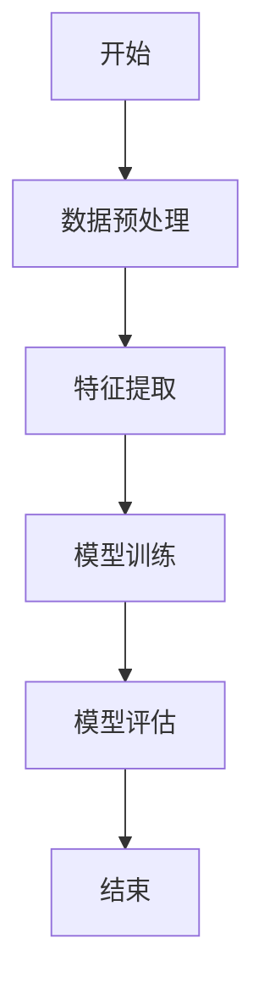
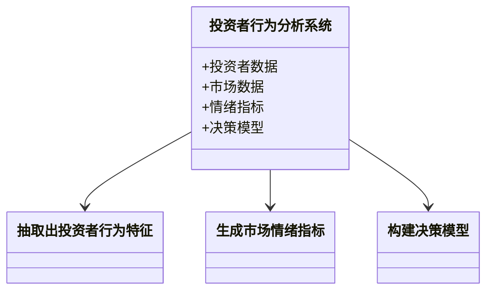
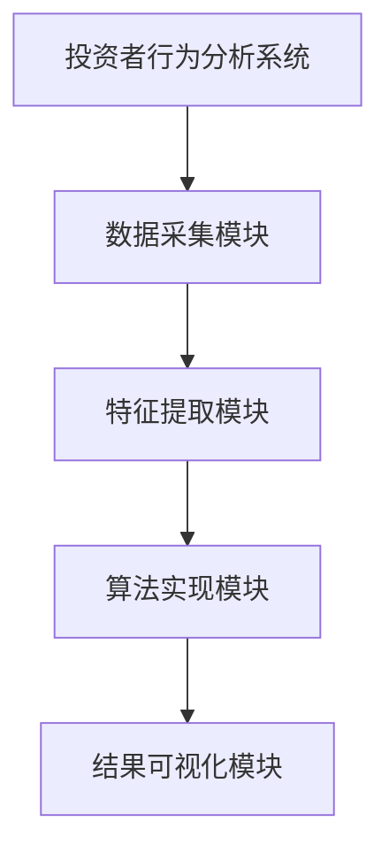
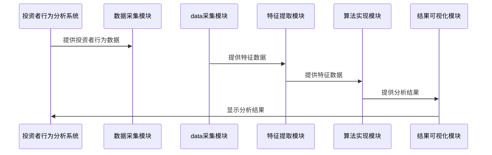

                 


# 威廉·欧奈尔的机构投资者行为分析

> 关键词：威廉·欧奈尔，机构投资者，行为分析，投资策略，技术指标，机器学习

> 摘要：本文详细探讨了威廉·欧奈尔的机构投资者行为分析方法，从投资者心理、技术指标、机器学习算法到系统架构，全面解析机构投资者的行为模式，结合实际案例，提供深入的分析与见解。

---

# 第一部分: 机构投资者行为分析概述

# 第1章: 机构投资者行为分析概述

## 1.1 威廉·欧奈尔及其投资理论
### 1.1.1 威廉·欧奈尔的背景介绍
威廉·欧奈尔是一位著名投资者，专注于分析机构投资者的行为模式，其理论结合了技术分析和行为金融学，为投资决策提供了新的视角。

### 1.1.2 欧奈尔投资理论的核心思想
欧奈尔强调市场情绪和技术指标的结合，认为投资者的行为受到心理和外部环境的双重影响。

### 1.1.3 机构投资者行为分析的意义
通过分析机构投资者的行为，可以帮助个人投资者做出更明智的投资决策，优化投资策略。

## 1.2 机构投资者行为分析的背景与现状
### 1.2.1 机构投资者在金融市场中的地位
机构投资者如基金公司和保险公司对市场有重要影响，其行为模式对整体市场波动有显著作用。

### 1.2.2 当前机构投资者行为分析的热点问题
近年来，行为金融学和大数据分析的结合为机构投资者行为分析提供了新的工具和方法。

### 1.2.3 机构投资者行为分析的边界与外延
分析的范围包括投资者心理、市场情绪和技术指标，但需注意数据的可靠性和模型的适用性。

## 1.3 机构投资者行为分析的核心要素
### 1.3.1 投资者心理与行为特征
投资者的心理特征如风险偏好和决策风格直接影响投资行为。

### 1.3.2 市场情绪与投资决策的关系
市场情绪波动影响资产价格，投资者行为与市场情绪相互作用。

### 1.3.3 机构投资者行为的外部影响因素
宏观经济指标和市场环境是影响机构投资者决策的重要因素。

## 1.4 本章小结
### 1.4.1 核心概念总结
威廉·欧奈尔的理论结合了技术分析和行为金融学，强调投资者心理和市场情绪对投资决策的影响。

### 1.4.2 后续章节的逻辑框架
后续章节将从心理分析、技术指标、机器学习算法等方面深入探讨机构投资者的行为模式。

---

# 第二部分: 机构投资者行为分析的核心概念与联系

# 第2章: 投资者心理与行为分析

## 2.1 投资者心理特征分析
### 2.1.1 投资者心理模型的构建
构建心理模型需考虑投资者的决策风格和认知偏差，如过度自信和损失厌恶。

### 2.1.2 不同类型投资者的心理差异
个人投资者和机构投资者在心理特征和决策风格上有显著差异。

### 2.1.3 心理因素对投资决策的影响
心理因素如风险偏好和认知偏差直接影响投资行为和决策。

## 2.2 投资者情绪与市场行为的关系
### 2.2.1 情绪周期理论
市场情绪呈现周期性波动，投资者情绪的波动影响资产价格。

### 2.2.2 市场情绪对资产价格的影响
情绪高涨时资产价格上涨，情绪低落时价格下跌，需结合技术指标进行分析。

### 2.2.3 情绪指标的构建与应用
构建情绪指标需结合市场数据和技术指标，用于预测市场趋势。

## 2.3 投资者决策模型的构建
### 2.3.1 理性决策与非理性决策的对比
理性决策基于逻辑分析，非理性决策受情绪影响，两者在不同市场环境下表现不同。

### 2.3.2 行为决策模型的构建
行为决策模型结合心理学和经济学理论，用于解释投资者行为。

### 2.3.3 模型的验证与优化
通过历史数据验证模型的有效性，并根据实际情况进行优化。

## 2.4 核心概念对比表
### 2.4.1 投资者心理与行为的对比
| 心理特征 | 行为表现 |
|---------|----------|
| 风险偏好 | 投资选择 |
| 认知偏差 | 决策模式 |

### 2.4.2 不同市场环境下的行为差异
| 市场环境 | 投资者行为 |
|---------|----------|
| 上升 | 投资积极 |
| 下降 | 投资保守 |

### 2.4.3 情绪指标与决策模型的关联
情绪指标用于预测市场趋势，决策模型基于情绪指标和市场数据进行优化。

## 2.5 本章小结
### 2.5.1 核心概念的总结
投资者心理和市场情绪是理解机构投资者行为的关键因素。

### 2.5.2 后续章节的逻辑延伸
后续章节将结合技术指标和机器学习算法，深入分析机构投资者的行为模式。

---

# 第三部分: 机构投资者行为分析的算法原理

# 第3章: 投资者行为分析的算法原理

## 3.1 技术指标分析方法
### 3.1.1 常用技术指标
- **移动平均线（MA）**：用于判断趋势方向。
- **相对强弱指数（RSI）**：用于判断超买超卖状态。

### 3.1.2 技术指标的计算公式
#### 移动平均线的计算
$$ MA_n = \frac{1}{n} \sum_{i=1}^{n} p_i $$
其中，$p_i$ 是第i天的收盘价，$n$ 是天数。

#### 相对强弱指数的计算
$$ RSI = \frac{100}{1 + \frac{d}{(H - L)} \times 100} $$
其中，$d$ 是涨跌差，$H$ 是最高价，$L$ 是最低价。

### 3.1.3 技术指标的应用场景
技术指标常用于趋势判断和买卖信号的生成。

## 3.2 机器学习算法在行为分析中的应用
### 3.2.1 机器学习算法的选择
- **回归算法**：用于预测资产价格。
- **分类算法**：用于判断市场趋势。

### 3.2.2 机器学习模型的训练流程
1. 数据预处理：清洗和归一化数据。
2. 特征提取：选择相关特征。
3. 模型训练：使用训练数据训练模型。
4. 模型评估：验证模型的准确性。

### 3.2.3 机器学习算法的优缺点
- **优点**：能够捕捉复杂模式，适用于非线性关系。
- **缺点**：计算复杂，需要大量数据支持。

## 3.3 算法流程图


## 3.4 技术实现代码示例
```python
# 移动平均线计算
import pandas as pd
import numpy as np

def calculate_MA(data, window):
    return data['close'].rolling(window).mean()

# 相对强弱指数计算
def calculate_RSI(data, window):
    diff = data['close'].diff()
    up = diff.where(diff > 0, 0)
    down = -diff.where(diff < 0, 0)
    rs = up.rolling(window).sum() / down.rolling(window).sum()
    rsi = 100 - (100 / (1 + rs))
    return rsi
```

## 3.5 本章小结
### 3.5.1 核心算法的总结
技术指标和机器学习算法各有优劣，结合使用能提高分析的准确性。

### 3.5.2 后续章节的逻辑延伸
后续章节将探讨系统架构和项目实战，结合算法进行实际分析。

---

# 第四部分: 机构投资者行为分析的系统架构

# 第4章: 机构投资者行为分析的系统架构

## 4.1 系统功能设计
### 4.1.1 领域模型


### 4.1.2 系统架构设计


## 4.2 系统接口设计
### 4.2.1 数据接口
- **输入接口**：接收投资者行为数据和市场数据。
- **输出接口**：输出分析结果和预测报告。

### 4.2.2 算法接口
- **输入接口**：接收特征数据和参数。
- **输出接口**：输出模型结果。

## 4.3 系统交互流程


## 4.4 本章小结
### 4.4.1 系统架构的总结
系统架构包括数据采集、特征提取、算法实现和结果可视化四个模块，各模块协同工作实现行为分析。

### 4.4.2 后续章节的逻辑延伸
后续章节将探讨项目实战，结合系统架构进行实际案例分析。

---

# 第五部分: 机构投资者行为分析的项目实战

# 第5章: 项目实战

## 5.1 环境安装与配置
### 5.1.1 安装Python和相关库
- 安装Python：确保安装最新版本的Python。
- 安装Pandas、NumPy、Matplotlib等库。

### 5.1.2 数据源获取
- 数据来源：使用公开的金融数据API获取投资者行为数据。

## 5.2 系统核心实现源代码
### 5.2.1 数据采集模块
```python
import requests
import pandas as pd

def get_data(api_key, ticker):
    url = f'https://api.example.com/stock_data/{ticker}?api_key={api_key}'
    response = requests.get(url)
    data = response.json()
    df = pd.DataFrame(data)
    return df
```

### 5.2.2 特征提取模块
```python
def extract_features(data):
    data['MA_20'] = data['close'].rolling(20).mean()
    data['RSI_14'] = calculate_RSI(data, 14)
    return data
```

### 5.2.3 算法实现模块
```python
from sklearn.linear_model import LinearRegression

def train_model(features, labels):
    model = LinearRegression()
    model.fit(features, labels)
    return model
```

## 5.3 代码应用解读与分析
### 5.3.1 数据采集模块的解读
通过API获取数据，清洗和处理数据，确保数据质量。

### 5.3.2 特征提取模块的解读
计算移动平均线和相对强弱指数，提取有用的特征用于模型训练。

### 5.3.3 算法实现模块的解读
使用线性回归模型进行训练，评估模型的准确性。

## 5.4 实际案例分析
### 5.4.1 案例背景
选取某段时间内的市场数据，分析机构投资者的行为模式。

### 5.4.2 数据分析与解读
通过模型预测市场趋势，验证预测结果与实际数据的吻合度。

## 5.5 本章小结
### 5.5.1 项目实战的总结
通过实际案例，验证了系统架构和算法的有效性，为投资决策提供了参考。

### 5.5.2 后续章节的逻辑延伸
后续章节将总结分析结果，并提出改进建议。

---

# 第六部分: 机构投资者行为分析的总结与优化

# 第6章: 总结与优化

## 6.1 总结
### 6.1.1 核心内容回顾
通过心理分析、技术指标和机器学习算法，全面解析了机构投资者的行为模式。

### 6.1.2 关键点总结
投资者心理、市场情绪和技术指标是分析机构投资者行为的关键因素。

## 6.2 注意事项
### 6.2.1 数据可靠性
确保数据来源可靠，避免错误数据影响分析结果。

### 6.2.2 模型适用性
根据实际情况选择合适的模型，避免过度拟合。

### 6.2.3 风险管理
结合模型预测结果，制定合理的风险管理策略。

## 6.3 未来研究方向
### 6.3.1 情绪指标的优化
进一步优化情绪指标，提高预测准确性。

### 6.3.2 多因素模型的构建
结合更多因素，构建更复杂的多因素模型。

### 6.3.3 实时分析系统开发
开发实时分析系统，及时捕捉市场变化。

## 6.4 本章小结
### 6.4.1 总结全文
通过系统的分析和实战，全面掌握了机构投资者行为分析的方法和技巧。

### 6.4.2 展望未来
未来将结合更多的因素和方法，进一步优化分析模型。

---

# 第七部分: 机构投资者行为分析的最佳实践与扩展阅读

# 第7章: 最佳实践与扩展阅读

## 7.1 最佳实践
### 7.1.1 投资者心理分析
定期进行心理评估，了解自身的决策风格和认知偏差。

### 7.1.2 技术指标应用
结合多种技术指标，提高分析的准确性。

### 7.1.3 机器学习模型优化
不断优化模型，提高预测的准确性和稳定性。

## 7.2 扩展阅读
### 7.2.1 行为金融学经典文献
推荐阅读《怪诞行为学》等书籍，深入理解投资者行为。

### 7.2.2 技术分析经典书籍
阅读《股票作手回忆录》等书籍，学习技术分析的方法。

### 7.2.3 机器学习与金融结合的论文
查阅相关论文，了解机器学习在金融领域的最新应用。

## 7.3 本章小结
### 7.3.1 最佳实践的总结
结合心理分析、技术指标和机器学习算法，全面提升分析能力。

### 7.3.2 扩展阅读的建议
通过阅读经典文献和最新论文，持续提升知识水平。

---

# 作者信息

作者：AI天才研究院/AI Genius Institute & 禅与计算机程序设计艺术 /Zen And The Art of Computer Programming

---

这篇文章通过详细分析威廉·欧奈尔的机构投资者行为分析方法，结合技术指标、机器学习算法和系统架构，为投资者提供了深入的分析与见解。通过实际案例和系统设计，帮助读者理解机构投资者的行为模式，并应用于实际投资决策中。

