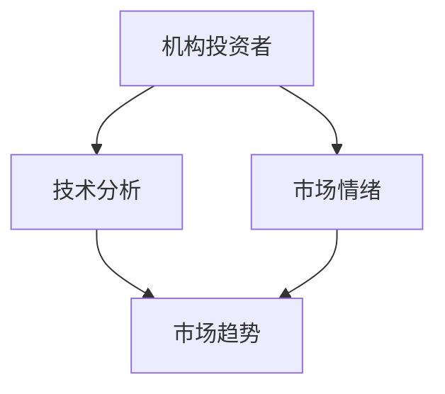
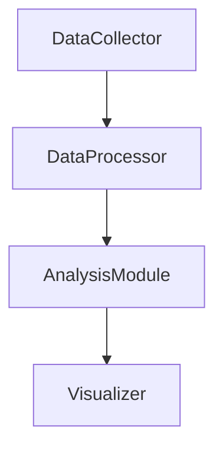

                 


# 《威廉·欧奈尔的机构资金流向分析》

**关键词**：机构资金流向、威廉·欧奈尔、投资分析、资金流动、市场趋势、技术分析

**摘要**：本文深入探讨了威廉·欧奈尔的机构资金流向分析方法，结合技术分析和市场行为学，分析机构投资者的资金流动模式及其对市场趋势的影响。文章从背景介绍、核心概念、算法原理、系统架构到项目实战，逐步展开，旨在为读者提供全面的分析框架和实践指导。

---

## 第1章: 机构资金流向分析的背景与概述

### 1.1 机构资金流向分析的背景

#### 1.1.1 机构投资者在金融市场中的地位与作用

机构投资者，如基金、保险公司和资产管理公司，是金融市场的重要参与者。他们的资金流动对市场趋势有着重要影响，因此分析机构资金流向对投资者决策至关重要。

#### 1.1.2 机构资金流向分析的重要性

机构资金流向分析帮助投资者预测市场趋势，优化投资组合，降低风险。通过研究机构的资金流动，投资者可以更好地把握市场动向。

#### 1.1.3 威廉·欧奈尔的贡献与研究方法

威廉·欧奈尔是一位知名的投资专家，他提出了许多有效的资金流向分析方法，如相对强度指数（RSI）和资金流指数（IWM）。这些方法结合了技术分析和市场情绪分析，为机构资金流向分析提供了有力工具。

### 1.2 机构资金流向分析的核心概念与联系

#### 1.2.1 机构资金流向的定义与特点

机构资金流向指的是机构投资者在金融市场中的资金流动情况，通常通过成交量、价格走势等指标来衡量。

#### 1.2.2 机构资金流向分析的边界与外延

机构资金流向分析不仅关注资金流入，还包括流出情况，分析其对市场的影响。同时，涉及多个市场领域，如股票、债券等。

#### 1.2.3 核心要素组成与概念结构

机构资金流向分析的核心要素包括资金流入、流出、净流入、市场情绪等。这些要素相互作用，构成一个复杂的分析体系。

---

## 第2章: 机构资金流向分析的核心概念与联系

### 2.1 核心概念原理

#### 2.1.1 机构资金流向的驱动因素

市场情绪、宏观经济指标、公司基本面等因素都可能影响机构资金流向。这些驱动因素通过技术分析指标反映出来。

#### 2.1.2 市场情绪与资金流向的关系

市场情绪波动直接影响机构投资者的决策，进而影响资金流向。例如，当市场情绪乐观时，资金倾向于流入股市。

#### 2.1.3 技术分析与资金流向的结合

技术分析通过价格走势和成交量等指标预测资金流向，帮助投资者判断市场趋势。

### 2.2 核心概念属性特征对比表格

| 概念       | 数据来源 | 分析方法 | 预测能力 |
|------------|----------|----------|----------|
| 机构资金流向 | 成交量、价格 | 技术指标、模型 | 强 |

### 2.3 ER实体关系图架构



---

## 第3章: 机构资金流向分析的算法原理

### 3.1 算法原理概述

#### 3.1.1 数据预处理

对收集的交易数据进行清洗、标准化处理，确保数据质量。

#### 3.1.2 特征提取

提取成交量、价格走势等关键特征，用于后续分析。

#### 3.1.3 模型训练

使用机器学习模型，如线性回归或时间序列分析，预测资金流向。

### 3.2 算法实现

#### 3.2.1 算法选择

选择适合的算法，如基于成交量的移动平均线（MA）或相对强度指数（RSI）。

#### 3.2.2 代码实现

```python
import pandas as pd
import numpy as np

# 数据预处理
data = pd.read_csv('market_data.csv')
data = data.dropna()

# 特征提取
features = data[['volume', 'close_price']]
labels = data['target']

# 模型训练
from sklearn.linear_model import LinearRegression
model = LinearRegression()
model.fit(features, labels)

# 预测
new_data = pd.DataFrame({'volume': [1000], 'close_price': [100])
prediction = model.predict(new_data)
print(prediction)
```

### 3.3 算法优化与调优

通过交叉验证优化模型参数，提高预测准确性。例如，调整回归模型的正则化系数，防止过拟合。

---

## 第4章: 机构资金流向分析的系统架构

### 4.1 系统架构设计

#### 4.1.1 系统功能模块

- 数据采集模块：收集交易数据。
- 数据处理模块：清洗和转换数据。
- 分析模块：运行算法，生成预测结果。
- 可视化模块：展示分析结果。

#### 4.1.2 系统架构图



### 4.2 系统交互设计

#### 4.2.1 系统交互流程

用户输入数据，系统处理后生成预测结果并展示。

---

## 第5章: 机构资金流向分析的项目实战

### 5.1 项目背景与目标

分析某段时间内机构资金流向，预测市场趋势。

### 5.2 环境安装与配置

安装Python、Pandas、NumPy等库，配置开发环境。

### 5.3 核心代码实现

```python
import pandas as pd
import numpy as np

# 数据加载与处理
data = pd.read_csv('market_data.csv')
data['close_price'].plot()

# 算法实现
from sklearn.ensemble import RandomForestRegressor
model = RandomForestRegressor()
model.fit(data[['volume', 'open_price']], data['close_price'])

# 预测与可视化
new_data = pd.DataFrame({'volume': [2000], 'open_price': [150])
prediction = model.predict(new_data)
print(prediction)
```

### 5.4 项目结果与分析

分析模型预测结果，评估准确性，总结经验教训。

### 5.5 项目小结

通过项目实战，掌握了机构资金流向分析的全过程，从数据处理到模型构建，再到结果分析。

---

## 第6章: 机构资金流向分析的最佳实践

### 6.1 小结与总结

总结文章内容，强调机构资金流向分析的重要性。

### 6.2 注意事项

数据质量、模型选择、市场变化等注意事项。

### 6.3 拓展阅读

推荐进一步阅读的书籍和资源，如威廉·欧奈尔的原著。

---

## 作者：AI天才研究院/AI Genius Institute & 禅与计算机程序设计艺术 /Zen And The Art of Computer Programming

---

**摘要**：本文详细探讨了威廉·欧奈尔的机构资金流向分析方法，结合技术分析和市场行为学，分析了机构投资者的资金流动模式及其对市场趋势的影响。文章从背景介绍、核心概念、算法原理、系统架构到项目实战，逐步展开，旨在为读者提供全面的分析框架和实践指导。通过本文的学习，读者可以掌握机构资金流向分析的核心方法，并能够应用到实际投资分析中。

