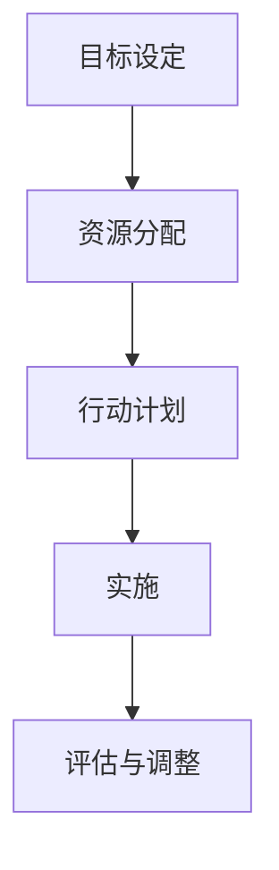
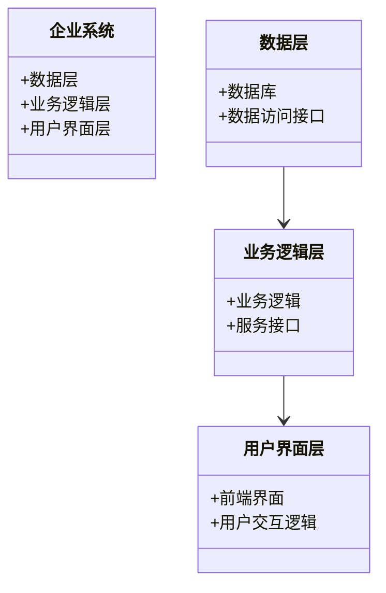

                 


# 威廉·贝恩的企业价值提升策略

## 关键词：企业价值提升，威廉·贝恩，战略规划，运营效率，客户价值，风险管理

## 摘要：威廉·贝恩作为世界著名的企业战略咨询专家，提出了一系列提升企业价值的策略。本文将从企业价值的定义、提升的必要性、核心策略、数学模型、系统架构、项目实战到最佳实践等方面，全面解析威廉·贝恩的企业价值提升策略。通过详细讲解每种策略的原理和应用，结合实际案例，帮助读者掌握如何有效提升企业价值。

---

## 第一部分：企业价值提升的背景与概念

### 第1章：企业价值提升的背景与概念

#### 1.1 企业的定义与基本概念

企业是现代社会最基本的经济单位，通过资源整合和价值创造，为企业股东和利益相关者创造经济价值。企业价值的定义是企业在市场上所能实现的经济价值，包括资产价值、运营效率、市场地位和客户忠诚度等多个方面。

企业价值的来源可以分为资产、负债、收入和成本。资产是企业创造价值的基础，负债则是企业运营中的资金来源，收入是企业的主要经济来源，成本则是企业在生产过程中需要支出的费用。

提升企业价值的重要性体现在企业的可持续发展、股东利益最大化和市场竞争中的优势。通过提升企业价值，企业能够增强市场竞争力，吸引更多的投资者，从而实现长期稳定的发展。

---

### 第2章：企业价值的来源

#### 2.1 企业价值的来源分析

企业价值的来源主要分为资产、负债、收入和成本四个方面。

| 来源 | 描述 | 影响 |
|------|------|------|
| 资产 | 企业的有形和无形资产，如设备、专利等 | 资产的优劣直接影响企业的生产能力 |
| 负债 | 企业的债务和财务负担 | 合理的负债结构有助于优化资本结构 |
| 收入 | 企业的销售收入和利润 | 收入是企业价值的核心来源 |
| 成本 | 企业的生产成本和运营费用 | 成本控制直接影响企业的利润和价值 |

企业价值的来源分析需要结合企业的实际情况，找到影响企业价值的关键因素，并进行针对性的优化。

---

## 第二部分：企业价值提升的核心策略

### 第3章：企业战略规划与价值定位

#### 3.1 战略规划的制定

战略规划是企业提升价值的重要手段，主要包括目标设定、资源分配和行动计划。通过明确的目标和合理的资源分配，企业能够更高效地实现价值提升。

战略规划的制定步骤如下：

1. **目标设定**：明确企业的长期目标和短期目标。
2. **资源分配**：根据目标分配资金、人力和时间。
3. **行动计划**：制定具体的实施步骤和时间表。

#### 3.2 战略实施的流程图



通过流程图可以看出，战略规划的实施是一个循环的过程，需要不断评估和调整，以适应市场变化。

---

### 第4章：企业运营效率的提升

#### 4.1 运营效率的优化

运营效率是影响企业价值的重要因素，主要包括生产流程优化和成本控制。通过分析企业的生产流程，找出瓶颈并进行优化，可以显著提升企业的运营效率。

#### 4.2 运营效率优化的数学模型

企业运营效率可以通过以下公式进行评估：

$$
\text{运营效率} = \frac{\text{总产量}}{\text{生产时间}}
$$

通过分析总产量和生产时间的关系，企业可以找到优化的方向。

---

## 第三部分：企业价值提升的系统架构与实现

### 第5章：企业系统的架构设计

#### 5.1 系统架构的优化

企业系统的架构设计直接影响企业的运营效率和价值。通过优化系统的架构，企业可以提升信息的流通效率和资源的利用率。

#### 5.2 系统架构优化的类图



通过类图可以看出，企业系统的优化需要各层之间的高效协作。

---

## 第四部分：企业价值提升的项目实战

### 第6章：企业价值提升的案例分析

#### 6.1 案例背景介绍

某制造企业通过优化生产流程和引入新的技术设备，显著提升了企业的运营效率和产品品质。

#### 6.2 项目实施的核心代码

以下是优化后的生产流程代码示例：

```python
def optimize_production():
    # 数据获取
    raw_data = get_raw_data()
    # 数据处理
    processed_data = process_data(raw_data)
    # 生产优化
    optimized_output = optimize(processed_data)
    return optimized_output

# 调用函数
optimize_production()
```

通过代码实现，企业可以显著提高生产效率，降低成本。

---

## 第五部分：企业价值提升的最佳实践

### 第7章：最佳实践与未来趋势

#### 7.1 提升企业价值的注意事项

- 确保战略规划的可行性和可操作性。
- 加强企业内部的沟通与协作。
- 定期评估和调整企业的运营策略。

#### 7.2 未来趋势与展望

随着信息技术的不断发展，企业价值的提升将更加依赖于数字化转型和智能化管理。未来的挑战是通过技术创新和管理优化，进一步提升企业的核心竞争力。

---

## 结语

威廉·贝恩的企业价值提升策略为企业提供了系统化的解决方案，从战略规划到系统优化，再到项目实施，每一个环节都需要细致的分析和执行。通过本文的详细讲解，读者可以全面理解威廉·贝恩的策略，并将其应用到实际的企业管理中。

---

## 作者：AI天才研究院 & 禅与计算机程序设计艺术

作者简介：AI天才研究院专注于人工智能和计算机科学的研究与实践，致力于为企业提供创新的技术解决方案。禅与计算机程序设计艺术则关注技术背后的哲学思考，探索技术与人类生活的深度融合。

