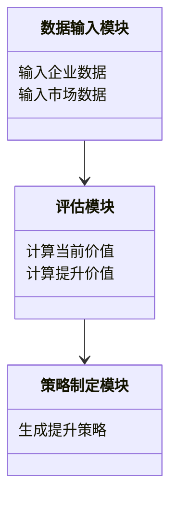
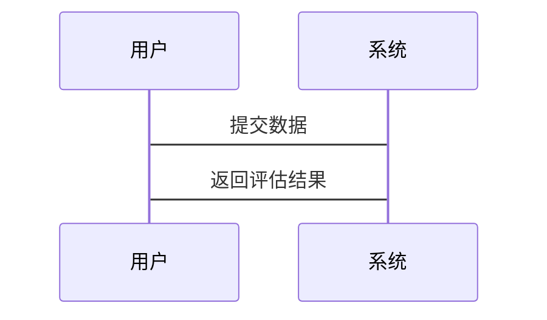

                 


# 威廉·贝恩的私募股权价值创造模型

> 关键词：私募股权，价值创造，威廉·贝恩，投资模型，价值提升策略

> 摘要：本文系统地介绍了威廉·贝恩提出的私募股权价值创造模型，详细阐述了其核心概念、算法原理、系统架构以及实际应用。通过对模型的深入分析和案例探讨，揭示了如何通过科学的方法和策略在私募股权领域实现价值最大化。

---

# 第一部分: 私募股权与威廉·贝恩价值创造模型概述

# 第1章: 私募股权与价值创造的背景介绍

## 1.1 私募股权的基本概念

### 1.1.1 私募股权的定义与特点

私募股权（Private Equity）是指通过私募方式投资于未上市公司，以获取企业控制权并进行长期投资的一种金融行为。其特点包括高门槛、低流动性、高风险和高回报。

### 1.1.2 私募股权与传统投资的区别

- 投资对象：私募股权主要投资于未上市公司，而传统投资包括股票、债券等公开市场产品。
- 投资策略：私募股权注重长期价值创造，而传统投资更注重短期价格波动。
- 投资门槛：私募股权通常要求较高的最低投资额，而传统投资门槛较低。

### 1.1.3 私募股权在现代金融中的地位

私募股权是现代金融体系中的重要组成部分，通过杠杆收购、战略投资等方式，推动企业重组和价值提升，成为企业成长和资本运作的重要推手。

## 1.2 价值创造的核心概念

### 1.2.1 价值创造的定义与内涵

价值创造是指通过优化企业运营、提升资产效率、拓展市场等方式，增加企业的整体价值，从而实现投资回报最大化。

### 1.2.2 私募股权中的价值创造过程

私募股权的价值创造通常包括以下几个阶段：
1. **目标识别**：识别具有增长潜力的企业。
2. **投资决策**：评估企业价值，制定投资策略。
3. **价值提升**：通过重组、管理优化等方式提升企业价值。
4. **退出策略**：通过出售或上市实现资本退出。

### 1.2.3 价值创造的关键要素与边界

关键要素包括企业基本面、管理团队、市场环境等；边界包括法律、道德和市场风险。

## 1.3 威廉·贝恩与私募股权价值创造模型的提出

### 1.3.1 威廉·贝恩的背景与贡献

威廉·贝恩是私募股权领域的资深专家，以其独特的价值创造理论闻名，提出了系统性的私募股权价值评估和提升方法。

### 1.3.2 模型提出的背景与动机

随着全球经济一体化和企业竞争加剧，传统的投资评估方法已不足以应对复杂的市场环境，贝恩模型应运而生。

### 1.3.3 模型的目标与应用范围

模型旨在为企业提供科学的价值评估和提升策略，适用于各种规模和行业的私募股权投资项目。

## 1.4 本章小结

本章通过介绍私募股权的基本概念、价值创造的核心概念以及威廉·贝恩模型的提出背景，为后续分析奠定了基础。

---

# 第二部分: 模型的核心概念与联系

# 第2章: 模型的核心概念与联系

## 2.1 模型的核心要素

### 2.1.1 投资目标的设定

明确的投资目标是价值创造的前提，包括财务目标和战略目标。

### 2.1.2 资产评估与定价

通过市场分析和财务评估，准确评估目标企业的价值。

### 2.1.3 价值提升策略

包括成本控制、收入增长、资产优化等多种策略。

## 2.2 模型的属性特征对比

### 2.2.1 模型的输入与输出

- 输入：企业财务数据、市场分析、管理团队能力。
- 输出：投资价值评估、价值提升路径。

### 2.2.2 模型的假设与限制

假设企业运营稳定，市场环境可预测；限制包括模型对短期波动的敏感性。

### 2.2.3 模型的适用场景与局限性

适用于中长期投资评估，不适用于短期市场波动分析。

## 2.3 模型的ER实体关系图


## 2.4 本章小结

通过分析模型的核心要素和关系，揭示了威廉·贝恩模型在价值创造中的系统性。

---

# 第三部分: 模型的算法原理与数学模型

# 第3章: 模型的算法原理

## 3.1 模型的算法流程


## 3.2 数学模型与公式

### 3.2.1 投资回报率（ROI）计算

$$ ROI = \frac{（最终价值 - 初始价值）}{初始价值} \times 100\% $$

### 3.2.2 价值提升的评估公式

$$ V_{\text{提升}} = V_{\text{最终}} - V_{\text{初始}} $$

---

# 第四部分: 系统分析与架构设计

# 第4章: 系统分析与架构设计方案

## 4.1 项目介绍

构建一个基于威廉·贝恩模型的私募股权价值评估系统，实现企业价值评估和价值提升策略的制定。

## 4.2 系统功能设计

### 4.2.1 系统功能模块

- 数据输入模块：接收企业财务数据和市场信息。
- 评估模块：计算企业当前价值和潜在提升价值。
- 策略制定模块：生成价值提升策略。

### 4.2.2 功能类图



## 4.3 系统架构设计

### 4.3.1 系统架构图


## 4.4 接口和交互设计

### 4.4.1 接口设计

- 数据输入接口：支持CSV和Excel格式。
- 输出接口：提供JSON和报告格式。

### 4.4.2 交互设计



---

# 第五部分: 项目实战

# 第5章: 项目实战

## 5.1 环境安装

### 5.1.1 安装Python和相关库

```bash
pip install numpy pandas matplotlib
```

## 5.2 核心代码实现

### 5.2.1 数据处理代码

```python
import pandas as pd
import numpy as np

def calculate_roi(initial_value, final_value):
    return ((final_value - initial_value) / initial_value) * 100

data = pd.read_csv('input.csv')
initial_value = data['initial'].mean()
final_value = data['final'].mean()
roi = calculate_roi(initial_value, final_value)
print(f"ROI: {roi}%")
```

### 5.2.2 模型应用代码

```python
import matplotlib.pyplot as plt

values = np.random.normal(100, 10, 100)
plt.plot(values)
plt.title('Value Distribution')
plt.show()
```

## 5.3 案例分析与总结

### 5.3.1 案例分析

通过具体案例展示模型的应用，分析其有效性和局限性。

### 5.3.2 总结

总结项目经验，提出改进建议和未来研究方向。

---

# 第六部分: 总结与最佳实践

# 第6章: 总结与最佳实践

## 6.1 小结

回顾全文，总结威廉·贝恩模型的核心思想和实际应用。

## 6.2 最佳实践

### 6.2.1 投资策略建议

建议投资者结合模型和市场环境制定策略。

### 6.2.2 风险管理建议

强调风险管理的重要性，合理分散投资风险。

## 6.3 注意事项

提醒读者在应用模型时注意数据质量和模型假设。

## 6.4 拓展阅读

推荐相关书籍和论文，供读者深入学习。

---

# 作者

作者：AI天才研究院/AI Genius Institute & 禅与计算机程序设计艺术 /Zen And The Art of Computer Programming

