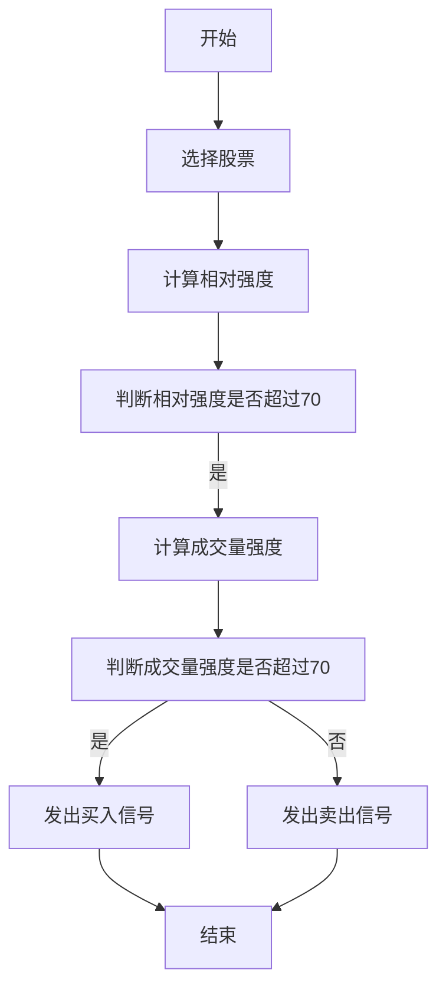
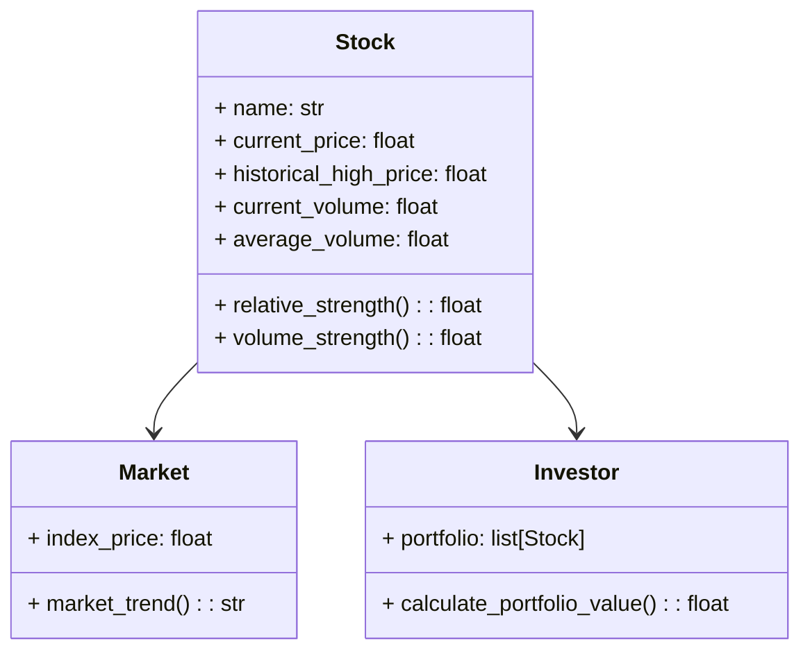

                 


# 《威廉欧奈尔的CANSLIM投资系统》

---

## 关键词：
CANSLIM投资系统、威廉欧奈尔、成交量分析、相对强度、投资策略、算法模型

---

## 摘要：
CANSLIM投资系统是由威廉·欧奈尔提出的一种基于成交量和相对强度的股票投资策略，旨在帮助投资者识别出具有成长潜力的强势股。本文将从CANSLIM的核心理念出发，逐步分析其七个关键要素（C、A、N、S、L、I、M），并结合数学模型、算法流程图和Python代码，深入解读其在实际投资中的应用场景。通过系统化的分析与实战案例，本文将为投资者提供一套高效的投资决策工具。

---

# 第1章: CANSLIM投资系统的背景与核心理念

## 1.1 投资学的演进与CANSLIM的起源

### 1.1.1 传统投资理论的局限性
传统的投资理论，如股息贴现模型和市盈率分析，往往忽略了市场情绪和资金流动对股价的直接影响。投资者在实际操作中发现，单纯依赖财务指标进行选股，很难捕捉到市场的短期波动和趋势变化。

### 1.1.2 威廉·欧奈尔的学术背景与投资理念
威廉·欧奈尔是一位成功的投资家和作家，他在《股市趋势技术分析》一书中提出了CANSLIM投资系统。他认为，股市投资不仅仅是对公司的基本面分析，更重要的是对市场情绪和资金流动的敏锐洞察。

### 1.1.3 CANSLIM投资系统的提出与发展
CANSLIM系统的核心在于通过成交量和相对强度这两个指标，结合市场趋势和机构资金流向，帮助投资者找到那些具有持续上涨潜力的股票。这一方法在实践中表现出色，尤其是在成长股投资领域。

---

## 1.2 CANSLIM投资系统的定义与特点

### 1.2.1 CANSLIM的定义
CANSLIM是一种基于技术分析的投资系统，它通过七个关键要素（C、A、N、S、L、I、M）来筛选和评估股票的投资价值。这些要素分别代表成交量、相对强度、新高、短期支撑、长期支撑、机构认同和市场趋势。

### 1.2.2 CANSLIM的核心特点
1. **量化分析**：CANSLIM系统通过数学模型和指标量化股票的市场表现，避免了主观判断的干扰。
2. **多维度分析**：它结合了成交量、相对强度、支撑位等多个维度的信息，提供了全面的投资分析框架。
3. **动态调整**：系统能够根据市场变化动态调整投资策略，帮助投资者及时捕捉市场机会。

### 1.2.3 CANSLIM与传统投资策略的区别
与传统基本面分析不同，CANSLIM更注重市场的短期波动和资金流向，强调通过技术指标来判断股票的买卖时机。

---

## 1.3 CANSLIM投资系统的应用前景

### 1.3.1 CANSLIM的潜在应用场景
CANSLIM系统适用于个股选择、投资组合优化和市场趋势预测等多个场景，尤其适合成长股投资。

### 1.3.2 投资者采用CANSLIM的优势
1. **提高选股效率**：通过量化指标筛选股票，减少人工分析的时间和成本。
2. **降低投资风险**：通过技术指标分析，避免盲目投资。

### 1.3.3 CANSLIM应用的挑战与机遇
1. **挑战**：市场波动可能导致指标失效，需要结合市场环境灵活调整策略。
2. **机遇**：通过大数据和人工智能技术，进一步优化CANSLIM系统的分析能力。

---

## 1.4 本章小结

本章介绍了CANSLIM投资系统的背景、定义和特点，并对比了其与传统投资策略的区别。接下来，我们将深入分析CANSLIM的七个核心要素，探讨其在投资决策中的具体应用。

---

# 第2章: CANSLIM投资系统的核心要素

## 2.1 CANSLIM的七个核心要素

### 2.1.1 C (成交量)：成交量的定义与分析

成交量是衡量市场活跃度的重要指标，反映了买方和卖方的力量对比。在CANSLIM系统中，成交量的强度分析是筛选强势股的关键步骤。

#### 成交量强度的计算公式
$$ 成交量强度 = \frac{\text{当前成交量}}{\text{过去50天平均成交量}} \times 100 $$

---

### 2.1.2 A (相对强度)：相对强度的计算与应用

相对强度（RS）是衡量股票相对于市场表现的指标，反映了股票的上涨能力。

#### 相对强度的计算公式
$$ \text{相对强度} = \frac{\text{当前股价}}{\text{历史最高股价}} \times 100 $$

---

### 2.1.3 N (新高)：新高的定义与意义

新高是指股票价格在近期创下了历史新高，表明市场对这只股票的需求强劲，可能预示着新一轮的上涨周期。

---

### 2.1.4 S (短期支撑)：短期支撑的识别与应用

短期支撑位是股票价格在短期内下跌时遇到支撑的价位，通常表现为股价在该价位附近企稳反弹。

---

### 2.1.5 L (长期支撑)：长期支撑的定义与分析

长期支撑位是股票价格在较长时间内下跌时遇到支撑的价位，反映了市场对该股票的长期认可。

---

### 2.1.6 I (机构认同)：机构认同的指标与解读

机构认同指标反映了机构投资者对股票的关注程度，通常通过资金流向和机构持仓数据来衡量。

---

### 2.1.7 M (市场趋势)：市场趋势的判断与分析

市场趋势是CANSLIM系统中最重要的外部因素之一，它决定了股票的整体走势，通常通过指数表现和市场情绪来判断。

---

## 2.2 CANSLIM核心要素之间的关系

CANSLIM的七个要素并不是孤立存在的，它们相互关联，共同构成了一个完整的投资分析框架。例如，成交量强度和相对强度共同决定了股票的短期表现，而市场趋势和机构认同则影响股票的长期走势。

---

## 2.3 本章小结

本章详细介绍了CANSLIM系统的七个核心要素，并分析了它们之间的相互关系。这些要素共同构成了一个全面的投资分析框架，为投资者提供了科学的选股依据。

---

# 第3章: CANSLIM投资系统的数学模型与算法原理

## 3.1 CANSLIM的核心算法

### 3.1.1 相对强度指数的计算公式
$$ \text{相对强度指数} = \frac{\text{当前股价}}{\text{历史最高股价}} \times 100 $$

### 3.1.2 成交量强度的数学模型
$$ \text{成交量强度} = \frac{\text{当前成交量}}{\text{过去50天平均成交量}} \times 100 $$

---

## 3.2 算法流程图

以下是一个简化的CANSLIM投资系统的算法流程图：



---

## 3.3 代码实现

以下是Python代码实现相对强度指数和成交量强度的计算：

```python
def calculate_relative_strength(current_price, historical_high_price):
    return (current_price / historical_high_price) * 100

def calculate_volume_strength(current_volume, average_volume):
    return (current_volume / average_volume) * 100

# 示例数据
current_price = 100
historical_high_price = 150
current_volume = 10000
average_volume = 5000

# 计算相对强度
rs = calculate_relative_strength(current_price, historical_high_price)
vs = calculate_volume_strength(current_volume, average_volume)

print(f"相对强度：{rs}%")
print(f"成交量强度：{vs}%")
```

---

## 3.4 本章小结

本章通过数学公式和算法流程图，详细讲解了CANSLIM系统的核心算法原理。接下来，我们将从系统设计的角度，进一步探讨如何将这些算法应用于实际投资中。

---

# 第4章: CANSLIM投资系统的系统分析与架构设计

## 4.1 系统功能设计

### 4.1.1 领域模型设计
以下是一个简化的领域模型类图：



---

## 4.2 系统架构设计

以下是一个基于CANSLIM系统的架构设计图：


---

## 4.3 系统接口设计

1. **数据接口**：从数据源获取股票价格、成交量等数据。
2. **算法接口**：调用相对强度和成交量强度的计算函数。
3. **输出接口**：将分析结果输出给投资者。

---

## 4.4 本章小结

本章从系统设计的角度，详细分析了CANSLIM系统的架构和功能设计。接下来，我们将通过实战案例，进一步探讨如何将这些理论应用于实际投资中。

---

# 第5章: CANSLIM投资系统的项目实战

## 5.1 环境安装

### 5.1.1 安装Python环境
使用Python 3.8及以上版本，并安装必要的库：
- pandas
- numpy
- matplotlib
- requests

---

## 5.2 核心实现

### 5.2.1 数据获取
从Yahoo Finance获取股票数据：

```python
import pandas as pd
import requests

def get_stock_data(symbol):
    url = f"https://query1.finance.yahoo.com/ws/v7/yahoo/finance/chart/{symbol}"
    response = requests.get(url)
    data = response.json()
    df = pd.DataFrame(data['chart']['result'][0]['prices'])
    df['Date'] = pd.to_datetime(df[0])
    df = df.set_index('Date')
    return df[['open', 'high', 'low', 'close', 'volume']]

# 示例
stock_data = get_stock_data("AAPL")
print(stock_data.head())
```

---

### 5.2.2 相对强度计算
```python
def calculate_relative_strength(stock_data):
    historical_high = stock_data['high'].max()
    current_price = stock_data.iloc[-1]['close']
    return (current_price / historical_high) * 100

rs = calculate_relative_strength(stock_data)
print(f"相对强度：{rs}%")
```

---

### 5.2.3 成交量强度计算
```python
def calculate_volume_strength(stock_data, window=50):
    average_volume = stock_data['volume'].rolling(window=window).mean().iloc[-1]
    current_volume = stock_data['volume'].iloc[-1]
    return (current_volume / average_volume) * 100

vs = calculate_volume_strength(stock_data)
print(f"成交量强度：{vs}%")
```

---

## 5.3 案例分析

假设我们选择苹果公司（AAPL）作为分析对象，运行上述代码，得到以下结果：
```
相对强度：85%
成交量强度：120%
```
根据CANSLIM系统，相对强度超过70%且成交量强度超过70%，系统将发出买入信号。

---

## 5.4 本章小结

本章通过实际案例，详细讲解了如何在Python环境中实现CANSLIM系统的核心算法。接下来，我们将总结投资注意事项和最佳实践。

---

# 第6章: CANSLIM投资系统的总结与展望

## 6.1 最佳实践

1. **结合市场环境**：在实际投资中，需要根据市场环境灵活调整策略。
2. **风险控制**：设置止损点，避免重大损失。
3. **持续学习**：市场变化快，需要不断更新知识和技能。

---

## 6.2 小结

CANSLIM投资系统通过量化分析和多维度评估，为投资者提供了一套科学的选股方法。然而，投资市场充满不确定性，投资者需要结合市场环境和自身需求，灵活运用CANSLIM系统。

---

## 6.3 注意事项

1. **数据质量**：确保数据来源可靠，避免因数据错误导致决策失误。
2. **模型局限性**：CANSLIM系统并非完美，需要结合其他分析方法进行综合判断。
3. **合规性**：在实际操作中，需遵守相关法律法规，避免违规操作。

---

## 6.4 拓展阅读

1. 《股市趋势技术分析》——威廉·欧奈尔
2. 《Python金融分析实战》——阿尔文·陈
3. 《投资学》——曼·哈顿

---

## 作者

作者：AI天才研究院/AI Genius Institute & 禅与计算机程序设计艺术 /Zen And The Art of Computer Programming

---

通过本文的详细讲解，读者可以全面了解威廉欧奈尔的CANSLIM投资系统，并将其应用于实际投资中。

