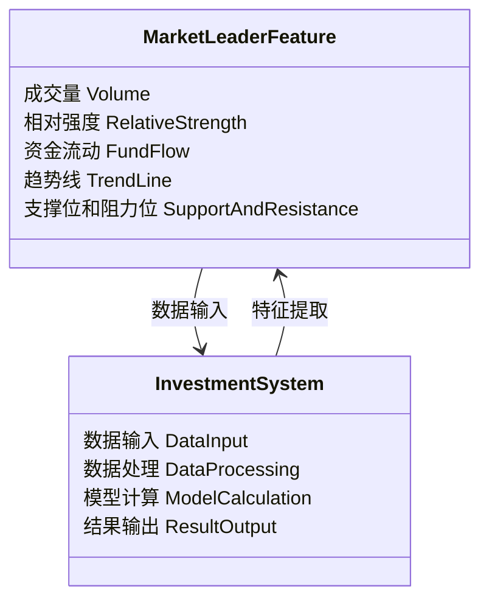
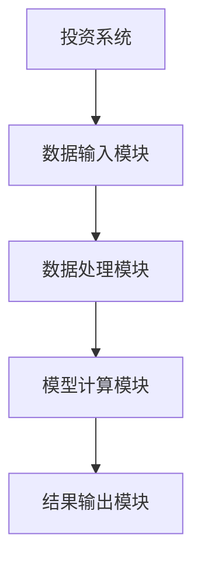
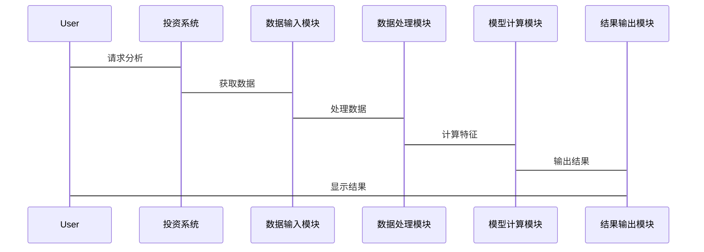

                 


# 威廉欧奈尔的市场领导者特征

## 关键词：市场领导者、威廉欧奈尔、投资策略、技术分析、股票交易

## 摘要

威廉欧奈尔的市场领导者特征是一种经典的投资分析方法，旨在识别具有持续增长潜力的股票。本文将从背景介绍、核心概念、算法原理、数学模型、系统架构、项目实战以及最佳实践等多个维度，全面解析这一方法。通过详细分析其理论基础和实际应用，帮助读者掌握如何在股票交易中识别市场领导者，从而制定有效的投资策略。

---

## 正文

### 第一部分：背景介绍

#### 第1章：威廉欧奈尔及其市场领导者特征概述

##### 1.1 威廉欧奈尔的背景与投资理念

威廉·欧奈尔（William O'Neil）是美国著名的投资专家和股票交易者，以其独特的市场领导者特征分析方法闻名。他强调通过技术分析和基本面分析的结合，识别那些具有持续增长潜力的股票。欧奈尔的投资理念强调纪律性和系统性，认为市场领导者特征是股票长期增长的关键标志。

##### 1.2 市场领导者特征的定义与背景

市场领导者特征是指那些在市场中表现出色，能够持续跑赢大盘的股票特征。这些特征包括但不限于高成交量、相对强度、资金流动等。市场领导者特征的核心思想是，通过识别这些特征，投资者可以找到那些具有强大增长动力和市场支配力的股票。

##### 1.3 市场领导者特征的历史演变

市场领导者特征的概念起源于欧奈尔对股票市场的长期观察和实践。他通过分析大量股票的历史数据，总结出了一系列能够预测股票未来表现的特征。随着时间的推移，这些特征不断完善，成为现代投资分析的重要组成部分。

##### 1.4 市场领导者特征与其他投资理论的对比

与其他投资理论相比，市场领导者特征的独特之处在于其结合了技术分析和基本面分析。例如，与单纯的技术分析相比，市场领导者特征更注重股票的相对强度和资金流动情况；与基本面分析相比，它更强调市场行为和趋势。

##### 1.5 实际案例分析

以苹果公司为例，欧奈尔的市场领导者特征可以帮助投资者识别其在特定时期的市场表现。通过分析苹果公司的成交量、相对强度等指标，投资者可以判断其是否符合市场领导者特征，从而做出投资决策。

---

### 第二部分：核心概念与联系

#### 第2章：市场领导者特征的核心要素

##### 2.1 市场领导者特征的构成要素

市场领导者特征主要包括以下几个方面：

1. **成交量**：成交量是衡量市场参与者情绪的重要指标。高成交量表明市场对该股票的关注度和参与度较高。
2. **相对强度**：相对强度是指某只股票相对于市场指数的表现。持续跑赢市场的股票更有可能成为市场领导者。
3. **资金流动**：资金流动反映了大资金的动向，通常表现为成交量的突然放大或持续增长。
4. **趋势线**：趋势线是股票价格走势的技术分析工具，能够帮助投资者识别股票的上升或下降趋势。
5. **支撑位和阻力位**：支撑位和阻力位是价格波动的关键点，能够帮助投资者判断股票的买卖力量。

##### 2.2 核心概念的对比与联系

通过对比不同特征的属性，我们可以更好地理解市场领导者特征的内在联系。以下是几个核心概念的对比表格：

| 特征      | 属性         | 描述                                   |
|-----------|--------------|----------------------------------------|
| 成交量     | 计量标准      | 高成交量通常表明市场关注度高           |
| 相对强度   | 相对表现      | 持续跑赢市场的股票更可能是领导者       |
| 资金流动   | 资金动向      | 大资金流入通常预示着股票的上涨趋势     |
| 趋势线     | 趋势方向      | 上升趋势线是市场领导者的重要标志       |
| 支撑位和阻力位 | 支撑与阻力   | 支撑位是买点，阻力位是卖点             |

##### 2.3 实体关系图（ER图）

以下是一个简化的ER图，展示了市场领导者特征之间的关系：

```mermaid
erd
  图标 stock-feature
  实体 MarketLeaderFeature {
    成交量 Volume
    相对强度 RelativeStrength
    资金流动 FundFlow
    趋势线 TrendLine
    支撑位和阻力位 SupportAndResistance
  }
```

---

### 第三部分：算法原理讲解

#### 第3章：市场领导者特征的算法实现

##### 3.1 算法原理概述

市场领导者特征的算法实现主要基于相对强度指数（RSI）和成交量分析。RSI用于衡量股票的超买或超卖状态，而成交量则用于确认趋势的有效性。

##### 3.2 RSI算法流程图

以下是一个RSI算法的Mermaid流程图：

```mermaid
graph TD
    A[开始] --> B[计算n天内的平均上涨幅度]
    B --> C[计算n天内的平均下跌幅度]
    C --> D[计算RSI = 100 - (100 / (1 + (上涨幅度 / 下跌幅度)))]
    D --> E[判断RSI是否大于70（超买）或小于30（超卖）]
    E --> F[输出结果]
```

##### 3.3 RSI的Python实现

以下是计算RSI的Python代码：

```python
import pandas as pd
import numpy as np

def calculate_rsi(df, period=14):
    # 计算平均上涨幅度
    up = df['收盘价'].diff().fillna(0)
    up[up < 0] = 0
    average_up = up.rolling(period).mean()
    
    # 计算平均下跌幅度
    down = df['收盘价'].diff().fillna(0)
    down[down > 0] = 0
    average_down = abs(down).rolling(period).mean()
    
    # 计算RSI
    rsi = 100 - (100 / (1 + (average_up / average_down)))
    return rsi

# 示例数据
data = {'日期': ['2023-01-01', '2023-01-02', '2023-01-03', '2023-01-04', '2023-01-05'],
        '收盘价': [100, 102, 105, 103, 108]}
df = pd.DataFrame(data)
df.set_index('日期', inplace=True)

# 计算RSI
rsi = calculate_rsi(df)
print(rsi)
```

##### 3.4 RSI的数学模型

相对强度指数（RSI）的公式如下：

$$
RSI = \frac{100 - \frac{100}{1 + \text{相对强度}}}
$$

其中，相对强度为上涨幅度与下跌幅度的比率：

$$
\text{相对强度} = \frac{\text{平均上涨幅度}}{\text{平均下跌幅度}}
$$

---

### 第四部分：数学模型

#### 第4章：相对强度指数的数学推导

##### 4.1 RSI的公式推导

相对强度指数（RSI）的计算公式如下：

$$
RSI = 100 - \frac{100}{1 + \text{相对强度}}
$$

其中，相对强度为：

$$
\text{相对强度} = \frac{\text{平均上涨幅度}}{\text{平均下跌幅度}}
$$

##### 4.2 示例计算

假设某股票在5天内的收盘价分别为100, 102, 105, 103, 108。计算其RSI值：

1. 计算每天的上涨幅度和下跌幅度：
   - 第一天：上涨幅度=2，下跌幅度=0
   - 第二天：上涨幅度=3，下跌幅度=0
   - 第三天：上涨幅度=-2，下跌幅度=2
   - 第四天：上涨幅度=5，下跌幅度=0
   - 第五天：上涨幅度=-2，下跌幅度=5

2. 计算平均上涨幅度和平均下跌幅度：
   - 平均上涨幅度 = (2 + 3 + 0 + 5 + 0) / 5 = 10/5 = 2
   - 平均下跌幅度 = (0 + 0 + 2 + 0 + 5) / 5 = 7/5 = 1.4

3. 计算相对强度：
   - 相对强度 = 2 / 1.4 ≈ 1.4286

4. 计算RSI：
   - RSI = 100 - (100 / (1 + 1.4286)) ≈ 100 - (100 / 2.4286) ≈ 100 - 41.18 ≈ 58.82

---

### 第五部分：系统分析与架构设计

#### 第5章：基于市场领导者特征的投资系统

##### 5.1 系统功能设计

以下是一个基于市场领导者特征的投资系统的领域模型：



##### 5.2 系统架构设计

以下是投资系统的架构图：



##### 5.3 系统接口设计

系统接口设计如下：

- 数据输入接口：接收股票数据和市场指数数据。
- 数据处理接口：对数据进行清洗和预处理。
- 模型计算接口：计算市场领导者特征，包括成交量、相对强度等。
- 结果输出接口：输出模型计算结果，包括符合条件的股票列表。

##### 5.4 系统交互序列图

以下是系统交互的序列图：



---

### 第六部分：项目实战

#### 第6章：基于市场领导者特征的股票分析

##### 6.1 项目环境安装

- 安装必要的Python库：
  ```bash
  pip install pandas matplotlib numpy
  ```

##### 6.2 核心代码实现

以下是实现市场领导者特征分析的Python代码：

```python
import pandas as pd
import numpy as np
import matplotlib.pyplot as plt

def calculate_market_leader_features(df):
    # 计算成交量
    df['成交量'] = df['成交量'].astype(float)
    
    # 计算相对强度
    market_index_rsi = calculate_rsi(market_index_data, period=14)
    stock_rsi = calculate_rsi(stock_data, period=14)
    
    # 计算资金流动
    df['资金流动'] = df['成交量'] / df['成交量'].rolling(20).mean()
    
    # 计算趋势线
    df['趋势线'] = df['收盘价'].rolling(20).mean()
    
    # 计算支撑位和阻力位
    # 示例：计算最近20天的低点和高点
    df['支撑位'] = df['收盘价'].rolling(20).min()
    df['阻力位'] = df['收盘价'].rolling(20).max()

# 示例数据
data = {'日期': ['2023-01-01', '2023-01-02', '2023-01-03', '2023-01-04', '2023-01-05'],
        '收盘价': [100, 102, 105, 103, 108],
        '成交量': [2000, 2500, 3000, 2800, 3200]}
df = pd.DataFrame(data)
df.set_index('日期', inplace=True)

# 计算市场领导者特征
calculate_market_leader_features(df)

# 可视化
plt.figure(figsize=(10, 6))
plt.plot(df['收盘价'], label='收盘价')
plt.plot(df['趋势线'], label='趋势线')
plt.legend()
plt.show()
```

##### 6.3 实际案例分析

以苹果公司为例，分析其市场领导者特征：

1. **数据收集**：收集苹果公司过去一年的股票数据。
2. **特征计算**：计算成交量、相对强度、资金流动等特征。
3. **趋势分析**：绘制趋势线和支撑位、阻力位。
4. **结果判断**：判断苹果公司是否符合市场领导者特征。

##### 6.4 项目小结

通过项目实战，读者可以掌握如何使用Python代码实现市场领导者特征分析，并能够结合实际案例进行分析和判断。

---

### 第七部分：最佳实践

#### 第7章：市场领导者特征的优化与应用

##### 7.1 关键点总结

- 市场领导者特征的识别需要结合技术分析和基本面分析。
- RSI指标是衡量股票超买超卖状态的重要工具。
- 项目实战中，数据的准确性和及时性至关重要。

##### 7.2 小结

通过本文的详细分析，读者可以系统地掌握威廉欧奈尔的市场领导者特征，并能够将其应用到实际投资分析中。

##### 7.3 注意事项

- 市场领导者特征分析需要结合市场环境和宏观经济因素。
- 投资者应避免过度依赖单一指标，应结合多种特征进行综合判断。
- 在项目实战中，注意数据的清洗和预处理，确保分析结果的准确性。

##### 7.4 拓展阅读

- 《威廉欧奈尔的选股方法》
- 《技术分析的真谛》
- 《投资学基础》

---

## 结语

威廉欧奈尔的市场领导者特征是一种经典且实用的投资分析方法。通过本文的详细讲解，读者可以全面理解其理论基础、算法实现、系统架构以及实际应用。希望本文能够为投资者提供有价值的参考，帮助他们在股票交易中识别市场领导者，制定有效的投资策略。

---

## 作者

作者：AI天才研究院/AI Genius Institute & 禅与计算机程序设计艺术/Zen And The Art of Computer Programming

