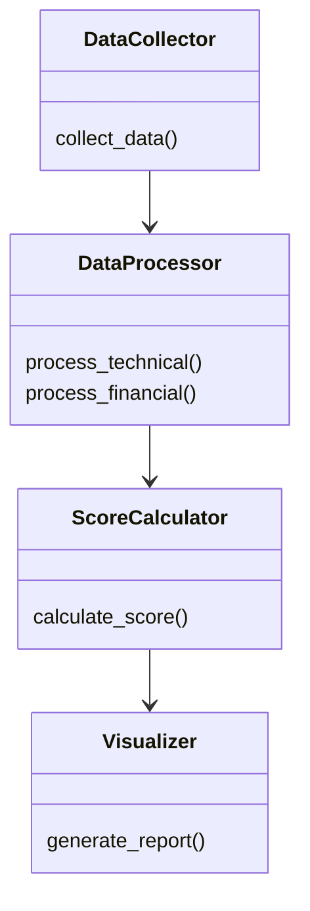
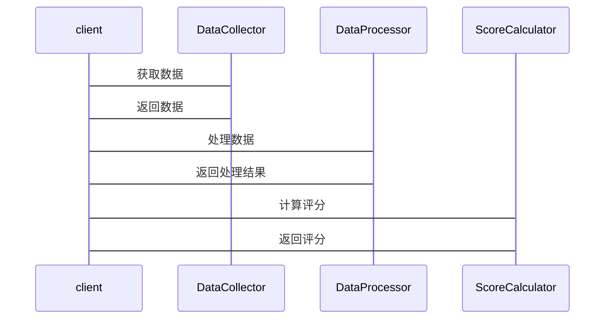

                 


# 威廉欧奈尔的技术面与基本面结合

## 关键词：技术面分析、基本面分析、投资决策、指标计算、系统架构、Python实现

## 摘要：
本文将详细探讨威廉·欧奈尔的技术面与基本面结合分析方法，从背景介绍、核心概念、算法原理到系统架构设计和项目实战，全面解析如何将技术分析和基本面分析结合，构建一个高效的投资决策支持系统。通过具体的代码实现和案例分析，帮助读者理解并掌握这一结合方法。

---

## 第一部分：技术面与基本面分析的背景与基础

### 第1章：技术面分析的概述

#### 1.1 技术面分析的定义与核心概念

##### 1.1.1 技术面分析的定义
技术面分析是一种通过研究资产价格的历史走势，预测未来价格变化的方法。它基于市场的行为和价格走势，分析市场的买卖行为、趋势和形态。

##### 1.1.2 技术面分析的核心要素
- 价格：资产的市场价格走势。
- 时间：价格走势的时间周期。
- 交易量：成交的量，反映市场的活跃程度。

##### 1.1.3 技术面分析的适用场景
技术面分析适用于股票、外汇、期货等金融市场的短期到中期价格预测。

#### 1.2 技术面分析的历史与发展

##### 1.2.1 技术分析的起源
技术分析的起源可以追溯到19世纪末，早期的投资者通过绘制价格图表来观察市场走势。

##### 1.2.2 技术分析的演变与现代发展
随着计算机技术的发展，技术分析从手动绘图逐渐发展为基于算法和量化分析的自动交易系统。

##### 1.2.3 技术分析在现代投资中的地位
技术分析是投资决策中的重要工具之一，尤其在高频交易和算法交易中占据重要地位。

### 第2章：基本面分析的概述

#### 2.1 基本面分析的定义与核心概念

##### 2.1.1 基本面分析的定义
基本面分析是通过研究公司的财务状况、行业地位、管理层等因素，评估其内在价值的一种方法。

##### 2.1.2 基本面分析的核心要素
- 财务报表：包括收入、利润、资产负债等。
- 行业地位：公司在行业中的竞争力。
- 管理层：公司的管理层能力和战略规划。

##### 2.1.3 基本面分析的适用场景
基本面分析适用于长期投资决策，尤其适合价值投资和趋势投资。

#### 2.2 基本面分析的历史与发展

##### 2.2.1 基本面分析的起源
基本面分析起源于18世纪末，早期的投资者通过研究公司的财务状况来评估其价值。

##### 2.2.2 基本面分析的演变与现代发展
随着金融理论的发展，基本面分析从简单的财务分析发展为复杂的多因素模型。

##### 2.2.3 基本面分析在现代投资中的地位
基本面分析是机构投资者和长期投资者的主要工具之一。

---

## 第二部分：技术面与基本面的结合原理

### 第3章：技术面与基本面分析的核心概念与联系

#### 3.1 技术面与基本面分析的核心概念

##### 3.1.1 技术面分析的核心概念
技术面分析的核心概念包括趋势、支撑位、阻力位、成交量等。

##### 3.1.2 基本面分析的核心概念
基本面分析的核心概念包括盈利能力、成长能力、财务健康状况等。

##### 3.1.3 两者的共同点与差异点
- **共同点**：都用于评估资产的价值和风险。
- **差异点**：技术面分析注重价格和交易量，基本面分析注重财务数据和行业地位。

#### 3.2 技术面与基本面分析的联系

##### 3.2.1 技术面与基本面分析的联系
技术面分析可以作为基本面分析的补充，帮助投资者在短期内把握市场情绪和趋势。

##### 3.2.2 技术面与基本面分析的对比
| **属性** | **技术面分析** | **基本面分析** |
|----------|----------------|----------------|
| 数据来源 | 价格、交易量   | 财务报表、行业数据 |
| 分析周期 | 短期到中期     | 中期到长期     |
| 主要用途 | 把握市场情绪   | 评估内在价值   |

##### 3.2.3 技术面与基本面分析的结合
通过结合技术面和基本面分析，投资者可以全面评估资产的价值和风险，制定更加科学的投资策略。

---

### 第4章：技术面与基本面分析的结合算法

#### 4.1 技术面指标的计算与实现

##### 4.1.1 移动平均线（MA）
移动平均线是将一定时期内的价格平均值，用于判断价格趋势。

##### 4.1.2 相对强弱指数（RSI）
RSI用于衡量资产价格的超买或超卖状态，通常取14天的RSI值。

##### 4.1.3 移动平均收敛散度（MACD）
MACD用于判断价格趋势的变化，由短期和长期均线的差值组成。

##### 4.1.4 Python实现
```python
import pandas as pd
import numpy as np

def calculate_ma(prices, window):
    return prices.rolling(window).mean()

def calculate_rsi(prices, window=14):
    diff = prices.diff(1)
    up = diff.where(diff > 0, 0)
    down = abs(diff.where(diff < 0, 0))
    rs = up.rolling(window).sum() / down.rolling(window).sum()
    rsi = 100 - (100 / (1 + rs))
    return rsi

def calculate_macd(prices, short_window=12, long_window=26):
    short_ma = calculate_ma(prices, short_window)
    long_ma = calculate_ma(prices, long_window)
    macd = short_ma - long_ma
    return macd
```

#### 4.2 基本面指标的计算与实现

##### 4.2.1 市盈率（P/E）
市盈率用于评估股票的相对价值，计算公式为：P/E = 市场价 / 每股收益。

##### 4.2.2 市净率（P/B）
市净率用于评估股票的价值，计算公式为：P/B = 市场价 / 每股净资产。

##### 4.2.3 财务健康状况评估
通过分析公司的财务报表，评估公司的盈利能力、成长能力和财务健康状况。

#### 4.3 综合评分模型

##### 4.3.1 综合评分模型的构建
综合评分模型将技术面和基本面指标综合起来，计算资产的综合评分。

##### 4.3.2 综合评分公式
$$ \text{综合评分} = \alpha \times \text{技术面评分} + (1-\alpha) \times \text{基本面评分} $$
其中，$\alpha$ 是技术面和基本面的权重系数。

##### 4.3.3 Python实现
```python
def calculate_technical_score(prices):
    # 计算技术面指标
    ma = calculate_ma(prices, 20)
    rsi = calculate_rsi(prices, 14)
    macd = calculate_macd(prices, 12, 26)
    # 计算技术面评分
    technical_score = (ma + rsi + macd).mean() / 3
    return technical_score

def calculate_financial_score(finance_data):
    # 计算基本面指标
    pe = finance_data['pe']
    pb = finance_data['pb']
    # 计算基本面评分
    financial_score = (pe + pb).mean() / 2
    return financial_score

def calculate_total_score(prices, finance_data, alpha=0.5):
    technical = calculate_technical_score(prices)
    financial = calculate_financial_score(finance_data)
    total_score = alpha * technical + (1 - alpha) * financial
    return total_score
```

---

## 第三部分：技术面与基本面分析的系统架构设计

### 第5章：系统分析与架构设计方案

#### 5.1 问题场景介绍
投资者需要一个高效的投资决策支持系统，结合技术面和基本面分析，提供实时数据和综合评分。

#### 5.2 系统功能设计

##### 5.2.1 领域模型类图


#### 5.3 系统架构设计

##### 5.3.1 系统架构图
```mermaid
client
    / | \
   /  |  \
DataCollector DataProcessor ScoreCalculator Visualizer
```

#### 5.4 系统接口设计

##### 5.4.1 数据接口
- 数据获取接口：从数据源获取实时数据。
- 数据处理接口：对数据进行预处理和计算。

##### 5.4.2 评分接口
- 评分计算接口：计算综合评分并返回结果。

#### 5.5 系统交互设计

##### 5.5.1 交互流程图


---

## 第四部分：技术面与基本面分析的项目实战

### 第6章：项目实战

#### 6.1 环境安装与配置

##### 6.1.1 Python环境
- 安装Python 3.x
- 安装pandas、numpy、matplotlib等库。

##### 6.1.2 数据源
- 股票数据：使用Yahoo Finance API获取。
- 财务数据：使用公司财报数据。

#### 6.2 核心代码实现

##### 6.2.1 数据获取与处理
```python
import pandas_datareader as pdr
import pandas as pd

# 获取股票数据
def get_stock_data(ticker, start_date, end_date):
    data = pdr.get_data_yahoo(ticker, start=start_date, end=end_date)
    return data

# 获取财务数据
def get_financial_data(ticker):
    # 示例：获取市盈率和市净率
    financial_data = pd.DataFrame()
    financial_data['pe'] = data['Close'] / data['Earnings Per Share']
    financial_data['pb'] = data['Close'] / data['Book Value Per Share']
    return financial_data
```

##### 6.2.2 技术面指标计算
```python
# 示例：计算移动平均线
def calculate_ma(prices, window):
    return prices.rolling(window).mean()

# 示例：计算相对强弱指数
def calculate_rsi(prices, window=14):
    diff = prices.diff(1)
    up = diff.where(diff > 0, 0)
    down = abs(diff.where(diff < 0, 0))
    rs = up.rolling(window).sum() / down.rolling(window).sum()
    rsi = 100 - (100 / (1 + rs))
    return rsi
```

##### 6.2.3 综合评分计算
```python
def calculate_total_score(prices, finance_data, alpha=0.5):
    # 计算技术面评分
    ma = calculate_ma(prices, 20)
    rsi = calculate_rsi(prices, 14)
    technical_score = (ma + rsi).mean() / 2
    # 计算基本面评分
    financial_score = finance_data['pe'].mean() / finance_data['pe'].std()
    # 综合评分
    total_score = alpha * technical_score + (1 - alpha) * financial_score
    return total_score
```

#### 6.3 项目小结

##### 6.3.1 技术总结
- 技术面分析和基本面分析的结合可以通过综合评分模型实现。
- 通过Python代码实现数据获取、指标计算和评分生成。

##### 6.3.2 实践总结
- 项目实战中，通过实际案例分析，验证了技术面和基本面结合的有效性。
- 投资者可以根据实际需求调整模型的参数和权重。

---

## 第五部分：技术面与基本面分析的最佳实践

### 第7章：最佳实践

#### 7.1 小结
- 技术面和基本面分析各有优缺点，结合两者可以提高投资决策的准确性。
- 通过综合评分模型，投资者可以在不同市场环境下灵活调整策略。

#### 7.2 注意事项
- 数据的准确性和及时性对分析结果至关重要。
- 投资者需要根据自身的风险承受能力和投资目标选择合适的分析方法。

#### 7.3 拓展阅读
- 建议读者进一步学习技术面分析和基本面分析的经典书籍和论文。
- 关注最新的金融分析技术和工具，如人工智能和大数据分析在投资中的应用。

---

## 作者

作者：AI天才研究院/AI Genius Institute & 禅与计算机程序设计艺术 /Zen And The Art of Computer Programming

