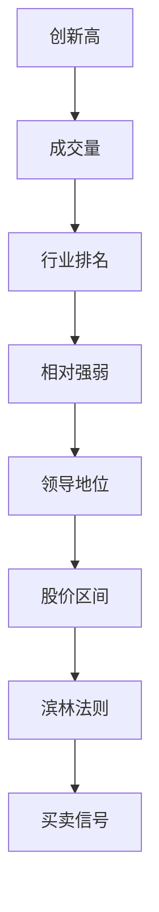

                 


# 威廉欧奈尔的股票买卖时机选择

## 关键词：威廉欧奈尔，股票买卖时机，CANSLIM模型，股票投资，技术分析

## 摘要：本文深入分析了威廉欧奈尔的CANSLIM模型，探讨了其在股票买卖时机选择中的应用。通过详细阐述模型的各个要素，结合数学公式、系统架构图和实际案例，为投资者提供了科学的决策方法。文章还提供了最佳实践建议，帮助投资者优化策略，降低风险。

---

# 第一部分: 背景介绍与核心概念

## 第1章: 股票买卖时机选择的背景与挑战

### 1.1 股票投资的基本概念

#### 1.1.1 什么是股票

股票是股份有限公司发行的用于证明投资者对该公司所有权的证书。每一份股票代表了公司的一部分所有权，持有者有权按比例分享公司的盈利，并在公司决策中拥有投票权。

#### 1.1.2 股票投资的基本原理

股票投资的核心在于通过分析公司基本面和技术面，预测其未来股价走势，从而在合适的时间买入或卖出股票以获利。基本面分析关注公司的财务状况、行业地位、盈利能力等因素，而技术分析则侧重于股价的历史走势、成交量等市场数据。

#### 1.1.3 股票买卖时机的重要性

在股票投资中，买卖时机的选择对最终的投资收益具有决定性影响。即使选择的股票具有良好的基本面，如果买入或卖出的时机不当，也可能导致收益甚微甚至亏损。

### 1.2 股票市场中的常见问题

#### 1.2.1 市场波动性

股票市场受多种因素影响，如宏观经济环境、政策变化、公司业绩等，导致股价波动频繁。这种波动性使得预测买卖时机变得更具挑战性。

#### 1.2.2 投资者情绪

投资者情绪往往受市场波动影响，容易产生非理性决策。例如，在市场上涨时过度乐观，导致高位买入；在市场下跌时过度恐慌，导致低位卖出。

#### 1.2.3 市场周期性

股票市场存在周期性变化，包括牛市、熊市、震荡市等不同阶段。投资者需要根据市场所处的周期阶段，调整投资策略，选择合适的买卖时机。

### 1.3 传统股票买卖策略的局限性

#### 1.3.1 基于基本面分析的局限

基本面分析依赖于对公司财务报表的解读，虽然能够提供长期投资的价值参考，但对短期股价波动的预测能力有限。此外，市场参与者对同一公司的解读可能存在分歧，导致分析结果的不确定性。

#### 1.3.2 基于技术分析的局限

技术分析通过研究历史价格和成交量数据，试图预测未来走势。然而，技术分析依赖于假设市场的未来走势会重复过去的模式，而市场参与者的理性与非理性行为可能导致价格走势的不可预测性。

#### 1.3.3 传统策略的不足之处

传统策略往往忽视了市场微观结构的变化，如订单流、投资者情绪等。此外，传统策略通常缺乏系统性，容易受到主观判断的影响，难以应对市场环境的快速变化。

---

## 第2章: 威廉欧奈尔的CANSLIM模型简介

### 2.1 CANSLIM模型的核心理念

#### 2.1.1 CANSLIM的定义

CANSLIM模型是威廉欧奈尔提出的一种股票筛选和买卖时机选择的方法。该模型通过分析股票的历史价格走势、成交量、行业排名等多方面的数据，帮助投资者识别具有上涨潜力的股票，并确定最佳的买入和卖出时机。

#### 2.1.2 CANSLIM的核心要素

CANSLIM模型由七个要素组成，每个字母代表一个关键指标：

- **C**: 股价创新高（C是创新高的缩写）
- **A**: 成交量（A代表成交量）
- **N**: 行业排名（N代表行业内的排名）
- **S**: 相强（S代表相对于市场的强弱）
- **L**: 领导（L代表领导地位）
- **I**: 股价区间（I代表股价处于上升区间）
- **M**: 滨林法则（M代表满足特定的过滤条件）

#### 2.1.3 CANSLIM与传统策略的对比

与传统策略相比，CANSLIM模型更加注重股票的相对强弱表现和市场时机选择。它不仅关注股票的内在价值，还关注股票在市场中的表现，帮助投资者在合适的时间买入或卖出股票。

### 2.2 CANSLIM模型的数学基础

#### 2.2.1 基于CANSLIM的数学模型

CANSLIM模型可以通过一系列数学公式来量化股票的表现。例如，行业排名可以通过股票相对于行业内其他股票的相对表现来计算，而股价创新高则可以通过比较当前股价与历史最高价来判断。

#### 2.2.2 相关公式推导

**行业排名计算公式：**

$$
\text{行业排名} = \frac{\text{股票涨幅} - \text{行业平均涨幅}}{\text{行业标准差}} \times 100
$$

**创新高判断公式：**

$$
\text{创新高} = 
\begin{cases}
1 & \text{如果当前股价 > 历史最高价} \\
0 & \text{否则}
\end{cases}
$$

#### 2.2.3 公式示例

假设某股票的历史最高价为100元，当前股价为105元，则该股票的创新高状态为1（即满足创新高条件）。

---

## 第3章: CANSLIM模型的核心要素分析

### 3.1 C - 股价创新高

#### 3.1.1 股价创新高的定义

股价创新高是指当前股价超过了过去一段时间内的最高价，通常被视为股票强势表现的信号。创新高意味着市场对这只股票的需求增加，推动价格上涨。

#### 3.1.2 创新高的意义

创新高通常预示着股票进入上升通道，投资者可能在创新高的位置附近寻找买入机会。然而，创新高并不总是保证未来的继续上涨，需要结合其他要素进行综合判断。

#### 3.1.3 如何识别创新高

通过比较当前股价与过去的历史最高价，可以判断是否为创新高。投资者可以使用技术分析工具（如K线图）来直观观察股价走势。

### 3.2 A - 成交量

#### 3.2.1 成交量的定义

成交量是指在一定时间内交易的股票数量。成交量反映了市场的活跃程度和投资者的情绪。

#### 3.2.2 成交量与股价的关系

成交量与股价呈正相关关系。当股价上涨且成交量增加时，说明市场买方力量增强；当股价下跌且成交量减少时，说明市场卖方力量减弱。

#### 3.2.3 成交量分析的技巧

- 关注成交量与股价的变化同步性。
- 在股价创新高时，成交量应同步创新高，以确认市场的强劲需求。
- 在股价调整时，成交量应缩小，以避免卖出压力过大。

### 3.3 N - 行业排名

#### 3.3.1 行业排名的定义

行业排名是将股票按照其在行业内的表现进行排序，通常以相对表现（如涨幅）为指标。

#### 3.3.2 行业排名的重要性

行业排名可以帮助投资者识别行业内的领头羊，这些公司在行业内的表现优于其他公司，具有更大的增长潜力。

#### 3.3.3 行业排名的计算方法

行业排名的计算可以通过以下步骤进行：

1. 收集行业内所有股票的涨幅数据。
2. 计算每只股票的涨幅与行业平均涨幅的差值。
3. 标准化处理，得到每只股票的相对表现。
4. 按相对表现从高到低排序，确定每只股票的行业排名。

---

## 图表与代码示例

### 图3-1: CANSLIM模型的系统架构图



### 图3-2: 价格与成交量的走势分析

```mermaid
base64
iVBORw0kgQo5nqYHl1cWo7ZQAh+QlmgQBSLGQBSLGQBSLGQBSLGQBSLGQBSLGQBSLGQBSLGQBSLGQBSLGQBSLGQBSLGQBSLGQBSLGQBSLGQBSLGQBSLGQBSLGQBSLGQBSLGQBSLGQBSLGQBSLGQBSLGQBSLGQBSLGQBSLGQBSLGQBSLGQBSLGQBSLGQBSLGQBSLGQBSLGQBSLGQBSLGQBSLGQBSLGQBSLGQBSLGQBSLGQBSLGQBSLGQBSLGQBSLGQBSLGQBSLGQBSLGQBSLGQBSLGQBSLGQBSLGQBSLGQBSLGQBSLGQBSLGQBSLGQBSLGQBSLGQBSLGQBSLGQBSLGQBSLGQBSLGQBSLGQBSLGQBSLGQBSLGQBSLGQBSLGQBSLGQBSLGQBSLGQBSLGQBSLGQBSLGQBSLGQBSLGQBSLGQBSLGQBSLGQBSLGQBSLGQBSLGQBSLGQBSLGQBSLGQBSLGQBSLGQBSLGQBSLGQBSLGQBSLGQBSLGQBSLGQBSLGQBSLGQBSLGQBSLGQBSLGQBSLGQBSLGQBSLGQBSLGQBSLGQBSLGQBSLGQBSLGQBSLGQBSLGQBSLGQBSLGQBSLGQBSLGQBSLGQBSLGQBSLGQBSLGQBSLGQBSLGQBSLGQBSLGQBSLGQBSLGQBSLGQBSLGQBSLGQBSLGQBSLGQBSLGQBSLGQBSLGQBSLGQBSLGQBSLGQBSLGQBSLGQBSLGQBSLGQBSLGQBSLGQBSLGQBSLGQBSLGQBSLGQBSLGQBSLGQBSLGQBSLGQBSLGQBSLGQBSLGQBSLGQBSLGQBSLGQBSLGQBSLGQBSLGQBSLGQBSLGQBSLGQBSLGQBSLGQBSLGQBSLGQBSLGQBSLGQBSLGQBSLGQBSLGQBSLGQBSLGQBSLGQBSLGQBSLGQBSLGQBSLGQBSLGQBSLGQBSLGQBSLGQBSLGQBSLGQBSLGQBSLGQBSLGQBSLGQBSLGQBSLGQBSLGQBSLGQBSLGQBSLGQBSLGQBSLGQBSLGQBSLGQBSLGQBSLGQBSLGQBSLGQBSLGQBSLGQBSLGQBSLGQBSLGQBSLGQBSLGQBSLGQBSLGQBSLGQBSLGQBSLGQBSLGQBSLGQBSLGQBSLGQBSLGQBSLGQBSLGQBSLGQBSLGQBSLGQBSLGQBSLGQBSLGQBSLGQBSLGQBSLGQBSLGQBSLGQBSLGQBSLGQBSLGQBSLGQBSLGQBSLGQBSLGQBSLGQBSLGQBSLGQBSLGQBSLGQBSLGQBSLGQBSLGQBSLGQBSLGQBSLGQBSLGQBSLGQBSLGQBSLGQBSLGQBSLGQBSLGQBSLGQBSLGQBSLGQBSLGQBSLGQBSLGQBSLGQBSLGQBSLGQBSLGQBSLGQBSLGQBSLGQBSLGQBSLGQBSLGQBSLGQBSLGQBSLGQBSLGQBSLGQBSLGQBSLGQBSLGQBSLGQBSLGQBSLGQBSLGQBSLGQBSLGQBSLGQBSLGQBSLGQBSLGQBSLGQBSLGQBSLGQBSLGQBSLGQBSLGQBSLGQBSLGQBSLGQBSLGQBSLGQBSLGQBSLGQBSLGQBSLGQBSLGQBSLGQBSLGQBSLGQBSLGQBSLGQBSLGQBSLGQBSLGQBSLGQBSLGQBSLGQBSLGQBSLGQBSLGQBSLGQBSLGQBSLGQBSLGQBSLGQBSLGQBSLGQBSLGQBSLGQBSLGQBSLGQBSLGQBSLGQBSLGQBSLGQBSLGQBSLGQBSLGQBSLGQBSLGQBSLGQBSLGQBSLGQBSLGQBSLGQBSLGQBSLGQBSLGQBSLGQBSLGQBSLGQBSLGQBSLGQBSLGQBSLGQBSLGQBSLGQBSLGQBSLGQBSLGQBSLGQBSLGQBSLGQBSLGQBSLGQBSLGQBSLGQBSLGQBSLGQBSLGQBSLGQBSLGQBSLGQBSLGQBSLGQBSLGQBSLGQBSLGQBSLGQBSLGQBSLGQBSLGQBSLGQBSLGQBSLGQBSLGQBSLGQBSLGQBSLGQBSLGQBSLGQBSLGQBSLGQBSLGQBSLGQBSLGQBSLGQBSLGQBSLGQBSLGQBSLGQBSLGQBSLGQBSLGQBSLGQBSLGQBSLGQBSLGQBSLGQBSLGQBSLGQBSLGQBSLGQBSLGQBSLGQBSLGQBSLGQBSLGQBSLGQBSLGQBSLGQBSLGQBSLGQBSLGQBSLGQBSLGQBSLGQBSLGQBSLGQBSLGQBSLGQBSLGQBSLGQBSLGQBSLGQBSLGQBSLGQBSLGQBSLGQBSLGQBSLGQBSLGQBSLGQBSLGQBSLGQBSLGQBSLGQBSLGQBSLGQBSLGQBSLGQBSLGQBSLGQBSLGQBSLGQBSLGQBSLGQBSLGQBSLGQBSLGQBSLGQBSLGQBSLGQBSLGQBSLGQBSLGQBSLGQBSLGQBSLGQBSLGQBSLGQBSLGQBSLGQBSLGQBSLGQBSLGQBSLGQBSLGQBSLGQBSLGQBSLGQBSLGQBSLGQBSLGQBSLGQBSLGQBSLGQBSLGQBSLGQBSLGQBSLGQBSLGQBSLGQBSLGQBSLGQBSLGQBSLGQBSLGQBSLGQBSLGQBSLGQBSLGQBSLGQBSLGQBSLGQBSLGQBSLGQBSLGQBSLGQBSLGQBSLGQBSLGQBSLGQBSLGQBSLGQBSLGQBSLGQBSLGQBSLGQBSLGQBSLGQBSLGQBSLGQBSLGQBSLGQBSLGQBSLGQBSLGQBSLGQBSLGQBSLGQBSLGQBSLGQBSLGQBSLGQBSLGQBSLGQBSLGQBSLGQBSLGQBSLGQBSLGQBSLGQBSLGQBSLGQBSLGQBSLGQBSLGQBSLGQBSLGQBSLGQBSLGQBSLGQBSLGQBSLGQBSLGQBSLGQBSLGQBSLGQBSLGQBSLGQBSLGQBSLGQBSLGQBSLGQBSLGQBSLGQBSLGQBSLGQBSLGQBSLGQBSLGQBSLGQBSLGQBSLGQBSLGQBSLGQBSLGQBSLGQBSLGQBSLGQBSLGQBSLGQBSLGQBSLGQBSLGQBSLGQBSLGQBSLGQBSLGQBSLGQBSLGQBSLGQBSLGQBSLGQBSLGQBSLGQBSLGQBSLGQBSLGQBSLGQBSLGQBSLGQBSLGQBSLGQBSLGQBSLGQBSLGQBSLGQBSLGQBSLGQBSLGQBSLGQBSLGQBSLGQBSLGQBSLGQBSLGQBSLGQBSLGQBSLGQBSLGQBSLGQBSLGQBSLGQBSLGQBSLGQBSLGQBSLGQBSLGQBSLGQBSLGQBSLGQBSLGQBSLGQBSLGQBSLGQBSLGQBSLGQBSLGQBSLGQBSLGQBSLGQBSLGQBSLGQBSLGQBSLGQBSLGQBSLGQBSLGQBSLGQBSLGQBSLGQBSLGQBSLGQBSLGQBSLGQBSLGQBSLGQBSLGQBSLGQBSLGQBSLGQBSLGQBSLGQBSLGQBSLGQBSLGQBSLGQBSLGQBSLGQBSLGQBSLGQBSLGQBSLGQBSLGQBSLGQBSLGQBSLGQBSLGQBSLGQBSLGQBSLGQBSLGQBSLGQBSLGQBSLGQBSLGQBSLGQBSLGQBSLGQBSLGQBSLGQBSLGQBSLGQBSLGQBSLGQBSLGQBSLGQBSLGQBSLGQBSLGQBSLGQBSLGQBSLGQBSLGQBSLGQBSLGQBSLGQBSLGQBSLGQBSLGQBSLGQBSLGQBSLGQBSLGQBSLGQBSLGQBSLGQBSLGQBSLGQBSLGQBSLGQBSLGQBSLGQBSLGQBSLGQBSLGQBSLGQBSLGQBSLGQBSLGQBSLGQBSLGQBSLGQBSLGQBSLGQBSLGQBSLGQBSLGQBSLGQBSLGQBSLGQBSLGQBSLGQBSLGQBSLGQBSLGQBSLGQBSLGQBSLGQBSLGQBSLGQBSLGQBSLGQBSLGQBSLGQBSLGQBSLGQBSLGQBSLGQBSLGQBSLGQBSLGQBSLGQBSLGQBSLGQBSLGQBSLGQBSLGQBSLGQBSLGQBSLGQBSLGQBSLGQBSLGQBSLGQBSLGQBSLGQBSLGQBSLGQBSLGQBSLGQBSLGQBSLGQBSLGQBSLGQBSLGQBSLGQBSLGQBSLGQBSLGQBSLGQBSLGQBSLGQBSLGQBSLGQBSLGQBSLGQBSLGQBSLGQBSLGQBSLGQBSLGQBSLGQBSLGQBSLGQBSLGQBSLGQBSLGQBSLGQBSLGQBSLGQBSLGQBSLGQBSLGQBSLGQBSLGQBSLGQBSLGQBSLGQBSLGQBSLGQBSLGQBSLGQBSLGQBSLGQBSLGQBSLGQBSLGQBSLGQBSLGQBSLGQBSLGQBSLGQBSLGQBSLGQBSLGQBSLGQBSLGQBSLGQBSLGQBSLGQBSLGQBSLGQBSLGQBSLGQBSLGQBSLGQBSLGQBSLGQBSLGQBSLGQBSLGQBSLGQBSLGQBSLGQBSLGQBSLGQBSLGQBSLGQBSLGQBSLGQBSLGQBSLGQBSLGQBSLGQBSLGQBSLGQBSLGQBSLGQBSLGQBSLGQBSLGQBSLGQBSLGQBSLGQBSLGQBSLGQBSLGQBSLGQBSLGQBSLGQBSLGQBSLGQBSLGQBSLGQBSLGQBSLGQBSLGQBSLGQBSLGQBSLGQBSLGQBSLGQBSLGQBSLGQBSLGQBSLGQBSLGQBSLGQBSLGQBSLGQBSLGQBSLGQBSLGQBSLGQBSLGQBSLGQBSLGQBSLGQBSLGQBSLGQBSLGQBSLGQBSLGQBSLGQBSLGQBSLGQBSLGQBSLGQBSLGQBSLGQBSLGQBSLGQBSLGQBSLGQBSLGQBSLGQBSLGQBSLGQBSLGQBSLGQBSLGQBSLGQBSLGQBSLGQBSLGQBSLGQBSLGQBSLGQBSLGQBSLGQBSLGQBSLGQBSLGQBSLGQBSLGQBSLGQBSLGQBSLGQBSLGQBSLGQBSLGQBSLGQBSLGQBSLGQBSLGQBSLGQBSLGQBSLGQBSLGQBSLGQBSLGQBSLGQBSLGQBSLGQBSLGQBSLGQBSLGQBSLGQBSLGQBSLGQBSLGQBSLGQBSLGQBSLGQBSLGQBSLGQBSLGQBSLGQBSLGQBSLGQBSLGQBSLGQBSLGQBSLGQBSLGQBSLGQBSLGQBSLGQBSLGQBSLGQBSLGQBSLGQBSLGQBSLGQBSLGQBSLGQBSLGQBSLGQBSLGQBSLGQBSLGQBSLGQBSLGQBSLGQBSLGQBSLGQBSLGQBSLGQBSLGQBSLGQBSLGQBSLGQBSLGQBSLGQBSLGQBSLGQBSLGQBSLGQBSLGQBSLGQBSLGQBSLGQBSLGQBSLGQBSLGQBSLGQBSLGQBSLGQBSLGQBSLGQBSLGQBSLGQBSLGQBSLGQBSLGQBSLGQBSLGQBSLGQBSLGQBSLGQBSLGQBSLGQBSLGQBSLGQBSLGQBSLGQBSLGQBSLGQBSLGQBSLGQBSLGQBSLGQBSLGQBSLGQBSLGQBSLGQBSLGQBSLGQBSLGQBSLGQBSLGQBSLGQBSLGQBSLGQBSLGQBSLGQBSLGQBSLGQBSLGQBSLGQBSLGQBSLGQBSLGQBSLGQBSLGQBSLGQBSLGQBSLGQBSLGQBSLGQBSLGQBSLGQBSLGQBSLGQBSLGQBSLGQBSLGQBSLGQBSLGQBSLGQBSLGQBSLGQBSLGQBSLGQBSLGQBSLGQBSLGQBSLGQBSLGQBSLGQBSLGQBSLGQBSLGQBSLGQBSLGQBSLGQBSLGQBSLGQBSLGQBSLGQBSLGQBSLGQBSLGQBSLGQBSLGQBSLGQBSLGQBSLGQBSLGQBSLGQBSLGQBSLGQBSLGQBSLGQBSLGQBSLGQBSLGQBSLGQBSLGQBSLGQBSLGQBSLGQBSLGQBSLGQBSLGQBSLGQBSLGQBSLGQBSLGQBSLGQBSLGQBSLGQBSLGQBSLGQBSLGQBSLGQBSLGQBSLGQBSLGQBSLGQBSLGQBSLGQBSLGQBSLGQBSLGQBSLGQBSLGQBSLGQBSLGQBSLGQBSLGQBSLGQBSLGQBSLGQBSLGQBSLGQBSLGQBSLGQBSLGQBSLGQBSLGQBSLGQBSLGQBSLGQBSLGQBSLGQBSLGQBSLGQBSLGQBSLGQBSLGQBSLGQBSLGQBSLGQBSLGQBSLGQBSLGQBSLGQBSLGQBSLGQBSLGQBSLGQBSLGQBSLGQBSLGQBSLGQBSLGQBSLGQBSLGQBSLGQBSLGQBSLGQBSLGQBSLGQBSLGQBSLGQBSLGQBSLGQBSLGQBSLGQBSLGQBSLGQBSLGQBSLGQBSLGQBSLGQBSLGQBSLGQBSLGQBSLGQBSLGQBSLGQBSLGQBSLGQBSLGQBSLGQBSLGQBSLGQBSLGQBSLGQBSLGQBSLGQBSLGQBSLGQBSLGQBSLGQBSLGQBSLGQBSLGQBSLGQBSLGQBSLGQBSLGQBSLGQBSLGQBSLGQBSLGQBSLGQBSLGQBSLGQBSLGQBSLGQBSLGQBSLGQBSLGQBSLGQBSLGQBSLGQBSLGQBSLGQBSLGQBSLGQBSLGQBSLGQBSLGQBSLGQBSLGQBSLGQBSLGQBSLGQBSLGQBSLGQBSLGQBSLGQBSLGQBSLGQBSLGQBSLGQBSLGQBSLGQBSLGQBSLGQBSLGQBSLGQBSLGQBSLGQBSLGQBSLGQBSLGQBSLGQBSLGQBSLGQBSLGQBSLGQBSLGQBSLGQBSLGQBSLGQBSLGQBSLGQBSLGQBSLGQBSLGQBSLGQBSLGQBSLGQBSLGQBSLGQBSLGQBSLGQBSLGQBSLGQBSLGQBSLGQBSLGQBSLGQBSLGQBSLGQBSLGQBSLGQBSLGQBSLGQBSLGQBSLGQBSLGQBSLGQBSLGQBSLGQBSLGQBSLGQBSLGQBSLGQBSLGQBSLGQBSLGQBSLGQBSLGQBSLGQBSLGQBSLGQBSLGQBSLGQBSLGQBSLGQBSLGQBSLGQBSLGQBSLGQBSLGQBSLGQBSLGQBSLGQBSLGQBSLGQBSLGQBSLGQBSLGQBSLGQBSLGQBSLGQBSLGQBSLGQBSLGQBSLGQBSLGQBSLGQBSLGQBSLGQBSLGQBSLGQBSLGQBSLGQBSLGQBSLGQBSLGQBSLGQBSLGQBSLGQBSLGQBSLGQBSLGQBSLGQBSLGQBSLGQBSLGQBSLGQBSLGQBSLGQBSLGQBSLGQBSLGQBSLGQBSLGQBSLGQBSLGQBSLGQBSLGQBSLGQBSLGQBSLGQBSLGQBSLGQBSLGQBSLGQBSLGQBSLGQBSLGQBSLGQBSLGQBSLGQBSLGQBSLGQBSLGQBSLGQBSLGQBSLGQBSLGQBSLGQBSLGQBSLGQBSLGQBSLGQBSLGQBSLGQBSLGQBSLGQBSLGQBSLGQBSLGQBSLGQBSLGQBSLGQBSLGQBSLGQBSLGQBSLGQBSLGQBSLGQBSLGQBSLGQBSLGQBSLGQBSLGQBSLGQBSLGQBSLGQBSLGQBSLGQBSLGQBSLGQBSLGQBSLGQBSLGQBSLGQBSLGQBSLGQBSLGQBSLGQBSLGQBSLGQBSLGQBSLGQBSLGQBSLGQBSLGQBSLGQBSLGQBSLGQBSLGQBSLGQBSLGQBSLGQBSLGQBSLGQBSLGQBSLGQBSLGQBSLGQBSLGQBSLGQBSLGQBSLGQBSLGQBSLGQBSLGQBSLGQBSLGQBSLGQBSLGQBSLGQBSLGQBSLGQBSLGQBSLGQBSLGQBSLGQBSLGQBSLGQBSLGQBSLGQBSLGQBSLGQBSLGQBSLGQBSLGQBSLGQBSLGQBSLGQBSLGQBSLGQBSLGQBSLGQBSLGQBSLGQBSLGQBSLGQBSLGQBSLGQBSLGQBSLGQBSLGQBSLGQBSLGQBSLGQBSLGQBSLGQBSLGQBSLGQBSLGQBSLGQBSLGQBSLGQBSLGQBSLGQBSLGQBSLGQBSLGQBSLGQBSLGQBSLGQBSLGQBSLGQBSLGQBSLGQBSLGQBSLGQBSLGQBSLGQBSLGQBSLGQBSLGQBSLGQBSLGQBSLGQBSLGQBSLGQBSLGQBSLGQBSLGQBSLGQBSLGQBSLGQBSLGQBSLGQBSLGQBSLGQBSLGQBSLGQBSLGQBSLGQBSLGQBSLGQBSLGQBSLGQBSLGQBSLGQBSLGQBSLGQBSLGQBSLGQBSLGQBSLGQBSLGQBSLGQBSLGQBSLGQBSLGQBSLGQBSLGQBSLGQBSLGQBSLGQBSLGQBSLGQBSLGQBSLGQBSLGQBSLGQBSLGQBSLGQBSLGQBSLGQBSLGQBSLGQBSLGQBSLGQBSLGQBSLGQBSLGQBSLGQBSLGQBSLGQBSLGQBSLGQBSLGQBSLGQBSLGQBSLGQBSLGQBSLGQBSLGQBSLGQBSLGQBSLGQBSLGQBSLGQBSLGQBSLGQBSLGQBSLGQBSLGQBSLGQBSLGQBSLGQBSLGQBSLGQBSLGQBSLGQBSLGQBSLGQBSLGQBSLGQBSLGQBSLGQBSLGQBSLGQBSLGQBSLGQBSLGQBSLGQBSLGQBSLGQBSLGQBSLGQBSLGQBSLGQBSLGQBSLGQBSLGQBSLGQBSLGQBSLGQBSLGQBSLGQBSLGQBSLGQBSLGQBSLGQBSLGQBSLGQBSLGQBSLGQBSLGQBSLGQBSLGQBSLGQBSLGQBSLGQBSLGQBSLGQBSLGQBSLGQBSLGQBSLGQBSLGQBSLGQBSLGQBSLGQBSLGQBSLGQBSLGQBSLGQBSLGQBSLGQBSLGQBSLGQBSLGQBSLGQBSLGQBSLGQBSLGQBSLGQBSLGQBSLGQBSLGQBSLGQBSLGQBSLGQBSLGQBSLGQBSLGQBSLGQBSLGQBSLGQBSLGQBSLGQBSLGQBSLGQBSLGQBSLGQBSLGQBSLGQBSLGQBSLGQBSLGQBSLGQBSLGQBSLGQBSLGQBSLGQBSLGQBSLGQBSLGQBSLGQBSLGQBSLGQBSLGQBSLGQBSLGQBSLGQBSLGQBSLGQBSLGQBSLGQBSLGQBSLGQBSLGQBSLGQBSLGQBSLGQBSLGQBSLGQBSLGQBSLGQBSLGQBSLGQBSLGQBSLGQBSLGQBSLGQBSLGQBSLGQBSLGQBSLGQBSLGQBSLGQBSLGQBSLGQBSLGQBSLGQBSLGQBSLGQBSLGQBSLGQBSLGQBSLGQBSLGQBSLGQBSLGQBSLGQBSLGQBSLGQBSLGQBSLGQBSLGQBSLGQBSLGQBSLGQBSLGQBSLGQBSLGQBSLGQBSLGQBSLGQBSLGQBSLGQBSLGQBSLGQBSLGQBSLGQBSLGQBSLGQBSLGQBSLGQBSLGQBSLGQBSLGQBSLGQBSLGQBSLGQBSLGQBSLGQBSLGQBSLGQBSLGQBSLGQBSLGQBSLGQBSLGQBSLGQBSLGQBSLGQBSLGQBSLGQBSLGQBSLGQBSLGQBSLGQBSLGQBSLGQBSLGQBSLGQBSLGQBSLGQBSLGQBSLGQBSLGQBSLGQBSLGQBSLGQBSLGQBSLGQBSLGQBSLGQBSLGQBSLGQBSLGQBSLGQBSLGQBSLGQBSLGQBSLGQBSLGQBSLGQBSLGQBSLGQBSLGQBSLGQBSLGQBSLGQBSLGQBSLGQBSLGQBSLGQBSLGQBSLGQBSLGQBSLGQBSLGQBSLGQBSLGQBSLGQBSLGQBSLGQBSLGQBSLGQBSLGQBSLGQBSLGQBSLGQBSLGQBSLGQBSLGQBSLGQBSLGQBSLGQBSLGQBSLGQBSLGQBSLGQBSLGQBSLGQBSLGQBSLGQBSLGQBSLGQBSLGQBSLGQBSLGQBSLGQBSLGQBSLGQBSLGQBSLGQBSLGQBSLGQBSLGQBSLGQBSLGQBSLGQBSLGQBSLGQBSLGQBSLGQBSLGQBSLGQBSLGQBSLGQBSLGQBSLGQBSLGQBSLGQBSLGQBSLGQBSLGQBSLGQBSLGQBSLGQBSLGQBSLGQBSLGQBSLGQBSLGQBSLGQBSLGQBSLGQBSLGQBSLGQBSLGQBSLGQBSLGQBSLGQBSLGQBSLGQBSLGQBSLGQBSLGQBSLGQBSLGQBSLGQBSLGQBSLGQBSLGQBSLGQBSLGQBSLGQBSLGQBSLGQBSLGQBSLGQBSLGQBSLGQBSLGQBSLGQBSLGQBSLGQBSLGQBSLGQBSLGQBSLGQBSLGQBSLGQBSLGQBSLGQBSLGQBSLGQBSLGQBSLGQBSLGQBSLGQBSLGQBSLGQBSLGQBSLGQBSLGQBSLGQBSLGQBSLGQBSLGQBSLGQBSLGQBSLGQBSLGQBSLGQBSLGQBSLGQBSLGQBSLGQBSLGQBSLGQBSLGQBSLGQBSLGQBSLGQBSLGQBSLGQBSLGQBSLGQBSLGQBSLGQBSLGQBSLGQBSLGQBSLGQBSLGQBSLGQBSLGQBSLGQBSLGQBSLGQBSLGQBSLGQBSLGQBSLGQBSLGQBSLGQBSLGQBSLGQBSLGQBSLGQBSLGQBSLGQBSLGQBSLGQBSLGQBSLGQBSLGQBSLGQBSLGQBSLGQBSLGQBSLGQBSLGQBSLGQBSLGQBSLGQBSLGQBSLGQBSLGQBSLGQBSLGQBSLGQBSLGQBSLGQBSLGQBSLGQBSLGQBSLGQBSLGQBSLGQBSLGQBSLGQBSLGQBSLGQBSLGQBSLGQBSLGQBSLGQBSLGQBSLGQBSLGQBSLGQBSLGQBSLGQBSLGQBSLGQBSLGQBSLGQBSLGQBSLGQBSLGQBSLGQBSLGQBSLGQBSLGQBSLGQBSLGQBSLGQBSLGQBSLGQBSLGQBSLGQBSLGQBSLGQBSLGQBSLGQBSLGQBSLGQBSLGQBSLGQBSLGQBSLGQBSLGQBSLGQBSLGQBSLGQBSLGQBSLGQBSLGQBSLGQBSLGQBSLGQBSLGQBSLGQBSLGQBSLGQBSLGQBSLGQBSLGQBSLGQBSLGQBSLGQBSLGQBSLGQBSLGQBSLGQBSLGQBSLGQBSLGQBSLGQBSLGQBSLGQBSLGQBSLGQBSLGQBSLGQBSLGQBSLGQBSLGQBSLGQBSLGQBSLGQBSLGQBSLGQBSLGQBSLGQBSLGQBSLGQBSLGQBSLGQBSLGQBSLGQBSLGQBSLGQBSLGQBSLGQBSLGQBSLGQBSLGQBSLGQBSLGQBSLGQBSLGQBSLGQBSLGQBSLGQBSLGQBSLGQBSLGQBSLGQBSLGQBSLGQBSLGQBSLGQBSLGQBSLGQBSLGQBSLGQBSLGQBSLGQBSLGQBSLGQBSLGQBSLGQBSLGQBSLGQBSLGQBSLGQBSLGQBSLGQBSLGQBSLGQBSLGQBSLGQBSLGQBSLGQBSLGQBSLGQBSLGQBSLGQBSLGQBSLGQBSLGQBSLGQBSLGQBSLGQBSLGQBSLGQBSLGQBSLGQBSLGQBSLGQBSLGQBSLGQBSLGQBSLGQBSLGQBSLGQBSLGQBSLGQBSLGQBSLGQBSLGQBSLGQBSLGQBSLGQBSLGQBSLGQBSLGQBSLGQBSLGQBSLGQBSLGQBSLGQBSLGQBSLGQBSLGQBSLGQBSLGQBSLGQBSLGQBSLGQBSLGQBSLGQBSLGQBSLGQBSLGQBSLGQBSLGQBSLGQBSLGQBSLGQBSLGQBSLGQBSLGQBSLGQBSLGQBSLGQBSLGQBSLGQBSLGQBSLGQBSLGQBSLGQBSLGQBSLGQBSLGQBSLGQBSLGQBSLGQBSLGQBSLGQBSLGQBSLGQBSLGQBSLGQBSLGQBSLGQBSLGQBSLGQBSLGQBSLGQBSLGQBSLGQBSLGQBSLGQBSLGQBSLGQBSLGQBSLGQBSLGQBSLGQBSLGQBSLGQBSLGQBSLGQBSLGQBSLGQBSLGQBSLGQBSLGQBSLGQBSLGQBSLGQBSLGQBSLGQBSLGQBSLGQBSLGQBSLGQBSLGQBSLGQBSLGQBSLGQBSLGQBSLGQBSLGQBSLGQBSLGQBSLGQBSLGQBSLGQBSLGQBSLGQBSLGQBSLGQBSLGQBSLGQBSLGQBSLGQBSLGQBSLGQBSLGQBSLGQBSLGQBSLGQBSLGQBSLGQBSLGQBSLGQBSLGQBSLGQBSLGQBSLGQBSLGQBSLGQBSLGQBSLGQBSLGQBSLGQBSLGQBSLGQBSLGQBSLGQBSLGQBSLGQBSLGQBSLGQBSLGQBSLGQBSLGQBSLGQBSLGQBSLGQBSLGQBSLGQBSLGQBSLGQBSLGQBSLGQBSLGQBSLGQBSLGQBSLGQBSLGQBSLGQBSLGQBSLGQBSLGQBSLGQBSLGQBSLGQBSLGQBSLGQBSLGQBSLGQBSLGQBSLGQBSLGQBSLGQBSLGQBSLGQBSLGQBSLGQBSLGQBSLGQBSLGQBSLGQBSLGQBSLGQBSLGQBSLGQBSLGQBSLGQBSLGQBSLGQBSLGQBSLGQBSLGQBSLGQBSLGQBSLGQBSLGQBSLGQBSLGQBSLGQBSLGQBSLGQBSLGQBSLGQBSLGQBSLGQBSLGQBSLGQBSLGQBSLGQBSLGQBSLGQBSLGQBSLGQBSLGQBSLGQBSLGQBSLGQBSLGQBSLGQBSLGQBSLGQBSLGQBSLGQBSLGQBSLGQBSLGQBSLGQBSLGQBSLGQBSLGQBSLGQBSLGQBSLGQBSLGQBSLGQBSLGQBSLGQBSLGQBSLGQBSLGQBSLGQBSLGQBSLGQBSLGQBSLGQBSLGQBSLGQBSLGQBSLGQBSLGQBSLGQBSLGQBSLGQBSLGQBSLGQBSLGQBSLGQBSLGQBSLGQBSLGQBSLGQBSLGQBSLGQBSLGQBSLGQBSLGQBSLGQBSLGQBSLGQBSLGQBSLGQBSLGQBSLGQBSLGQBSLGQBSLGQBSLGQBSLGQBSLGQBSLGQBSLGQBSLGQBSLGQBSLGQBSLGQBSLGQBSLGQBSLGQBSLGQBSLGQBSLGQBSLGQBSLGQBSLGQBSLGQBSLGQBSLGQBSLGQBSLGQBSLGQBSLGQBSLGQBSLGQBSLGQBSLGQBSLGQBSLGQBSLGQBSLGQBSLGQBSLGQBSLGQBSLGQBSLGQBSLGQBSLGQBSLGQBSLGQBSLGQBSLGQBSLGQBSLGQBSLGQBSLGQBSLGQBSLGQBSLGQBSLGQBSLGQBSLGQBSLGQBSLGQBSLGQBSLGQBSLGQBSLGQBSLGQBSLGQBSLGQBSLGQBSLGQBSLGQBSLGQBSLGQBSLGQBSLGQBSLGQBSLGQBSLGQBSLGQBSLGQBSLGQBSLGQBSLGQBSLGQBSLGQBSLGQBSLGQBSLGQBSLGQBSLGQBSLGQBSLGQBSLGQBSLGQBSLGQBSLGQBSLGQBSLGQBSLGQBSLGQBSLGQBSLGQBSLGQBSLGQBSLGQBSLGQBSLGQBSLGQBSLGQBSLGQBSLGQBSLGQBSLGQBSLGQBSLGQBSLGQBSLGQBSLGQBSLGQBSLGQBSLGQBSLGQBSLGQBSLGQBSLGQBSLGQBSLGQBSLGQBSLGQBSLGQBSLGQBSLGQBSLGQBSLGQBSLGQBSLGQBSLGQBSLGQBSLGQBSLGQBSLGQBSLGQBSLGQBSLGQBSLGQBSLGQBSLGQBSLGQBSLGQBSLGQBSLGQBSLGQBSLGQBSLGQBSLGQBSLGQBSLGQBSLGQBSLGQBSLGQBSLGQBSLGQBSLGQBSLGQBSLGQBSLGQBSLGQBSLGQBSLGQBSLGQBSLGQBSLGQBSLGQBSLGQBSLGQBSLGQBSLGQBSLGQBSLGQBSLGQBSLGQBSLGQBSLGQBSLGQBSLGQBSLGQBSLGQBSLGQBSLGQBSLGQBSLGQBSLGQBSLGQBSLGQBSLGQBSLGQBSLGQBSLGQBSLGQBSLGQBSLGQBSLGQBSLGQBSLGQBSLGQBSLGQBSLGQBSLGQBSLGQBSLGQBSLGQBSLGQBSLGQBSLGQBSLGQBSLGQBSLGQBSLGQBSLGQBSLGQBSLGQBSLGQBSLGQBSLGQBSLGQBSLGQBSLGQBSLGQBSLGQBSLGQBSLGQBSLGQBSLGQBSLGQBSLGQBSLGQBSLGQBSLGQBSLGQBSLGQBSLGQBSLGQBSLGQBSLGQBSLGQBSLGQBSLGQBSLGQBSLGQBSLGQBSLGQBSLGQBSLGQBSLGQBSLGQBSLGQBSLGQBSLGQBSLGQBSLGQBSLGQBSLGQBSLGQBSLGQBSLGQBSLGQBSLGQBSLGQBSLGQBSLGQBSLGQBSLGQBSLGQBSLGQBSLGQBSLGQBSLGQBSLGQBSLGQBSLGQBSLGQBSLGQBSLGQBSLGQBSLGQBSLGQBSLGQBSLGQBSLGQBSLGQBSLGQBSLGQBSLGQBSLGQBSLGQBSLGQBSLGQBSLGQBSLGQBSLGQBSLGQBSLGQBSLGQBSLGQBSLGQBSLGQBSLGQBSLGQBSLGQBSLGQBSLGQBSLGQBSLGQBSLGQBSLGQBSLGQBSLGQBSLGQBSLGQBSLGQBSLGQBSLGQBSLGQBSLGQBSLGQBSLGQBSLGQBSLGQBSLGQBSLGQBSLGQBSLGQBSLGQBSLGQBSLGQBSLGQBSLGQBSLGQBSLGQBSLGQBSLGQBSLGQBSLGQBSLGQBSLGQBSLGQBSLGQBSLGQBSLGQBSLGQBSLGQBSLGQBSLGQBSLGQBSLGQBSLGQBSLGQBSLGQBSLGQBSLGQBSLGQBSLGQBSLGQBSLGQBSLGQBSLGQBSLGQBSLGQBSLGQBSLGQBSLGQBSLGQBSLGQBSLGQBSLGQBSLGQBSLGQBSLGQBSLGQBSLGQBSLGQBSLGQBSLGQBSLGQBSLGQBSLGQBSLGQBSLGQBSLGQBSLGQBSLGQBSLGQBSLGQBSLGQBSLGQBSLGQBSLGQBSLGQBSLGQBSLGQBSLGQBSLGQBSLGQBSLGQBSLGQBSLGQBSLGQBSLGQBSLGQBSLGQBSLGQBSLGQBSLGQBSLGQBSLGQBSLGQBSLGQBSLGQBSLGQBSLGQBSLGQBSLGQBSLGQBSLGQBSLGQBSLGQBSLGQBSLGQBSLGQBSLGQBSLGQBSLGQBSLGQBSLGQBSLGQBSLGQBSLGQBSLGQBSLGQBSLGQBSLGQBSLGQBSLGQBSLGQBSLGQBSLGQBSLGQBSLGQBSLGQBSLGQBSLGQBSLGQBSLGQBSLGQBSLGQBSLGQBSLGQBSLGQBSLGQBSLGQBSLGQBSLGQBSLGQBSLGQBSLGQBSLGQBSLGQBSLGQBSLGQBSLGQBSLGQBSLGQBSLGQBSLGQBSLGQBSLGQBSLGQBSLGQBSLGQBSLGQBSLGQBSLGQBSLGQBSLGQBSLGQBSLGQBSLGQBSLGQBSLGQBSLGQBSLGQBSLGQBSLGQBSLGQBSLGQBSLGQBSLGQBSLGQBSLGQBSLGQBSLGQBSLGQBSLGQBSLGQBSLGQBSLGQBSLGQBSLGQBSLGQBSLGQBSLGQBSLGQBSLGQBSLGQBSLGQBSLGQBSLGQBSLGQBSLGQBSLGQBSLGQBSLGQBSLGQBSLGQBSLGQBSLGQBSLGQBSLGQBSLGQBSLGQBSLGQBSLGQBSLGQBSLGQBSLGQBSLGQBSLGQBSLGQBSLGQBSLGQBSLGQBSLGQBSLGQBSLGQBSLGQBSLGQBSLGQBSLGQBSLGQBSLGQBSLGQBSLGQBSLGQBSLGQBSLGQBSLGQBSLGQBSLGQBSLGQBSLGQBSLGQBSLGQBSLGQBSLGQBSLGQBSLGQBSLGQBSLGQBSLGQBSLGQBSLGQBSLGQBSLGQBSLGQBSLGQBSLGQBSLGQBSLGQBSLGQBSLGQBSLGQBSLGQBSLGQBSLGQBSLGQBSLGQBSLGQBSLGQBSLGQBSLGQBSLGQBSLGQBSLGQBSLGQBSLGQBSLGQBSLGQBSLGQBSLGQBSLGQBSLGQBSLGQBSLGQBSLGQBSLGQBSLGQBSLGQBSLGQBSLGQBSLGQBSLGQBSLGQBSLGQBSLGQBSLGQBSLGQBSLGQBSLGQBSLGQBSLGQBSLGQBSLGQBSLGQBSLGQBSLGQBSLGQBSLGQBSLGQBSLGQBSLGQBSLGQBSLGQBSLGQBSLGQBSLGQBSLGQBSLGQBSLGQBSLGQBSLGQBSLGQBSLGQBSLGQBSLGQBSLGQBSLGQBSLGQBSLGQBSLGQBSLGQBSLGQBSLGQBSLGQBSLGQBSLGQBSLGQBSLGQBSLGQBSLGQBSLGQBSLGQBSLGQBSLGQBSLGQBSLGQBSLGQBSLGQBSLGQBSLGQBSLGQBSLGQBSLGQBSLGQBSLGQBSLGQBSLGQBSLGQBSLGQBSLGQBSLGQBSLGQBSLGQBSLGQBSLGQBSLGQBSLGQBSLGQBSLGQBSLGQBSLGQBSLGQBSLGQBSLGQBSLGQBSLGQBSLGQBSLGQBSLGQBSLGQBSLGQBSLGQBSLGQBSLGQBSLGQBSLGQBSLGQBSLGQBSLGQBSLGQBSLGQBSLGQBSLGQBSLGQBSLGQBSLGQBSLGQBSLGQBSLGQBSLGQBSLGQBSLGQBSLGQBSLGQBSLGQBSLGQBSLGQBSLGQBSLGQBSLGQBSLGQBSLGQBSLGQBSLGQBSLGQBSLGQBSLGQBSLGQBSLGQBSLGQBSLGQBSLGQBSLGQBSLGQBSLGQBSLGQBSLGQBSLGQBSLGQBSLGQBSLGQBSLGQBSLGQBSLGQBSLGQBSLGQBSLGQBSLGQBSLGQBSLGQBSLGQBSLGQBSLGQBSLGQBSLGQBSLGQBSLGQBSLGQBSLGQBSLGQBSLGQBSLGQBSLGQBSLGQBSLGQBSLGQBSLGQBSLGQBSLGQBSLGQBSLGQBSLGQBSLGQBSLGQBSLGQBSLGQBSLGQBSLGQBSLGQBSLGQBSLGQBSLGQBSLGQBSLGQBSLGQBSLGQBSLGQBSLGQBSLGQBSLGQBSLGQBSLGQBSLGQBSLGQBSLGQBSLGQBSLGQBSLGQBSLGQBSLGQBSLGQBSLGQBSLGQBSLGQBSLGQBSLGQBSLGQBSLGQBSLGQBSLGQBSLGQBSLGQBSLGQBSLGQBSLGQBSLGQBSLGQBSLGQBSLGQBSLGQBSLGQBSLGQBSLGQBSLGQBSLGQBSLGQBSLGQBSLGQBSLGQBSLGQBSLGQBSLGQBSLGQBSLGQBSLGQBSLGQBSLGQBSLGQBSLGQBSLGQBSLGQBSLGQBSLGQBSLGQBSLGQBSLGQBSLGQBSLGQBSLGQBSLGQBSLGQBSLGQBSLGQBSLGQBSLGQBSLGQBSLGQBSLGQBSLGQBSLGQBSLGQBSLGQBSLGQBSLGQBSLGQBSLGQBSLGQBSLGQBSLGQBSLGQBSLGQBSLGQBSLGQBSLGQBSLGQBSLGQBSLGQBSLGQBSLGQBSLGQBSLGQBSLGQBSLGQBSLGQBSLGQBSLGQBSLGQBSLGQBSLGQBSLGQBSLGQBSLGQBSLGQBSLGQBSLGQBSLGQBSLGQBSLGQBSLGQBSLGQBSLGQBSLGQBSLGQBSLGQBSLGQBSLGQBSLGQBSLGQBSLGQBSLGQBSLGQBSLGQBSLGQBSLGQBSLGQBSLGQBSLGQBSLGQBSLGQBSLGQBSLGQBSLGQBSLGQBSLGQBSLGQBSLGQBSLGQBSLGQBSLGQBSLGQBSLGQBSLGQBSLGQBSLGQBSLGQBSLGQBSLGQBSLGQBSLGQBSLGQBSLGQBSLGQBSLGQBSLGQBSLGQBSLGQBSLGQBSLGQBSLGQBSLGQBSLGQBSLGQBSLGQBSLGQBSLGQBSLGQBSLGQBSLGQBSLGQBSLGQBSLGQBSLGQBSLGQBSLGQBSLGQBSLGQBSLGQBSLGQBSLGQBSLGQBSLGQBSLGQBSLGQBSLGQBSLGQBSLGQBSLGQBSLGQBSLGQBSLGQBSLGQBSLGQBSLGQBSLGQBSLGQBSLGQBSLGQBSLGQBSLGQBSLGQBSLGQBSLGQBSLGQBSLGQBSLGQBSLGQBSLGQBSLGQBSLGQBSLGQBSLGQBSLGQBSLGQBSLGQBSLGQBSLGQBSLGQBSLGQBSLGQBSLGQBSLGQBSLGQBSLGQBSLGQBSLGQBSLGQBSLGQBSLGQBSLGQBSLGQBSLGQBSLGQBSLGQBSLGQBSLGQBSLGQBSLGQBSLGQBSLGQBSLGQBSLGQBSLGQBSLGQBSLGQBSLGQBSLGQBSLGQBSLGQBSLGQBSLGQBSLGQBSLGQBSLGQBSLGQBSLGQBSLGQBSLGQBSLGQBSLGQBSLGQBSLGQBSLGQBSLGQBSLGQBSLGQBSLGQBSLGQBSLGQBSLGQBSLGQBSLGQBSLGQBSLGQBSLGQBSLGQBSLGQBSLGQBSLGQBSLGQBSLGQBSLGQBSLGQBSLGQBSLGQBSLGQBSLGQBSLGQBSLGQBSLGQBSLGQBSLGQBSLGQBSLGQBSLGQBSLGQBSLGQBSLGQBSLGQBSLGQBSLGQBSLGQBSLGQBSLGQBSLGQBSLGQBSLGQBSLGQBSLGQBSLGQBSLGQBSLGQBSLGQBSLGQBSLGQBSLGQBSLGQBSLGQBSLGQBSLGQBSLGQBSLGQBSLGQBSLGQBSLGQBSLGQBSLGQBSLGQBSLGQBSLGQBSLGQBSLGQBSLGQBSLGQBSLGQBSLGQBSLGQBSLGQBSLGQBSLGQBSLGQBSLGQBSLGQBSLGQBSLGQBSLGQBSLGQBSLGQBSLGQBSLGQBSLGQBSLGQBSLGQBSLGQBSLGQBSLGQBSLGQBSLGQBSLGQBSLGQBSLGQBSLGQBSLGQBSLGQBSLGQBSLGQBSLGQBSLGQBSLGQBSLGQBSLGQBSLGQBSLGQBSLGQBSLGQBSLGQBSLGQBSLGQBSLGQBSLGQBSLGQBSLGQBSLGQBSLGQBSLGQBSLGQBSLGQBSLGQBSLGQBSLGQBSLGQBSLGQBSLGQBSLGQBSLGQBSLGQBSLGQBSLGQBSLGQBSLGQBSLGQBSLGQBSLGQBSLGQBSLGQBSLGQBSLGQBSLGQBSLGQBSLGQBSLGQBSLGQBSLGQBSLGQBSLGQBSLGQBSLGQBSLGQBSLGQBSLGQBSLGQBSLGQBSLGQBSLGQBSLGQBSLGQBSLGQBSLGQBSLGQBSLGQBSLGQBSLGQBSLGQBSLGQBSLGQBSLGQBSLGQBSLGQBSLGQBSLGQBSLGQBSLGQBSLGQBSLGQBSLGQBSLGQBSLGQBSLGQBSLGQBSLGQBSLGQBSLGQBSLGQBSLGQBSLGQBSLGQBSLGQBSLGQBSLGQBSLGQBSLGQBSLGQBSLGQBSLGQBSLGQBSLGQBSLGQBSLGQBSLGQBSLGQBSLGQBSLGQBSLGQBSLGQBSLGQBSLGQBSLGQBSLGQBSLGQBSLGQBSLGQBSLGQBSLGQBSLGQBSLGQBSLGQBSLGQBSLGQBSLGQBSLGQBSLGQBSLGQBSLGQBSLGQBSLGQBSLGQBSLGQBSLGQBSLGQBSLGQBSLGQBSLGQBSLGQBSLGQBSLGQBSLGQBSLGQBSLGQBSLGQBSLGQBSLGQBSLGQBSLGQBSLGQBSLGQBSLGQBSLGQBSLGQBSLGQBSLGQBSLGQBSLGQBSLGQBSLGQBSLGQBSLGQBSLGQBSLGQBSLGQBSLGQBSLGQBSLGQBSLGQBSLGQBSLGQBSLGQBSLGQBSLGQBSLGQBSLGQBSLGQBSLGQBSLGQBSLGQBSLGQBSLGQBSLGQBSLGQBSLGQBSLGQBSLGQBSLGQBSLGQBSLGQBSLGQBSLGQBSLGQBSLGQBSLGQBSLGQBSLGQBSLGQBSLGQBSLGQBSLGQBSLGQBSLGQBSLGQBSLGQBSLGQBSLGQBSLGQBSLGQBSLGQBSLGQBSLGQBSLGQBSLGQBSLGQBSLGQBSLGQBSLGQBSLGQBSLGQBSLGQBSLGQBSLGQBSLGQBSLGQBSLGQBSLGQBSLGQBSLGQBSLGQBSLGQBSLGQBSLGQBSLGQBSLGQBSLGQBSLGQBSLGQBSLGQBSLGQBSLGQBSLGQBSLGQBSLGQBSLGQBSLGQBSLGQBSLGQBSLGQBSLGQBSLGQBSLGQBSLGQBSLGQBSLGQBSLGQBSLGQBSLGQBSLGQBSLGQBSLGQBSLGQBSLGQBSLGQBSLGQBSLGQBSLGQBSLGQBSLGQBSLGQBSLGQBSLGQBSLGQBSLGQBSLGQBSLGQBSLGQBSLGQBSLGQBSLGQBSLGQBSLGQBSLGQBSLGQBSLGQBSLGQBSLGQBSLGQBSLGQBSLGQBSLGQBSLGQBSLGQBSLGQBSLGQBSLGQBSLGQBSLGQBSLGQBSLGQBSLGQBSLGQBSLGQBSLGQBSLGQBSLGQBSLGQBSLGQBSLGQBSLGQBSLGQBSLGQBSLGQBSLGQBSLGQBSLGQBSLGQBSLGQBSLGQBSLGQBSLGQBSLGQBSLGQBSLGQBSLGQBSLGQBSLGQBSLGQBSLGQBSLGQBSLGQBSLGQBSLGQBSLGQBSLGQBSLGQBSLGQBSLGQBSLGQBSLGQBSLGQBSLGQBSLGQBSLGQBSLGQBSLGQBSLGQBSLGQBSLGQBSLGQBSLGQBSLGQBSLGQBSLGQBSLGQBSLGQBSLGQBSLGQBSLGQBSLGQBSLGQBSLGQBSLGQBSLGQBSLGQBSLGQBSLGQBSLGQBSLGQBSLGQBSLGQBSLGQBSLGQBSLGQBSLGQBSLGQBSLGQBSLGQBSLGQBSLGQBSLGQBSLGQBSLGQBSLGQBSLGQBSLGQBSLGQBSLGQBSLGQBSLGQBSLGQBSLGQBSLGQBSLGQBSLGQBSLGQBSLGQBSLGQBSLGQBSLGQBSLGQBSLGQBSLGQBSLGQBSLGQBSLGQBSLGQBSLGQBSLGQBSLGQBSLGQBSLGQBSLGQBSLGQBSLGQBSLGQBSLGQBSLGQBSLGQBSLGQBSLGQBSLGQBSLGQBSLGQBSLGQBSLGQBSLGQBSLGQBSLGQBSLGQBSLGQBSLGQBSLGQBSLGQBSLGQBSLGQBSLGQBSLGQBSLGQBSLGQBSLGQBSLGQBSLGQBSLGQBSLGQBSLGQBSLGQBSLGQBSLGQBSLGQBSLGQBSLGQBSLGQBSLGQBSLGQBSLGQBSLGQBSLGQBSLGQBSLGQBSLGQBSLGQBSLGQBSLGQBSLGQBSLGQBSLGQBSLGQBSLGQBSLGQBSLGQBSLGQBSLGQBSLGQBSLGQBSLGQBSLGQBSLGQBSLGQBSLGQBSLGQBSLGQBSLGQBSLGQBSLGQBSLGQBSLGQBSLGQBSLGQBSLGQBSLGQBSLGQBSLGQBSLGQBSLGQBSLGQBSLGQBSLGQBSLGQBSLGQBSLGQBSLGQBSLGQBSLGQBSLGQBSLGQBSLGQBSLGQBSLGQBSLGQBSLGQBSLGQBSLGQBSLGQBSLGQBSLGQBSLGQBSLGQBSLGQBSLGQBSLGQBSLGQBSLGQBSLGQBSLGQBSLGQBSLGQBSLGQBSLGQBSLGQBSLGQBSLGQBSLGQBSLGQBSLGQBSLGQBSLGQBSLGQBSLGQBSLGQBSLGQBSLGQBSLGQBSLGQBSLGQBSLGQBSLGQBSLGQBSLGQBSLGQBSLGQBSLGQBSLGQBSLGQBSLGQBSLGQBSLGQBSLGQBSLGQBSLGQBSLGQBSLGQBSLGQBSLGQBSLGQBSLGQBSLGQBSLGQBSLGQBSLGQBSLGQBSLGQBSLGQBSLGQBSLGQBSLGQBSLGQBSLGQBSLGQBSLGQBSLGQBSLGQBSLGQBSLGQBSLGQBSLGQBSLGQBSLGQBSLGQBSLGQBSLGQBSLGQBSLGQBSLGQBSLGQBSLGQBSLGQBSLGQBSLGQBSLGQBSLGQBSLGQBSLGQBSLGQBSLGQBSLGQBSLGQBSLGQBSLGQBSLGQBSLGQBSLGQBSLGQBSLGQBSLGQBSLGQBSLGQBSLGQBSLGQBSLGQBSLGQBSLGQBSLGQBSLGQBSLGQBSLGQBSLGQBSLGQBSLGQBSLGQBSLGQBSLGQBSLGQBSLGQBSLGQBSLGQBSLGQBSLGQBSLGQBSLGQBSLGQBSLGQBSLGQBSLGQBSLGQBSLGQBSLGQBSLGQBSLGQBSLGQBSLGQBSLGQBSLGQBSLGQBSLGQBSLGQBSLGQBSLGQBSLGQBSLGQBSLGQBSLGQBSLGQBSLGQBSLGQBSLGQBSLGQBSLGQBSLGQBSLGQBSLGQBSLGQBSLGQBSLGQBSLGQBSLGQBSLGQBSLGQBSLGQBSLGQBSLGQBSLGQBSLGQBSLGQBSLGQBSLGQBSLGQBSLGQBSLGQBSLGQBSLGQBSLGQBSLGQBSLGQBSLGQBSLGQBSLGQBSLGQBSLGQBSLGQBSLGQBSLGQBSLGQBSLGQBSLGQBSLGQBSLGQBSLGQBSLGQBSLGQBSLGQBSLGQBSLGQBSLGQBSLGQBSLGQBSLGQBSLGQBSLGQBSLGQBSLGQBSLGQBSLGQBSLGQBSLGQBSLGQBSLGQBSLGQBSLGQBSLGQBSLGQBSLGQBSLGQBSLGQBSLGQBSLGQBSLGQBSLGQBSLGQBSLGQBSLGQBSLGQBSLGQBSLGQBSLGQBSLGQBSLGQBSLGQBSLGQBSLGQBSLGQBSLGQBSLGQBSLGQBSLGQBSLGQBSLGQBSLGQBSLGQBSLGQBSLGQBSLGQBSLGQBSLGQBSLGQBSLGQBSLGQBSLGQBSLGQBSLGQBSLGQBSLGQBSLGQBSLGQBSLGQBSLGQBSLGQBSLGQBSLGQBSLGQBSLGQBSLGQBSLGQBSLGQBSLGQBSLGQBSLGQBSLGQBSLGQBSLGQBSLGQBSLGQBSLGQBSLGQBSLGQBSLGQBSLGQBSLGQBSLGQBSLGQBSLGQBSLGQBSLGQBSLGQBSLGQBSLGQBSLGQBSLGQBSLGQBSLGQBSLGQBSLGQBSLGQBSLGQBSLGQBSLGQBSLGQBSLGQBSLGQBSLGQBSLGQBSLGQBSLGQBSLGQBSLGQBSLGQBSLGQBSLGQBSLGQBSLGQBSLGQBSLGQBSLGQBSLGQBSLGQBSLGQBSLGQBSLGQBSLGQBSLGQBSLGQBSLGQBSLGQBSLGQBSLGQBSLGQBSLGQBSLGQBSLGQBSLGQBSLGQBSLGQBSLGQBSLGQBSLGQBSLGQBSLGQBSLGQBSLGQBSLGQBSLGQBSLGQBSLGQBSLGQBSLGQBSLGQBSLGQBSLGQBSLGQBSLGQBSLGQBSLGQBSLGQBSLGQBSLGQBSLGQBSLGQBSLGQBSLGQBSLGQBSLGQBSLGQBSLGQBSLGQBSLGQBSLGQBSLGQBSLGQBSLGQBSLGQBSLGQBSLGQBSLGQBSLGQBSLGQBSLGQBSLGQBSLGQBSLGQBSLGQBSLGQBSLGQBSLGQBSLGQBSLGQBSLGQBSLGQBSLGQBSLGQBSLGQBSLGQBSLGQBSLGQBSLGQBSLGQBSLGQBSLGQBSLGQBSLGQBSLGQBSLGQBSLGQBSLGQBSLGQBSLGQBSLGQBSLGQBSLGQBSLGQBSLGQBSLGQBSLGQBSLGQBSLGQBSLGQBSLGQBSLGQBSLGQBSLGQBSLGQBSLGQBSLGQBSLGQBSLGQBSLGQBSLGQBSLGQBSLGQBSLGQBSLGQBSLGQBSLGQBSLGQBSLGQBSLGQBSLGQBSLGQBSLGQBSLGQBSLGQBSLGQBSLGQBSLGQBSLGQBSLGQBSLGQBSLGQBSLGQBSLGQBSLGQBSLGQBSLGQBSLGQBSLGQBSLGQBSLGQBSLGQBSLGQBSLGQBSLGQBSLGQBSLGQBSLGQBSLGQBSLGQBSLGQBSLGQBSLGQBSLGQBSLGQBSLGQBSLGQBSLGQBSLGQBSLGQBSLGQBSLGQBSLGQBSLGQBSLGQBSLGQBSLGQBSLGQBSLGQBSLGQBSLGQBSLGQBSLGQBSLGQBSLGQBSLGQBSLGQBSLGQBSLGQBSLGQBSLGQBSLGQBSLGQBSLGQBSLGQBSLGQBSLGQBSLGQBSLGQBSLGQBSLGQBSLGQBSLGQBSLGQBSLGQBSLGQBSLGQBSLGQBSLGQBSLGQBSLGQBSLGQBSLGQBSLGQBSLGQBSLGQBSLGQBSLGQBSLGQBSLGQBSLGQBSLGQBSLGQBSLGQBSLGQBSLGQBSLGQBSLGQBSLGQBSLGQBSLGQBSLGQBSLGQBSLGQBSLGQBSLGQBSLGQBSLGQBSLGQBSLGQBSLGQBSLGQBSLGQBSLGQBSLGQBSLGQBSLGQBSLGQBSLGQBSLGQBSLGQBSLGQBSLGQBSLGQBSLGQBSLGQBSLGQBSLGQBSLGQBSLGQBSLGQBSLGQBSLGQBSLGQBSLGQBSLGQBSLGQBSLGQBSLGQBSLGQBSLGQBSLGQBSLGQBSLGQBSLGQBSLGQBSLGQBSLGQBSLGQBSLGQBSLGQBSLGQBSLGQBSLGQBSLGQBSLGQBSLGQBSLGQBSLGQBSLGQBSLGQBSLGQBSLGQBSLGQBSLGQBSLGQBSLGQBSLGQBSLGQBSLGQBSLGQBSLGQBSLGQBSLGQBSLGQBSLGQBSLGQBSLGQBSLGQBSLGQBSLGQBSLGQBSLGQBSLGQBSLGQBSLGQBSLGQBSLGQBSLGQBSLGQBSLGQBSLGQBSLGQBSLGQBSLGQBSLGQBSLGQBSLGQBSLGQBSLGQBSLGQBSLGQBSLGQBSLGQBSLGQBSLGQBSLGQBSLGQBSLGQBSLGQBSLGQBSLGQBSLGQBSLGQBSLGQBSLGQBSLGQBSLGQBSLGQBSLGQBSLGQBSLGQBSLGQBSLGQBSLGQBSLGQBSLGQBSLGQBSLGQBSLGQBSLGQBSLGQBSLGQBSLGQBSLGQBSLGQBSLGQBSLGQBSLGQBSLGQBSLGQBSLGQBSLGQBSLGQBSLGQBSLGQBSLGQBSLGQBSLGQBSLGQBSLGQBSLGQBSLGQBSLGQBSLGQBSLGQBSLGQBSLGQBSLGQBSLGQBSLGQBSLGQBSLGQBSLGQBSLGQBSLGQBSLGQBSLGQBSLGQBSLGQBSLGQBSLGQBSLGQBSLGQBSLGQBSLGQBSLGQBSLGQBSLGQBSLGQBSLGQBSLGQBSLGQBSLGQBSLGQBSLGQBSLGQBSLGQBSLGQBSLGQBSLGQBSLGQBSLGQBSLGQBSLGQBSLGQBSLGQBSLGQBSLGQBSLGQBSLGQBSLGQBSLGQBSLGQBSLGQBSLGQBSLGQBSLGQBSLGQBSLGQBSLGQBSLGQBSLGQBSLGQBSLGQBSLGQBSLGQBSLGQBSLGQBSLGQBSLGQBSLGQBSLGQBSLGQBSLGQBSLGQBSLGQBSLGQBSLGQBSLGQBSLGQBSLGQBSLGQBSLGQBSLGQBSLGQBSLGQBSLGQBSLGQBSLGQBSLGQBSLGQBSLGQBSLGQBSLGQBSLGQBSLGQBSLGQBSLGQBSLGQBSLGQBSLGQBSLGQBSLGQBSLGQBSLGQBSLGQBSLGQBSLGQBSLGQBSLGQBSLGQBSLGQBSLGQBSLGQBSLGQBSLGQBSLGQBSLGQBSLGQBSLGQBSLGQBSLGQBSLGQBSLGQBSLGQBSLGQBSLGQBSLGQBSLGQBSLGQBSLGQBSLGQBSLGQBSLGQBSLGQBSLGQBSLGQBSLGQBSLGQBSLGQBSLGQBSLGQBSLGQBSLGQBSLGQBSLGQBSLGQBSLGQBSLGQBSLGQBSLGQBSLGQBSLGQBSLGQBSLGQBSLGQBSLGQBSLGQBSLGQBSLGQBSLGQBSLGQBSLGQBSLGQBSLGQBSLGQBSLGQBSLGQBSLGQBSLGQBSLGQBSLGQBSLGQBSLGQBSLGQBSLGQBSLGQBSLGQBSLGQBSLGQBSLGQBSLGQBSLGQBSLGQBSLGQBSLGQBSLGQBSLGQBSLGQBSLGQBSLGQBSLGQBSLGQBSLGQBSLGQBSLGQBSLGQBSLGQBSLGQBSLGQBSLGQBSLGQBSLGQBSLGQBSLGQBSLGQBSLGQBSLGQBSLGQBSLGQBSLGQBSLGQBSLGQBSLGQBSLGQBSLGQBSLGQBSLGQBSLGQBSLGQBSLGQBSLGQBSLGQBSLGQBSLGQBSLGQBSLGQBSLGQBSLGQBSLGQBSLGQBSLGQBSLGQBSLGQBSLGQBSLGQBSLGQBSLGQBSLGQBSLGQBSLGQBSLGQBSLGQBSLGQBSLGQBSLGQBSLGQBSLGQBSLGQBSLGQBSLGQBSLGQBSLGQBSLGQBSLGQBSLGQBSLGQBSLGQBSLGQBSLGQBSLGQBSLGQBSLGQBSLGQBSLGQBSLGQBSLGQBSLGQBSLGQBSLGQBSLGQBSLGQBSLGQBSLGQBSLGQBSLGQBSLGQBSLGQBSLGQBSLGQBSLGQBSLGQBSLGQBSLGQBSLGQBSLGQBSLGQBSLGQBSLGQBSLGQBSLGQBSLGQBSLGQBSLGQBSLGQBSLGQBSLGQBSLGQBSLGQBSLGQBSLGQBSLGQBSLGQBSLGQBSLGQBSLGQBSLGQBSLGQBSLGQBSLGQBSLGQBSLGQBSLGQBSLGQBSLGQBSLGQBSLGQBSLGQBSLGQBSLGQBSLGQBSLGQBSLGQBSLGQBSLGQBSLGQBSLGQBSLGQBSLGQBSLGQBSLGQBSLGQBSLGQBSLGQBSLGQBSLGQBSLGQBSLGQBSLGQBSLGQBSLGQBSLGQBSLGQBSLGQBSLGQBSLGQBSLGQBSLGQBSLGQBSLGQBSLGQBSLGQBSLGQBSLGQBSLGQBSLGQBSLGQBSLGQBSLGQBSLGQBSLGQBSLGQBSLGQBSLGQBSLGQBSLGQBSLGQBSLGQBSLGQBSLGQBSLGQBSLGQBSLGQBSLGQBSLGQBSLGQBSLGQBSLGQBSLGQBSLGQBSLGQBSLGQBSLGQBSLGQBSLGQBSLGQBSLGQBSLGQBSLGQBSLGQBSLGQBSLGQBSLGQBSLGQBSLGQBSLGQBSLGQBSLGQBSLGQBSLGQBSLGQBSLGQBSLGQBSLGQBSLGQBSLGQBSLGQBSLGQBSLGQBSLGQBSLGQBSLGQBSLGQBSLGQBSLGQBSLGQBSLGQBSLGQBSLGQBSLGQBSLGQBSLGQBSLGQBSLGQBSLGQBSLGQBSLGQBSLGQBSLGQBSLGQBSLGQBSLGQBSLGQBSLGQBSLGQBSLGQBSLGQBSLGQBSLGQBSLGQBSLGQBSLGQBSLGQBSLGQBSLGQBSLGQBSLGQBSLGQBSLGQBSLGQBSLGQBSLGQBSLGQBSLGQBSLGQBSLGQBSLGQBSLGQBSLGQBSLGQBSLGQBSLGQBSLGQBSLGQBSLGQBSLGQBSLGQBSLGQBSLGQBSLGQBSLGQBSLGQBSLGQBSLGQBSLGQBSLGQBSLGQBSLGQBSLGQBSLGQBSLGQBSLGQBSLGQBSLGQBSLGQBSLGQBSLGQBSLGQBSLGQBSLGQBSLGQBSLGQBSLGQBSLGQBSLGQBSLGQBSLGQBSLGQBSLGQBSLGQBSLGQBSLGQBSLGQBSLGQBSLGQBSLGQBSLGQBSLGQBSLGQBSLGQBSLGQBSLGQBSLGQBSLGQBSLGQBSLGQBSLGQBSLGQBSLGQBSLGQBSLGQBSLGQBSLGQBSLGQBSLGQBSLGQBSLGQBSLGQBSLGQBSLGQBSLGQBSLGQBSLGQBSLGQBSLGQBSLGQBSLGQBSLGQBSLGQBSLGQBSLGQBSLGQBSLGQBSLGQBSLGQBSLGQBSLGQBSLGQBSLGQBSLGQBSLGQBSLGQBSLGQBSLGQBSLGQBSLGQBSLGQBSLGQBSLGQBSLGQBSLGQBSLGQBSLGQBSLGQBSLGQBSLGQBSLGQBSLGQBSLGQBSLGQBSLGQBSLGQBSLGQBSLGQBSLGQBSLGQBSLGQBSLGQBSLGQBSLGQBSLGQBSLGQBSLGQBSLGQBSLGQBSLGQBSLGQBSLGQBSLGQBSLGQBSLGQBSLGQBSLGQBSLGQBSLGQBSLGQBSLGQBSLGQBSLGQBSLGQBSLGQBSLGQBSLGQBSLGQBSLGQBSLGQBSLGQBSLGQBSLGQBSLGQBSLGQBSLGQBSLGQBSLGQBSLGQBSLGQBSLGQBSLGQBSLGQBSLGQBSLGQBSLGQBSLGQBSLGQBSLGQBSLGQBSLGQBSLGQBSLGQBSLGQBSLGQBSLGQBSLGQBSLGQBSLGQBSLGQBSLGQBSLGQBSLGQBSLGQBSLGQBSLGQBSLGQBSLGQBSLGQBSLGQBSLGQBSLGQBSLGQBSLGQBSLGQBSLGQBSLGQBSLGQBSLGQBSLGQBSLGQBSLGQBSLGQBSLGQBSLGQBSLGQBSLGQBSLGQBSLGQBSLGQBSLGQBSLGQBSLGQBSLGQBSLGQBSLGQBSLGQBSLGQBSLGQBSLGQBSLGQBSLGQBSLGQBSLGQBSLGQBSLGQBSLGQBSLGQBSLGQBSLGQBSLGQBSLGQBSLGQBSLGQBSLGQBSLGQBSLGQBSLGQBSLGQBSLGQBSLGQBSLGQBSLGQBSLGQBSLGQBSLGQBSLGQBSLGQBSLGQBSLGQBSLGQBSLGQBSLGQBSLGQBSLGQBSLGQBSLGQBSLGQBSLGQBSLGQBSLGQBSLGQBSLGQBSLGQBSLGQBSLGQBSLGQBSLGQBSLGQBSLGQBSLGQBSLGQBSLGQBSLGQBSLGQBSLGQBSLGQBSLGQBSLGQBSLGQBSLGQBSLGQBSLGQBSLGQBSLGQBSLGQBSLGQBSLGQBSLGQBSLGQBSLGQBSLGQBSLGQBSLGQBSLGQBSLGQBSLGQBSLGQBSLGQBSLGQBSLGQBSLGQBSLGQBSLGQBSLGQBSLGQBSLGQBSLGQBSLGQBSLGQBSLGQBSLGQBSLGQBSLGQBSLGQBSLGQBSLGQBSLGQBSLGQBSLGQBSLGQBSLGQBSLGQBSLGQBSLGQBSLGQBSLGQBSLGQBSLGQBSLGQBSLGQBSLGQBSLGQBSLGQBSLGQBSLGQBSLGQBSLGQBSLGQBSLGQBSLGQBSLGQBSLGQBSLGQBSLGQBSLGQBSLGQBSLGQBSLGQBSLGQBSLGQBSLGQBSLGQBSLGQBSLGQBSLGQBSLGQBSLGQBSLGQBSLGQBSLGQBSLGQBSLGQBSLGQBSLGQBSLGQBSLGQBSLGQBSLGQBSLGQBSLGQBSLGQBSLGQBSLGQBSLGQBSLGQBSLGQBSLGQBSLGQBSLGQBSLGQBSLGQBSLGQBSLGQBSLGQBSLGQBSLGQBSLGQBSLGQBSLGQBSLGQBSLGQBSLGQBSLGQBSLGQBSLGQBSLGQBSLGQBSLGQBSLGQBSLGQBSLGQBSLGQBSLGQBSLGQBSLGQBSLGQBSLGQBSLGQBSLGQBSLGQBSLGQBSLGQBSLGQBSLGQBSLGQBSLGQBSLGQBSLGQBSLGQBSLGQBSLGQBSLGQBSLGQBSLGQBSLGQBSLGQBSLGQBSLGQBSLGQBSLGQBSLGQBSLGQBSLGQBSLGQBSLGQBSLGQBSLGQBSLGQBSLGQBSLGQBSLGQBSLGQBSLGQBSLGQBSLGQBSLGQBSLGQBSLGQBSLGQBSLGQBSLGQBSLGQBSLGQBSLGQBSLGQBSLGQBSLGQBSLGQBSLGQBSLGQBSLGQBSLGQBSLGQBSLGQBSLGQBSLGQBSLGQBSLGQBSLGQBSLGQBSLGQBSLGQBSLGQBSLGQBSLGQBSLGQBSLGQBSLGQBSLGQBSLGQBSLGQBSLGQBSLGQBSLGQBSLGQBSLGQBSLGQBSLGQBSLGQBSLGQBSLGQBSLGQBSLGQBSLGQBSLGQBSLGQBSLGQBSLGQBSLGQBSLGQBSLGQBSLGQBSLGQBSLGQBSLGQBSLGQBSLGQBSLGQBSLGQBSLGQBSLGQBSLGQBSLGQBSLGQBSLGQBSLGQBSLGQBSLGQBSLGQBSLGQBSLGQBSLGQBSLGQBSLGQBSLGQBSLGQBSLGQBSLGQBSLGQBSLGQBSLGQBSLGQBSLGQBSLGQBSLGQBSLGQBSLGQBSLGQBSLGQBSLGQBSLGQBSLGQBSLGQBSLGQBSLGQBSLGQBSLGQBSLGQBSLGQBSLGQBSLGQBSLGQBSLGQBSLGQBSLGQBSLGQBSLGQBSLGQBSLGQBSLGQBSLGQBSLGQBSLGQBSLGQBSLGQBSLGQBSLGQBSLGQBSLGQBSLGQBSLGQBSLGQBSLGQBSLGQBSLGQBSLGQBSLGQBSLGQBSLGQBSLGQBSLGQBSLGQBSLGQBSLGQBSLGQBSLGQBSLGQBSLGQBSLGQBSLGQBSLGQBSLGQBSLGQBSLGQBSLGQBSLGQBSLGQBSLGQBSLGQBSLGQBSLGQBSLGQBSLGQBSLGQBSLGQBSLGQBSLGQBSLGQBSLGQBSLGQBSLGQBSLGQBSLGQBSLGQBSLGQBSLGQBSLGQBSLGQBSLGQBSLGQBSLGQBSLGQBSLGQBSLGQBSLGQBSLGQBSLGQBSLGQBSLGQBSLGQBSLGQBSLGQBSLGQBSLGQBSLGQBSLGQBSLGQBSLGQBSLGQBSLGQBSLGQBSLGQBSLGQBSLGQBSLGQBSLGQBSLGQBSLGQBSLGQBSLGQBSLGQBSLGQBSLGQBSLGQBSLGQBSLGQBSLGQBSLGQBSLGQBSLGQBSLGQBSLGQBSLGQBSLGQBSLGQBSLGQBSLGQBSLGQBSLGQBSLGQBSLGQBSLGQBSLGQBSLGQBSLGQBSLGQBSLGQBSLGQBSLGQBSLGQBSLGQBSLGQBSLGQBSLGQBSLGQBSLGQBSLGQBSLGQBSLGQBSLGQBSLGQBSLGQBSLGQBSLGQBSLGQBSLGQBSLGQBSLGQBSLGQBSLGQBSLGQBSLGQBSLGQBSLGQBSLGQBSLGQBSLGQBSLGQBSLGQBSLGQBSLGQBSLGQBSLGQBSLGQBSLGQBSLGQBSLGQBSLGQBSLGQBSLGQBSLGQBSLGQBSLGQBSLGQBSLGQBSLGQBSLGQBSLGQBSLGQBSLGQBSLGQBSLGQBSLGQBSLGQBSLGQBSLGQBSLGQBSLGQBSLGQBSLGQBSLGQBSLGQBSLGQBSLGQBSLGQBSLGQBSLGQBSLGQBSLGQBSLGQBSLGQBSLGQBSLGQBSLGQBSLGQBSLGQBSLGQBSLGQBSLGQBSLGQBSLGQBSLGQBSLGQBSLGQBSLGQBSLGQBSLGQBSLGQBSLGQBSLGQBSLGQBSLGQBSLGQBSLGQBSLGQBSLGQBSLGQBSLGQBSLGQBSLGQBSLGQBSLGQBSLGQBSLGQBSLGQBSLGQBSLGQBSLGQBSLGQBSLGQBSLGQBSLGQBSLGQBSLGQBSLGQBSLGQBSLGQBSLGQBSLGQBSLGQBSLGQBSLGQBSLGQBSLGQBSLGQBSLGQBSLGQBSLGQBSLGQBSLGQBSLGQBSLGQBSLGQBSLGQBSLGQBSLGQBSLGQBSLGQBSLGQBSLGQBSLGQBSLGQBSLGQBSLGQBSLGQBSLGQBSLGQBSLGQBSLGQBSLGQBSLGQBSLGQBSLGQBSLGQBSLGQBSLGQBSLGQBSLGQBSLGQBSLGQBSLGQBSLGQBSLGQBSLGQBSLGQBSLGQBSLGQBSLGQBSLGQBSLGQBSLGQBSLGQBSLGQBSLGQBSLGQBSLGQBSLGQBSLGQBSLGQBSLGQBSLGQBSLGQBSLGQBSLGQBSLGQBSLGQBSLGQBSLGQBSLGQBSLGQBSLGQBSLGQBSLGQBSLGQBSLGQBSLGQBSLGQBSLGQBSLGQBSLGQBSLGQBSLGQBSLGQBSLGQBSLGQBSLGQBSLGQBSLGQBSLGQBSLGQBSLGQBSLGQBSLGQBSLGQBSLGQBSLGQBSLGQBSLGQBSLGQBSLGQBSLGQBSLGQBSLGQBSLGQBSLGQBSLGQBSLGQBSLGQBSLGQBSLGQBSLGQBSLGQBSLGQBSLGQBSLGQBSLGQBSLGQBSLGQBSLGQBSLGQBSLGQBSLGQBSLGQBSLGQBSLGQBSLGQBSLGQBSLGQBSLGQBSLGQBSLGQBSLGQBSLGQBSLGQBSLGQBSLGQBSLGQBSLGQBSLGQBSLGQBSLGQBSLGQBSLGQBSLGQBSLGQBSLGQBSLGQBSLGQBSLGQBSLGQBSLGQBSLGQBSLGQBSLGQBSLGQBSLGQBSLGQBSLGQBSLGQBSLGQBSLGQBSLGQBSLGQBSLGQBSLGQBSLGQBSLGQBSLGQBSLGQBSLGQBSLGQBSLGQBSLGQBSLGQBSLGQBSLGQBSLGQBSLGQBSLGQBSLGQBSLGQBSLGQBSLGQBSLGQBSLGQBSLGQBSLGQBSLGQBSLGQBSLGQBSLGQBSLGQBSLGQBSLGQBSLGQBSLGQBSLGQBSLGQBSLGQBSLGQBSLGQBSLGQBSLGQBSLGQBSLGQBSLGQBSLGQBSLGQBSLGQBSLGQBSLGQBSLGQBSLGQBSLGQBSLGQBSLGQBSLGQBSLGQBSLGQBSLGQBSLGQBSLGQBSLGQBSLGQBSLGQBSLGQBSLGQBSLGQBSLGQBSLGQBSLGQBSLGQBSLGQBSLGQBSLGQBSLGQBSLGQBSLGQBSLGQBSLGQBSLGQBSLGQBSLGQBSLGQBSLGQBSLGQBSLGQBSLGQBSLGQBSLGQBSLGQBSLGQBSLGQBSLGQBSLGQBSLGQBSLGQBSLGQBSLGQBSLGQBSLGQBSLGQBSLGQBSLGQBSLGQBSLGQBSLGQBSLGQBSLGQBSLGQBSLGQBSLGQBSLGQBSLGQBSLGQBSLGQBSLGQBSLGQBSLGQBSLGQBSLGQBSLGQBSLGQBSLGQBSLGQBSLGQBSLGQBSLGQBSLGQBSLGQBSLGQBSLGQBSLGQBSLGQBSLGQBSLGQBSLGQBSLGQBSLGQBSLGQBSLGQBSLGQBSLGQBSLGQBSLGQBSLGQBSLGQBSLGQBSLGQBSLGQBSLGQBSLGQBSLGQBSLGQBSLGQBSLGQBSLGQBSLGQBSLGQBSLGQBSLGQBSLGQBSLGQBSLGQBSLGQBSLGQBSLGQBSLGQBSLGQBSLGQBSLGQBSLGQBSLGQBSLGQBSLGQBSLGQBSLGQBSLGQBSLGQBSLGQBSLGQBSLGQBSLGQBSLGQBSLGQBSLGQBSLGQBSLGQBSLGQBSLGQBSLGQBSLGQBSLGQBSLGQBSLGQBSLGQBSLGQBSLGQBSLGQBSLGQBSLGQBSLGQBSLGQBSLGQBSLGQBSLGQBSLGQBSLGQBSLGQBSLGQBSLGQBSLGQBSLGQBSLGQBSLGQBSLGQBSLGQBSLGQBSLGQBSLGQBSLGQBSLGQBSLGQBSLGQBSLGQBSLGQBSLGQBSLGQBSLGQBSLGQBSLGQBSLGQBSLGQBSLGQBSLGQBSLGQBSLGQBSLGQBSLGQBSLGQBSLGQBSLGQBSLGQBSLGQBSLGQBSLGQBSLGQBSLGQBSLGQBSLGQBSLGQBSLGQBSLGQBSLGQBSLGQBSLGQBSLGQBSLGQBSLGQBSLGQBSLGQBSLGQBSLGQBSLGQBSLGQBSLGQBSLGQBSLGQBSLGQBSLGQBSLGQBSLGQBSLGQBSLGQBSLGQBSLGQBSLGQBSLGQBSLGQBSLGQBSLGQBSLGQBSLGQBSLGQBSLGQBSLGQBSLGQBSLGQBSLGQBSLGQBSLGQBSLGQBSLGQBSLGQBSLGQBSLGQBSLGQBSLGQBSLGQBSLGQBSLGQBSLGQBSLGQBSLGQBSLGQBSLGQBSLGQBSLGQBSLGQBSLGQBSLGQBSLGQBSLGQBSLGQBSLGQBSLGQBSLGQBSLGQBSLGQBSLGQBSLGQBSLGQBSLGQBSLGQBSLGQBSLGQBSLGQBSLGQBSLGQBSLGQBSLGQBSLGQBSLGQBSLGQBSLGQBSLGQBSLGQBSLGQBSLGQBSLGQBSLGQBSLGQBSLGQBSLGQBSLGQBSLGQBSLGQBSLGQBSLGQBSLGQBSLGQBSLGQBSLGQBSLGQBSLGQBSLGQBSLGQBSLGQBSLGQBSLGQBSLGQBSLGQBSLGQBSLGQBSLGQBSLGQBSLGQBSLGQBSLGQBSLGQBSLGQBSLGQBSLGQBSLGQBSLGQBSLGQBSLGQBSLGQBSLGQBSLGQBSLGQBSLGQBSLGQBSLGQBSLGQBSLGQBSLGQBSLGQBSLGQBSLGQBSLGQBSLGQBSLGQBSLGQBSLGQBSLGQBSLGQBSLGQBSLGQBSLGQBSLGQBSLGQBSLGQBSLGQBSLGQBSLGQBSLGQBSLGQBSLGQBSLGQBSLGQBSLGQBSLGQBSLGQBSLGQBSLGQBSLGQBSLGQBSLGQBSLGQBSLGQBSLGQBSLGQBSLGQBSLGQBSLGQBSLGQBSLGQBSLGQBSLGQBSLGQBSLGQBSLGQBSLGQBSLGQBSLGQBSLGQBSLGQBSLGQBSLGQBSLGQBSLGQBSLGQBSLGQBSLGQBSLGQBSLGQBSLGQBSLGQBSLGQBSLGQBSLGQBSLGQBSLGQBSLGQBSLGQBSLGQBSLGQBSLGQBSLGQBSLGQBSLGQBSLGQBSLGQBSLGQBSLGQBSLGQBSLGQBSLGQBSLGQBSLGQBSLGQBSLGQBSLGQBSLGQBSLGQBSLGQBSLGQBSLGQBSLGQBSLGQBSLGQBSLGQBSLGQBSLGQBSLGQBSLGQBSLGQBSLGQBSLGQBSLGQBSLGQBSLGQBSLGQBSLGQBSLGQBSLGQBSLGQBSLGQBSLGQBSLGQBSLGQBSLGQBSLGQBSLGQBSLGQBSLGQBSLGQBSLGQBSLGQBSLGQBSLGQBSLGQBSLGQBSLGQBSLGQBSLGQBSLGQBSLGQBSLGQBSLGQBSLGQBSLGQBSLGQBSLGQBSLGQBSLGQBSLGQBSLGQBSLGQBSLGQBSLGQBSLGQBSLGQBSLGQBSLGQBSLGQBSLGQBSLGQBSLGQBSLGQBSLGQBSLGQBSLGQBSLGQBSLGQBSLGQBSLGQBSLGQBSLGQBSLGQBSLGQBSLGQBSLGQBSLGQBSLGQBSLGQBSLGQBSLGQBSLGQBSLGQBSLGQBSLGQBSLGQBSLGQBSLGQBSLGQBSLGQBSLGQBSLGQBSLGQBSLGQBSLGQBSLGQBSLGQBSLGQBSLGQBSLGQBSLGQBSLGQBSLGQBSLGQBSLGQBSLGQBSLGQBSLGQBSLGQBSLGQBSLGQBSLGQBSLGQBSLGQBSLGQBSLGQBSLGQBSLGQBSLGQBSLGQBSLGQBSLGQBSLGQBSLGQBSLGQBSLGQBSLGQBSLGQBSLGQBSLGQBSLGQBSLGQBSLGQBSLGQBSLGQBSLGQBSLGQBSLGQBSLGQBSLGQBSLGQBSLGQBSLGQBSLGQBSLGQBSLGQBSLGQBSLGQBSLGQBSLGQBSLGQBSLGQBSLGQBSLGQBSLGQBSLGQBSLGQBSLGQBSLGQBSLGQBSLGQBSLGQBSLGQBSLGQBSLGQBSLGQBSLGQBSLGQBSLGQBSLGQBSLGQBSLGQBSLGQBSLGQBSLGQBSLGQBSLGQBSLGQBSLGQBSLGQBSLGQBSLGQBSLGQBSLGQBSLGQBSLGQBSLGQBSLGQBSLGQBSLGQBSLGQBSLGQBSLGQBSLGQBSLGQBSLGQBSLGQBSLGQBSLGQBSLGQBSLGQBSLGQBSLGQBSLGQBSLGQBSLGQBSLGQBSLGQBSLGQBSLGQBSLGQBSLGQBSLGQBSLGQBSLGQBSLGQBSLGQBSLGQBSLGQBSLGQBSLGQBSLGQBSLGQBSLGQBSLGQBSLGQBSLGQBSLGQBSLGQBSLGQBSLGQBSLGQBSLGQBSLGQBSLGQBSLGQBSLGQBSLGQBSLGQBSLGQBSLGQBSLGQBSLGQBSLGQBSLGQBSLGQBSLGQBSLGQBSLGQBSLGQBSLGQBSLGQBSLGQBSLGQBSLGQBSLGQBSLGQBSLGQBSLGQBSLGQBSLGQBSLGQBSLGQBSLGQBSLGQBSLGQBSLGQBSLGQBSLGQBSLGQBSLGQBSLGQBSLGQBSLGQBSLGQBSLGQBSLGQBSLGQBSLGQBSLGQBSLGQBSLGQBSLGQBSLGQBSLGQBSLGQBSLGQBSLGQBSLGQBSLGQBSLGQBSLGQBSLGQBSLGQBSLGQBSLGQBSLGQBSLGQBSLGQBSLGQBSLGQBSLGQBSLGQBSLGQBSLGQBSLGQBSLGQBSLGQBSLGQBSLGQBSLGQBSLGQBSLGQBSLGQBSLGQBSLGQBSLGQBSLGQBSLGQBSLGQBSLGQBSLGQBSLGQBSLGQBSLGQBSLGQBSLGQBSLGQBSLGQBSLGQBSLGQBSLGQBSLGQBSLGQBSLGQBSLGQBSLGQBSLGQBSLGQBSLGQBSLGQBSLGQBSLGQBSLGQBSLGQBSLGQBSLGQBSLGQBSLGQBSLGQBSLGQBSLGQBSLGQBSLGQBSLGQBSLGQBSLGQBSLGQBSLGQBSLGQBSLGQBSLGQBSLGQBSLGQBSLGQBSLGQBSLGQBSLGQBSLGQBSLGQBSLGQBSLGQBSLGQBSLGQBSLGQBSLGQBSLGQBSLGQBSLGQBSLGQBSLGQBSLGQBSLGQBSLGQBSLGQBSLGQBSLGQBSLGQBSLGQBSLGQBSLGQBSLGQBSLGQBSLGQBSLGQBSLGQBSLGQBSLGQBSLGQBSLGQBSLGQBSLGQBSLGQBSLGQBSLGQBSLGQBSLGQBSLGQBSLGQBSLGQBSLGQBSLGQBSLGQBSLGQBSLGQBSLGQBSLGQBSLGQBSLGQBSLGQBSLGQBSLGQBSLGQBSLGQBSLGQBSLGQBSLGQBSLGQBSLGQBSLGQBSLGQBSLGQBSLGQBSLGQBSLGQBSLGQBSLGQBSLGQBSLGQBSLGQBSLGQBSLGQBSLGQBSLGQBSLGQBSLGQBSLGQBSLGQBSLGQBSLGQBSLGQBSLGQBSLGQBSLGQBSLGQBSLGQBSLGQBSLGQBSLGQBSLGQBSLGQBSLGQBSLGQBSLGQBSLGQBSLGQBSLGQBSLGQBSLGQBSLGQBSLGQBSLGQBSLGQBSLGQBSLGQBSLGQBSLGQBSLGQBSLGQBSLGQBSLGQBSLGQBSLGQBSLGQBSLGQBSLGQBSLGQBSLGQBSLGQBSLGQBSLGQBSLGQBSLGQBSLGQBSLGQBSLGQBSLGQBSLGQBSLGQBSLGQBSLGQBSLGQBSLGQBSLGQBSLGQBSLGQBSLGQBSLGQBSLGQBSLGQBSLGQBSLGQBSLGQBSLGQBSLGQBSLGQBSLGQBSLGQBSLGQBSLGQBSLGQBSLGQBSLGQBSLGQBSLGQBSLGQBSLGQBSLGQBSLGQBSLGQBSLGQBSLGQBSLGQBSLGQBSLGQBSLGQBSLGQBSLGQBSLGQBSLGQBSLGQBSLGQBSLGQBSLGQBSLGQBSLGQBSLGQBSLGQBSLGQBSLGQBSLGQBSLGQBSLGQBSLGQBSLGQBSLGQBSLGQBSLGQBSLGQBSLGQBSLGQBSLGQBSLGQBSLGQBSLGQBSLGQBSLGQBSLGQBSLGQBSLGQBSLGQBSLGQBSLGQBSLGQBSLGQBSLGQBSLGQBSLGQBSLGQBSLGQBSLGQBSLGQBSLGQBSLGQBSLGQBSLGQBSLGQBSLGQBSLGQBSLGQBSLGQBSLGQBSLGQBSLGQBSLGQBSLGQBSLGQBSLGQBSLGQBSLGQBSLGQBSLGQBSLGQBSLGQBSLGQBSLGQBSLGQBSLGQBSLGQBSLGQBSLGQBSLGQBSLGQBSLGQBSLGQBSLGQBSLGQBSLGQBSLGQBSLGQBSLGQBSLGQBSLGQBSLGQBSLGQBSLGQBSLGQBSLGQBSLGQBSLGQBSLGQBSLGQBSLGQBSLGQBSLGQBSLGQBSLGQBSLGQBSLGQBSLGQBSLGQBSLGQBSLGQBSLGQBSLGQBSLGQBSLGQBSLGQBSLGQBSLGQBSLGQBSLGQBSLGQBSLGQBSLGQBSLGQBSLGQBSLGQBSLGQBSLGQBSLGQBSLGQBSLGQBSLGQBSLGQBSLGQBSLGQBSLGQBSLGQBSLGQBSLGQBSLGQBSLGQBSLGQBSLGQBSLGQBSLGQBSLGQBSLGQBSLGQBSLGQBSLGQBSLGQBSLGQBSLGQBSLGQBSLGQBSLGQBSLGQBSLGQBSLGQBSLGQBSLGQBSLGQBSLGQBSLGQBSLGQBSLGQBSLGQBSLGQBSLGQBSLGQBSLGQBSLGQBSLGQBSLGQBSLGQBSLGQBSLGQBSLGQBSLGQBSLGQBSLGQBSLGQBSLGQBSLGQBSLGQBSLGQBSLGQBSLGQBSLGQBSLGQBSLGQBSLGQBSLGQBSLGQBSLGQBSLGQBSLGQBSLGQBSLGQBSLGQBSLGQBSLGQBSLGQBSLGQBSLGQBSLGQBSLGQBSLGQBSLGQBSLGQBSLGQBSLGQBSLGQBSLGQBSLGQBSLGQBSLGQBSLGQBSLGQBSLGQBSLGQBSLGQBSLGQBSLGQBSLGQBSLGQBSLGQBSLGQBSLGQBSLGQBSLGQBSLGQBSLGQBSLGQBSLGQBSLGQBSLGQBSLGQBSLGQBSLGQBSLGQBSLGQBSLGQBSLGQBSLGQBSLGQBSLGQBSLGQBSLGQBSLGQBSLGQBSLGQBSLGQBSLGQBSLGQBSLGQBSLGQBSLGQBSLGQBSLGQBSLGQBSLGQBSLGQBSLGQBSLGQBSLGQBSLGQBSLGQBSLGQBSLGQBSLGQBSLGQBSLGQBSLGQBSLGQBSLGQBSLGQBSLGQBSLGQBSLGQBSLGQBSLGQBSLGQBSLGQBSLGQBSLGQBSLGQBSLGQBSLGQBSLGQBSLGQBSLGQBSLGQBSLGQBSLGQBSLGQBSLGQBSLGQBSLGQBSLGQBSLGQBSLGQBSLGQBSLGQBSLGQBSLGQBSLGQBSLGQBSLGQBSLGQBSLGQBSLGQBSLGQBSLGQBSLGQBSLGQBSLGQBSLGQBSLGQBSLGQBSLGQBSLGQBSLGQBSLGQBSLGQBSLGQBSLGQBSLGQBSLGQBSLGQBSLGQBSLGQBSLGQBSLGQBSLGQBSLGQBSLGQBSLGQBSLGQBSLGQBSLGQBSLGQBSLGQBSLGQBSLGQBSLGQBSLGQBSLGQBSLGQBSLGQBSLGQBSLGQBSLGQBSLGQBSLGQBSLGQBSLGQBSLGQBSLGQBSLGQBSLGQBSLGQBSLGQBSLGQBSLGQBSLGQBSLGQBSLGQBSLGQBSLGQBSLGQBSLGQBSLGQBSLGQBSLGQBSLGQBSLGQBSLGQBSLGQBSLGQBSLGQBSLGQBSLGQBSLGQBSLGQBSLGQBSLGQBSLGQBSLGQBSLGQBSLGQBSLGQBSLGQBSLGQBSLGQBSLGQBSLGQBSLGQBSLGQBSLGQBSLGQBSLGQBSLGQBSLGQBSLGQBSLGQBSLGQBSLGQBSLGQBSLGQBSLGQBSLGQBSLGQBSLGQBSLGQBSLGQBSLGQBSLGQBSLGQBSLGQBSLGQBSLGQBSLGQBSLGQBSLGQBSLGQBSLGQBSLGQBSLGQBSLGQBSLGQBSLGQBSLGQBSLGQBSLGQBSLGQBSLGQBSLGQBSLGQBSLGQBSLGQBSLGQBSLGQBSLGQBSLGQBSLGQBSLGQBSLGQBSLGQBSLGQBSLGQBSLGQBSLGQBSLGQBSLGQBSLGQBSLGQBSLGQBSLGQBSLGQBSLGQBSLGQBSLGQBSLGQBSLGQBSLGQBSLGQBSLGQBSLGQBSLGQBSLGQBSLGQBSLGQBSLGQBSLGQBSLGQBSLGQBSLGQBSLGQBSLGQBSLGQBSLGQBSLGQBSLGQBSLGQBSLGQBSLGQBSLGQBSLGQBSLGQBSLGQBSLGQBSLGQBSLGQBSLGQBSLGQBSLGQBSLGQBSLGQBSLGQBSLGQBSLGQBSLGQBSLGQBSLGQBSLGQBSLGQBSLGQBSLGQBSLGQBSLGQBSLGQBSLGQBSLGQBSLGQBSLGQBSLGQBSLGQBSLGQBSLGQBSLGQBSLGQBSLGQBSLGQBSLGQBSLGQBSLGQBSLGQBSLGQBSLGQBSLGQBSLGQBSLGQBSLGQBSLGQBSLGQBSLGQBSLGQBSLGQBSLGQBSLGQBSLGQBSLGQBSLGQBSLGQBSLGQBSLGQBSLGQBSLGQBSLGQBSLGQBSLGQBSLGQBSLGQBSLGQBSLGQBSLGQBSLGQBSLGQBSLGQBSLGQBSLGQBSLGQBSLGQBSLGQBSLGQBSLGQBSLGQBSLGQBSLGQBSLGQBSLGQBSLGQBSLGQBSLGQBSLGQBSLGQBSLGQBSLGQBSLGQBSLGQBSLGQBSLGQBSLGQBSLGQBSLGQBSLGQBSLGQBSLGQBSLGQBSLGQBSLGQBSLGQBSLGQBSLGQBSLGQBSLGQBSLGQBSLGQBSLGQBSLGQBSLGQBSLGQBSLGQBSLGQBSLGQBSLGQBSLGQBSLGQBSLGQBSLGQBSLGQBSLGQBSLGQBSLGQBSLGQBSLGQBSLGQBSLGQBSLGQBSLGQBSLGQBSLGQBSLGQBSLGQBSLGQBSLGQBSLGQBSLGQBSLGQBSLGQBSLGQBSLGQBSLGQBSLGQBSLGQBSLGQBSLGQBSLGQBSLGQBSLGQBSLGQBSLGQBSLGQBSLGQBSLGQBSLGQBSLGQBSLGQBSLGQBSLGQBSLGQBSLGQBSLGQBSLGQBSLGQBSLGQBSLGQBSLGQBSLGQBSLGQBSLGQBSLGQBSLGQBSLGQBSLGQBSLGQBSLGQBSLGQBSLGQBSLGQBSLGQBSLGQBSLGQBSLGQBSLGQBSLGQBSLGQBSLGQBSLGQBSLGQBSLGQBSLGQBSLGQBSLGQBSLGQBSLGQBSLGQBSLGQBSLGQBSLGQBSLGQBSLGQBSLGQBSLGQBSLGQBSLGQBSLGQBSLGQBSLGQBSLGQBSLGQBSLGQBSLGQBSLGQBSLGQBSLGQBSLGQBSLGQBSLGQBSLGQBSLGQBSLGQBSLGQBSLGQBSLGQBSLGQBSLGQBSLGQBSLGQBSLGQBSLGQBSLGQBSLGQBSLGQBSLGQBSLGQBSLGQBSLGQBSLGQBSLGQBSLGQBSLGQBSLGQBSLGQBSLGQBSLGQBSLGQBSLGQBSLGQBSLGQBSLGQBSLGQBSLGQBSLGQBSLGQBSLGQBSLGQBSLGQBSLGQBSLGQBSLGQBSLGQBSLGQBSLGQBSLGQBSLGQBSLGQBSLGQBSLGQBSLGQBSLGQBSLGQBSLGQBSLGQBSLGQBSLGQBSLGQBSLGQBSLGQBSLGQBSLGQBSLGQBSLGQBSLGQBSLGQBSLGQBSLGQBSLGQBSLGQBSLGQBSLGQBSLGQBSLGQBSLGQBSLGQBSLGQBSLGQBSLGQBSLGQBSLGQBSLGQBSLGQBSLGQBSLGQBSLGQBSLGQBSLGQBSLGQBSLGQBSLGQBSLGQBSLGQBSLGQBSLGQBSLGQBSLGQBSLGQBSLGQBSLGQBSLGQBSLGQBSLGQBSLGQBSLGQBSLGQBSLGQBSLGQBSLGQBSLGQBSLGQBSLGQBSLGQBSLGQBSLGQBSLGQBSLGQBSLGQBSLGQBSLGQBSLGQBSLGQBSLGQBSLGQBSLGQBSLGQBSLGQBSLGQBSLGQBSLGQBSLGQBSLGQBSLGQBSLGQBSLGQBSLGQBSLGQBSLGQBSLGQBSLGQBSLGQBSLGQBSLGQBSLGQBSLGQBSLGQBSLGQBSLGQBSLGQBSLGQBSLGQBSLGQBSLGQBSLGQBSLGQBSLGQBSLGQBSLGQBSLGQBSLGQBSLGQBSLGQBSLGQBSLGQBSLGQBSLGQBSLGQBSLGQBSLGQBSLGQBSLGQBSLGQBSLGQBSLGQBSLGQBSLGQBSLGQBSLGQBSLGQBSLGQBSLGQBSLGQBSLGQBSLGQBSLGQBSLGQBSLGQBSLGQBSLGQBSLGQBSLGQBSLGQBSLGQBSLGQBSLGQBSLGQBSLGQBSLGQBSLGQBSLGQBSLGQBSLGQBSLGQBSLGQBSLGQBSLGQBSLGQBSLGQBSLGQBSLGQBSLGQBSLGQBSLGQBSLGQBSLGQBSLGQBSLGQBSLGQBSLGQBSLGQBSLGQBSLGQBSLGQBSLGQBSLGQBSLGQBSLGQBSLGQBSLGQBSLGQBSLGQBSLGQBSLGQBSLGQBSLGQBSLGQBSLGQBSLGQBSLGQBSLGQBSLGQBSLGQBSLGQBSLGQBSLGQBSLGQBSLGQBSLGQBSLGQBSLGQBSLGQBSLGQBSLGQBSLGQBSLGQBSLGQBSLGQBSLGQBSLGQBSLGQBSLGQBSLGQBSLGQBSLGQBSLGQBSLGQBSLGQBSLGQBSLGQBSLGQBSLGQBSLGQBSLGQBSLGQBSLGQBSLGQBSLGQBSLGQBSLGQBSLGQBSLGQBSLGQBSLGQBSLGQBSLGQBSLGQBSLGQBSLGQBSLGQBSLGQBSLGQBSLGQBSLGQBSLGQBSLGQBSLGQBSLGQBSLGQBSLGQBSLGQBSLGQBSLGQBSLGQBSLGQBSLGQBSLGQBSLGQBSLGQBSLGQBSLGQBSLGQBSLGQBSLGQBSLGQBSLGQBSLGQBSLGQBSLGQBSLGQBSLGQBSLGQBSLGQBSLGQBSLGQBSLGQBSLGQBSLGQBSLGQBSLGQBSLGQBSLGQBSLGQBSLGQBSLGQBSLGQBSLGQBSLGQBSLGQBSLGQBSLGQBSLGQBSLGQBSLGQBSLGQBSLGQBSLGQBSLGQBSLGQBSLGQBSLGQBSLGQBSLGQBSLGQBSLGQBSLGQBSLGQBSLGQBSLGQBSLGQBSLGQBSLGQBSLGQBSLGQBSLGQBSLGQBSLGQBSLGQBSLGQBSLGQBSLGQBSLGQBSLGQBSLGQBSLGQBSLGQBSLGQBSLGQBSLGQBSLGQBSLGQBSLGQBSLGQBSLGQBSLGQBSLGQBSLGQBSLGQBSLGQBSLGQBSLGQBSLGQBSLGQBSLGQBSLGQBSLGQBSLGQBSLGQBSLGQBSLGQBSLGQBSLGQBSLGQBSLGQBSLGQBSLGQBSLGQBSLGQBSLGQBSLGQBSLGQBSLGQBSLGQBSLGQBSLGQBSLGQBSLGQBSLGQBSLGQBSLGQBSLGQBSLGQBSLGQBSLGQBSLGQBSLGQBSLGQBSLGQBSLGQBSLGQBSLGQBSLGQBSLGQBSLGQBSLGQBSLGQBSLGQBSLGQBSLGQBSLGQBSLGQBSLGQBSLGQBSLGQBSLGQBSLGQBSLGQBSLGQBSLGQBSLGQBSLGQBSLGQBSLGQBSLGQBSLGQBSLGQBSLGQBSLGQBSLGQBSLGQBSLGQBSLGQBSLGQBSLGQBSLGQBSLGQBSLGQBSLGQBSLGQBSLGQBSLGQBSLGQBSLGQBSLGQBSLGQBSLGQBSLGQBSLGQBSLGQBSLGQBSLGQBSLGQBSLGQBSLGQBSLGQBSLGQBSLGQBSLGQBSLGQBSLGQBSLGQBSLGQBSLGQBSLGQBSLGQBSLGQBSLGQBSLGQBSLGQBSLGQBSLGQBSLGQBSLGQBSLGQBSLGQBSLGQBSLGQBSLGQBSLGQBSLGQBSLGQBSLGQBSLGQBSLGQBSLGQBSLGQBSLGQBSLGQBSLGQBSLGQBSLGQBSLGQBSLGQBSLGQBSLGQBSLGQBSLGQBSLGQBSLGQBSLGQBSLGQBSLGQBSLGQBSLGQBSLGQBSLGQBSLGQBSLGQBSLGQBSLGQBSLGQBSLGQBSLGQBSLGQBSLGQBSLGQBSLGQBSLGQBSLGQBSLGQBSLGQBSLGQBSLGQBSLGQBSLGQBSLGQBSLGQBSLGQBSLGQBSLGQBSLGQBSLGQBSLGQBSLGQBSLGQBSLGQBSLGQBSLGQBSLGQBSLGQBSLGQBSLGQBSLGQBSLGQBSLGQBSLGQBSLGQBSLGQBSLGQBSLGQBSLGQBSLGQBSLGQBSLGQBSLGQBSLGQBSLGQBSLGQBSLGQBSLGQBSLGQBSLGQBSLGQBSLGQBSLGQBSLGQBSLGQBSLGQBSLGQBSLGQBSLGQBSLGQBSLGQBSLGQBSLGQBSLGQBSLGQBSLGQBSLGQBSLGQBSLGQBSLGQBSLGQBSLGQBSLGQBSLGQBSLGQBSLGQBSLGQBSLGQBSLGQBSLGQBSLGQBSLGQBSLGQBSLGQBSLGQBSLGQBSLGQBSLGQBSLGQBSLGQBSLGQBSLGQBSLGQBSLGQBSLGQBSLGQBSLGQBSLGQBSLGQBSLGQBSLGQBSLGQBSLGQBSLGQBSLGQBSLGQBSLGQBSLGQBSLGQBSLGQBSLGQBSLGQBSLGQBSLGQBSLGQBSLGQBSLGQBSLGQBSLGQBSLGQBSLGQBSLGQBSLGQBSLGQBSLGQBSLGQBSLGQBSLGQBSLGQBSLGQBSLGQBSLGQBSLGQBSLGQBSLGQBSLGQBSLGQBSLGQBSLGQBSLGQBSLGQBSLGQBSLGQBSLGQBSLGQBSLGQBSLGQBSLGQBSLGQBSLGQBSLGQBSLGQBSLGQBSLGQBSLGQBSLGQBSLGQBSLGQBSLGQBSLGQBSLGQBSLGQBSLGQBSLGQBSLGQBSLGQBSLGQBSLGQBSLGQBSLGQBSLGQBSLGQBSLGQBSLGQBSLGQBSLGQBSLGQBSLGQBSLGQBSLGQBSLGQBSLGQBSLGQBSLGQBSLGQBSLGQBSLGQBSLGQBSLGQBSLGQBSLGQBSLGQBSLGQBSLGQBSLGQBSLGQBSLGQBSLGQBSLGQBSLGQBSLGQBSLGQBSLGQBSLGQBSLGQBSLGQBSLGQBSLGQBSLGQBSLGQBSLGQBSLGQBSLGQBSLGQBSLGQBSLGQBSLGQBSLGQBSLGQBSLGQBSLGQBSLGQBSLGQBSLGQBSLGQBSLGQBSLGQBSLGQBSLGQBSLGQBSLGQBSLGQBSLGQBSLGQBSLGQBSLGQBSLGQBSLGQBSLGQBSLGQBSLGQBSLGQBSLGQBSLGQBSLGQBSLGQBSLGQBSLGQBSLGQBSLGQBSLGQBSLGQBSLGQBSLGQBSLGQBSLGQBSLGQBSLGQBSLGQBSLGQBSLGQBSLGQBSLGQBSLGQBSLGQBSLGQBSLGQBSLGQBSLGQBSLGQBSLGQBSLGQBSLGQBSLGQBSLGQBSLGQBSLGQBSLGQBSLGQBSLGQBSLGQBSLGQBSLGQBSLGQBSLGQBSLGQBSLGQBSLGQBSLGQBSLGQBSLGQBSLGQBSLGQBSLGQBSLGQBSLGQBSLGQBSLGQBSLGQBSLGQBSLGQBSLGQBSLGQBSLGQBSLGQBSLGQBSLGQBSLGQBSLGQBSLGQBSLGQBSLGQBSLGQBSLGQBSLGQ

