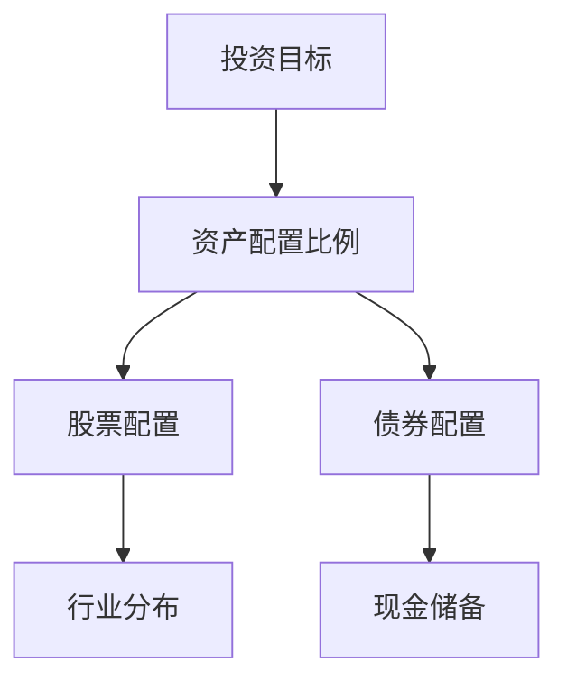
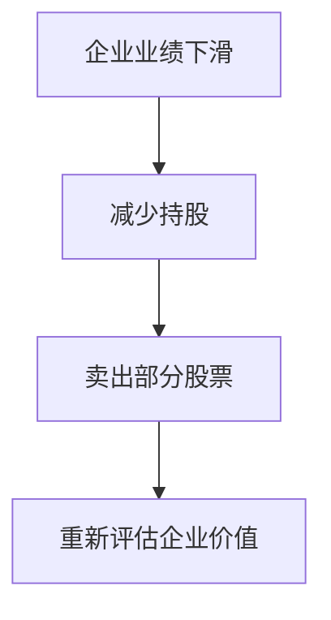
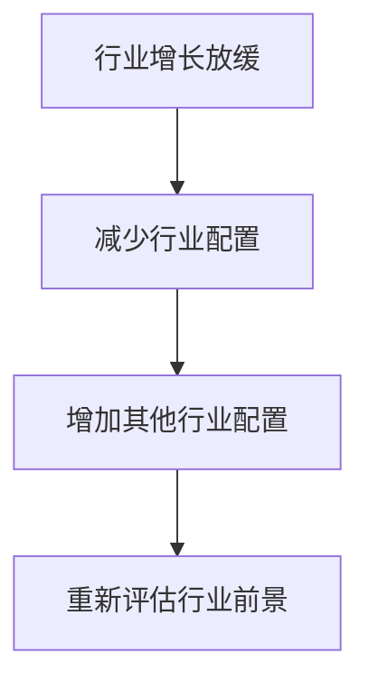
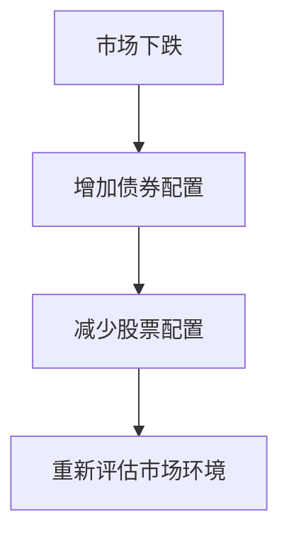

                 


# 定期更新投资组合：巴菲特的年度习惯

## 关键词：投资组合、巴菲特、价值投资、风险管理、投资策略、资产配置

## 摘要：  
本文深入探讨了巴菲特的年度投资习惯，特别是其定期更新投资组合的策略。通过分析巴菲特的投资哲学、投资组合管理的原则、定期更新的必要性以及实施步骤，结合数学模型和系统架构设计，本文为读者提供了全面的理解和实践指南。文章还介绍了相关的工具和技术，帮助读者在实际操作中更好地应用这些理念。

---

## 第1章：巴菲特的投资哲学

### 1.1 价值投资的核心思想  
巴菲特的价值投资理念强调购买优秀的企业，并长期持有。他认为市场先生是疯狂的，而投资者应关注企业的内在价值。  
$$\text{内在价值} = \text{未来现金流的现值}$$  

#### 1.1.1 股票的真正价值  
巴菲特认为，股票的价值不是由市场决定的，而是由企业的未来现金流决定的。他用以下公式解释：  
$$\text{股票价值} = \sum_{t=1}^{n} \frac{\text{未来现金流}}{(1 + r)^t}$$  
其中，$r$ 是折现率，$t$ 是时间。

#### 1.1.2 长期投资的重要性  
巴菲特强调长期投资，避免短期市场的波动干扰。他认为，市场短期是投票机，长期是称重机。  
$$\text{长期收益} = \text{内在价值} - \text{初始投资成本}$$  

#### 1.1.3 股东权益的保护  
巴菲特注重股东权益，认为企业应为股东创造价值。他通过以下方式实现：  
1. 高ROE（净资产收益率）企业。  
2. 高质量的管理层。  
3. 稳定的现金流。  

---

## 第2章：投资组合管理的基本原则

### 2.1 资产配置的科学性  
资产配置是投资组合管理的核心，巴菲特的资产配置原则包括：  
1. **分散投资**：避免过度集中。  
2. **长期持有**：减少交易成本。  
3. **价值导向**：选择被市场低估的企业。  

#### 2.1.1 分散投资的风险  
分散投资可以降低非系统性风险。巴菲特的资产配置比例通常为：  
- 80% 投资于优质股票。  
- 20% 投资于短期债券。  

#### 2.1.2 长期持有的优势  
长期持有可以避免频繁交易的佣金和税收成本。巴菲特的交易成本公式：  
$$\text{交易成本} = \text{佣金} + \text{资本利得税} + \text{机会成本}$$  

---

## 第3章：定期更新投资组合的必要性

### 3.1 市场环境的变化  
市场环境的变化需要定期调整投资组合。巴菲特的市场分析方法包括：  
1. **经济周期分析**：  
   - 衰退期：增加债券配置。  
   - 复苏期：增加股票配置。  

2. **行业趋势分析**：  
   - 高增长行业：如科技、新能源。  
   - 成熟行业：如公用事业。  

3. **宏观政策分析**：  
   - 货币政策：低利率环境适合股票投资。  
   - 财政政策：财政刺激政策利好周期性行业。  

#### 3.1.1 股票市场的波动性  
股票市场的波动性需要定期调整投资组合。巴菲特的波动性分析公式：  
$$\text{波动性} = \sqrt{\text{方差}}$$  

### 3.2 企业基本面的变化  
企业基本面的变化也需要定期调整投资组合。巴菲特的企业分析方法包括：  
1. **财务状况评估**：  
   - 利润率：净利润率越高越好。  
   - 负债率：低负债率更安全。  

2. **管理层变动**：  
   - 管理层能力直接影响企业价值。  

3. **竞争优势变化**：  
   - 竞争优势减弱的企业应减少配置。  

---

## 第4章：定期更新投资组合的实施步骤

### 4.1 投资组合评估

#### 4.1.1 资产配置比例分析  
定期评估资产配置比例，确保符合投资目标。巴菲特的资产配置模型：  



#### 4.1.2 投资标的业绩表现  
评估投资标的业绩，包括：  
- 股票的ROE。  
- 债券的到期收益率。  

#### 4.1.3 市场环境变化评估  
评估市场环境的变化，包括：  
- 经济周期。  
- 宏观政策。  

### 4.2 投资组合调整策略

#### 4.2.1 个股调整策略  
根据企业基本面变化进行个股调整。巴菲特的个股调整逻辑：  



#### 4.2.2 行业配置调整  
根据行业趋势变化进行行业配置调整。巴菲特的行业调整逻辑：  



#### 4.2.3 资产类别调整  
根据市场环境变化进行资产类别调整。巴菲特的资产调整逻辑：  



### 4.3 投资组合调整的执行

#### 4.3.1 调整的具体操作步骤  
- 制定调整计划。  
- 执行交易指令。  
- 记录调整日志。  

#### 4.3.2 调整后的跟踪与评估  
- 定期评估调整效果。  
- 重新评估投资目标。  

---

## 第5章：定期更新投资组合的数学模型与分析

### 5.1 投资组合优化的数学模型

#### 5.1.1 现代投资组合理论（MPT）  
MPT由Harry Markowitz提出，用于优化投资组合的收益与风险。公式如下：  

$$\text{最优组合} = \argmin_{w} \left( \sigma^2 \right) \text{ s.t. } w \cdot \mu = \text{目标收益}$$  

其中，$\sigma^2$ 是组合的方差，$w$ 是权重向量，$\mu$ 是收益向量。  

#### 5.1.2 马科维茨的有效前沿  
有效前沿是所有最优投资组合的集合，满足给定风险下的最高收益或给定收益下的最低风险。  

### 5.2 投资组合风险的量化分析

#### 5.2.1 方差与标准差的计算  
方差衡量资产收益的波动性：  
$$\text{方差} = \frac{1}{n}\sum_{i=1}^{n} (x_i - \bar{x})^2$$  
标准差是方差的平方根，衡量资产的风险：  
$$\text{标准差} = \sqrt{\text{方差}}$$  

#### 5.2.2 VaR（在险价值）模型  
VaR是在一定置信水平下，投资组合可能的最大损失。公式如下：  
$$\text{VaR} = \text{损失的分位数}$$  

#### 5.2.3 CVaR（条件在险价值）模型  
CVaR是VaR的扩展，考虑超过VaR的平均损失。公式如下：  
$$\text{CVaR} = \frac{1}{\alpha} \int_{0}^{\alpha} \text{损失分布} \, d\text{概率}$$  

---

## 第6章：定期更新投资组合的系统架构与工具

### 6.1 投资组合管理系统的功能设计

#### 6.1.1 数据采集与处理模块  
数据采集包括市场数据（如股价、债券收益率）和企业数据（如财务报表）。  

#### 6.1.2 投资组合优化模块  
使用数学模型优化投资组合，如MPT和CVaR模型。  

#### 6.1.3 风险评估与预警模块  
评估投资组合风险，如VaR和CVaR，并发出预警信号。  

### 6.2 投资组合管理系统的架构设计

#### 6.2.1 分层架构设计  
- 数据层：存储市场和企业数据。  
- 业务逻辑层：执行优化和风险评估。  
- 用户界面层：展示结果并支持调整操作。  

#### 6.2.2 模块化设计  
- 数据采集模块：负责数据输入。  
- 优化模块：负责组合优化。  
- 风险评估模块：负责风险计算。  

#### 6.2.3 系统接口设计  
系统与外部数据源（如金融数据库）接口，以及与交易系统接口。  

---

## 第7章：定期更新投资组合的项目实战

### 7.1 环境安装

#### 7.1.1 Python环境搭建  
安装Python和相关库（如numpy、pandas、matplotlib）。  

#### 7.1.2 数据获取工具安装  
安装金融数据API（如Yahoo Finance API）。  

### 7.2 核心实现

#### 7.2.1 数据采集与处理  
使用Python代码采集市场和企业数据。  

```python
import pandas as pd
import numpy as np

# 示例：采集股票数据
data = pd.DataFrame({'股价': [100, 105, 98, 110, 108]})
print(data)
```

#### 7.2.2 投资组合优化  
使用MPT模型优化投资组合。  

```python
import numpy as np

# 示例：MPT优化
mu = np.array([0.1, 0.15, 0.12])
sigma = np.array([[0.2, 0.1, 0.15],
                 [0.1, 0.3, 0.2],
                 [0.15, 0.2, 0.3]])

# 计算最优权重
w = np.linalg.inv(sigma) @ mu
w = w / np.sum(w)
print(w)
```

### 7.3 案例分析

#### 7.3.1 投资组合调整案例  
假设当前投资组合中某股票业绩下滑，需减少持股比例。  

#### 7.3.2 风险管理案例  
假设市场波动加剧，需增加债券配置比例。  

### 7.4 项目小结  
通过实际案例，展示了定期更新投资组合的必要性和实施步骤。

---

## 结语  
巴菲特的成功不仅在于其价值投资理念，还在于其对投资组合的定期更新和优化。通过结合现代数学模型和系统工具，投资者可以更好地管理和调整投资组合，实现长期稳定的收益。

---

## 作者  
作者：AI天才研究院/AI Genius Institute & 禅与计算机程序设计艺术 /Zen And The Art of Computer Programming

