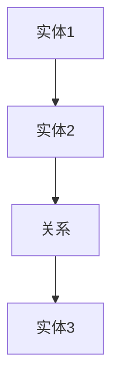

                 


# 实体提取：增强AI Agent的信息处理能力

> 关键词：实体提取，命名实体识别，关系抽取，自然语言处理，AI Agent

> 摘要：实体提取是自然语言处理中的关键任务，旨在从文本中提取结构化信息，增强AI Agent的信息处理能力。本文从实体提取的核心概念、算法原理、系统设计到项目实战，全面解析其实现细节和应用价值。

---

## 第一部分: 实体提取概述

### 第1章: 实体提取的核心概念与背景

#### 1.1 实体提取的定义与背景

实体提取（Entity Extraction）是自然语言处理（NLP）中的关键任务，旨在从文本中识别出具有特定意义的实体及其属性信息。实体可以是人名、地名、组织名、时间、日期、金额等。这些实体构成了文本中的核心信息，是AI Agent理解和处理文本的基础。

- **AI Agent与实体提取的关系**  
  AI Agent需要从大量非结构化文本中提取结构化信息，以便进行后续的分析、推理和决策。实体提取为其提供了关键的输入数据，显著增强了信息处理能力。

- **实体提取的背景**  
  随着NLP技术的发展，实体提取在智能客服、舆情分析、知识图谱构建等领域发挥着重要作用。然而，文本的复杂性（如歧义性、上下文依赖性）使得实体提取面临诸多挑战。

#### 1.2 实体提取的问题背景

- **信息结构化需求**  
  非结构化文本难以直接用于数据分析，实体提取通过结构化处理，使其可被机器理解和利用。

- **实体提取的挑战**  
  - 文本中的实体可能重叠或模糊（如“苹果公司”可能指公司或水果）。
  - 实体识别依赖于上下文，需要考虑语义信息。
  - 不同领域的实体提取需求差异较大，需要定制化处理。

- **实体提取的应用场景**  
  - **智能客服**：从用户输入中提取关键信息，如姓名、地址等。
  - **舆情分析**：从社交媒体文本中提取情感相关实体，如品牌名称。
  - **知识图谱构建**：通过实体提取构建大规模知识库。

#### 1.3 实体提取的核心问题描述

- **实体识别与实体链接**  
  实体识别（NER）是将文本中的实体进行分类和标记；实体链接是将识别出的实体映射到知识库中的具体概念（如将“苹果”映射到“公司”或“水果”）。

- **关系抽取**  
  关系抽取（RE）是识别文本中实体之间的关系，如“苹果公司成立于1971年”。

- **实体消解**  
  在上下文中消除实体指代的歧义性，确保实体的一致性。

#### 1.4 实体提取的边界与外延

- **实体提取的边界**  
  实体提取专注于从文本中提取结构化实体信息，不涉及情感分析或文本生成。

- **实体提取的外延**  
  - 命名实体识别（NER）：识别文本中的命名实体，如人名、地名。
  - 关系抽取（RE）：识别实体之间的关系，如“X是Y的子公司”。
  - 实体消解（Entity Disambiguation）：消除实体指代的歧义性。

- **与信息抽取的关系**  
  实体提取是信息抽取的重要组成部分，信息抽取还包括时间抽取、事件抽取等任务。

#### 1.5 实体提取的核心要素组成

- **实体类型与标签**  
  实体类型包括人名（PER）、地名（LOC）、组织名（ORG）、时间（TIME）等。每个实体都有对应的标签，如B-PER（实体开始）、I-PER（实体中间）。

- **实体识别的特征**  
  - 位置信息：实体在文本中的起始和结束位置。
  - 实体类型：如PER、LOC等。
  - 上下文信息：影响实体识别的语义环境。

- **实体关系的结构化表示**  
  实体之间的关系可以用三元组（头实体、关系、尾实体）表示，如（苹果公司，成立于，1971年）。

---

### 第2章: 实体提取的核心概念与联系

#### 2.1 实体提取的原理

- **命名实体识别（NER）的原理**  
  NER通过模式匹配或机器学习方法，基于局部特征（如字符、词性）和全局特征（如上下文）进行实体分类。

- **关系抽取（RE）的原理**  
  RE通过分析实体之间的语义关系，利用句法结构或语义角色标注（SRL）进行关系识别。

- **实体消解的原理**  
  实体消解通过消除指代歧义，将文本中的实体映射到唯一标识符。

#### 2.2 实体提取的核心概念对比

| 对比维度 | 实体类型（NER） | 实体关系（RE） |
|----------|----------------|----------------|
| 核心任务 | 识别实体        | 识别实体关系    |
| 输入     | 文本片段        | 实体候选列表    |
| 输出     | 实体标签        | 关系三元组      |
| 算法     | 基于CRF的序列标注 | 基于RNN的关系抽取 |

#### 2.3 实体关系的ER图架构



---

## 第3章: 实体提取的算法原理

#### 3.1 命名实体识别（NER）的实现

- **CRF算法原理**  
  CRF（Conditional Random Fields）是一种无向图模型，用于序列标注任务。其核心思想是基于局部特征和转移特征进行条件概率建模。

  ```mermaid
  graph LR
      A[输入序列] --> B[特征提取]
      B --> C[条件概率计算]
      C --> D[NER标签输出]
  ```

  **Python代码示例**  
  ```python
  import numpy as np
  from sklearn_crfsuite import CRF

  # 示例数据
  X = [[...], ...]  # 特征向量
  y = ['PER', 'LOC', ...]  # 标签

  # 模型训练
  crf = CRF()
  crf.fit(X, y)
  ```

- **数学模型**  
  CRF的目标函数可以表示为：
  $$P(y|x) = \frac{\exp(\sum_{i=1}^n f_i(x,y))}{Z}$$
  其中，$Z$是归一化因子，$f_i$是特征函数。

#### 3.2 关系抽取（RE）的实现

- **RNN算法原理**  
  RNN通过循环处理序列数据，提取上下文特征，用于关系分类。

  ```mermaid
  graph LR
      A[输入序列] --> B[RNN处理]
      B --> C[关系分类]
      C --> D[RE标签输出]
  ```

  **Python代码示例**  
  ```python
  import tensorflow as tf
  from tensorflow.keras import layers

  # 示例数据
  input_sequence = Input(shape=(None, 100))
  x = layers.LSTM(64)(input_sequence)
  x = layers.Dense(128, activation='relu')(x)
  output = layers.Dense(num_relations, activation='softmax')(x)

  # 模型训练
  model = Model(inputs=input_sequence, outputs=output)
  model.compile(loss='sparse_categorical_crossentropy', optimizer='adam')
  ```

- **数学模型**  
  RNN的损失函数可以表示为：
  $$L = -\sum_{i=1}^n \log P(y_i|x_i)$$
  其中，$P(y_i|x_i)$是模型预测的概率。

---

## 第4章: 系统分析与架构设计

### 4.1 问题场景介绍

- **项目介绍**  
  开发一个基于实体提取的AI Agent，用于从新闻文本中提取公司名称和时间信息。

- **系统功能设计**  
  - 实体识别：识别文本中的公司名称。
  - 关系抽取：识别公司之间的关系（如投资、合作）。
  - 实体消解：消除指代歧义。

  ```mermaid
  classDiagram
      class TextProcessor {
          extract_entities()
      }
      class NERModel {
          predict()
      }
      class REModel {
          predict()
      }
      TextProcessor --> NERModel
      TextProcessor --> REModel
  ```

- **系统架构设计**  
  ```mermaid
  box {
      + 输入文本
      + 实体识别模块
      + 关系抽取模块
      + 输出结果
  } as EntityExtractor
  ```

---

## 第5章: 项目实战

### 5.1 环境安装

- **Python安装**  
  ```bash
  python --version
  ```

- **依赖安装**  
  ```bash
  pip install scikit-learn tensorflow
  ```

### 5.2 核心代码实现

- **NER模型实现**  
  ```python
  import sklearn_crfsuite

  def train_ner_model(X_train, y_train):
      crf = sklearn_crfsuite.CRF()
      crf.fit(X_train, y_train)
      return crf

  # 示例训练
  X_train = [[...], ...]
  y_train = ['PER', 'LOC', ...]
  ner_model = train_ner_model(X_train, y_train)
  ```

- **RE模型实现**  
  ```python
  import tensorflow as tf

  def train_re_model(X_train, y_train):
      model = tf.keras.Sequential([
          layers.LSTM(64, input_shape=(None, 100)),
          layers.Dense(128, activation='relu'),
          layers.Dense(num_relations, activation='softmax')
      ])
      model.compile(loss='sparse_categorical_crossentropy', optimizer='adam')
      model.fit(X_train, y_train, epochs=10)
      return model

  # 示例训练
  X_train = Input(shape=(None, 100))
  y_train = [...]
  re_model = train_re_model(X_train, y_train)
  ```

### 5.3 案例分析与总结

- **案例分析**  
  从新闻文本中提取公司名称和时间信息，构建关系三元组。

- **项目总结**  
  通过实体提取，AI Agent能够从非结构化文本中提取关键信息，显著提升信息处理能力。

---

## 第6章: 最佳实践与小结

### 6.1 最佳实践

- **数据质量**  
  高质量的标注数据是实体提取性能的关键。

- **模型调优**  
  使用交叉验证和网格搜索优化模型参数。

- **领域定制**  
  不同领域需要定制化的实体提取模型。

### 6.2 小结

实体提取是AI Agent信息处理的核心能力，通过NER和RE技术，能够从文本中提取结构化信息，提升系统的理解和推理能力。

### 6.3 注意事项

- **性能优化**  
  使用高效的特征提取和模型压缩技术。

- **可解释性**  
  提供可解释的实体提取结果，便于用户理解和调试。

### 6.4 拓展阅读

- **推荐阅读书籍**  
  - 《自然语言处理实战》
  - 《深度学习入门：基于Python的理论与实现》

- **推荐阅读论文**  
  - Lample, G., et al. "Neural architectures for named entity recognition."

---

## 作者信息

作者：AI天才研究院（AI Genius Institute） & 禅与计算机程序设计艺术（Zen And The Art of Computer Programming）

---

通过以上思考过程，我们可以逐步撰写一篇完整的关于实体提取的技术博客文章，覆盖核心概念、算法原理、系统设计和项目实战等内容。

