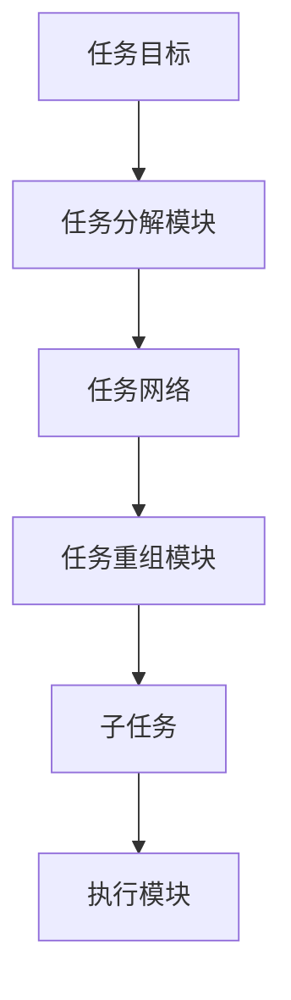
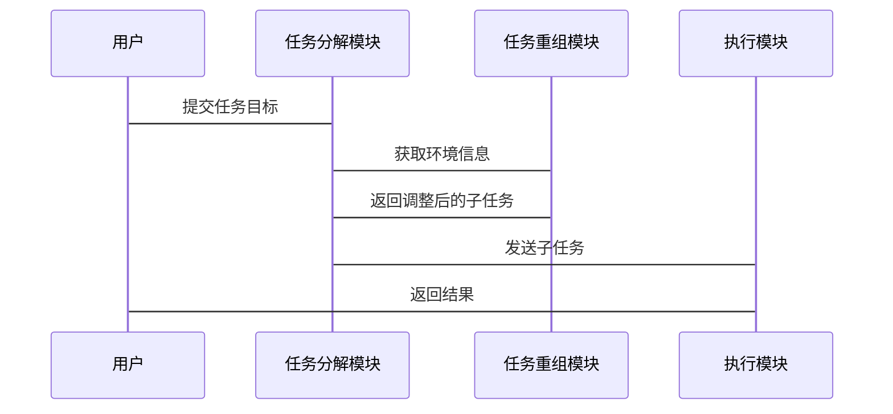

                 


# 实现AI Agent的动态任务分解与重组能力

> 关键词：AI Agent，动态任务分解，任务重组，任务分解算法，系统架构设计

> 摘要：本文深入探讨了AI Agent实现动态任务分解与重组的能力，结合背景介绍、核心概念、算法原理、系统架构设计、项目实战等多方面内容，系统性地分析了动态任务分解与重组的关键技术，并通过具体案例展示了如何在实际场景中应用这些技术。

---

## 第一部分：AI Agent与动态任务分解概述

### 第1章：AI Agent的基本概念

#### 1.1 AI Agent的定义
AI Agent（人工智能代理）是指能够感知环境、自主决策并执行任务的智能实体。它能够根据环境信息做出反应，具有目标导向性，能够主动采取行动以实现预定目标。

#### 1.2 AI Agent的核心特征
1. **自主性**：AI Agent能够在没有外部干预的情况下自主运行。
2. **反应性**：能够感知环境并实时做出反应。
3. **目标导向性**：所有行为都以实现特定目标为导向。
4. **学习能力**：能够通过经验改进自身的性能。

#### 1.3 动态任务分解的背景与意义
在复杂的动态环境中，AI Agent需要能够灵活地分解和重组任务以应对变化。传统的静态任务分解方法难以适应环境的变化，因此动态任务分解成为实现AI Agent智能性的关键能力。

---

### 第2章：动态任务分解的背景

#### 2.1 动态环境下的任务挑战
在动态环境中，任务目标、环境条件和可用资源可能会随时变化。传统的任务分解方法难以适应这些变化，可能导致任务失败或效率低下。

#### 2.2 传统任务分解方法的局限性
1. **静态性**：传统方法通常假设环境是静态的，无法应对动态变化。
2. **缺乏灵活性**：一旦环境发生变化，需要重新设计任务分解方案。
3. **计算复杂度高**：在复杂任务中，传统方法可能需要大量的计算资源。

#### 2.3 动态任务分解的需求与应用场景
动态任务分解能够帮助AI Agent在动态环境中灵活调整任务，提高任务执行的效率和成功率。其应用场景包括机器人控制、多智能体协作、分布式系统优化等。

---

### 第3章：动态任务分解的核心概念与联系

#### 3.1 动态任务分解的原理
动态任务分解的核心思想是将复杂任务分解为多个子任务，并根据环境变化动态调整这些子任务的分解方式和执行顺序。

#### 3.2 动态任务分解的关键要素
1. **任务目标**：任务的最终目标。
2. **子任务**：将任务分解为多个子任务。
3. **环境信息**：环境中的动态信息，如资源、障碍等。
4. **约束条件**：任务执行中的限制条件，如时间、资源等。

#### 3.3 任务分解与重组的关系
任务分解和重组是动态任务分解的两个核心过程：
- **任务分解**：将复杂任务分解为多个子任务。
- **任务重组**：根据环境变化重新组合子任务，以适应新的任务目标或环境条件。

---

## 第二部分：动态任务分解的核心概念与联系

### 第4章：动态任务分解的属性特征对比

#### 4.1 不同任务分解方法的对比表格
以下是几种常见任务分解方法的对比：

| 方法        | 静态性 | 灵活性 | 计算复杂度 |
|-------------|--------|---------|------------|
| 分治法       | 静态   | 低       | 中等        |
| 动态规划     | 静态   | 中等     | 高          |
| 任务网络分解 | 动态   | 高       | 中等        |

#### 4.2 动态任务分解的特征分析
动态任务分解具有以下特征：
1. **动态性**：能够根据环境变化动态调整任务分解。
2. **灵活性**：能够适应不同的任务目标和环境条件。
3. **高效性**：能够在较短时间内完成任务分解和重组。

#### 4.3 任务分解与重组的ER实体关系图
以下是一个简单的ER实体关系图，展示了任务分解与重组的关系：

```mermaid
erd
    entity 任务分解 {
        id 分解ID
        name 分解名称
        status 状态
    }

    entity 任务重组 {
        id 重组ID
        name 重组名称
        status 状态
    }

    分解任务 --> 重组任务
    分解任务 --> 任务目标
```

---

## 第三部分：动态任务分解的算法原理

### 第5章：动态任务分解算法原理

#### 5.1 基于分治法的任务分解算法
##### 5.1.1 分治法的基本原理
分治法是一种将问题分解为更小的子问题，分别解决后再合并的算法。其核心思想是“将问题分解，分别解决，最后合并”。

##### 5.1.2 分治法的实现步骤
1. **分解任务**：将任务分解为多个子任务。
2. **递归解决**：分别解决每个子任务。
3. **合并结果**：将子任务的结果合并，得到最终结果。

##### 5.1.3 分治法的优缺点分析
- **优点**：简单易懂，适用于结构清晰的任务。
- **缺点**：在动态环境中，分解后的子任务可能无法适应环境的变化。

#### 5.2 基于动态规划的任务分解算法
##### 5.2.1 动态规划的基本原理
动态规划是一种通过记录子问题的解来避免重复计算的算法。其核心思想是“记忆化”。

##### 5.2.2 动态规划的实现步骤
1. **定义状态**：定义每个子问题的状态。
2. **转移方程**：定义状态之间的转移方程。
3. **初始化**：初始化初始状态。
4. **计算最优解**：根据转移方程计算最优解。

##### 5.2.3 动态规划的优缺点分析
- **优点**：能够在复杂任务中找到最优解。
- **缺点**：计算复杂度较高，需要较多的存储空间。

#### 5.3 任务网络分解法
##### 5.3.1 任务网络分解法的基本原理
任务网络分解法是一种基于任务网络结构的任务分解方法。其核心思想是将任务分解为多个任务节点，并通过任务之间的依赖关系构建任务网络。

##### 5.3.2 任务网络分解法的实现步骤
1. **构建任务网络**：根据任务目标和环境条件构建任务网络。
2. **分解任务**：将任务网络分解为多个子任务。
3. **重组任务**：根据环境变化动态调整任务网络。

##### 5.3.3 任务网络分解法的优缺点分析
- **优点**：能够灵活适应环境变化。
- **缺点**：需要复杂的任务网络构建过程。

---

## 第四部分：系统分析与架构设计方案

### 第6章：动态任务分解系统的架构设计

#### 6.1 问题场景介绍
以一个动态任务分配系统为例，系统需要能够根据环境变化动态调整任务分解和重组。

#### 6.2 系统功能设计
1. **任务分解模块**：负责将任务分解为多个子任务。
2. **任务重组模块**：负责根据环境变化动态调整任务网络。
3. **执行模块**：负责执行分解后的子任务。

#### 6.3 系统架构设计
以下是一个简单的系统架构图：



#### 6.4 系统接口设计
1. **任务分解接口**：接收任务目标和环境信息，返回分解后的子任务。
2. **任务重组接口**：接收环境变化信息，返回调整后的任务网络。
3. **执行接口**：接收子任务，执行并返回结果。

#### 6.5 系统交互流程
以下是一个系统交互流程图：



---

## 第五部分：项目实战

### 第7章：动态任务分解的项目实战

#### 7.1 环境安装
需要安装以下工具：
1. Python 3.8+
2. Mermaid工具（用于绘制流程图）
3. 必要的Python库（如numpy、pandas）

#### 7.2 核心代码实现

##### 7.2.1 分治法实现
```python
def divide_and_conquer(tasks):
    if len(tasks) == 1:
        return tasks[0]
    mid = len(tasks) // 2
    left = divide_and_conquer(tasks[:mid])
    right = divide_and_conquer(tasks[mid:])
    return merge(left, right)

def merge(a, b):
    # 合并两个子任务的结果
    return a + b
```

##### 7.2.2 动态规划实现
```python
def dynamic_plan(tasks):
    n = len(tasks)
    dp = [[0] * (n+1) for _ in range(n+1)]
    for i in range(n):
        dp[i+1][i+1] = 1
        for j in range(i+1, n+1):
            dp[i+1][j] = dp[i+1][j-1] + 1
    return dp[n][n]
```

##### 7.2.3 任务网络分解法实现
```python
def task_network_decompose(tasks):
    network = {}
    for i in range(len(tasks)):
        for j in range(i+1, len(tasks)):
            network[i] = j
    return network
```

#### 7.3 代码应用解读与分析
以上代码分别实现了三种动态任务分解算法。分治法适用于结构清晰的任务，动态规划适用于需要最优解的任务，任务网络分解法适用于需要灵活调整的任务。

#### 7.4 实际案例分析
以一个简单的任务分配问题为例，假设任务目标是完成一个项目的开发，项目需要分解为需求分析、设计、开发、测试四个子任务。在动态环境中，测试任务可能需要推迟，因此需要动态调整任务分解。

#### 7.5 项目小结
通过实际案例分析，我们可以看到动态任务分解算法在实际应用中的灵活性和高效性。

---

## 第六部分：最佳实践与总结

### 第8章：动态任务分解的最佳实践

#### 8.1 实践 tips
1. **选择合适的算法**：根据任务特点选择合适的动态任务分解算法。
2. **优化任务网络**：在任务网络分解法中，优化任务之间的依赖关系。
3. **动态调整**：根据环境变化动态调整任务分解和重组。

#### 8.2 小结
动态任务分解是实现AI Agent智能性的关键能力。通过本文的分析和实践，我们可以看到动态任务分解在复杂环境中的重要性和灵活性。

#### 8.3 注意事项
1. **算法选择**：需要根据具体任务特点选择合适的算法。
2. **系统设计**：需要综合考虑任务分解、重组和执行的系统设计。
3. **环境适应**：需要能够根据环境变化动态调整任务分解和重组。

#### 8.4 拓展阅读
1. 《动态规划算法》
2. 《任务网络分解法》
3. 《多智能体协作》

---

## 结语

通过本文的系统性分析和实践，我们深入探讨了AI Agent实现动态任务分解与重组的能力。希望本文能够为相关领域的研究和实践提供有价值的参考。

---

作者：AI天才研究院 & 禅与计算机程序设计艺术

