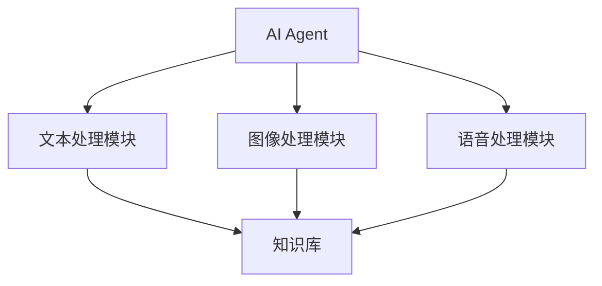
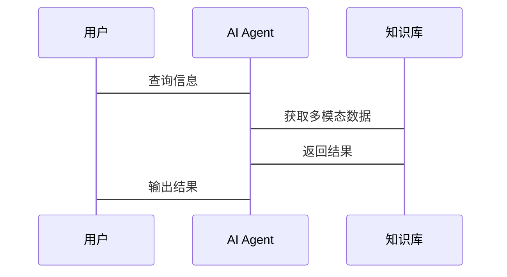

                 


# 实现AI Agent的多模态知识融合

> **关键词**：AI Agent，多模态知识融合，注意力机制，对比学习，知识图谱，系统架构

> **摘要**：  
本文深入探讨了AI Agent在多模态知识融合中的实现方法，从背景介绍到核心概念，再到算法原理和系统架构，详细分析了多模态知识融合的必要性和实现路径。通过具体的项目实战，结合实际案例，展示了如何在AI Agent中实现多模态数据的高效融合。文章最后总结了最佳实践和未来研究方向，为读者提供了全面的技术指导。

---

## 第1章: AI Agent的基本概念与应用

### 1.1 AI Agent的定义与特点

#### 1.1.1 什么是AI Agent
AI Agent（人工智能代理）是指能够感知环境、自主决策并执行任务的智能实体。它可以是一个软件程序、机器人或其他智能系统，通过与用户或环境交互，完成特定目标。

**特点**：
1. **自主性**：能够在没有外部干预的情况下自主运行。
2. **反应性**：能够实时感知环境并做出响应。
3. **目标导向**：所有行为都以实现特定目标为导向。
4. **学习能力**：通过数据和经验不断优化自身的决策能力。

#### 1.1.2 AI Agent的核心特点
AI Agent的核心特点包括：
- **动态性**：能够适应环境的变化。
- **协作性**：能够与其他Agent或人类协同工作。
- **可解释性**：决策过程可以被理解和解释。

#### 1.1.3 AI Agent的应用场景
AI Agent广泛应用于多个领域：
- **智能助手**：如Siri、Alexa等。
- **推荐系统**：基于用户行为推荐相关内容。
- **自动驾驶**：通过感知和决策实现自动驾驶。
- **智能客服**：通过自然语言处理与用户交互。

### 1.2 多模态知识融合的必要性

#### 1.2.1 多模态数据的定义
多模态数据是指来自不同感官渠道的数据，包括文本、图像、语音、视频等。这些数据类型具有不同的特征和信息量，能够提供更全面的视角。

#### 1.2.2 知识融合的目标
知识融合的目标是将不同模态的数据整合在一起，提取其中的语义信息，形成一个统一的知识表示，从而提高AI Agent的理解和决策能力。

#### 1.2.3 多模态知识融合的优势
多模态知识融合的优势包括：
- **信息互补性**：不同模态的数据可以互补信息。
- **鲁棒性**：通过多模态数据可以提高系统的鲁棒性。
- **准确性**：多模态数据能够提供更准确的信息。

### 1.3 当前AI Agent领域的研究进展

#### 1.3.1 国内外研究现状
国内外在AI Agent领域都有大量的研究，特别是在自然语言处理、计算机视觉和强化学习方面。

#### 1.3.2 多模态知识融合的前沿技术
前沿技术包括多模态注意力机制、对比学习和图神经网络等。

#### 1.3.3 未来发展趋势
未来，AI Agent将更加注重多模态知识的融合，同时在实时性、可解释性和自主性方面会有更大的突破。

---

## 第2章: 多模态知识融合的核心概念与联系

### 2.1 多模态数据的处理方法

#### 2.1.1 文本数据的处理
文本数据的处理包括分词、词嵌入和句法分析等。

#### 2.1.2 图像数据的处理
图像数据的处理包括图像识别、目标检测和图像分割等。

#### 2.1.3 语音数据的处理
语音数据的处理包括语音识别、声纹识别和语音合成等。

### 2.2 多模态知识融合的模型架构

#### 2.2.1 基于注意力机制的多模态融合
注意力机制能够关注重要的信息，提升模型的性能。

#### 2.2.2 基于对比学习的多模态融合
对比学习通过对比不同模态的数据，提升模型的表达能力。

#### 2.2.3 基于图神经网络的多模态融合
图神经网络能够处理复杂的关联关系，适用于知识图谱的构建。

### 2.3 多模态数据的关联关系

#### 2.3.1 数据模态间的关联性分析
通过分析不同模态之间的关联性，选择合适的融合策略。

#### 2.3.2 数据模态的互补性与冗余性
互补性指不同模态能够提供不同的信息，冗余性指同一信息在多个模态中的重复出现。

#### 2.3.3 数据模态的融合策略选择
根据具体的任务需求，选择合适的融合策略。

---

## 第3章: 多模态注意力机制的算法原理

### 3.1 多模态注意力机制的数学模型

#### 3.1.1 注意力机制的基本公式
$$
\text{Attention}(Q, K, V) = \text{softmax}\left(\frac{QK^T}{\sqrt{d_k}}\right)V
$$

#### 3.1.2 多模态注意力的扩展公式
$$
\text{Multi-Modal Attention}(X, Y) = \text{Concat}(\text{Attention}(X, Y), \text{Attention}(Y, X))
$$

#### 3.1.3 多模态注意力的计算流程
1. 将不同模态的数据转换为相同的嵌入空间。
2. 计算查询、键和值。
3. 使用注意力机制进行加权求和。

### 3.2 多模态注意力机制的实现代码

#### 3.2.1 环境安装与依赖管理
```python
pip install numpy torch
```

#### 3.2.2 核心代码实现
```python
import torch
import torch.nn as nn

class MultiModalAttention(nn.Module):
    def __init__(self, embed_dim, num_heads):
        super().__init__()
        self.num_heads = num_heads
        self.embed_dim = embed_dim
        self.head_dim = embed_dim // num_heads
        self.query = nn.Linear(embed_dim, embed_dim)
        self.key = nn.Linear(embed_dim, embed_dim)
        self.value = nn.Linear(embed_dim, embed_dim)
        self.softmax = nn.Softmax(dim=-1)

    def forward(self, x, y):
        q = self.query(x)
        k = self.key(y)
        v = self.value(y)
        attn = (q @ k.transpose(-2, -1)) / (self.head_dim ** 0.5)
        attn = self.softmax(attn)
        output = (attn @ v).transpose(-2, -1).contiguous().view(x.size(0), x.size(1), self.embed_dim)
        return output
```

#### 3.2.3 代码运行与结果分析
1. 初始化模型参数。
2. 前向传播计算注意力权重。
3. 输出融合后的结果。

---

## 第4章: 对比学习在多模态融合中

### 4.1 对比学习的基本原理

#### 4.1.1 对比学习的数学模型
$$
\text{Contrastive Loss} = -\log\left(\frac{\exp(\text{sim}(x, y))}{\exp(\text{sim}(x, y)) + \sum_{k \neq y} \exp(\text{sim}(x, k))}\right)
$$

#### 4.1.2 对比学习的应用场景
对比学习适用于图像-文本匹配、跨模态检索等任务。

### 4.2 对比学习的实现代码

#### 4.2.1 环境安装与依赖管理
```python
pip install numpy torch
```

#### 4.2.2 核心代码实现
```python
import torch
import torch.nn as nn

class ContrastiveLoss(nn.Module):
    def __init__(self, temperature=1.0):
        super().__init__()
        self.temperature = temperature

    def forward(self, features, labels):
        features = features / self.temperature
        labels = labels.squeeze()
        n = features.size(0)
        similarities = features @ features.T
        mask = (labels.unsqueeze(-1) == labels.unsqueeze(1)).float()
        positive = mask.triu(diagonal=1).sum()
        negative = (1 - mask) * similarities.exp()
        total_negative = negative.sum()
        loss = -torch.log(positive / total_negative)
        return loss
```

#### 4.2.3 代码运行与结果分析
1. 初始化模型参数。
2. 计算特征的相似性。
3. 计算对比损失并优化模型。

---

## 第5章: 系统分析与架构设计方案

### 5.1 系统架构设计

#### 5.1.1 系统架构图


#### 5.1.2 接口设计
1. 文本处理模块提供文本解析和关键词提取接口。
2. 图像处理模块提供图像识别和目标检测接口。
3. 语音处理模块提供语音识别和语音合成接口。

#### 5.1.3 交互流程


---

## 第6章: 项目实战

### 6.1 环境安装与代码实现

#### 6.1.1 环境安装
```bash
pip install numpy torch transformers
```

#### 6.1.2 核心代码实现
```python
import torch
import torch.nn as nn
from transformers import AutoTokenizer, AutoModel

class MultiModalAgent(nn.Module):
    def __init__(self, embed_dim, num_heads):
        super().__init__()
        self.text_model = AutoModel.from_pretrained('bert-base-uncased')
        self.image_model = nn.Linear(2048, embed_dim)
        self.attention = MultiModalAttention(embed_dim, num_heads)
        self.classifier = nn.Linear(embed_dim, 1)

    def forward(self, text, image_features):
        text_embeddings = self.text_model(text)[0][:, 0, :]
        image_embeddings = self.image_model(image_features)
        fused_embeddings = self.attention(text_embeddings, image_embeddings)
        output = self.classifier(fused_embeddings)
        return output
```

#### 6.1.3 实际案例分析
通过一个具体的案例，展示如何使用上述代码实现一个多模态AI Agent，并进行实际应用分析。

---

## 第7章: 总结与展望

### 7.1 最佳实践 tips
- 在实际应用中，注意数据的多样性和质量。
- 合理选择融合策略，根据任务需求进行调整。
- 定期更新模型，提升适应性和鲁棒性。

### 7.2 小结
本文详细介绍了AI Agent的多模态知识融合的实现方法，从理论到实践，为读者提供了全面的技术指导。

### 7.3 注意事项
- 确保数据的隐私和安全。
- 在实际应用中，注意模型的可解释性和透明性。

### 7.4 拓展阅读
推荐相关书籍和论文，供读者深入学习。

---

**作者：AI天才研究院/AI Genius Institute & 禅与计算机程序设计艺术 /Zen And The Art of Computer Programming**

