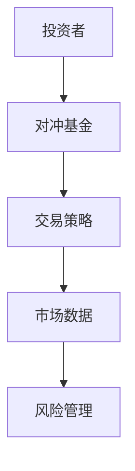
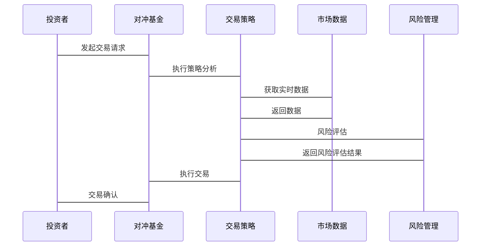

                 


# 对冲基金策略：专业投资者如何应对市场波动

## 关键词：对冲基金、套利、统计套利、CTA策略、风险管理、市场波动

## 摘要：  
对冲基金是一种复杂的金融工具，通过多种策略应对市场波动。本文从套利策略、统计套利、CTA策略等核心概念入手，结合数学模型和系统架构设计，详细分析对冲基金的运作原理。通过实例解读和实际案例分析，帮助专业投资者掌握对冲基金策略的精髓，应对市场波动，实现稳健投资回报。

---

## 第一部分: 对冲基金策略概述

### 第1章: 对冲基金的基本概念

#### 1.1 对冲基金的定义与特点

##### 1.1.1 对冲基金的定义  
对冲基金是一种通过做多和做空相结合的金融工具，旨在在不同市场条件下实现超额收益。其核心目标是通过套利、统计套利和趋势跟踪等策略，在市场波动中捕捉投资机会。

##### 1.1.2 对冲基金的核心特点  
- **对冲风险**：通过做多和做空平衡市场风险，追求绝对收益。  
- **杠杆效应**：合理使用杠杆放大收益，但需控制风险。  
- **多样化策略**：涵盖套利、统计套利、CTA等多种策略，适应不同市场环境。  
- **高流动性**：对冲基金通常具有较高的流动性，便于投资者在市场波动中快速调整仓位。  

##### 1.1.3 对冲基金与传统投资的区别  
| 特性 | 对冲基金 | 传统投资 |
|------|----------|----------|
| 投资目标 | 绝对收益 | 相对收益 |
| 风险控制 | 严格控制波动 | 依赖市场整体表现 |
| 杠杆使用 | 允许适度杠杆 | 通常无杠杆或低杠杆 |

#### 1.2 对冲基金的主要策略

##### 1.2.1 套利策略  
套利策略通过捕捉资产价格差异获利。例如，在股票和可转换债券之间寻找价格偏差，通过同时买入低估资产和卖出高估资产实现无风险收益。

##### 1.2.2 统计套利策略  
统计套利通过分析历史价格数据，寻找资产价格的均值回归特性。例如，当两只股票的价格差异超过历史平均值时，买入低估股票，卖出高估股票。

##### 1.2.3 CTA策略  
CTA（商品交易顾问）策略基于动量效应，通过追踪价格趋势进行交易。例如，在价格上涨时买入，价格下跌时卖出。

##### 1.2.4 股票市场中性策略  
该策略通过做多和做空股票组合，保持市场中性，降低整体市场波动影响。

##### 1.2.5 预期收益策略  
预期收益策略通过分析市场情绪和新闻事件，预测资产价格变动，提前布局投资。

#### 1.3 对冲基金的市场环境

##### 1.3.1 全球化与对冲基金的发展  
全球化使市场更加复杂，但也为对冲基金提供了更多投资机会，如跨国套利和全球趋势跟踪。

##### 1.3.2 市场波动与对冲基金的应对  
市场波动为对冲基金提供套利机会，但同时也要求对冲基金具备快速反应能力，及时调整策略。

##### 1.3.3 对冲基金的监管环境  
对冲基金通常受到较严格的监管，需满足资本充足、信息披露等要求，确保投资者利益。

---

### 第2章: 对冲基金的核心概念与联系

#### 2.1 核心概念原理

##### 2.1.1 套利的原理  
套利通过寻找市场中的价格差异，利用无风险或低风险套利机会获利。例如，股票和可转换债券之间的套利机会。

##### 2.1.2 统计套利的数学模型  
统计套利基于均值回归假设，通过回归分析寻找资产价格的波动规律，建立交易模型。

##### 2.1.3 CTA策略的执行逻辑  
CTA策略基于动量效应，通过技术指标分析价格趋势，执行买入或卖出指令。

#### 2.2 概念属性特征对比表格  
| 战略类型 | 套利 | 统计套利 | CTA |
|----------|------|----------|-----|
| 核心原理 | 价格差异 | 均值回归 | 动量效应 |
| 适用市场 | 股票、债券 | 多资产 | 商品、股票 |
| 风险敞口 | 中低 | 中低 | 中高 |

#### 2.3 ER实体关系图  


---

### 第3章: 对冲基金的数学模型与算法原理

#### 3.1 套利模型

##### 3.1.1 套利定价理论（APT）  
套利定价理论指出，资产的预期收益由其风险因子决定。公式如下：  
$$ E(R_i) = \alpha_i + \beta_i (R_f + \lambda) $$  

##### 3.1.2 实际应用  
例如，股票和债券之间的套利机会，通过公式计算预期收益，指导交易决策。

#### 3.2 统计套利模型

##### 3.2.1 均值回归模型  
$$ \text{spread}_t = \alpha + \beta \cdot \text{spread}_{t-1} + \epsilon_t $$  
该模型用于预测价格回归均值，指导交易时机。

##### 3.2.2 实际应用  
当价格偏离均值时，建立头寸，等待价格回归。

#### 3.3 CTA策略模型

##### 3.3.1 动量策略  
$$ P_t = P_{t-1} + \text{动量因子} \times \text{市场趋势} $$  
该模型基于价格动量，指导买入或卖出决策。

##### 3.3.2 实际应用  
在价格上涨时买入，价格下跌时卖出。

---

### 第4章: 对冲基金的系统分析与架构设计方案

#### 4.1 问题场景介绍

##### 4.1.1 对冲基金交易系统的需求分析  
系统需支持多策略交易、实时数据分析、风险控制和高效执行。

##### 4.1.2 系统的目标与范围  
系统目标：实现对冲基金策略的自动化交易与风险管理。系统范围：包括数据采集、策略执行、风险监控等功能模块。

#### 4.2 系统功能设计

##### 4.2.1 领域模型  


#### 4.3 系统架构设计

##### 4.3.1 系统架构图  


#### 4.4 系统接口设计

##### 4.4.1 数据接口  
- 市场数据接口：实时获取股票、债券等市场数据。  
- 风险管理接口：监控和管理交易风险。  

#### 4.5 系统交互设计

##### 4.5.1 交易执行流程  


---

## 第二部分: 对冲基金策略的实际应用

### 第5章: 套利策略的数学模型与实现

#### 5.1 实例解读

##### 5.1.1 股票与可转换债券的套利机会  
通过分析股票和可转换债券的价格差异，建立套利头寸，锁定无风险收益。

#### 5.2 代码实现

##### 5.2.1 数据采集与处理  
```python
import pandas as pd
import numpy as np

# 读取市场数据
market_data = pd.read_csv('market_data.csv')
# 计算套利机会
spread = market_data['stock'] - market_data['bond']
mean_spread = np.mean(spread)
std_spread = np.std(spread)
```

##### 5.2.2 套利策略实现  
```python
# 判断套利机会
if spread > mean_spread + 2 * std_spread:
    execute_short(market_data['bond'])
    execute_long(market_data['stock'])
elif spread < mean_spread - 2 * std_spread:
    execute_long(market_data['bond'])
    execute_short(market_data['stock'])
```

#### 5.3 案例分析  
通过具体案例分析套利策略的实际效果，验证模型的有效性。

---

### 第6章: 统计套利策略的系统实现

#### 6.1 系统实现步骤

##### 6.1.1 数据预处理  
清洗和标准化市场数据，提取关键指标。

##### 6.1.2 模型训练  
基于历史数据训练均值回归模型，确定交易信号。

##### 6.1.3 系统部署  
将模型部署到交易系统中，实时监控市场数据，自动执行交易指令。

#### 6.2 代码实现

##### 6.2.1 数据处理  
```python
import pandas as pd
import numpy as np

market_data = pd.read_csv('market_data.csv')
spread = market_data['asset1'] - market_data['asset2']
mean_spread = spread.mean()
std_spread = spread.std()
```

##### 6.2.2 统计套利实现  
```python
# 均值回归策略
if spread[-1] > mean_spread + 2 * std_spread:
    execute_short(market_data['asset1'])
    execute_long(market_data['asset2'])
elif spread[-1] < mean_spread - 2 * std_spread:
    execute_long(market_data['asset1'])
    execute_short(market_data['asset2'])
```

#### 6.3 案例分析  
分析统计套利在实际市场中的表现，评估策略的有效性和稳定性。

---

### 第7章: CTA策略的算法实现与优化

#### 7.1 算法实现步骤

##### 7.1.1 数据采集与处理  
实时采集市场数据，进行清洗和特征提取。

##### 7.1.2 动量策略模型  
基于动量指标（如RSI、MACD）构建交易信号。

##### 7.1.3 系统优化  
通过回测和风险控制优化策略参数，提升交易表现。

#### 7.2 代码实现

##### 7.2.1 数据处理  
```python
import pandas as pd
import numpy as np

market_data = pd.read_csv('market_data.csv')
# 计算动量指标
market_data['RSI'] = compute_rsi(market_data['close'])
market_data['MACD'] = compute_macd(market_data['close'])
```

##### 7.2.2 CTA策略实现  
```python
# 动量策略
if market_data['RSI'][-1] < 30:
    execute_long(market_data['close'])
elif market_data['RSI'][-1] > 70:
    execute_short(market_data['close'])
```

#### 7.3 案例分析  
分析CTA策略在实际市场中的表现，评估策略的有效性和适应性。

---

## 第三部分: 对冲基金策略的最佳实践

### 第8章: 对冲基金策略的风险管理

#### 8.1 风险管理原则

##### 8.1.1 风险分散  
通过多策略和多资产配置分散风险。

##### 8.1.2 杠杆控制  
合理使用杠杆，避免过度杠杆带来的风险。

##### 8.1.3 仓位管理  
根据市场波动调整仓位大小，控制整体风险敞口。

#### 8.2 风险管理工具

##### 8.2.1 停损订单  
设置止损点，限制单笔交易的最大亏损。

##### 8.2.2 风险价值（VaR）  
计算投资组合的风险价值，评估潜在损失。

#### 8.3 实际案例分析  
通过具体案例分析风险管理在对冲基金中的重要性，总结经验教训。

---

### 第9章: 对冲基金策略的优化与创新

#### 9.1 策略优化方法

##### 9.1.1 参数优化  
通过回测优化策略参数，提升交易表现。

##### 9.1.2 模型优化  
引入机器学习等先进技术，提升预测精度和交易效率。

#### 9.2 策略创新方向

##### 9.2.1 新兴市场机会  
挖掘新兴市场的投资机会，拓展对冲基金的应用场景。

##### 9.2.2 多因子模型  
结合多个因子构建投资组合，提升收益和风险控制能力。

#### 9.3 实际案例分析  
通过具体案例分析策略优化与创新的实际效果，总结成功经验。

---

## 第四部分: 总结与展望

### 第10章: 对冲基金策略的核心要点总结

#### 10.1 对冲基金策略的核心要点  
对冲基金通过多种策略应对市场波动，实现绝对收益。套利、统计套利和CTA策略是核心工具，数学模型和系统架构是实现这些策略的关键。

#### 10.2 本文的主要贡献  
本文系统介绍了对冲基金的核心概念、数学模型和系统架构，提供了丰富的实例分析和代码实现，帮助读者全面掌握对冲基金策略的精髓。

---

## 参考文献  
1. <NAME>, *The New Finance: The Case for Capitalism without Attachment*  
2. <NAME>, *Option Pricing and Portfolio Optimization: Modern Techniques*  
3. <NAME>, *Quantitative Risk Management: Concepts, Techniques, and Tools*  

---

## 作者：  
**AI天才研究院 / AI Genius Institute & 禅与计算机程序设计艺术 / Zen And The Art of Computer Programming**

