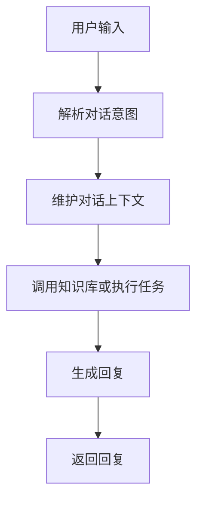
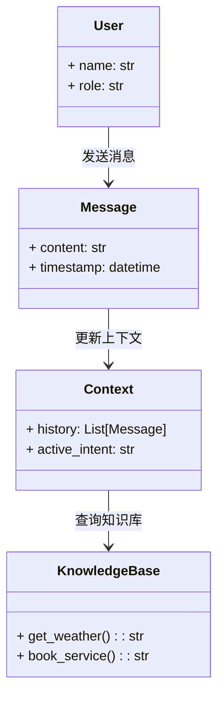
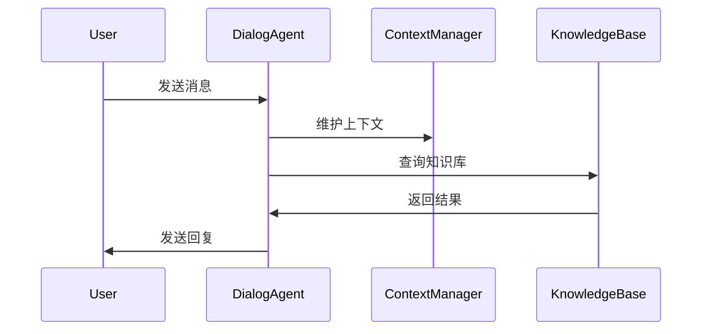

                 


```markdown
# 对话式AI Agent：提升LLM的自然语言交互能力

## 关键词
对话式AI Agent, 自然语言交互, 大语言模型, 知识库, 多轮对话

## 摘要
对话式AI Agent作为提升大语言模型（LLM）自然语言交互能力的核心技术，通过结合外部知识库、任务执行能力以及多轮对话管理，能够显著增强LLM在实际应用场景中的交互效果和用户体验。本文从对话式AI Agent的背景、核心概念、算法原理、系统架构、项目实战到最佳实践等方面进行全面阐述，帮助读者深入了解并掌握这一前沿技术。

---

## 第一部分: 对话式AI Agent基础

## 第1章: 对话式AI Agent的背景与问题背景

### 1.1 对话式AI Agent的定义与问题背景

#### 1.1.1 对话式AI Agent的定义
对话式AI Agent是一种结合了自然语言处理技术、知识表示与推理能力的智能系统，能够通过多轮对话形式与用户交互，并根据对话上下文和外部知识库提供准确、连贯的反馈。

#### 1.1.2 自然语言交互的核心问题
- **上下文理解**：LLM在对话过程中需要维护和理解对话历史，以确保回复的连贯性。
- **知识库的调用**：LLM需要能够调用外部知识库中的信息，以提供更准确的回答。
- **任务执行能力**：在复杂场景中，LLM需要执行具体任务，如查询数据库、调用API等。

#### 1.1.3 当前LLM技术的局限性
- **上下文丢失**：LLM在长对话中容易忘记先前的对话内容，导致回复不连贯。
- **知识库依赖**：LLM本身的知识有限，需要依赖外部知识库来提供准确信息。
- **任务执行能力有限**：LLM难以直接执行复杂任务，需要借助外部系统。

### 1.2 问题描述与解决思路

#### 1.2.1 当前LLM在对话中的主要问题
- **对话不连贯**：缺乏有效的上下文记忆机制。
- **知识调用能力不足**：无法有效结合外部知识库。
- **任务执行能力有限**：难以直接完成复杂任务。

#### 1.2.2 对话式AI Agent的目标与解决思路
- **目标**：通过结合外部知识库、任务执行能力和多轮对话管理，提升LLM的自然语言交互能力。
- **解决思路**：
  1. 维护对话上下文，确保回复的连贯性。
  2. 引入知识库，增强回答的准确性。
  3. 集成任务执行能力，提升系统实用性。

#### 1.2.3 边界与外延
- **边界**：对话式AI Agent专注于提升LLM的自然语言交互能力，不涉及具体任务执行的后端实现。
- **外延**：可扩展至多轮对话、知识库构建与管理、任务执行监控等领域。

### 1.3 对话式AI Agent的核心要素与概念结构

#### 1.3.1 核心要素分析
- **对话历史**：记录用户与AI Agent之间的对话内容，确保回复的连贯性。
- **知识库**：存储结构化或非结构化的知识，供AI Agent调用。
- **逻辑推理**：基于对话历史和知识库，生成符合逻辑的回复。
- **任务执行**：根据用户需求，调用外部系统完成具体任务。

#### 1.3.2 概念结构与组成
- **用户**：发起对话的主体。
- **对话消息**：用户与AI Agent之间的交流内容。
- **对话上下文**：对话历史和当前状态。
- **知识库**：AI Agent的知识支持。
- **逻辑推理引擎**：基于知识库和对话上下文生成回复。

#### 1.3.3 对话式AI Agent与相关概念的对比

| 概念                | 对话式AI Agent                              | 传统LLM                                      | 任务型对话系统                          |
|---------------------|--------------------------------------------|-----------------------------------------------|-------------------------------------------|
| 核心目标            | 提升自然语言交互能力                        | 提供文本生成/理解能力                        | 执行具体任务                              |
| 知识依赖            | 结合外部知识库                              | 依赖模型内部知识                            | 依赖外部知识库                            |
| 对话能力            | 支持多轮对话，上下文连贯                   | 专注于单轮对话或简单对话                    | 支持任务型对话，注重任务完成              |
| 示例场景            | 智能客服、虚拟助手                        | 文本生成、翻译                              | 机票预订、酒店预订                      |

---

## 第二部分: 对话式AI Agent的核心概念与联系

## 第2章: 对话式AI Agent的核心概念与联系

### 2.1 对话式AI Agent的核心原理

#### 2.1.1 对话式AI Agent的工作原理
1. 接收用户输入，解析对话意图。
2. 维护对话上下文，结合知识库生成回复。
3. 根据需要调用外部系统执行任务。
4. 返回结果给用户。

#### 2.1.2 对话式AI Agent的核心算法
- **基于记忆的对话模型**：通过记忆网络记录对话历史。
- **知识增强的生成模型**：结合知识库进行内容生成。

#### 2.1.3 对话式AI Agent的实现流程
1. 接收输入消息。
2. 分析对话上下文。
3. 调用知识库或执行任务。
4. 生成回复消息。

### 2.2 对话式AI Agent的核心概念对比

#### 2.2.1 对话式AI Agent与传统LLM的对比
- **输入**：对话式AI Agent需要对话历史和上下文，传统LLM仅需要单条输入。
- **输出**：对话式AI Agent输出连贯的多轮对话，传统LLM输出单条文本。
- **依赖**：对话式AI Agent依赖外部知识库，传统LLM依赖内部参数。

#### 2.2.2 对话式AI Agent与任务型对话系统的对比
- **目标**：对话式AI Agent注重自然语言交互能力，任务型对话系统注重任务完成。
- **复杂度**：对话式AI Agent涉及多轮对话和知识调用，任务型对话系统注重任务执行效率。

#### 2.2.3 对话式AI Agent与知识图谱的关系
- **知识图谱**：结构化的知识表示，为对话式AI Agent提供高效的知识查询能力。
- **关系**：对话式AI Agent利用知识图谱进行知识推理和信息检索。

### 2.3 对话式AI Agent的ER实体关系图

```mermaid
er
    actor: 用户
    agent: 对话式AI Agent
    message: 对话消息
    context: 对话上下文
    knowledge_base: 知识库
    action: 执行操作
    relation: 关系
    actor --> message: 发送消息
    message --> agent: 接收消息
    agent --> message: 发送回复
    agent --> context: 维护上下文
    agent --> knowledge_base: 查询知识库
    agent --> action: 执行操作
```

---

## 第三部分: 对话式AI Agent的算法原理

## 第3章: 对话式AI Agent的算法原理

### 3.1 对话式AI Agent的算法实现

#### 3.1.1 对话式AI Agent的数学模型

对话式AI Agent的回复生成可以表示为一个概率生成模型：

$$ P(y|x) = \prod_{i=1}^{n} P(y_i|x_{<i}) $$

其中，$x$ 表示对话历史，$y$ 表示生成的回复，$y_i$ 表示回复的第 $i$ 个词。

#### 3.1.2 对话式AI Agent的实现流程

对话式AI Agent的实现流程可以用以下 mermaid 图表示：



#### 3.1.3 对话式AI Agent的代码实现

以下是对话式AI Agent的核心代码实现示例：

```python
class DialogAgent:
    def __init__(self, knowledge_base):
        self.knowledge_base = knowledge_base
        self.context = []

    def receive_message(self, message):
        self.context.append(message)
        # 解析对话意图
        intent = self.parse_intent(message)
        # 调用知识库或执行任务
        response = self.generate_response(intent)
        return response

    def parse_intent(self, message):
        # 示例：简单的意图解析
        if "天气" in message:
            return "查询天气"
        elif "预约" in message:
            return "预约服务"
        else:
            return "其他"

    def generate_response(self, intent):
        if intent == "查询天气":
            return self.knowledge_base.get_weather()
        elif intent == "预约服务":
            return self.book_service()
        else:
            return "我不明白，请重新描述您的需求。"
```

---

## 第四部分: 对话式AI Agent的系统架构设计

## 第4章: 对话式AI Agent的系统分析与架构设计

### 4.1 项目背景与目标

#### 4.1.1 项目背景
随着LLM技术的发展，对话式AI Agent的需求日益增长。本项目旨在通过结合知识库和任务执行能力，提升LLM的自然语言交互能力。

#### 4.1.2 系统目标
- 提供高效的对话历史管理。
- 实现知识库的高效查询。
- 提供任务执行能力。

### 4.2 系统功能设计

#### 4.2.1 领域模型设计



#### 4.2.2 系统架构设计


#### 4.2.3 系统接口设计
- **输入接口**：接收用户消息。
- **输出接口**：返回生成的回复。
- **知识库接口**：提供知识查询功能。
- **任务执行接口**：提供任务执行功能。

#### 4.2.4 系统交互流程



---

## 第五部分: 对话式AI Agent的项目实战

## 第5章: 对话式AI Agent的项目实战

### 5.1 环境安装

```bash
pip install python-mermaid
pip install numpy
pip install pandas
pip install requests
```

### 5.2 核心代码实现

#### 5.2.1 对话历史管理

```python
class ContextManager:
    def __init__(self):
        self.history = []

    def add_message(self, message):
        self.history.append(message)

    def get_history(self):
        return self.history
```

#### 5.2.2 知识库查询

```python
class KnowledgeBase:
    def __init__(self):
        self.data = {}

    def add_knowledge(self, key, value):
        self.data[key] = value

    def get_knowledge(self, key):
        return self.data.get(key, "未找到相关信息。")
```

#### 5.2.3 任务执行

```python
class Executor:
    def __init__(self, api_key):
        self.api_key = api_key

    def execute_task(self, task):
        # 示例：调用外部API
        response = requests.post(task['url'], json=task['params'])
        return response.json()
```

### 5.3 案例分析

#### 5.3.1 案例一：天气查询

用户输入：今天北京的天气如何？
对话式AI Agent执行步骤：
1. 接收用户消息。
2. 解析意图：查询天气。
3. 调用天气知识库。
4. 返回天气信息。

#### 5.3.2 案例二：预约服务

用户输入：帮我预约明天的航班。
对话式AI Agent执行步骤：
1. 接收用户消息。
2. 解析意图：预约服务。
3. 调用航班预订API。
4. 返回预约确认信息。

### 5.4 项目小结

通过以上实战，我们可以看到对话式AI Agent在实际应用中的潜力。通过结合知识库和任务执行能力，可以显著提升自然语言交互的准确性和实用性。

---

## 第六部分: 对话式AI Agent的总结与展望

## 第6章: 对话式AI Agent的总结与展望

### 6.1 总结

对话式AI Agent通过结合知识库和任务执行能力，显著提升了LLM的自然语言交互能力。本文从背景、核心概念、算法原理、系统架构到项目实战，全面介绍了对话式AI Agent的实现与应用。

### 6.2 技术趋势与展望

随着LLM技术的不断发展，对话式AI Agent将朝着以下方向发展：
1. **更强大的知识库支持**：整合更多结构化知识，提升回答的准确性。
2. **更强的任务执行能力**：支持更多类型的任务执行，扩展应用场景。
3. **更自然的对话体验**：通过改进算法，实现更接近人类的对话体验。

### 6.3 最佳实践 tips

- **选择合适的知识库**：根据应用场景选择合适的知识库类型。
- **优化对话流程**：确保对话流程的连贯性和逻辑性。
- **监控与维护**：定期监控系统性能，及时优化和维护。

### 6.4 注意事项

- **数据安全**：确保用户数据的安全性。
- **系统稳定性**：保证系统的稳定运行。
- **用户体验**：注重用户体验设计，提升用户满意度。

### 6.5 拓展阅读

- 《Large Language Models in Dialogue Systems》
- 《Knowledge Integration for Dialogue Systems》
- 《Task-Oriented Dialogue Systems》

---

## 作者：AI天才研究院/AI Genius Institute & 禅与计算机程序设计艺术 /Zen And The Art of Computer Programming
```

