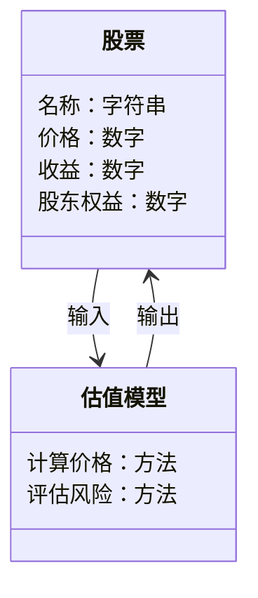
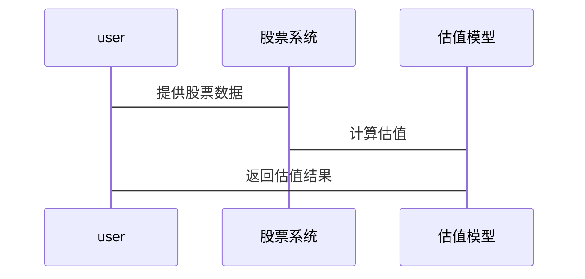

                 


# 巴基斯坦股市估值:南亚新兴市场的机遇与挑战

## 关键词：巴基斯坦股市，估值模型，南亚新兴市场，投资机遇，风险管理

## 摘要

本文深入分析巴基斯坦股市的估值情况，探讨其在南亚新兴市场中的机遇与挑战。通过介绍估值模型、系统分析和实际案例，文章为投资者提供科学的决策支持，帮助其把握投资机会并规避风险。

---

# 第一部分：引言

## 第1章：引言

### 1.1 本书的目的与重要性

#### 1.1.1 巴基斯坦股市的现状与重要性
巴基斯坦股市近年来表现出色，吸引了国内外投资者的关注。本文将探讨其估值情况，分析其在南亚新兴市场中的地位。

#### 1.1.2 南亚新兴市场的独特性
南亚新兴市场包括印度、巴基斯坦等国家，具有高增长潜力，但也面临特定风险。

#### 1.1.3 投资者为何关注巴基斯坦股市
巴基斯坦股市的高增长潜力和相对较低的估值吸引了投资者。

---

# 第二部分：背景介绍

## 第2章：巴基斯坦股市的背景

### 2.1 巴基斯坦股市的基本情况

#### 2.1.1 巴基斯坦股市的历史与发展
巴基斯坦股市始于1947年，经历了多次改革，现已成为南亚重要的金融中心。

#### 2.1.2 巴基斯坦股市的主要指数
- **卡拉奇100指数**：代表巴基斯坦最大的100家上市公司。
- ** Lahore指数**：涵盖更多中小型企业。

#### 2.1.3 巴基斯坦股市的参与者
包括个人投资者、机构投资者、外国投资者等。

### 2.2 南亚新兴市场的特点

#### 2.2.1 南亚新兴市场的定义与范围
南亚新兴市场指印度、巴基斯坦等国家的新兴经济体。

#### 2.2.2 南亚新兴市场的经济特征
- 高增长潜力
- 通胀压力
- 外汇管制

#### 2.2.3 南亚新兴市场的投资机遇
- 经济增长迅速
- 人口红利
- 基础设施投资

### 2.3 股市估值的基本概念

#### 2.3.1 股市估值的定义与意义
通过分析公司财务数据，评估股票的合理价格。

#### 2.3.2 股市估值的核心要素
- 收益能力
- 资产质量
- 市场地位

#### 2.3.3 股市估值的边界与外延
- 估值范围：单个股票、行业、整体市场
- 影响因素：宏观经济、行业趋势、公司特

---

# 第三部分：理论框架

## 第3章：估值模型与方法

### 3.1 常见的估值模型

#### 3.1.1 市盈率（P/E）模型
$$ P/E = \frac{股票价格}{每股收益} $$

#### 3.1.2 市净率（P/B）模型
$$ P/B = \frac{股票价格}{每股净资产} $$

#### 3.1.3 现金流折现模型（DCF）
$$DCF = \sum_{t=1}^{n} \frac{CF_t}{(1+r)^t} + \frac{TV}{(1+r)^n}$$

#### 3.1.4 市值回报率（ROE）模型
$$ROE = \frac{净利润}{股东权益}$$

### 3.2 各种模型的适用场景

#### 3.2.1 市盈率模型的应用场景
适用于高增长行业，如科技公司。

#### 3.2.2 市净率模型的应用场景
适用于重资产行业，如银行和能源公司。

#### 3.2.3 DCF模型的应用场景
适用于具有稳定现金流的公司。

#### 3.2.4 市值回报率模型的应用场景
适用于回报率稳定的公司。

### 3.3 估值模型的优缺点对比

| 模型       | 优点                           | 缺点                           |
|------------|--------------------------------|---------------------------------|
| P/E        | 简单易用，适合高增长行业       | 不适合亏损公司                 |
| P/B        | 适用于重资产行业                | 不考虑收益能力                 |
| DCF        | 考虑未来现金流                 | 计算复杂                      |
| ROE        | 适合回报率稳定的公司           | 不考虑增长潜力                 |

---

# 第四部分：系统分析与架构设计方案

## 第4章：巴基斯坦股市的系统分析

### 4.1 问题场景介绍
分析巴基斯坦股市的估值情况，为投资者提供决策支持。

### 4.2 项目介绍
本文旨在通过系统分析，帮助投资者了解巴基斯坦股市的风险和机会。

### 4.3 系统功能设计

#### 4.3.1 领域模型（Mermaid类图）


### 4.4 系统架构设计

#### 4.4.1 系统架构图（Mermaid架构图）
```mermaid
    split
    左
        左1
        左2
        左3
    右
        右1
        右2
```

### 4.5 系统接口设计

#### 4.5.1 系统接口
- 输入：股票数据
- 输出：估值结果

### 4.6 系统交互设计

#### 4.6.1 系统交互图（Mermaid序列图）


---

# 第五部分：项目实战

## 第5章：项目实战

### 5.1 环境安装
安装Python和必要的库，如Pandas、Matplotlib。

### 5.2 系统核心实现源代码

#### 5.2.1 Python源代码
```python
import pandas as pd
import matplotlib.pyplot as plt

# 数据加载
data = pd.read_csv('stock_data.csv')

# 计算市盈率
data['P/E'] = data['Price'] / data['Earnings']

# 绘制图表
data.plot('P/E', 'Market Cap', kind='scatter')
plt.show()
```

### 5.3 代码应用解读与分析
- 数据加载：读取股票数据。
- 市盈率计算：评估股票估值。
- 图表绘制：可视化分析。

### 5.4 实际案例分析
分析巴基斯坦某银行的市盈率和市净率，评估其投资价值。

### 5.5 详细讲解剖析
通过案例分析，展示如何应用估值模型进行投资决策。

### 5.6 项目小结
总结项目成果，强调系统分析的重要性。

---

# 第六部分：最佳实践

## 第6章：最佳实践

### 6.1 专业人员Tips
- 多模型结合，避免单一模型偏差。
- 关注宏观经济指标，评估整体市场风险。

### 6.2 小结
总结全文，强调系统分析和模型应用的重要性。

### 6.3 注意事项
- 定期更新数据，保持模型准确性。
- 了解市场法规，规避投资风险。

### 6.4 拓展阅读
推荐相关书籍和资源，鼓励深入学习。

---

# 作者：AI天才研究院 & 禅与计算机程序设计艺术

---

**作者简介：**
AI天才研究院（AI Genius Institute）专注于人工智能和计算机科学的研究，致力于为读者提供高质量的技术内容。

