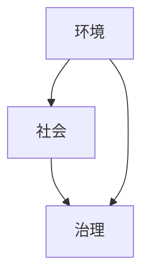
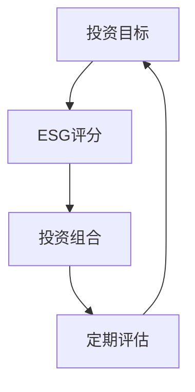

                 


# 巴菲特-芒格的ESG投资策略：平衡社会责任和财务回报

> 关键词：ESG投资，巴菲特，芒格，价值投资，可持续发展

> 摘要：本文深入探讨了巴菲特和芒格的ESG投资策略，结合环境、社会和治理因素，平衡社会责任和财务回报。通过量化评估和系统分析，阐述了如何将ESG投资策略应用于实际投资中，以实现长期稳定的财务回报和可持续发展。

---

## 第1章: ESG投资策略的背景与定义

### 1.1 ESG投资的定义与核心要素

#### 1.1.1 ESG的定义
ESG（Environmental, Social, Governance）是一种投资策略，通过评估企业在环境、社会和公司治理方面的表现，来选择投资标的。ESG投资不仅关注企业的财务表现，还关注其对社会和环境的积极影响。

#### 1.1.2 ESG投资的核心要素
- **环境（Environmental）**：包括企业对环境的影响，如碳排放、能源消耗、资源利用效率等。
- **社会（Social）**：包括企业对员工、社区和社会的贡献，如员工权益、社会责任、公平对待等。
- **治理（Governance）**：包括公司治理结构、董事会构成、高管薪酬、股东权益等。

#### 1.1.3 ESG与传统投资的对比
与传统投资相比，ESG投资更加注重企业的长期可持续发展能力，而不仅仅是短期财务表现。

---

### 1.2 巴菲特与芒格的投资理念

#### 1.2.1 巴菲特的价值投资哲学
巴菲特的价值投资理念强调长期投资、安全边际和企业基本面分析。他认为，投资的本质是寻找具有持续竞争优势和良好管理的企业。

#### 1.2.2 芒格的多元思维模型
芒格强调通过多元思维模型来分析问题，将不同学科的知识结合起来，以更全面地评估企业的价值。

#### 1.2.3 巴菲特-芒格投资理念与ESG的结合
将ESG因素纳入投资决策，可以帮助投资者更好地评估企业的长期价值，同时兼顾社会责任。

---

### 1.3 ESG投资的背景与发展趋势

#### 1.3.1 全球ESG投资的兴起
随着全球对可持续发展的关注增加，ESG投资在全球范围内迅速发展。

#### 1.3.2 ESG投资的政策支持
各国政府和监管机构出台了一系列政策，鼓励企业和投资者关注ESG因素。

#### 1.3.3 ESG投资的未来趋势
ESG投资将更加普及，并成为主流投资策略之一。

---

## 第2章: ESG投资的核心概念与联系

### 2.1 ESG核心概念的原理

#### 2.1.1 环境（Environmental）的核心要素
- 碳排放
- 能源消耗
- 资源利用效率

#### 2.1.2 社会（Social）的核心要素
- 员工权益
- 社会责任
- 公平对待

#### 2.1.3 治理（Governance）的核心要素
- 公司治理结构
- 董事会构成
- 高管薪酬

---

### 2.2 ESG核心概念的对比分析

#### 2.2.1 环境与社会的对比
- 环境关注企业的外部影响，社会关注企业的内部影响。

#### 2.2.2 社会与治理的对比
- 社会关注企业的社会责任，治理关注企业的内部管理。

#### 2.2.3 环境与治理的对比
- 环境关注企业的外部影响，治理关注企业的内部管理。

---

### 2.3 ESG实体关系图（Mermaid流程图）



---

## 第3章: ESG投资的量化评估方法

### 3.1 ESG评分模型的原理

#### 3.1.1 ESG评分的定义
ESG评分是对企业在环境、社会和治理方面的综合评估，通常以分数或等级形式表示。

#### 3.1.2 ESG评分的计算方法
- 加权平均法
- 分段评分法

#### 3.1.3 ESG评分的影响因素
- 数据来源
- 评估标准
- 企业规模

---

### 3.2 ESG数据的来源与处理

#### 3.2.1 数据来源的多样性
- 第三方评级机构
- 公司财报
- 行业报告

#### 3.2.2 数据清洗与预处理
- 数据清洗
- 数据标准化

#### 3.2.3 数据标准化与归一化
- 标准差标准化
- 最小-最大归一化

---

### 3.3 ESG评分的数学模型

#### 3.3.1 线性回归模型
$$ y = \beta_0 + \beta_1x_1 + \beta_2x_2 + \dots + \beta_nx_n $$

#### 3.3.2 聚类分析模型
$$ x_i \sim N(\mu, \sigma^2) $$

---

## 第4章: 巴菲特-芒格ESG投资策略的实现

### 4.1 巴菲特-芒格ESG投资策略的哲学基础

#### 4.1.1 价值投资与ESG的结合
将ESG因素纳入价值投资的分析框架，寻找具有长期竞争优势和社会责任感的企业。

#### 4.1.2 长期投资与ESG的契合
长期投资注重企业的可持续发展能力，而ESG投资关注企业的长期价值。

#### 4.1.3 风险管理与ESG的整合
通过关注企业的治理结构和社会责任，降低投资风险。

---

### 4.2 巴菲特-芒格ESG投资策略的实施步骤

#### 4.2.1 确定投资目标
- 确定投资目标和投资策略
- 确定ESG投资的比例

#### 4.2.2 选择ESG评分高的企业
- 选择ESG评分高的企业
- 评估企业的基本面

#### 4.2.3 构建投资组合
- 分散投资
- 定期评估和调整

#### 4.2.4 定期评估与调整
- 定期评估投资组合的ESG表现
- 根据市场变化进行调整

---

## 第5章: ESG投资策略的系统分析与架构设计

### 5.1 系统架构设计



---

## 第6章: 项目实战

### 6.1 环境安装

```bash
pip install pandas numpy scikit-learn
```

---

### 6.2 核心实现

```python
import pandas as pd
import numpy as np
from sklearn.linear_model import LinearRegression

# 示例数据
data = pd.DataFrame({
    '环境': [0.8, 0.9, 0.7],
    '社会': [0.6, 0.8, 0.5],
    '治理': [0.7, 0.6, 0.8]
})

# 训练线性回归模型
model = LinearRegression()
model.fit(data[['环境', '社会', '治理']], data['综合评分'])

# 预测评分
预测评分 = model.predict([[0.8, 0.7, 0.6]])
print(预测评分)
```

---

### 6.3 项目总结

通过将巴菲特和芒格的投资理念与ESG因素相结合，投资者可以在追求财务回报的同时，关注企业的社会责任，实现可持续发展。

---

## 第7章: 总结与展望

### 7.1 总结

巴菲特和芒格的ESG投资策略通过将环境、社会和治理因素纳入投资决策，帮助投资者实现长期稳定的财务回报和可持续发展。

### 7.2 展望

未来，ESG投资将成为主流的投资策略，投资者需要更加关注企业的社会责任和可持续发展能力。

---

## 作者信息

作者：AI天才研究院/AI Genius Institute & 禅与计算机程序设计艺术 /Zen And The Art of Computer Programming

---

