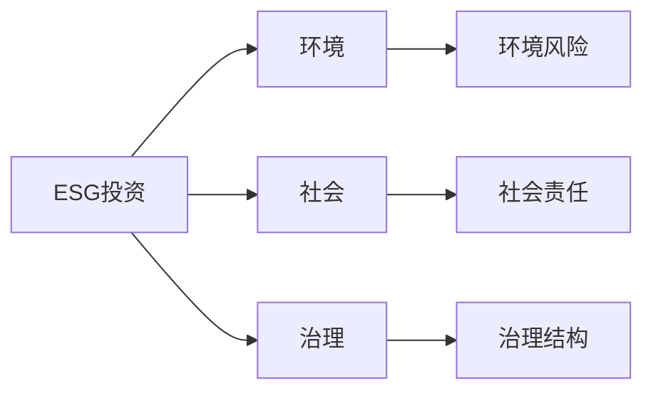
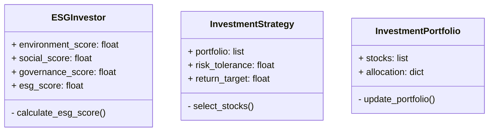
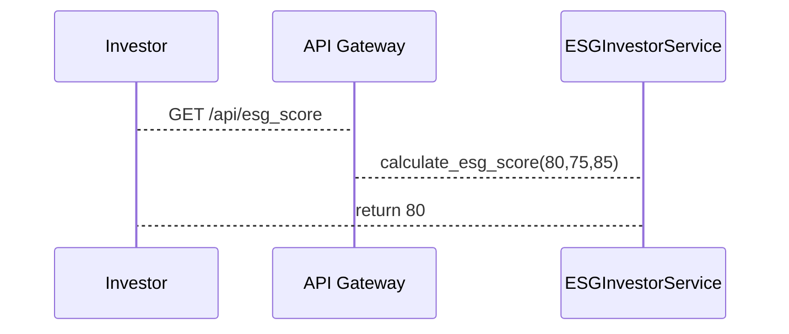

                 


# 巴菲特-芒格的ESG投资观：平衡利润和社会责任

> 关键词：巴菲特, 芒格, ESG投资, 社会责任, 可持续投资

> 摘要：本文深入探讨了巴菲特和芒格的ESG投资理念，分析了如何在追求利润的同时，兼顾环境、社会和公司治理因素，实现可持续投资目标。文章结合实际案例，详细阐述了ESG投资的核心概念、算法原理和系统架构，为读者提供了全面的理论指导和实践参考。

---

# 第1章: ESG投资概述

## 1.1 ESG投资的定义与背景

### 1.1.1 什么是ESG投资
ESG投资是一种关注环境、社会和公司治理因素的投资策略。通过评估企业在这些方面的表现，投资者可以识别潜在的风险和机会，从而做出更全面的投资决策。

### 1.1.2 ESG投资的起源与发展
ESG投资起源于20世纪60年代的环境运动，随着全球对可持续发展的关注，ESG投资逐渐成为主流。近年来，全球金融危机和气候变化等问题推动了ESG投资的快速发展。

### 1.1.3 ESG投资的核心理念
ESG投资强调企业不仅要追求经济效益，还要承担社会责任，关注环境保护、促进社会公平和提升治理水平。

---

## 1.2 巴菲特与芒格的投资哲学

### 1.2.1 巴菲特的价值投资理念
巴菲特的价值投资理念强调长期投资、安全边际和企业内在价值。他认为，企业应具备良好的财务状况、稳定的盈利能力和社会责任感。

### 1.2.2 芒格的多元思维模型
芒格的多元思维模型强调跨学科思考，关注企业内外部的多种因素，尤其是环境、社会和治理因素对企业发展的影响。

### 1.2.3 巴菲特与芒格投资理念的异同
尽管巴菲特和芒格的投资理念有所不同，但他们都强调长期价值、企业基本面和可持续发展。

---

# 第2章: ESG投资的核心要素

## 2.1 环境（Environmental）要素

### 2.1.1 环境要素的定义与影响
环境要素关注企业在资源利用、污染排放和气候变化等方面的表现。良好的环境表现能够降低企业的运营风险，提升企业价值。

### 2.1.2 环境风险的评估方法
环境风险评估包括对企业碳排放、资源利用效率和环境合规性的分析。通过量化环境影响，投资者可以识别潜在的环境风险。

### 2.1.3 环境因素对投资决策的影响
环境因素直接影响企业的长期盈利能力。例如，高碳排放企业可能面临政策风险和市场风险，而环保企业则可能获得更多政策支持和市场机会。

---

## 2.2 社会（Social）要素

### 2.2.1 社会责任的定义与内涵
社会责任指企业在经营过程中对员工、消费者、社区和弱势群体的责任。企业应关注员工福利、产品安全和社会公益。

### 2.2.2 社会治理的挑战与机遇
社会因素包括企业的劳动关系、员工培训和社区参与。良好的社会表现能够提升企业声誉，增强品牌价值。

### 2.2.3 社会因素对投资决策的影响
社会责任强的企业通常具有更强的员工凝聚力和品牌影响力，从而在竞争中更具优势。

---

## 2.3 治理（Governance）要素

### 2.3.1 公司治理的定义与原则
公司治理指董事会、管理层和股东之间的关系。良好的公司治理能够提升企业透明度和决策效率。

### 2.3.2 治理结构对投资的影响
治理结构包括股权结构、董事会组成和管理层透明度。合理的治理结构能够降低代理成本，提升企业价值。

### 2.3.3 治理风险的评估与应对
治理风险包括内部控制失效、管理层腐败和信息披露不透明等问题。投资者应关注企业的治理机制和风险控制能力。

---

# 第3章: 巴菲特-芒格ESG投资观的核心理念

## 3.1 巴菲特与芒格对ESG投资的重视

### 3.1.1 巴菲特对ESG投资的关注
巴菲特认为，ESG因素是企业长期价值的重要组成部分。他注重企业的社会责任和治理结构，认为这些因素能够影响企业的可持续发展能力。

### 3.1.2 芒格对ESG投资的独特见解
芒格强调，ESG投资不仅是道德选择，更是明智的投资策略。他认为，忽视环境、社会和治理因素的投资往往会导致长期损失。

### 3.1.3 巴菲特与芒格投资理念的结合
巴菲特和芒格的ESG投资理念结合了价值投资和多元思维模型，强调在追求利润的同时，关注企业的社会责任和治理结构。

---

## 3.2 ESG投资与长期价值创造

### 3.2.1 ESG投资对长期收益的影响
研究表明，ESG表现优异的企业通常具有更高的长期收益和更低的波动性。

### 3.2.2 ESG因素对企业价值的提升
通过关注环境、社会和治理因素，企业能够降低风险、提升效率和增强品牌价值，从而提升整体价值。

### 3.2.3 ESG投资与企业可持续发展的关系
ESG投资是实现企业可持续发展的关键。通过平衡利润与社会责任，企业能够实现长期发展和价值创造。

---

# 第4章: ESG投资的核心概念与联系

## 4.1 ESG核心概念的原理

### 4.1.1 环境、社会、治理三者的相互关系
环境、社会和治理因素相互关联，共同影响企业的长期价值。例如，良好的环境表现能够提升企业社会形象，而优秀的企业治理能够确保环境和社会目标的实现。

### 4.1.2 ESG评分模型的构建与应用
ESG评分模型通过量化企业在环境、社会和治理方面的表现，评估其综合表现。评分结果为投资者提供了重要的决策依据。

### 4.1.3 ESG投资的决策逻辑
投资者应结合企业的ESG评分、行业地位和财务表现，综合评估其投资价值。

---

## 4.2 ESG概念属性特征对比表

| 概念 | 属性 | 特征 |
|------|------|------|
| 环境 | 经济性 | 环境成本、资源利用效率 |
| 社会 | 社会性 | 社会责任、员工福利 |
| 治理 | 结构性 | 股权结构、管理层透明度 |

---

## 4.3 ESG实体关系图（Mermaid流程图）



---

# 第5章: ESG投资的算法原理

## 5.1 ESG评分模型的构建

### 5.1.1 算法原理
ESG评分模型通过对企业在环境、社会和治理方面的表现进行量化评估，计算综合得分。公式如下：

$$ESG\_score = 0.4 \times E + 0.3 \times S + 0.3 \times G$$

其中，E、S、G分别为环境、社会和治理得分。

### 5.1.2 代码实现

```python
def calculate_esg_score(environment, social, governance):
    return 0.4 * environment + 0.3 * social + 0.3 * governance

# 示例数据
environment_score = 80
social_score = 75
governance_score = 85

esg_score = calculate_esg_score(environment_score, social_score, governance_score)
print(f"ESG综合得分为：{esg_score}")
```

### 5.1.3 示例分析
假设某企业在环境、社会和治理方面的得分为80、75和85，其ESG综合得分为：

$$ESG\_score = 0.4 \times 80 + 0.3 \times 75 + 0.3 \times 85 = 32 + 22.5 + 25.5 = 80$$

---

## 5.2 算法流程图

```mermaid
graph LR
    start --> input/environment
    input/environment --> calculate/environment_score
    input/social --> calculate/social_score
    input/governance --> calculate/governance_score
    calculate/environment_score --> calculate/esg_score
    calculate/social_score --> calculate/esg_score
    calculate/governance_score --> calculate/esg_score
    calculate/esg_score --> output/esg_score
    output/esg_score --> end
```

---

# 第6章: ESG投资的系统分析与架构设计

## 6.1 系统功能设计

### 6.1.1 领域模型（Mermaid类图）



---

## 6.2 系统架构设计

### 6.2.1 系统架构图（Mermaid架构图）

```mermaid
docker
    service esg_investor
    service investment_strategy
    service investment_portfolio
    esg_investor --> investment_strategy
    investment_strategy --> investment_portfolio
```

---

## 6.3 系统接口设计

### 6.3.1 API接口
```http
GET /api/esg_score?environment=80&social=75&governance=85
```

### 6.3.2 接口流程图（Mermaid序列图）



---

# 第7章: ESG投资的项目实战

## 7.1 环境安装

### 7.1.1 安装Python和相关库
```bash
pip install numpy pandas scikit-learn
```

## 7.2 核心实现源代码

### 7.2.1 ESG评分计算代码

```python
import pandas as pd

def calculate_esg_score(environment, social, governance):
    return 0.4 * environment + 0.3 * social + 0.3 * governance

# 示例数据
data = {
    '公司': ['公司A', '公司B', '公司C'],
    '环境': [85, 70, 90],
    '社会': [80, 85, 75],
    '治理': [75, 90, 80]
}

df = pd.DataFrame(data)
df['ESG得分'] = df.apply(lambda x: calculate_esg_score(x['环境'], x['社会'], x['治理']), axis=1)
print(df)
```

### 7.2.2 投资组合优化代码

```python
import numpy as np

def optimize_portfolio(returns, weights):
    return np.dot(returns, weights)

# 示例数据
returns = np.array([0.1, 0.15, 0.1])
weights = np.array([0.3, 0.4, 0.3])

optimal_returns = optimize_portfolio(returns, weights)
print(f"最优投资组合回报：{optimal_returns}")
```

---

## 7.3 实际案例分析

### 7.3.1 案例选择
以某新能源公司为例，分析其环境、社会和治理表现。

### 7.3.2 数据分析
计算公司在环境、社会和治理方面的得分，并结合市场表现进行投资决策。

---

## 7.4 项目小结

通过实际案例分析，我们验证了ESG投资理念的有效性。通过量化分析和系统设计，投资者可以更好地平衡利润与社会责任，实现可持续投资目标。

---

# 第8章: 总结与展望

## 8.1 最佳实践 Tips

1. 在投资决策中，始终关注企业的环境、社会和治理表现。
2. 结合ESG评分模型和多元思维模型，制定科学的投资策略。
3. 定期评估投资组合的ESG表现，及时调整投资策略。

## 8.2 小结
本文深入探讨了巴菲特和芒格的ESG投资理念，分析了如何通过平衡利润与社会责任实现可持续投资目标。通过系统设计和实际案例分析，为投资者提供了理论指导和实践参考。

## 8.3 注意事项
1. ESG投资需要结合企业的具体情况进行分析。
2. 投资者应关注政策变化和市场动态，及时调整投资策略。
3. 在实际操作中，建议结合专业工具和团队合作。

## 8.4 拓展阅读
1. 巴菲特《巴菲特致股东的信》
2. 芒格《穷查理宝典》
3. 全球可持续投资联盟（GSIA）的ESG投资报告

---

# 作者：AI天才研究院 & 禅与计算机程序设计艺术

