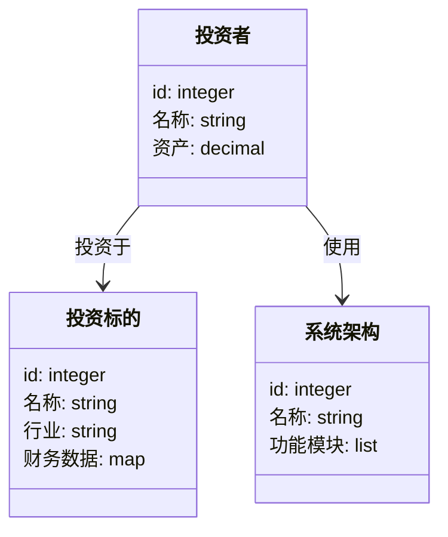
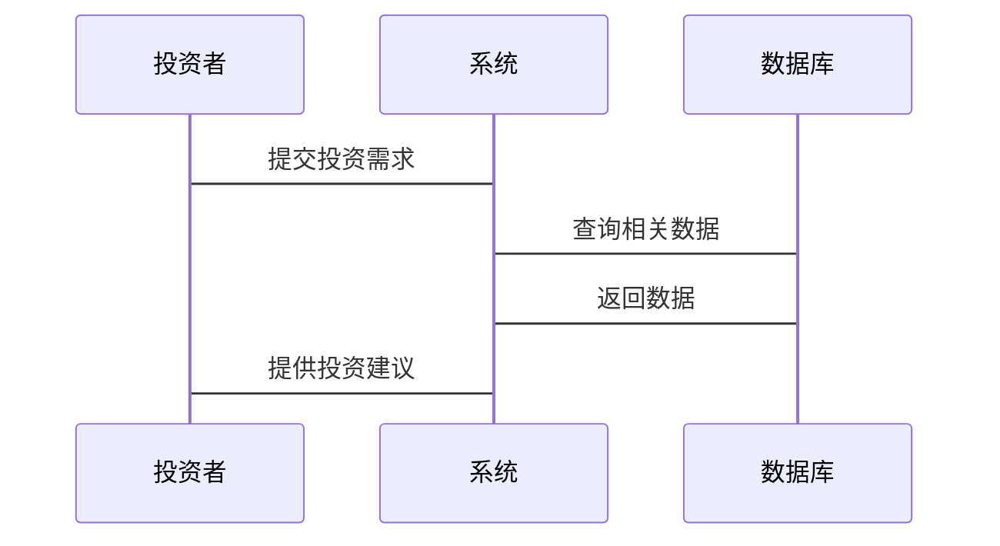

                 


# {{巴菲特-芒格的人口老龄化投资：社会变迁中的机遇}}

> 关键词：巴菲特，芒格，人口老龄化，投资策略，社会变迁，现金流贴现模型，多元思维模型

> 摘要：随着全球人口老龄化的加剧，投资领域面临着前所未有的挑战和机遇。本文从巴菲特和芒格的投资理念出发，分析了人口老龄化对投资策略的影响，探讨了如何在社会变迁中寻找投资机遇。通过详细的数学模型和实际案例分析，本文为投资者提供了应对老龄化趋势的实用策略和方法。

---

# 第一部分: 人口老龄化与投资背景

## 第1章: 人口老龄化与投资背景

### 1.1 人口老龄化的基本概念
#### 1.1.1 人口老龄化定义
- 人口老龄化是指65岁及以上人口占总人口比例不断上升的趋势。
- 老龄化社会的划分标准：65岁以上人口占比达到7%即为老龄化社会，达到14%为深度老龄化社会。

#### 1.1.2 人口老龄化的原因与趋势
- 社会发展：医疗进步、生育率下降导致人口结构变化。
- 全球趋势：发达国家已进入深度老龄化，发展中国家老龄化速度加快。
- 预测数据：联合国数据显示，全球65岁以上人口将从2020年的10%增长到2050年的16%。

#### 1.1.3 人口老龄化对经济的影响
- 消费模式：从年轻人为主转向中老年人为主。
- 劳动力市场：劳动力供给减少，用工成本上升。
- 经济结构：医疗、养老、科技等领域需求增加。

### 1.2 巴菲特与芒格的投资理念
#### 1.2.1 巴菲特的价值投资理论
- **核心理念**：寻找具有持续竞争优势的公司，长期投资。
- **关键指标**：关注ROE（净资产收益率）、ROA（资产回报率）等财务指标。
- **案例分析**：巴菲特投资可口可乐的逻辑。

#### 1.2.2 芒格的多元思维模型
- **跨学科思维**：将物理学、心理学等学科的原理应用到投资中。
- **判断力培养**：通过不断学习和思考，提升决策能力。
- **复合决策优势**：结合多维度信息进行投资决策。

#### 1.2.3 两人投资理念的结合
- 巴菲特的价值投资与芒格的多元思维模型相辅相成。
- 强调长期价值、安全边际和风险控制。

### 1.3 人口老龄化与投资的关联
#### 1.3.1 老龄化对消费模式的影响
- 医疗健康、养老服务等需求增加。
- 保险、金融服务业的投资机会。

#### 1.3.2 老龄化对产业结构的影响
- 医疗健康行业：医疗设备、药品研发等领域需求增长。
- 养老服务行业：养老地产、社区养老服务等新兴领域。
- 智能科技行业：智能家居、健康监测设备等技术需求上升。

#### 1.3.3 老龄化对投资机会的影响
- 高质量医疗和养老服务企业的投资价值。
- 保险行业的长期增长潜力。

---

# 第二部分: 投资策略与企业应对

## 第2章: 巴菲特-芒格投资策略解析

### 2.1 巴菲特的长期价值投资
#### 2.1.1 企业护城河的构建
- **定义**：企业竞争优势的来源，如品牌、技术、市场准入等。
- **案例分析**：巴菲特投资的保险公司如何构建护城河。

#### 2.1.2 财务指标的分析与选择
- 关注ROE、债务率、利润率等关键指标。
- 通过财务报表分析评估企业的健康状况。

#### 2.1.3 长期投资的纪律性
- 遵循价值投资原则，避免短期波动干扰。
- 通过长期持有优质资产实现财富增长。

### 2.2 芒格的多元思维模型
#### 2.2.1 跨学科思维的重要性
- 将物理学、心理学等学科原理应用到投资决策中。
- 通过多维度分析降低投资风险。

#### 2.2.2 判断力的培养
- 培养独立思考能力，避免从众心理。
- 通过不断学习和实践提升判断力。

#### 2.2.3 复合决策的优势
- 结合多方面信息做出更准确的投资决策。
- 通过多元思维模型降低投资失误的风险。

### 2.3 两人合作的投资模式
#### 2.3.1 资源整合的优势
- 利用双方资源和信息优势，寻找优质投资标的。
- 通过团队合作提高投资效率。

#### 2.3.2 风险控制的协同
- 建立风险评估机制，及时发现和应对潜在风险。
- 通过多元化投资降低整体风险敞口。

#### 2.3.3 投资决策的高效性
- 结合两人经验，快速做出高质量的投资决策。
- 通过高效沟通和协作提升投资效率。

## 第3章: 企业应对老龄化的方法

### 3.1 企业战略调整
#### 3.1.1 产品与服务的适老化改造
- 开发适合老年人的产品和服务。
- 通过技术创新提升产品适老化水平。

#### 3.1.2 市场定位的重新定义
- 从年轻人市场转向中老年市场。
- 针对老年人需求调整市场策略。

#### 3.1.3 业务模式的创新
- 从传统业务转向新兴领域，如健康科技。
- 利用数字化技术提升业务效率。

### 3.2 企业投资机会分析
#### 3.2.1 医疗健康行业的投资机会
- 医疗设备、药品研发等领域投资价值。
- 通过技术创新提升医疗服务质量。

#### 3.2.2 养老服务行业的投资机会
- 养老地产、社区养老服务等新兴领域。
- 通过资源整合提升养老服务效率。

#### 3.2.3 智能科技行业的投资机会
- 智能家居、健康监测设备等领域需求增长。
- 通过技术驱动提升产品竞争力。

### 3.3 企业风险管理
#### 3.3.1 老龄化带来的风险
- 劳动力成本上升、市场需求变化等风险。
- 通过风险评估机制提前识别潜在风险。

#### 3.3.2 风险评估与控制
- 建立完善的风险评估体系。
- 通过多元化投资降低整体风险敞口。

#### 3.3.3 应对策略的制定
- 制定应对老龄化趋势的具体策略。
- 通过持续创新提升企业竞争力。

---

# 第三部分: 数学模型与投资算法

## 第4章: 投资数学模型

### 4.1 现金流贴现模型（DCF）
#### 4.1.1 模型的基本原理
- 将未来现金流折现，评估企业当前价值。
- 公式：$$DCF = \frac{CF}{(r - g)}$$
  - CF：未来现金流
  - r：折现率
  - g：增长率

#### 4.1.2 模型的公式推导
- 通过时间价值理论推导DCF模型。
- 通过实际案例展示模型的应用。

#### 4.1.3 模型的优缺点
- 优点：能够准确评估企业内在价值。
- 缺点：假设条件严格，实际操作中难以满足。

### 4.2 市盈率与市净率分析
#### 4.2.1 市盈率的计算与应用
- 公式：$$市盈率 = \frac{股价}{每股收益}$$
- 应用：评估股票的估值水平。

#### 4.2.2 市净率的计算与应用
- 公式：$$市净率 = \frac{股价}{每股净资产}$$
- 应用：评估股票的资产价值。

#### 4.2.3 两者的综合运用
- 结合市盈率和市净率评估股票的内在价值。
- 通过多维度分析降低投资风险。

---

# 第四部分: 系统分析与架构设计方案

## 第5章: 系统分析与架构设计方案

### 5.1 问题场景介绍
- 背景：应对老龄化趋势，构建投资管理系统。
- 目标：实现高效的投资决策支持。

### 5.2 项目介绍
- 项目名称：老龄化投资管理系统。
- 项目目标：利用技术手段提升投资效率。

### 5.3 系统功能设计
#### 5.3.1 领域模型mermaid类图


#### 5.3.2 系统架构设计mermaid架构图


#### 5.3.3 系统接口设计
- 数据接口：与财务数据源对接，获取实时数据。
- 用户接口：提供友好的操作界面，方便投资者使用。

#### 5.3.4 系统交互mermaid序列图


---

# 第五部分: 项目实战

## 第6章: 项目实战

### 6.1 环境安装
- 安装Python、Pandas、Matplotlib等工具。
- 配置开发环境，确保所有依赖项安装完成。

### 6.2 系统核心实现源代码
```python
import pandas as pd
import numpy as np

# 示例：计算DCF模型
def calculate_dcf(future_cash_flows, discount_rate, growth_rate):
    return future_cash_flows / (discount_rate - growth_rate)

# 示例：计算市盈率
def calculate_pe_ratio(stock_price, eps):
    return stock_price / eps

# 示例：计算市净率
def calculate_pb_ratio(stock_price, book_value_per_share):
    return stock_price / book_value_per_share

# 数据分析
data = pd.DataFrame({
    '股价': [100, 80, 90],
    '每股收益': [20, 15, 25],
    '每股净资产': [50, 40, 60]
})

data['市盈率'] = data.apply(lambda x: calculate_pe_ratio(x['股价'], x['每股收益']), axis=1)
data['市净率'] = data.apply(lambda x: calculate_pb_ratio(x['股价'], x['每股净资产']), axis=1)
print(data)
```

### 6.3 代码应用解读与分析
- 通过DCF模型计算企业内在价值。
- 使用市盈率和市净率评估股票估值。
- 分析数据结果，制定投资策略。

### 6.4 实际案例分析
- 分析某保险公司如何利用DCF模型评估投资标的。
- 通过市盈率和市净率分析某科技企业的投资价值。

### 6.5 项目小结
- 总结项目实施过程中的经验与教训。
- 提出改进建议，优化投资策略。

---

# 第六部分: 总结

## 第7章: 总结

### 7.1 核心观点回顾
- 巴菲特和芒格的投资理念在应对老龄化趋势中具有重要价值。
- 通过DCF模型等数学工具可以有效评估投资标的。

### 7.2 投资策略与未来展望
- 继续关注医疗健康、养老服务等领域投资机会。
- 利用技术创新提升投资效率。

### 7.3 最佳实践Tips
- 坚持长期投资，避免短期波动干扰。
- 不断学习和更新投资知识，提升判断力。

---

# 作者：AI天才研究院/AI Genius Institute & 禅与计算机程序设计艺术 /Zen And The Art of Computer Programming

