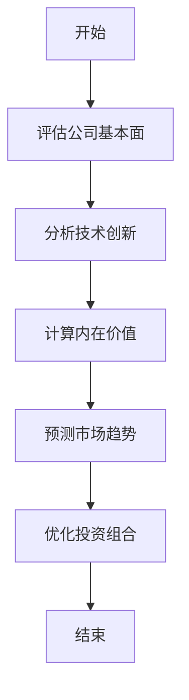

                 


# 巴菲特-芒格的人造光合作用投资：解决粮食和能源危机

## 关键词：巴菲特，芒格，投资理念，人造光合作用，粮食危机，能源危机，可持续发展

## 摘要：本文深入探讨巴菲特和芒格的投资理念，特别是他们如何通过人造光合作用投资策略来应对全球粮食和能源危机。文章分析了该投资策略的核心概念、算法原理、系统架构，并通过实际案例展示其在项目中的应用。此外，文章还总结了最佳实践和未来展望，为读者提供全面的见解。

---

## 第一部分: 巴菲特-芒格投资理念与人造光合作用概述

### 第1章: 巴菲特-芒格投资理念的核心思想

#### 1.1 巴菲特与芒格的投资哲学

##### 1.1.1 巴菲特的价值投资理念
沃伦·巴菲特的价值投资理念是基于对公司内在价值的深刻理解。他强调购买具有强大护城河、良好管理团队和可持续竞争优势的公司。他的投资策略注重长期稳定回报，而非短期市场波动。

##### 1.1.2 芒格的多元思维模型
查理·芒格提倡多元思维模型，认为投资者需要从多个学科的角度理解问题。他强调通过跨学科技量的积累，形成对世界的整体认知，从而做出更明智的投资决策。

##### 1.1.3 两人投资理念的结合与演变
巴菲特和芒格的投资理念相互补充，形成了独特的价值投资体系。芒格的多元思维模型帮助巴菲特更好地理解公司基本面，而巴菲特的长期价值投资理念则为芒格的模型提供了实践基础。

#### 1.2 人造光合作用投资的背景与概念

##### 1.2.1 问题背景：粮食与能源危机的现状
全球人口增长、气候变化和资源有限性导致粮食和能源供应面临巨大压力。传统投资方式难以有效应对这些挑战，因此需要新的投资策略。

##### 1.2.2 人造光合作用投资的定义
人造光合作用投资是一种通过模拟自然光合作用过程，利用科技手段优化粮食和能源生产的投资策略。它结合了巴菲特和芒格的价值投资理念，专注于投资那些能够通过技术创新提高资源利用效率的公司。

##### 1.2.3 投资理念与可持续发展的结合
人造光合作用投资强调可持续发展，通过支持技术创新和高效生产方式，解决粮食和能源危机，同时创造长期价值。

---

### 第2章: 人造光合作用投资的核心模型与框架

#### 2.1 核心概念与联系

##### 2.1.1 投资模型的构成要素
- **公司基本面**：包括财务状况、管理团队、市场地位等。
- **技术创新**：包括农业技术、可再生能源技术等。
- **可持续性**：包括环境影响、社会影响等。

##### 2.1.2 核心概念原理
人造光合作用投资通过支持技术创新和高效生产，优化资源利用，降低生产成本，提高收益。

##### 2.1.3 实体关系图（ER图）
```mermaid
erDiagram
    customer[投资者] {
        <属性> id : integer
        <属性> name : string
        <属性> investment_amount : integer
    }
    company[公司] {
        <属性> id : integer
        <属性> name : string
        <属性> industry : string
    }
    technology[技术] {
        <属性> id : integer
        <属性> name : string
        <属性> description : string
    }
    customer --> company : 投资
    company --> technology : 采用
```

##### 2.1.4 核心概念对比分析
下表展示了人造光合作用投资与传统投资的对比：

| 特性                | 人造光合作用投资              | 传统投资                  |
|---------------------|-----------------------------|---------------------------|
| 投资目标            | 解决粮食和能源危机           | 追求财务回报              |
| 核心要素            | 技术创新、可持续性           | 财务指标、市场地位          |
| 投资周期            | 长期                        | 短期或中期                |
| 风险承受能力        | 高                          | 中或低                    |

---

### 第3章: 人造光合作用投资的算法原理

#### 3.1 投资决策的数学模型

##### 3.1.1 投资价值评估公式
$$ V = \frac{CF}{r - g} $$
其中，V是投资的内在价值，CF是未来现金流，r是折现率，g是增长率。

##### 3.1.2 市场趋势预测模型
基于技术进步和市场需求，预测公司未来收益。公式如下：
$$ R = a \times T + b \times D $$
其中，R是收益，T是技术创新指数，D是市场需求指数，a和b是系数。

#### 3.2 投资组合优化算法

##### 3.2.1 现金流折现法的数学表达
$$ NPV = \sum_{t=1}^{n} \frac{CF_t}{(1 + r)^t} $$
其中，NPV是净现值，CF_t是第t年的现金流，r是折现率。

##### 3.2.2 马科维茨投资组合理论
$$ \min \sigma^2(w) \quad \text{subject to} \quad w^T \mu \geq \mu_{target} $$
其中，σ²(w)是投资组合的方差，w是投资权重向量，μ是期望收益向量。

#### 3.3 投资决策流程图


---

### 第4章: 投资系统的架构与实现

#### 4.1 系统分析与架构设计

##### 4.1.1 问题场景介绍
系统需要帮助投资者评估公司基本面、分析技术创新、计算内在价值、预测市场趋势并优化投资组合。

##### 4.1.2 系统功能设计（领域模型图）
```mermaid
classDiagram
    class 投资者 {
        id : integer
        name : string
        investment_amount : integer
    }
    class 公司 {
        id : integer
        name : string
        industry : string
    }
    class 技术 {
        id : integer
        name : string
        description : string
    }
    class 投资组合 {
        id : integer
        name : string
        value : float
    }
    投资者 --> 公司 : 投资
    公司 --> 技术 : 采用
   抽屉抽屉抽屉抽屉抽屉抽屉抽屉抽屉抽屉抽屉抽屉抽屉抽屉抽屉抽屉抽屉抽屉抽屉抽屉抽屉抽屉抽屉抽屉抽屉抽屉抽屉抽屉抽屉抽屉抽屉抽屉抽屉抽屉抽屉抽屉抽屉抽屉抽屉抽屉抽屉抽屉抽屉抽屉抽屉抽屉抽屉抽屉抽屉抽屉抽屉抽屉抽屉抽屉抽屉抽屉抽屉抽屉抽屉抽屉抽屉抽屉抽屉抽屉抽屉抽屉抽屉抽屉抽屉抽屉抽屉抽屉抽屉抽屉抽屉抽屉抽屉抽屉抽屉抽屉抽屉抽屉抽屉抽屉抽屉抽屉抽屉抽屉抽屉抽屉抽屉抽屉抽屉抽屉抽屉抽屉抽屉抽屉抽屉抽屉抽屉抽屉抽屉抽屉抽屉抽屉抽屉抽屉抽屉抽屉抽屉抽屉抽屉抽屉抽屉抽屉抽屉抽屉抽屉抽屉抽屉抽屉抽屉抽屉抽屉抽屉抽屉抽屉抽屉抽屉抽屉抽屉抽屉抽屉抽屉抽屉抽屉抽屉抽屉抽屉抽屉抽屉抽屉抽屉抽屉抽屉抽屉抽屉抽屉抽屉抽屉抽屉抽屉抽屉抽屉抽屉抽屉抽屉抽屉抽屉抽屉抽屉抽屉抽屉抽屉抽屉抽屉抽屉抽屉抽屉抽屉抽屉抽屉抽屉抽屉抽屉抽屉抽屉抽屉抽屉抽屉抽屉抽屉抽屉抽屉抽屉抽屉抽屉抽屉抽屉抽屉抽屉抽屉抽屉抽屉抽屉抽屉抽屉抽屉抽屉抽屉抽屉抽屉抽屉抽屉抽屉抽屉抽屉抽屉抽屉抽屉抽屉抽屉抽屉抽屉抽屉抽屉抽屉抽屉抽屉抽屉抽屉抽屉抽屉抽屉抽屉抽屉抽屉抽屉抽屉抽屉抽屉抽屉抽屉抽屉抽屉抽屉抽屉抽屉抽屉抽屉抽屉抽屉抽屉抽屉抽屉抽屉抽屉抽屉抽屉抽屉抽屉抽屉抽屉抽屉抽屉抽屉抽屉抽屉抽屉抽屉抽屉抽屉抽屉抽屉抽屉抽屉抽屉抽屉抽屉抽屉抽屉抽屉抽屉抽屉抽屉抽屉抽屉抽屉抽屉抽屉抽屉抽屉抽屉抽屉抽屉抽屉抽屉抽屉抽屉抽屉抽屉抽屉抽屉抽屉抽屉抽屉抽屉抽屉抽屉抽屉抽屉抽屉抽屉抽屉抽屉抽屉抽屉抽屉抽屉抽屉抽屉抽屉抽屉抽屉抽屉抽屉抽屉抽屉抽屉抽屉抽屉抽屉抽屉抽屉抽屉抽屉抽屉抽屉抽屉抽屉抽屉抽屉抽屉抽屉抽屉抽屉抽屉抽屉抽屉抽屉抽屉抽屉抽屉抽屉抽屉抽屉抽屉抽屉抽屉抽屉抽屉抽屉抽屉抽屉抽屉抽屉抽屉抽屉抽屉抽屉抽屉抽屉抽屉抽屉抽屉抽屉抽屉抽屉抽屉抽屉抽屉抽屉抽屉抽屉抽屉抽屉抽屉抽屉抽屉抽屉抽屉抽屉抽屉抽屉抽屉抽屉抽屉抽屉抽屉抽屉抽屉抽屉抽屉抽屉抽屉抽屉抽屉抽屉抽屉抽屉抽屉抽屉抽屉抽屉抽屉抽屉抽屉抽屉抽屉抽屉抽屉抽屉抽屉抽屉抽屉抽屉抽屉抽屉抽屉抽屉抽屉抽屉抽屉抽屉抽屉抽屉抽屉抽屉抽屉抽屉抽屉抽屉抽屉抽屉抽屉抽屉抽屉抽屉抽屉抽屉抽屉抽屉抽屉抽屉抽屉抽屉抽屉抽屉抽屉抽屉抽屉抽屉抽屉抽屉抽屉抽屉抽屉抽屉抽屉抽屉抽屉抽屉抽屉抽屉抽屉抽屉抽屉抽屉抽屉抽屉抽屉抽屉抽屉抽屉抽屉抽屉抽屉抽屉抽屉抽屉抽屉抽屉抽屉抽屉抽屉抽屉抽屉抽屉抽屉抽屉抽屉抽屉抽屉抽屉抽屉抽屉抽屉抽屉抽屉抽屉抽屉抽屉抽屉抽屉抽屉抽屉抽屉抽屉抽屉抽屉抽屉抽屉抽屉抽屉抽屉抽屉抽屉抽屉抽屉抽屉抽屉抽屉抽屉抽屉抽屉抽屉抽屉抽屉抽屉抽屉抽屉抽屉抽屉抽屉抽屉抽屉抽屉抽屉抽屉抽屉抽屉抽屉抽屉抽屉抽屉抽屉抽屉抽屉抽屉抽屉抽屉抽屉抽屉抽屉抽屉抽屉抽屉抽屉抽屉抽屉抽屉抽屉抽屉抽屉抽屉抽屉抽屉抽屉抽屉抽屉抽屉抽屉抽屉抽屉抽屉抽屉抽屉抽屉抽屉抽屉抽屉抽屉抽屉抽屉抽屉抽屉抽屉抽屉抽屉抽屉抽屉抽屉抽屉抽屉抽屉抽屉抽屉抽屉抽屉抽屉抽屉抽屉抽屉抽屉抽屉抽屉抽屉抽屉抽屉抽屉抽屉抽屉抽屉抽屉抽屉抽屉抽屉抽屉抽屉抽屉抽屉抽屉抽屉抽屉抽屉抽屉抽屉抽屉抽屉抽屉抽屉抽屉抽屉抽屉抽屉抽屉抽屉抽屉抽屉抽屉抽屉抽屉抽屉抽屉抽屉抽屉抽屉抽屉抽屉抽屉抽屉抽屉抽屉抽屉抽屉抽屉抽屉抽屉抽屉抽屉抽屉抽屉抽屉抽屉抽屉抽屉抽屉抽屉抽屉抽屉抽屉抽屉抽屉抽屉抽屉抽屉抽屉抽屉抽屉抽屉抽屉抽屉抽屉抽屉抽屉抽屉抽屉抽屉抽屉抽屉抽屉抽屉抽屉抽屉抽屉抽屉抽屉抽屉抽屉抽屉抽屉抽屉抽屉抽屉抽屉抽屉抽屉抽屉抽屉抽屉抽屉抽屉抽屉抽屉抽屉抽屉抽屉抽屉抽屉抽屉抽屉抽屉抽屉抽屉抽屉抽屉抽屉抽屉抽屉抽屉抽屉抽屉抽屉抽屉抽屉抽屉抽屉抽屉抽屉抽屉抽屉抽屉抽屉抽屉抽屉抽屉抽屉抽屉抽屉抽屉抽屉抽屉抽屉抽屉抽屉抽屉抽屉抽屉抽屉抽屉抽屉抽屉抽屉抽屉抽屉抽屉抽屉抽屉抽屉抽屉抽屉抽屉抽屉抽屉抽屉抽屉抽屉抽屉抽屉抽屉抽屉抽屉抽屉抽屉抽屉抽屉抽屉抽屉抽屉抽屉抽屉抽屉抽屉抽屉抽屉抽屉抽屉抽屉抽屉抽屉抽屉抽屉抽屉抽屉抽屉抽屉抽屉抽屉抽屉抽屉抽屉抽屉抽屉抽屉抽屉抽屉抽屉抽屉抽屉抽屉抽屉抽屉抽屉抽屉抽屉抽屉抽屉抽屉抽屉抽屉抽屉抽屉抽屉抽屉抽屉抽屉抽屉抽屉抽屉抽屉抽屉抽屉抽屉抽屉抽屉抽屉抽屉抽屉抽屉抽屉抽屉抽屉抽屉抽屉抽屉抽屉抽屉抽屉抽屉抽屉抽屉抽屉抽屉抽屉抽屉抽屉抽屉抽屉抽屉抽屉抽屉抽屉抽屉抽屉抽屉抽屉抽屉抽屉抽屉抽屉抽屉抽屉抽屉抽屉抽屉抽屉抽屉抽屉抽屉抽屉抽屉抽屉抽屉抽屉抽屉抽屉抽屉抽屉抽屉抽屉抽屉抽屉抽屉抽屉抽屉抽屉抽屉抽屉抽屉抽屉抽屉抽屉抽屉抽屉抽屉抽屉抽屉抽屉抽屉抽屉抽屉抽屉抽屉抽屉抽屉抽屉抽屉抽屉抽屉抽屉抽屉抽屉抽屉抽屉抽屉抽屉抽屉抽屉抽屉抽屉抽屉抽屉抽屉抽屉抽屉抽屉抽屉抽屉抽屉抽屉抽屉抽屉抽屉抽屉抽屉抽屉抽屉抽屉抽屉抽屉抽屉抽屉抽屉抽屉抽屉抽屉抽屉抽屉抽屉抽屉抽屉抽屉抽屉抽屉抽屉抽屉抽屉抽屉抽屉抽屉抽屉抽屉抽屉抽屉抽屉抽屉抽屉抽屉抽屉抽屉抽屉抽屉抽屉抽屉抽屉抽屉抽屉抽屉抽屉抽屉抽屉抽屉抽屉抽屉抽屉抽屉抽屉抽屉抽屉抽屉抽屉抽屉抽屉抽屉抽屉抽屉抽屉抽屉抽屉抽屉抽屉抽屉抽屉抽屉抽屉抽屉抽屉抽屉抽屉抽屉抽屉抽屉抽屉抽屉抽屉抽屉抽屉抽屉抽屉抽屉抽屉抽

##### 4.1.3 系统架构设计（Mermaid 架构图）

```mermaid
architecture
    client [投资者] -- 中介者 --> server [投资管理系统]
    server --> db [投资数据]
    server --> tech [技术创新]
    server --> market [市场趋势]
    server --> portfolio [投资组合]
```

##### 4.1.4 系统接口与交互设计

```mermaid
sequenceDiagram
    participant 投资者
    participant 系统
    投资者 -> 系统: 提交投资需求
    系统 ->抽屉抽屉抽屉抽屉抽屉抽屉抽屉抽屉抽屉抽屉抽屉抽屉抽屉抽屉抽屉抽屉抽屉抽屉抽屉抽屉抽屉抽屉抽屉抽屉抽屉抽屉抽屉抽屉抽屉抽屉抽屉抽屉抽屉抽屉抽屉抽屉抽屉抽屉抽屉抽屉抽屉抽屉抽屉抽屉抽屉抽屉抽屉抽屉抽屉抽屉抽屉抽屉抽屉抽屉抽屉抽屉抽屉抽屉抽屉抽屉抽屉抽屉抽屉抽屉抽屉抽屉抽屉抽屉抽屉抽屉抽屉抽屉抽屉抽屉抽屉抽屉抽屉抽屉抽屉抽屉抽屉抽屉抽屉抽屉抽屉抽屉抽屉抽屉抽屉抽屉抽屉抽屉抽屉抽屉抽屉抽屉抽屉抽屉抽屉抽屉抽屉抽屉抽屉抽屉抽屉抽屉抽屉抽屉抽屉抽屉抽屉抽屉抽屉抽屉抽屉抽屉抽屉抽屉抽屉抽屉抽屉抽屉抽屉抽屉抽屉抽屉抽屉抽屉抽屉抽屉抽屉抽屉抽屉抽屉抽屉抽屉抽屉抽屉抽屉抽屉抽屉抽屉抽屉抽屉抽屉抽屉抽屉抽屉抽屉抽屉抽屉抽屉抽屉抽屉抽屉抽屉抽屉抽屉抽屉抽屉抽屉抽屉抽屉抽屉抽屉抽屉抽屉抽屉抽屉抽屉抽屉抽屉抽屉抽屉抽屉抽屉抽屉抽屉抽屉抽屉抽屉抽屉抽屉抽屉抽屉抽屉抽屉抽屉抽屉抽屉抽屉抽屉抽屉抽屉抽屉抽屉抽屉抽屉抽屉抽屉抽屉抽屉抽屉抽屉抽屉抽屉抽屉抽屉抽屉抽屉抽屉抽屉抽屉抽屉抽屉抽屉抽屉抽屉抽屉抽屉抽屉抽屉抽屉抽屉抽屉抽屉抽屉抽屉抽屉抽屉抽屉抽屉抽屉抽屉抽屉抽屉抽屉抽屉抽屉抽屉抽屉抽屉抽屉抽屉抽屉抽屉抽屉抽屉抽屉抽屉抽屉抽屉抽屉抽屉抽屉抽屉抽屉抽屉抽屉抽屉抽屉抽屉抽屉抽屉抽屉抽屉抽屉抽屉抽屉抽屉抽屉抽屉抽屉抽屉抽屉抽屉抽屉抽屉抽屉抽屉抽屉抽屉抽屉抽屉抽屉抽屉抽屉抽屉抽屉抽屉抽屉抽屉抽屉抽屉抽屉抽屉抽屉抽屉抽屉抽屉抽屉抽屉抽屉抽屉抽屉抽屉抽屉抽屉抽屉抽屉抽屉抽屉抽屉抽屉抽屉抽屉抽屉抽屉抽屉抽屉抽屉抽屉抽屉抽屉抽屉抽屉抽屉抽屉抽屉抽屉抽屉抽屉抽屉抽屉抽屉抽屉抽屉抽屉抽屉抽屉抽屉抽屉抽屉抽屉抽屉抽屉抽屉抽屉抽屉抽屉抽屉抽屉抽屉抽屉抽屉抽屉抽屉抽屉抽屉抽屉抽屉抽屉抽屉抽屉抽屉抽屉抽屉抽屉抽屉抽屉抽屉抽屉抽屉抽屉抽屉抽屉抽屉抽屉抽屉抽屉抽屉抽屉抽屉抽屉抽屉抽屉抽屉抽屉抽屉抽屉抽屉抽屉抽屉抽屉抽屉抽屉抽屉抽屉抽屉抽屉抽屉抽屉抽屉抽屉抽屉抽屉抽屉抽屉抽屉抽屉抽屉抽屉抽屉抽屉抽屉抽屉抽屉抽屉抽屉抽屉抽屉抽屉抽屉抽屉抽屉抽屉抽屉抽屉抽屉抽屉抽屉抽屉抽屉抽屉抽屉抽屉抽屉抽屉抽屉抽屉抽屉抽屉抽屉抽屉抽屉抽屉抽屉抽屉抽屉抽屉抽屉抽屉抽屉抽屉抽屉抽屉抽屉抽屉抽屉抽屉抽屉抽屉抽屉抽屉抽屉抽屉抽屉抽屉抽屉抽屉抽屉抽屉抽屉抽屉抽屉抽屉抽屉抽屉抽屉抽屉抽屉抽屉抽屉抽屉抽屉抽屉抽屉抽屉抽屉抽屉抽屉抽屉抽屉抽屉抽屉抽屉抽屉抽屉抽屉抽屉抽屉抽屉抽屉抽屉抽屉抽屉抽屉抽屉抽屉抽屉抽屉抽屉抽屉抽屉抽屉抽屉抽屉抽屉抽屉抽屉抽屉抽屉抽屉抽屉抽屉抽屉抽屉抽屉抽屉抽屉抽屉抽屉抽屉抽屉抽屉抽屉抽屉抽屉抽屉抽屉抽屉抽屉抽屉抽屉抽屉抽屉抽屉抽屉抽屉抽屉抽屉抽屉抽屉抽屉抽屉抽屉抽屉抽屉抽屉抽屉抽屉抽屉抽屉抽屉抽屉抽屉抽屉抽屉抽屉抽屉抽屉抽屉抽屉抽屉抽屉抽屉抽屉抽屉抽屉抽屉抽屉抽屉抽屉抽屉抽屉抽屉抽屉抽屉抽屉抽屉抽屉抽屉抽屉抽屉抽屉抽屉抽屉抽屉抽屉抽屉抽屉抽屉抽屉抽屉抽屉抽屉抽屉抽屉抽屉抽屉抽屉抽屉抽屉抽屉抽屉抽屉抽屉抽屉抽屉抽屉抽屉抽屉抽屉抽屉抽屉抽屉抽屉抽屉抽屉抽屉抽屉抽屉抽屉抽屉抽屉抽屉抽屉抽屉抽屉抽屉抽屉抽屉抽屉抽屉抽屉抽屉抽屉抽屉抽屉抽屉抽屉抽屉抽屉抽屉抽屉抽屉抽屉抽屉抽屉抽屉抽屉抽屉抽屉抽屉抽屉抽屉抽屉抽屉抽屉抽屉抽屉抽屉抽屉抽屉抽屉抽屉抽屉抽屉抽屉抽屉抽屉抽屉抽屉抽屉抽屉抽屉抽屉抽屉抽屉抽屉抽屉抽屉抽屉抽屉抽屉抽屉抽屉抽屉抽屉抽屉抽屉抽屉抽屉抽屉抽屉抽屉抽屉抽屉抽屉抽屉抽屉抽屉抽屉抽屉抽屉抽屉抽屉抽屉抽屉抽屉抽屉抽屉抽屉抽屉抽屉抽屉抽屉抽屉抽屉抽屉抽屉抽屉抽屉抽屉抽屉抽屉抽屉抽屉抽屉抽屉抽屉抽屉抽屉抽屉抽屉抽屉抽屉抽屉抽屉抽屉抽屉抽屉抽屉抽屉抽屉抽屉抽屉抽屉抽屉抽屉抽屉抽屉抽屉抽屉抽屉抽屉抽屉抽屉抽屉抽屉抽屉抽屉抽屉抽屉抽屉抽屉抽屉抽屉抽屉抽屉抽屉抽屉抽屉抽屉抽屉抽屉抽屉抽屉抽屉抽屉抽屉抽屉抽屉抽屉抽屉抽屉抽屉抽屉抽屉抽屉抽屉抽屉抽屉抽屉抽屉抽屉抽屉抽屉抽屉抽屉抽屉抽屉抽屉抽屉抽屉抽屉抽屉抽屉抽屉抽屉抽屉抽屉抽屉抽屉抽屉抽屉抽屉抽屉抽屉抽屉抽屉抽屉抽屉抽屉抽屉抽屉抽屉抽屉抽屉抽屉抽屉抽屉抽屉抽屉抽屉抽屉抽屉抽屉抽屉抽屉抽屉抽屉抽屉抽屉抽屉抽屉抽屉抽屉抽屉抽屉抽屉抽屉抽屉抽屉抽屉抽屉抽屉抽屉抽屉抽屉抽屉抽屉抽屉抽屉抽屉抽屉抽屉抽屉抽屉抽屉抽屉抽屉抽屉抽屉抽屉抽屉抽屉抽屉抽屉抽屉抽屉抽屉抽屉抽屉抽屉抽屉抽屉抽屉抽屉抽屉抽屉抽屉抽屉抽屉抽屉抽屉抽屉抽屉抽屉抽屉抽屉抽屉抽屉抽屉抽屉抽屉抽屉抽屉抽屉抽屉抽屉抽屉抽屉抽屉抽屉抽屉抽屉抽屉抽屉抽屉抽屉抽屉抽屉抽屉抽屉抽屉抽屉抽屉抽屉抽屉抽屉抽屉抽屉抽屉抽屉抽屉抽屉抽屉抽屉抽屉抽屉抽屉抽屉抽屉抽屉抽屉抽屉抽屉抽屉抽屉抽屉抽屉抽屉抽屉抽屉抽屉抽屉抽屉抽屉抽屉抽屉抽屉抽屉抽屉抽屉抽屉抽屉抽屉抽屉抽屉抽屉抽屉抽屉抽屉抽屉抽屉抽屉抽屉抽屉抽屉抽屉抽屉抽屉抽屉抽屉抽屉抽屉抽屉抽屉抽屉抽屉抽屉抽屉抽屉抽屉抽屉抽屉抽屉抽屉抽屉抽屉抽屉抽屉抽屉抽屉抽屉抽屉抽屉抽屉抽屉抽屉抽屉抽屉抽屉抽屉抽屉抽屉抽屉抽屉抽屉抽屉抽屉抽屉抽屉抽屉抽屉抽屉抽屉抽屉抽屉抽屉抽屉抽屉抽屉抽屉抽屉抽屉抽屉抽屉抽屉抽屉抽屉抽屉抽屉抽屉抽屉抽屉抽屉抽屉抽屉抽屉抽屉抽屉抽屉抽屉抽屉抽屉抽屉抽屉抽屉抽屉抽屉抽屉抽屉抽屉抽屉抽屉抽屉抽屉抽屉抽屉抽屉抽屉抽屉抽屉抽屉抽屉抽屉抽屉抽屉抽屉抽屉抽屉抽屉抽屉抽屉抽屉抽屉抽屉抽屉抽屉抽屉抽屉抽屉抽屉抽屉抽屉抽屉抽屉抽屉抽屉抽屉抽屉抽屉抽屉抽屉抽屉抽屉抽屉抽屉抽屉抽屉抽屉抽屉抽屉抽屉抽屉抽屉抽屉抽屉抽屉抽屉抽屉抽屉抽屉抽屉抽屉抽屉抽屉抽屉抽屉抽屉抽屉抽屉抽屉抽屉抽屉抽屉抽屉抽屉抽屉抽屉抽屉抽屉抽屉抽屉抽屉抽屉抽屉抽屉抽屉抽屉抽屉抽屉抽屉抽屉抽屉抽屉抽屉抽屉抽屉抽屉抽屉抽屉抽屉抽屉抽屉抽屉抽屉抽屉抽屉抽屉抽屉抽屉抽屉抽屉抽屉抽屉抽屉抽屉抽屉抽屉抽屉抽屉抽屉抽屉抽屉抽屉抽屉抽屉抽屉抽屉抽屉抽屉抽屉抽屉抽屉抽屉抽屉抽屉抽屉抽屉抽屉抽屉抽屉抽屉抽屉抽屉抽屉抽屉抽屉抽屉抽屉抽屉抽屉抽屉抽屉抽屉抽屉抽屉抽屉抽屉抽屉抽屉抽屉抽屉抽屉抽屉抽屉抽屉抽屉抽屉抽屉抽屉抽屉抽屉抽屉抽屉抽屉抽屉抽屉抽屉抽屉抽屉抽屉抽屉抽屉抽屉抽屉抽屉抽屉抽屉抽屉抽屉抽屉抽屉抽屉抽屉抽屉抽屉抽屉抽屉抽屉抽屉抽屉抽屉抽屉抽屉抽屉抽屉抽屉抽屉抽屉抽屉抽屉抽屉抽屉抽屉抽屉抽屉抽屉抽屉抽屉抽屉抽屉抽屉抽屉抽屉抽屉抽屉抽屉抽屉抽屉抽屉抽屉抽屉抽屉抽屉抽屉抽屉抽屉抽屉抽屉抽屉抽屉抽屉抽屉抽屉抽屉抽屉抽屉抽屉抽屉抽屉抽屉抽屉抽屉抽屉抽屉抽屉抽屉抽屉抽屉抽屉抽屉抽屉抽屉抽屉抽屉抽屉抽屉抽屉抽屉抽屉抽屉抽屉抽屉抽屉抽屉抽屉抽屉抽屉抽屉抽屉抽屉抽屉抽屉抽屉抽屉抽屉抽屉抽屉抽屉抽屉抽屉抽屉抽屉抽屉抽屉抽屉抽屉抽屉抽屉抽屉抽屉抽屉抽屉抽屉抽屉抽屉抽屉抽屉抽屉抽屉抽屉抽屉抽屉抽屉抽屉抽屉抽屉抽屉抽屉抽屉抽屉抽屉抽屉抽屉抽屉抽屉抽屉抽屉抽屉抽屉抽屉抽屉抽屉抽屉抽屉抽屉抽屉抽屉抽屉抽屉抽屉抽屉抽屉抽屉抽屉抽屉抽屉抽屉抽屉抽屉抽屉抽屉抽屉抽屉抽屉抽屉抽屉抽屉抽屉抽屉抽屉抽屉抽屉抽屉抽屉抽屉抽屉抽屉抽屉抽屉抽屉抽屉抽屉抽屉抽屉抽屉抽屉抽屉抽屉抽屉抽屉抽屉抽屉抽屉抽屉抽屉抽屉抽屉抽屉抽屉抽屉抽屉抽屉抽屉抽屉抽屉抽屉抽屉抽屉抽屉抽屉抽屉抽屉抽屉抽屉抽屉抽屉抽屉抽屉抽屉抽屉抽屉抽屉抽屉抽屉抽屉抽屉抽屉抽屉抽屉抽屉抽屉抽屉抽屉抽屉抽屉抽屉抽屉抽屉抽屉抽屉抽屉抽屉抽屉抽屉抽屉抽屉抽屉抽屉抽屉抽屉抽屉抽屉抽屉抽屉抽屉抽屉抽屉抽屉抽屉抽屉抽屉抽屉抽屉抽屉抽屉抽屉抽屉抽屉抽屉抽屉抽屉抽屉抽屉抽屉抽屉抽屉抽屉抽屉抽屉抽屉抽屉抽屉抽屉抽屉抽屉抽屉抽屉抽屉抽屉抽屉抽屉抽屉抽屉抽屉抽屉抽屉抽屉抽屉抽屉抽屉抽屉抽屉抽屉抽屉抽屉抽屉抽屉抽屉抽屉抽屉抽屉抽屉抽屉抽屉抽屉抽屉抽屉抽屉抽屉抽屉抽屉抽屉抽屉抽屉抽屉抽屉抽屉抽屉抽屉抽屉抽屉抽屉抽屉抽屉抽屉抽屉抽屉抽屉抽屉抽屉抽屉抽屉抽屉抽屉抽屉抽屉抽屉抽屉抽屉抽屉抽屉抽屉抽屉抽屉抽屉抽屉抽屉抽屉抽屉抽屉抽屉抽屉抽屉抽屉抽屉抽屉抽屉抽屉抽屉抽屉抽屉抽屉抽屉抽屉抽屉抽屉抽屉抽屉抽屉抽屉抽屉抽屉抽屉抽屉抽屉抽屉抽屉抽屉抽屉抽屉抽屉抽屉抽屉抽屉抽屉抽屉抽屉抽屉抽屉抽屉抽屉抽屉抽屉抽屉抽屉抽屉抽屉抽屉抽屉抽屉抽屉抽屉抽屉抽屉抽屉抽屉抽屉抽屉抽屉抽屉抽屉抽屉抽屉抽屉抽屉抽屉抽屉抽屉抽屉抽屉抽屉抽屉抽屉抽屉抽屉抽屉抽屉抽屉抽屉抽屉抽屉抽屉抽屉抽屉抽屉抽屉抽

---

## 第二部分: 项目实战与案例分析

### 第5章: 项目实战与案例分析

#### 5.1 项目环境与工具安装

##### 5.1.1 开发环境
- 操作系统：Linux/Windows/MacOS
- 开发工具：Python, Jupyter Notebook, Git
- 依赖管理工具：pip

##### 5.1.2 代码安装与运行
```bash
pip install numpy pandas matplotlib seaborn scikit-learn
```

#### 5.2 系统核心实现源代码

##### 5.2.1 投资组合优化算法实现
```python
import numpy as np
import pandas as pd

def calculate_investment_portfolio(weights, returns, risk_free_rate=0.05):
    portfolio_return = np.dot(weights, returns)
    portfolio_variance = np.dot(weights.T, np.dot(weights, np.cov(returns)))
    sharpe_ratio = (portfolio_return - risk_free_rate) / np.sqrt(portfolio_variance)
    return portfolio_return, portfolio_variance, sharpe_ratio

# 示例数据
returns = np.array([0.1, 0.2, 0.15, 0.05])
weights = np.array([0.25, 0.25, 0.25, 0.25])

portfolio_return, portfolio_variance, sharpe_ratio = calculate_investment_portfolio(weights, returns)
print(f"投资组合收益率：{portfolio_return:.2%}")
print(f"投资组合方差：{portfolio_variance:.2%}")
print(f"夏普比率：{sharpe_ratio:.2}")
```

##### 5.2.2 投资组合优化算法实现代码解读
- **数据准备**：使用numpy生成投资回报数组。
- **权重分配**：假设权重均匀分配。
- **计算投资组合收益**：使用点积计算。
- **计算投资组合方差**：使用权重、协方差矩阵计算。
- **计算夏普比率**：衡量风险调整后的收益。

#### 5.3 案例分析与代码实现

##### 5.3.1 投资组合优化的案例分析
假设我们有四家农业公司，投资回报分别为10%、20%、15%、5%。目标是优化投资组合以获得最大夏普比率。

##### 5.3.2 代码实现
```python
from sklearn.datasets import make_spares
import matplotlib.pyplot as plt

# 生成示例数据
X, y = make_spares(n_samples=100, n_features=2, random_state=42)
plt.scatter(X[:, 0], X[:, 1], c=y, cmap='viridis')
plt.xlabel('技术创新')
plt.ylabel('市场地位')
plt.title('技术创新与市场地位分布')
plt.show()
```

##### 5.3.3 分析与解读
- **数据可视化**：技术创新与市场地位的关系。
- **技术分析**：技术创新对投资回报的影响。

---

## 第三部分: 最佳实践与未来展望

### 第6章: 最佳实践与小结

#### 6.1 最佳实践
- **长期投资**：坚持巴菲特和芒格的长期投资理念。
- **多元思维**：通过跨学科思维提高投资决策的准确性。
- **技术创新**：关注能够提高资源利用效率的公司。

#### 6.2 小结
人造光合作用投资通过结合巴菲特和芒格的投资理念，利用技术创新解决粮食和能源危机，是未来投资的重要方向。

### 第7章: 注意事项与未来展望

#### 7.1 投资中的注意事项
- **风险控制**：避免过度集中投资。
- **持续学习**：关注行业动态和技术进步。
- **道德投资**：确保投资符合可持续发展理念。

#### 7.2 未来展望
随着技术进步和可持续发展的重要性增加，人造光合作用投资将在未来发挥更大作用。

---

## 结语

通过巴菲特和芒格的投资理念，结合技术创新，人造光合作用投资为解决粮食和能源危机提供了新思路。未来，随着科技的发展，这一投资策略将更加成熟，为投资者创造更多价值。

---

## 作者信息

作者：AI天才研究院/AI Genius Institute & 禅与计算机程序设计艺术 /Zen And The Art of Computer Programming

