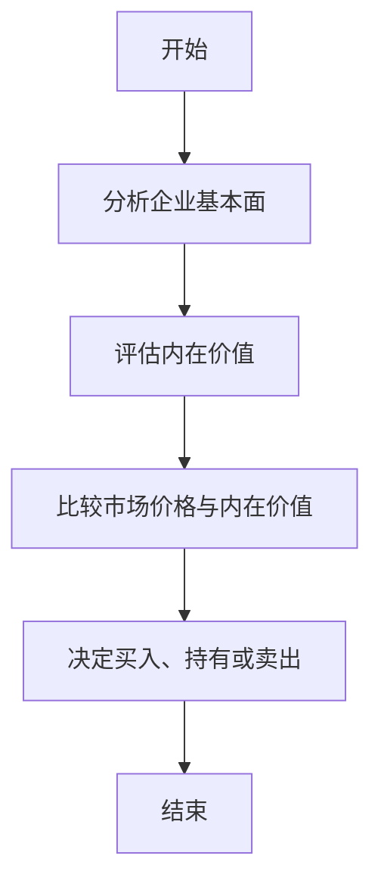
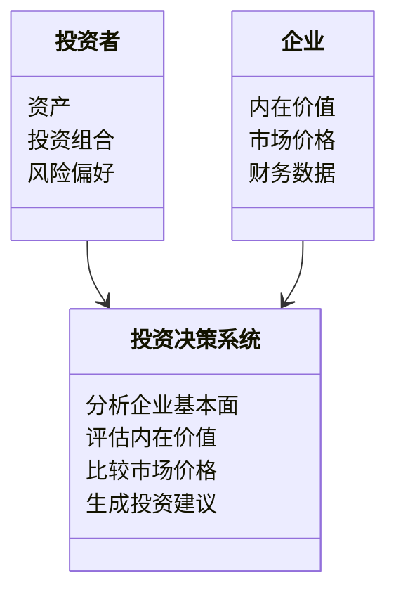
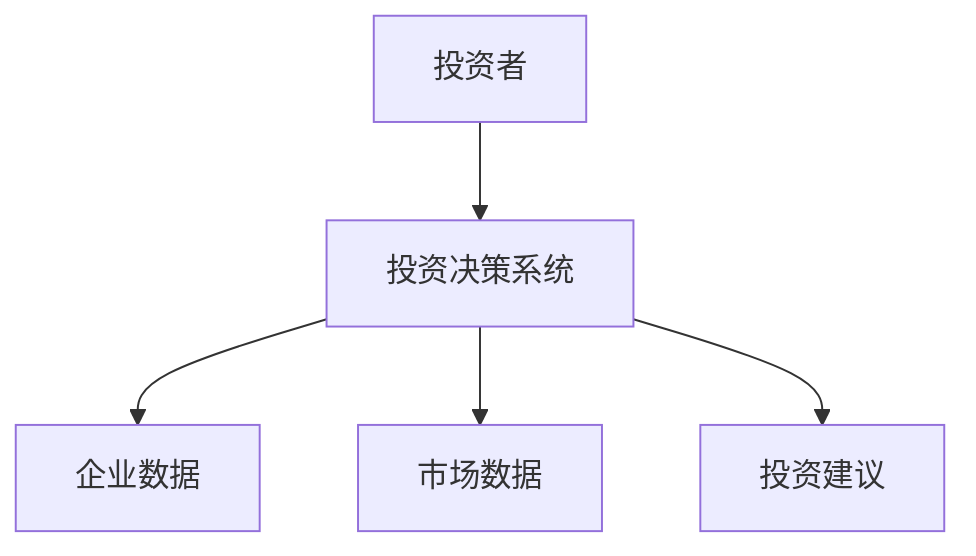

                 


# 巴菲特-芒格的全球化投资视角：机遇与挑战

> 关键词：巴菲特，芒格，价值投资，全球化，投资策略，风险管理

> 摘要：本文从巴菲特和芒格的投资哲学出发，分析其在全球化背景下的投资策略，探讨如何将他们的价值投资理念应用于跨国市场，并通过实际案例和系统设计，揭示投资中的机遇与挑战。

---

## 第一部分：巴菲特-芒格投资理念与全球化背景

### 第1章：巴菲特与芒格的投资哲学

#### 1.1 巴菲特与芒格的生平简介

##### 1.1.1 巴菲特的早年经历与投资起步
沃伦·巴菲特（Warren Buffett）于1934年出生在美国奥马哈市，是一位传奇投资者。他从小就展现出对数字的敏感和对投资的兴趣。1950年代，他在哥伦比亚大学师从本杰明·格雷厄姆（Benjamin Graham），学习价值投资的核心理念。

##### 1.1.2 芒格的法律背景与投资理念
查理·芒格（Charlie Munger）是巴菲特的长期合作伙伴，拥有法律背景，擅长从心理学和社会学的角度分析人类误判行为。他的思维方式深刻影响了巴菲特的投资决策。

##### 1.1.3 巴菲特与芒格的合作历程
两人自1959年合作以来，共同创立了伯克希尔哈撒韦公司（Berkshire Hathaway），并将其打造成全球最具影响力的投资公司之一。芒格的“人类误判心理学”和巴菲特的价值投资理念相结合，形成了独特的投资策略。

#### 1.2 巴菲特-芒格投资哲学的核心理念

##### 1.2.1 价值投资的定义与核心要素
价值投资是一种基于对公司内在价值分析的投资方法。核心要素包括：
- **安全边际**：买入价格低于内在价值。
- **长期思维**：关注企业的长期盈利能力。
- **护城河**：寻找具有竞争优势的企业。

##### 1.2.2 巴菲特的“护城河”理论
护城河是指企业在行业内长期保持竞争优势的能力。例如，可口可乐的全球品牌影响力和供应链优势就是其护城河。

##### 1.2.3 芒格的“人类误判心理学”
芒格认为，投资者的决策往往受到心理偏差的影响。通过识别和避免这些偏差，可以做出更理性的投资决策。

#### 1.3 全球化投资的背景与趋势

##### 1.3.1 全球化经济的发展历程
全球化使得资本、技术和人才的流动更加自由，企业可以跨越国界进行投资和运营。

##### 1.3.2 全球化投资的机遇与挑战
- **机遇**：跨国市场的增长潜力。
- **挑战**：汇率波动、政策风险和文化差异。

##### 1.3.3 巴菲特-芒格视角下的全球化投资框架
他们主张在全球范围内寻找具有强大竞争优势的企业，并长期持有。

#### 1.4 本章小结

##### 1.4.1 巴菲特与芒格的核心投资理念
价值投资、安全边际和护城河是其投资策略的核心。

##### 1.4.2 全球化投资的背景与重要性
全球化为投资者提供了更广阔的投资空间，但也带来了更多风险。

---

### 第2章：巴菲特-芒格投资策略的核心要素

#### 2.1 价值投资的定义与关键特征

##### 2.1.1 价值投资的定义
价值投资是通过分析企业的内在价值，寻找市场价格低于内在价值的投资机会。

##### 2.1.2 价值投资的核心特征对比表格
| 特征       | 价值投资               | 其他投资策略             |
|------------|------------------------|--------------------------|
| 投资期限   | 长期                   | 短期                     |
| 分析方法   | 基于基本面分析         | 基于技术分析或情绪分析   |
| 风险管理   | 强调安全边际           | 风险中性或高风险承受    |

##### 2.1.3 价值投资的ER实体关系图
```mermaid
erDiagram
    巴菲特-芒格投资策略 {
        工厂(企业) {
            id
            名称
            内在价值
            市场价格
        }
        关系(投资决策) {
            id
            投资者
            企业
            投资金额
            时间
        }
    }
```

#### 2.2 巴菲特-芒格投资策略的算法原理

##### 2.2.1 投资决策的流程图


##### 2.2.2 投资决策的Python源代码实现
```python
def calculate_intrinsic_value(company_data):
    """
    计算企业的内在价值
    :param company_data: 包含企业财务数据的字典
    :return: 内在价值
    """
    revenue = company_data['revenue']
    net_income = company_data['net_income']
    book_value = company_data['book_value']
    return (revenue + net_income + book_value) / 3

def investment_decision(company_data, market_price):
    """
    投资决策
    :param company_data: 企业数据
    :param market_price: 市场价格
    :return: 投资决策（买入、持有、卖出）
    """
    intrinsic_value = calculate_intrinsic_value(company_data)
    margin_of_safety = (intrinsic_value - market_price) / intrinsic_value
    if margin_of_safety > 0.2:
        return "买入"
    elif margin_of_safety < 0:
        return "卖出"
    else:
        return "持有"
```

##### 2.2.3 投资策略的数学模型与公式
企业内在价值（IV）的计算公式：
$$ IV = \text{未来现金流的现值} $$

##### 2.2.4 投资策略的举例说明
例如，分析苹果公司的内在价值时，需考虑其现金流、利润率和市场地位。

#### 2.3 全球化投资中的风险管理

##### 2.3.1 风险管理的核心原则
- 分散投资：避免过度集中在某一市场或行业。
- 定期评估：根据市场变化调整投资组合。

##### 2.3.2 风险管理的数学模型
$$ \text{风险调整后的收益} = \text{预期收益} - \text{风险溢价} $$

##### 2.3.3 风险管理的实战案例
例如，2008年金融危机期间，巴菲特通过分散投资和安全边际策略，避免了重大损失。

#### 2.4 本章小结

##### 2.4.1 价值投资的核心要素
内在价值、安全边际和长期持有是关键。

##### 2.4.2 全球化投资中的风险管理策略
分散投资和定期评估是有效的风险管理方法。

---

## 第三部分：系统分析与架构设计

### 第3章：巴菲特-芒格投资策略的系统分析

#### 3.1 投资决策系统的功能设计

##### 3.1.1 领域模型


#### 3.2 投资决策系统的架构设计

##### 3.2.1 系统架构图


#### 3.3 投资决策系统的实现与优化

##### 3.3.1 系统实现的代码框架
```python
class InvestmentSystem:
    def __init__(self):
        self.enterprises = {}  # 企业数据
        self.market_data = {}  # 市场数据

    def analyze(self):
        # 分析企业基本面
        pass

    def evaluate(self):
        # 评估内在价值
        pass

    def decide(self):
        # 生成投资建议
        pass
```

---

## 第四部分：项目实战与最佳实践

### 第4章：巴菲特-芒格投资策略的项目实战

#### 4.1 项目环境与工具安装

##### 4.1.1 工具安装
- Python 3.8+
- Jupyter Notebook
- Matplotlib

#### 4.2 投资决策系统的实现与优化

##### 4.2.1 系统实现的代码示例
```python
def calculate_intrinsic_value(revenue, net_income, book_value):
    return (revenue + net_income + book_value) / 3

def investment_decision(intrinsic_value, market_price):
    margin_of_safety = (intrinsic_value - market_price) / intrinsic_value
    if margin_of_safety > 0.2:
        return "买入"
    elif margin_of_safety < 0:
        return "卖出"
    else:
        return "持有"

# 示例数据
company_data = {
    'revenue': 1000000,
    'net_income': 200000,
    'book_value': 150000
}

market_price = 500000
print(investment_decision(calculate_intrinsic_value(**company_data), market_price))
```

#### 4.3 项目小结

##### 4.3.1 项目实现的核心要点
- 数据分析与建模
- 系统设计与优化
- 投资决策的实战应用

#### 4.4 最佳实践 tips

##### 4.4.1 投资策略的注意事项
- 避免情绪化决策
- 定期评估投资组合

##### 4.4.2 扩展阅读
- 《聪明的投资者》（格雷厄姆）
- 《芒格的投资思想》（查理·芒格）

---

## 第五部分：总结与展望

### 第5章：总结与展望

#### 5.1 总结
巴菲特和芒格的价值投资理念在全球化背景下依然适用，但需要结合跨国市场的特点进行调整。

#### 5.2 展望
未来，随着科技的发展，投资决策将更加依赖于数据驱动和人工智能技术。

---

## 作者：AI天才研究院/AI Genius Institute & 禅与计算机程序设计艺术/Zen And The Art of Computer Programming

