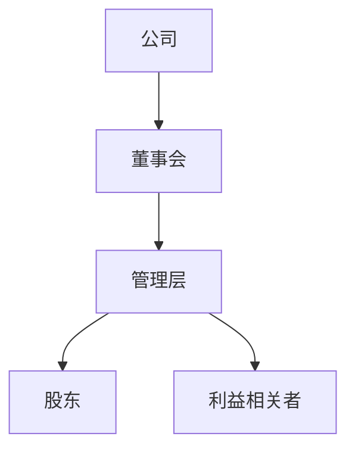

                 

# 巴菲特-芒格的公司治理观：管理层诚信的重要性

## 关键词：巴菲特，芒格，公司治理，管理层诚信，投资理念，治理原则

## 摘要：  
本文深入探讨了巴菲特和芒格的公司治理观点，重点分析了管理层诚信的重要性。通过结合他们的投资理念和实际案例，文章揭示了诚信在公司治理中的核心作用，并提出了有效的治理策略和评估方法。读者将了解如何通过诚信管理来实现长期投资价值。

---

## 第一部分：背景介绍

### 第1章：公司治理与管理层诚信的背景介绍

#### 1.1 公司治理的核心概念

##### 1.1.1 问题背景与问题描述
- **问题背景**：公司治理是确保公司有效运作和股东利益的核心机制。随着企业规模扩大，治理问题日益重要。
- **问题描述**：公司治理涉及董事会、管理层、股东和利益相关者的互动。有效的治理能提升企业绩效，避免欺诈和管理不当。

##### 1.1.2 问题解决与边界
- **问题解决**：通过明确角色、责任和决策流程来优化治理。
- **边界**：公司治理关注战略决策、风险管理，不涉及日常运营。

##### 1.1.3 核心要素与概念结构
- **核心要素**：董事会、管理层、股东、利益相关者。
- **概念结构**：治理结构确保各方利益的平衡与协调。

#### 1.2 管理层诚信的重要性

##### 1.2.1 诚信的定义与特征
- **诚信**：管理层在决策和行为中保持诚实、透明和责任感。

##### 1.2.2 诚信对公司治理的影响
- **信任基础**：诚信增强利益相关者的信任，促进长期合作。
- **决策质量**：诚信管理层更倾向于透明决策，提升企业绩效。

##### 1.2.3 诚信的边界与外延
- **边界**：诚信不等于完美，管理层可能面临道德困境。
- **外延**：诚信延伸至财务透明度、合规性和社会责任。

---

## 第2章：公司治理的核心概念与联系

### 2.1 核心概念原理

#### 2.1.1 公司治理的定义与特征
- **定义**：公司治理是通过制度和流程确保各方利益平衡。
- **特征**：透明性、责任性、制衡机制。

#### 2.1.2 管理层诚信的内涵与外延
- **内涵**：管理层在决策中的诚实与责任感。
- **外延**：包括决策透明度、财务合规性和社会义务。

### 2.2 核心概念对比分析

#### 2.2.1 治理结构与管理层角色对比
- **治理结构**：董事会、股东会、管理层。
- **管理层角色**：执行战略、日常运营。

#### 2.2.2 股东责任与管理层决策对比
- **股东责任**：监督管理层，确保合规。
- **管理层决策**：基于战略目标，平衡各方利益。

### 2.3 实体关系图

---

## 第3章：巴菲特与芒格的公司治理原则

### 3.1 投资理念与治理观

#### 3.1.1 巴菲特的价值投资理念
- **长期投资**：投资于具备持续竞争优势的企业。
- **管理层评估**：关注管理层的诚信与能力。

#### 3.1.2 芒格的多元思维模型
- **跨学科思维**：从多个角度分析问题。
- **决策质量**：依赖于管理层的智慧和诚信。

### 3.2 公司治理的核心原则

#### 3.2.1 管理层诚信的重要性
- **信任基础**：诚信是巴菲特和芒格投资的基石。
- **决策透明度**：管理层应以透明方式处理事务。

#### 3.2.2 股东权益的保护
- **股东价值**：确保股东利益，避免短期主义。
- **治理结构**：董事会独立性，防止管理层滥用职权。

#### 3.2.3 公司治理的透明度
- **公开披露**：及时、准确地公开信息。
- **利益相关者**：关注所有利益相关者的权益。

---

## 第4章：管理层诚信的评估与实践

### 4.1 诚信评估的指标与方法

#### 4.1.1 财务报表分析
- **财务指标**：ROE、利润增长率。
- **财务透明度**：审计意见、财务报告及时性。

#### 4.1.2 经营决策的透明度
- **决策过程**：管理层是否公开决策依据。
- **战略一致性**：决策是否符合长期战略。

#### 4.1.3 内部审计与合规性
- **内部审计**：独立审查财务和合规性。
- **合规文化**：公司是否建立合规机制。

---

## 总结与展望

### 总结
本文探讨了巴菲特和芒格的公司治理观，强调了管理层诚信的重要性。通过分析治理结构、评估方法和实际案例，揭示了诚信在投资中的核心作用。

### 展望
未来研究可进一步探讨技术在治理中的应用，如区块链技术提升透明度，AI辅助决策分析。诚信将继续是投资成功的关键因素。

---

## 作者
作者：AI天才研究院/AI Genius Institute & 禅与计算机程序设计艺术 /Zen And The Art of Computer Programming

---

这篇博客文章详细探讨了巴菲特和芒格的公司治理观点，分析了管理层诚信的重要性，并结合实际案例和系统架构，帮助读者理解如何在投资中应用这些原则。

